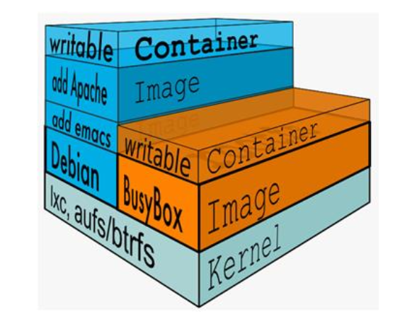
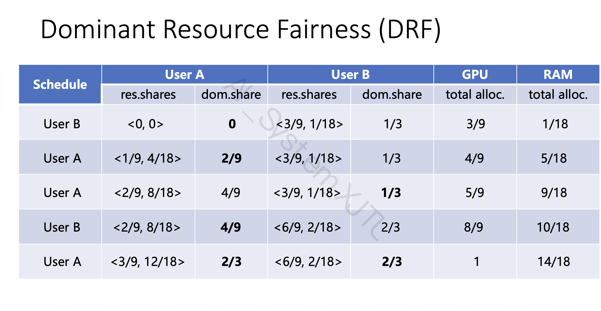

# 第 7 章：Scheduling / 深度学习集群调度

## 本章主线

!!! info "本章关注"
    多租户 GPU 集群中，如何提交、隔离、调度和管理深度学习作业。
核心问题：

1. 如何提交深度学习作业？
2. 如何解决不同作业的环境依赖问题？
3. 如何隔离不同用户/作业的运行环境？
4. 如何高效分配 CPU、GPU、Memory 等资源？
5. 如何兼顾吞吐、公平性、SLA 和资源利用率？
6. 如何避免 GPU 拓扑碎片化？
7. 如何在多租户场景下实现弹性和抢占？

!!! note "必会十个点"
    1. Job 生命周期：提交、排队、调度、执行、释放。
    2. Docker 解决环境依赖和隔离问题。
    3. Image 是静态只读模板，Container 是动态运行实例。
    4. Docker 镜像分层，容器顶层可写。
    5. Copy-on-Write：修改先复制到容器层。
    6. Namespace 实现进程、网络、文件系统等隔离。
    7. 主导资源公平调度(DRF)用于多资源公平调度，核心是主导资源占比(dominant share)。
    8. GPU 调度必须考虑拓扑亲和性。
    9. HiveD 使用 level、cell、buddy cell 减少碎片。
    10. 弹性提高利用率，抢占保证 SLA 和公平性。

## 7.1 深度学习作业 Job 的生命周期

一个深度学习作业通常经历：

1. 作业提交与排队
2. 作业资源分配与调度
3. 作业执行
4. 作业完成并释放资源

## 7.2 Docker：镜像与容器

### 7.2.1 Docker 的作用

Docker 解决两个核心工程问题：

1. 环境依赖问题
2. 运行隔离问题

深度学习作业依赖复杂，依赖关系很容易剪不断理还乱，依赖某个特定版本的依赖这种事情司空见惯，相信各位在实验课上已经经历过了。

那么，当我要交付一个产品，客户最希望的当然是可以开箱即用了，让客户配置依赖属实不太人道。

于是我们引入了集装箱——Docker：

> 一次构建，随处运行。

### 7.2.2 Image 与 Container

#### Image 镜像

镜像是静态模板，用于打包运行环境。
包括：

- 文件系统
- 系统库
- 运行时依赖
- 深度学习框架
- 用户代码

特点：

- 静态
- 只读
- 可共享
- 可复用

#### Container 容器

容器是镜像运行起来后的实例。
特点：

- 动态
- 可读写
- 有独立运行环境
- 提供进程、网络、文件系统等隔离

#### 对比表

| 对象 | Image | Container |
| --- | --- | --- |
| 中文 | 镜像 | 容器 |
| 状态 | 静态 | 动态 |
| 是否运行 | 不运行 | 正在运行 |
| 读写性 | 只读 | 顶层可读写 |
| 作用 | 打包环境 | 执行作业 |
| 类比 | 类 | 对象 |

### 7.2.3 Docker Registry

Registry 用于存储和分发镜像。

作用：

- 镜像共享
- 镜像版本管理
- 作业环境复现
- 集群节点拉取统一镜像

### 7.2.4 Dockerfile

Dockerfile 用于描述镜像构建过程。

常见指令：

```dockerfile
FROM ubuntu:20.04
RUN apt-get update
COPY train.py /workspace/train.py
WORKDIR /workspace
CMD ["python", "train.py"]
```

常见命令：

```bash
docker build -f Dockerfile.train.cpu -t train_dk_cpu .
docker run train_dk_cpu
```

!!! example "例题"
    给出 Dockerfile，问各指令作用：

    | 指令 | 作用 |
    | --- | --- |
    | FROM | 指定基础镜像 |
    | RUN | 构建镜像时执行命令 |
    | COPY | 将本地文件复制进镜像 |
    | WORKDIR | 设置工作目录 |
    | CMD | 容器启动后默认执行命令 |

### 7.2.5 Docker 技术特点

Docker 的技术特点：

1. 轻量级
2. 标准化
3. 环境一致
4. 快速启动
5. 隔离性

轻量级原因

- 多个容器共享宿主机操作系统内核
- 镜像通过分层文件系统构造
- 多个镜像可以共享公共层
- 不需要像虚拟机一样启动完整 Guest OS

快速启动原因

- 不需要启动完整操作系统
- 只启动隔离后的进程
- 镜像层可以复用

### 7.3.6 Docker 镜像分层原理

#### 分层结构

Docker 镜像采用分层结构。

镜像由多个只读层组成：


只有最上面的 container layer 可读写。

#### Copy-on-Write

当容器修改某个文件时：

1. 文件原本在只读镜像层中
2. Docker 会先把文件复制到容器可写层
3. 修改发生在容器层
4. 原始镜像层保持不变

!!! tip 简答题
    ——为什么 Docker 镜像分层可以节省空间？

    ——多个镜像可以共享相同的 base layer，多个容器也可以共享同一份只读镜像层。容器的修改只保存在自身的可写层中，因此减少了磁盘占用并提升了镜像复用能力。

## 7.4 Namespace 隔离

Docker 使用 namespace 实现隔离。

常见 namespace：

| Namespace | 作用 |
| --- | --- |
| PID namespace | 进程隔离 |
| NET namespace | 网络隔离 |
| MNT namespace | 文件系统挂载隔离 |
| IPC namespace | 进程间通信隔离 |
| UTS namespace | 主机名隔离 |
| USER namespace | 用户权限隔离 |

!!! example "例题"

    填空

    Docker 使用 namespace 实现命名空间隔离。

    不定项选择

    哪些属于 Docker namespace？

    - PID
    - NET
    - MNT
    - IPC
    - USER

## 7.5 深度学习集群调度指标

调度系统常见优化目标：

| 指标 | 含义 |
| --- | --- |
| Throughput | 吞吐量，单位时间完成多少作业 |
| Makespan | 一批作业全部完成所需总时间 |
| Average Response Time | 平均响应时间 |
| Fairness | 公平性 |
| Utilization | 资源利用率 |
| SLA | 服务等级协议 |
| Locality / Affinity | 拓扑亲和性 |
| Fragmentation | 资源碎片化程度 |

## 7.6 Fairness：公平调度

!!! caution 核心观点
    分配资源要公平。
    但是多种资源下，怎么认定为公平？这就要靠DRF的Dom share。

### 7.6.1 Max-Min Fairness

Max-Min Fairness 是单资源公平调度思想。

最大化所有用户中资源分配最少者的资源量。

简单地说，先照顾资源最少的用户，让最弱用户尽可能公平地获得资源。

适合单资源调度，例如只考虑 GPU 数量。

### 7.6.2 DRF(Dominant Resource Fairness)

#### 背景

Max-Min只适合单资源调度，但是深度学习作业通常需要多种资源：

- GPU
- CPU
- Host Memory
- GPU Memory
- Bandwidth

因此单资源公平算法不够，需要多资源公平算法。

#### DRF 定义

DRF,(Dominant Resource Fairness)
主导资源公平调度

核心思想：

1. 计算每个用户在每类资源上的占比
2. 找出该用户占比最大的资源
3. 该资源称为 dominant resource
4. 该占比称为 dominant share
5. 调度时最大化所有用户中的最小 dominant share

#### 公式化理解

对于用户 A：

GPU share = A 使用的 GPU 数 / 集群总 GPU 数
Memory share = A 使用的内存 / 集群总内存
CPU share = A 使用的 CPU 数 / 集群总 CPU 数

A的dominant share = max(GPU share, Memory share, CPU share, ...)

!!! tip
    一言以蔽之，每次优先调度当前 dominant share 最小的用户。

#### DRF 例子

这里直接给出PPT上例题的解析。


1. 反推
从前两个schelude可以得到，A的Dom res是RAM，B的Dom res是GPU（比较每个任务中res的占比即可）
2. 比较
比较看看谁的Dom share更小，就发他的任务

!!! tip 解题方法
    给定集群资源和多个用户 task 需求，要求：

    1. 计算每个用户的资源占比
    2. 找 dominant resource
    3. 计算 dominant share
    4. 判断下一步调度谁

    解题步骤：

    Step 1: 计算每类资源 share
    Step 2: 对每个用户取 max share
    Step 3: 找 dominant share 最小的用户
    Step 4: 优先调度该用户的 task
    Step 5: 更新资源分配，重复

## 7.7 拓扑与亲和性 Affinity

!!! caution 核心观点
    多 GPU 作业的性能不仅取决于 GPU 数量，还取决于 GPU 之间的拓扑关系。

例如：

同一节点 8 GPU > 跨节点 8 GPU

原因：

- 同一 PCIe switch 下通信更快
- 同一 CPU socket 下通信较快
- 跨 socket 通信变慢
- 跨机器通信最慢

课件中的典型性能差异

| 分配方式 | 性能影响 |
| --- | --- |
| Same PCIe switch | 最好 |
| Cross-switch | 可能约 50% slowdown |
| Cross-machine | 可能约 5x slowdown |

多 GPU 训练需要频繁通信，GPU 之间的互联拓扑会显著影响通信开销。同一 PCIe switch 或同一节点内的 GPU 通信更快，而跨 socket 或跨机器会导致性能下降。因此调度器不能只看 GPU 数量，还要尽量分配拓扑上相近的 GPU。

举个简单的栗子，一个任务需要吃5卡A100，另有5个任务各需要吃1卡A100，现服务器集群有一个5卡A100和2个3卡A100，理论上就该优先把性能开销最大的那个issue到5卡服务器去

## 7.8 配额(Quota)与资源碎片(Fragmentation)

Quota(配额)

Quota 表示某个用户、队列或租户拥有的资源配额。

例如：

User A: 10 GPU quota
User B: 20 GPU quota

### 共享异常(Sharing Anomaly)

基于 quota 分配 GPU 时，可能出现共享异常。

#### 表现

虽然某个作业分配到了足够数量的 GPU，但这些 GPU 分散在不同 socket、不同 PCIe switch，甚至不同机器上，导致性能大幅下降。

#### GPU碎片化(GPU Fragmentation)

GPU fragmentation 指 GPU 资源碎片化。

出现原因：

- 多用户动态申请和释放 GPU
- 作业大小不同
- quota 分配只关注数量，不关注位置
- 大作业需要连续/亲和 GPU，但剩余资源零散

!!! example "例题"
    GPU 调度中，分配到足够数量 GPU 但性能下降，原因可能是 GPU 拓扑碎片化 或 sharing anomaly。

## 7.9 HiveD 调度算法

### 7.9.1 HiveD 解决的问题

HiveD 是面向 GPU 集群的调度算法。

目标：

1. 支持多租户 GPU 集群
2. 支持 GPU 拓扑感知
3. 减少 GPU fragmentation
4. 保留高层级 cell
5. 提高大规模 GPU 作业调度机会
6. 支持弹性与抢占

### 7.9.2 HiveD 的层级 levels

HiveD 按 GPU 拓扑划分层级：

| Level | 含义 |
| --- | --- |
| Level 1 | single GPU |
| Level 2 | PCIe switch |
| Level 3 | CPU socket |
| Level 4 | node / server |

记忆：

GPU < PCIe switch < CPU socket < node

### 7.9.3 Cell

Cell 是 HiveD 中资源分配的基本单位。

定义：

一个 cell 表示某个拓扑层级下，具有亲和性的 GPU 集合。

例如：

- 单个 GPU 是 Level 1 cell
- 同一 PCIe switch 下的一组 GPU 是 Level 2 cell
- 同一 CPU socket 下的一组 GPU 是 Level 3 cell
- 同一 node 内的 GPU 是 Level 4 cell

### 7.9.4 Buddy Cell

Buddy cell 指同一层级中的相关 cell。

作用：

- 维护层级结构
- 支持 cell 合并与拆分
- 保留高层级资源
- 减少碎片

### 7.9.5 Buddy Cell Allocation Algorithm

维护的信息：

1. Binding 关系
2. 每层级 free list

优化目标：

尽可能保留更多 high-level cells

效果：

1. 减少 GPU fragmentation
2. 保留更完整的拓扑资源
3. 为需要高层级 cell 的大作业创造调度机会

可能考法：简答

HiveD 如何减少 GPU 碎片？

答：

HiveD 将 GPU 拓扑抽象成多层级 cell，并通过 buddy cell allocation 尽量从合适层级分配资源，同时保留高层级 cell。这样可以减少 GPU 被零散占用的情况，为大规模多 GPU 作业保留拓扑亲和性更好的资源。

## 7.10 弹性(Elasticity)与抢占(Preemption)

### 7.10.1 弹性 (Elasticity)

定义：

当集群存在空闲资源时，调度器允许某些队列使用超过自身 quota 的资源。

作用：

- 提高资源利用率
- 避免资源空闲
- 允许作业更快完成

### 7.10.2 抢占 Preemption

定义：

当集群资源不足，且某些队列无法满足 quota 或 SLA 时，调度器从超额使用资源的队列中收回资源。

典型场景：

APP1 和 APP2 均有 50% quota
APP1 前期使用了超过 50% 的资源
APP2 后续提交任务但资源不足
调度器从 APP1 中抢占部分资源给 APP2

抢占的优点

- 提高 SLA
- 保证公平性
- 避免队列长期饥饿
- 保证 quota 生效

抢占的缺点

- 被抢占作业可能变慢
- 深度学习作业若无 checkpoint，可能损失训练进度
- 抢占有调度和恢复开销

可能考法

简答

弹性和抢占如何兼顾利用率与 SLA？

答：

弹性允许队列在集群空闲时临时使用超过 quota 的资源，从而提高利用率；抢占则在其他队列资源不足时从超额使用的队列中回收资源，从而保证 SLA 和公平性。两者结合可以在资源空闲时提高效率，在资源紧张时恢复公平。

## 7.11 YARN 抢占机制

YARN 抢占的大致步骤：

1. 从过度使用资源的队列中选择需要被抢占的 container
2. 通知 Application Master
3. Application Master 尝试释放资源
4. 若未释放，Resource Manager 强制回收资源

可能考法

填空

YARN 中被抢占的基本资源单位通常是 container。

## 7.12 OpenPAI

OpenPAI 全称：

Open Platform for AI

它是一个 AI 集群管理平台。

组成

OpenPAI 涉及：

- Docker
- Kubernetes
- Hadoop YARN
- HiveD
- Web Portal
- REST Server
- GPU Cluster

分工

| 组件 | 作用 |
| --- | --- |
| Docker | 封装作业运行环境 |
| YARN | 资源调度 |
| Kubernetes | 静态资源管理 |
| HiveD | GPU 拓扑感知调度 |
| Web Portal | 用户提交和管理作业 |
| REST Server | 提供 API 接口 |

OpenPAI 特点

1. 支持多租户 GPU 集群
2. 支持深度学习作业提交
3. 支持容器化运行
4. 支持 GPU 作为一等资源
5. 支持监控和管理
6. 支持拓扑感知调度

## 第 7 章高频考点清单

必背概念

- Job lifecycle
- Docker Image
- Docker Container
- Dockerfile
- Docker Registry
- Namespace
- Copy-on-Write
- Throughput
- Makespan
- Fairness
- SLA
- Max-Min Fairness
- DRF
- Dominant resource
- Dominant share
- Affinity
- GPU fragmentation
- Sharing anomaly
- Quota
- HiveD
- Level
- Cell
- Buddy cell
- Elasticity
- Preemption
- OpenPAI

第 7 章选择题易错点

1. Image 是只读的，Container 顶层是可读写的。
2. Container 不是完整虚拟机，不包含独立内核。
3. Docker 轻量是因为共享宿主机 OS kernel。
4. Copy-on-Write 修改的是容器层，不修改镜像层。
5. DRF 适用于多资源公平调度，不是只调度 GPU。
6. dominant resource 是占比最大的资源，不一定是数量最多的资源。
7. GPU 数量够不代表性能好，还要看拓扑亲和性。
8. HiveD 的 cell 是资源分配粒度。
9. Buddy Cell Allocation 目标是保留高层级 cell。
10. 弹性提高利用率，抢占保证公平性和 SLA。
11. 抢占对深度学习作业有代价，需要 checkpoint 支持。
12. Kubernetes 在 OpenPAI 中偏静态资源管理，YARN 负责资源调度。

## 按题型整理

一、不定项选择题重点

第 7 章

Docker

可能正确选项：

- Docker 使用容器技术隔离作业环境
- Docker 镜像是分层构造的
- Docker 容器共享宿主机内核
- Docker 可以提供一致运行环境
- Container 是 Image 的运行实例
- Copy-on-Write 可以减少存储开销

可能错误选项：

- Docker 容器拥有独立操作系统内核
- Image 是可读写的运行实例
- Container 是只读模板
- Docker 启动慢于虚拟机
- Docker 不能用于深度学习作业环境封装

DRF

可能正确选项：

- DRF 用于多资源公平调度
- dominant resource 是资源占比最大的资源
- dominant share 是主导资源占比
- DRF 目标是最大化最小 dominant share
- DRF 适合 CPU/GPU/Memory 等异构资源场景

可能错误选项：

- DRF 只适用于单资源调度
- dominant resource 是数量最多的资源
- DRF 完全不考虑公平性
- DRF 只适合 CPU，不适合 GPU

HiveD

可能正确选项：

- HiveD 关注 GPU 拓扑亲和性
- HiveD 使用 cell 作为资源分配粒度
- HiveD 定义了多级 GPU 拓扑
- Buddy cell allocation 可以减少碎片
- HiveD 尽量保留 high-level cell

可能错误选项：

- HiveD 完全不考虑 GPU 拓扑
- cell 与拓扑层级无关
- Buddy cell 的目标是打散 GPU 资源
- HiveD 只适用于 CPU 调度

三、简答题模板

1. 为什么深度学习作业需要 Docker？

答：

深度学习作业依赖复杂，不同作业可能需要不同版本的 CUDA、cuDNN、Python、PyTorch 或 TensorFlow。Docker 可以将完整运行环境打包成镜像，保证环境一致性。同时 Docker 通过 namespace 等机制实现运行隔离，避免多用户作业相互干扰。Docker 镜像分层和 Copy-on-Write 机制还可以提高复用性并减少存储开销，因此适合多租户 GPU 集群中的深度学习作业管理。

1. Docker Image 和 Container 有什么区别？

答：

Image 是静态的只读模板，用于打包作业运行环境；Container 是 Image 运行起来后的实例，包含一个可读写的容器层。Image 类似面向对象中的类，Container 类似对象。多个容器可以共享相同镜像层，但各自的修改只保存在自己的容器层中。

1. 什么是 DRF？

答：

DRF，即 Dominant Resource Fairness，是一种面向多资源场景的公平调度算法。它会计算每个用户在 CPU、GPU、Memory 等资源上的占比，其中占比最大的资源称为主导资源，对应占比称为主导资源占比。DRF 的目标是最大化所有用户中的最小主导资源占比，从而实现多资源公平分配。

1. 为什么 GPU 调度需要考虑拓扑亲和性？

答：

多 GPU 深度学习作业需要频繁进行 GPU 间通信，通信性能与 GPU 拓扑密切相关。同一 PCIe switch 或同一节点内的 GPU 通信更快，而跨 CPU socket 或跨机器通信开销更高。因此调度器不能只关注 GPU 数量，还需要考虑 GPU 之间的拓扑亲和性，避免资源碎片化并提升训练性能。

1. HiveD 如何减少 GPU 资源碎片？

答：

HiveD 将 GPU 拓扑抽象为多层级 cell，例如 single GPU、PCIe switch、CPU socket 和 node。Cell 是资源分配的基本粒度。HiveD 使用 buddy cell allocation，在满足作业需求的同时尽量保留更高层级的 cell，从而减少 GPU 被零散分配造成的碎片化，为大规模多 GPU 作业保留拓扑亲和性更好的资源。

1. 弹性和抢占的区别是什么？

答：

弹性是指当集群有空闲资源时，允许队列临时使用超过自身 quota 的资源，从而提高资源利用率。抢占是指当其他队列资源不足或 SLA 无法满足时，调度器从超额使用资源的队列中回收资源。弹性关注利用率，抢占关注公平性和 SLA，两者结合可以兼顾效率和服务质量。

四、编程题重点

1. Dockerfile 编写

```dockerfile
FROM python:3.9
WORKDIR /workspace
COPY requirements.txt .
RUN pip install -r requirements.txt
COPY train.py .
CMD ["python", "train.py"]
```

需要会解释

```dockerfile
FROM        # 基础镜像
WORKDIR     # 工作目录
COPY        # 复制文件
RUN         # 构建时执行命令
CMD         # 容器启动后执行命令
```

五、综合题解题套路

1. DRF 综合题

题目类型：

给定集群资源：
GPU = a
Memory = b
用户 A 每个 task 需要：
GPU = x1
Memory = y1
用户 B 每个 task 需要：
GPU = x2
Memory = y2
问：下一步应该调度谁？

解题步骤：

Step 1: 计算每个用户当前 total allocation
Step 2: 计算每类资源 share
Step 3: 对每个用户取最大 share，即 dominant share
Step 4: dominant share 最小者优先调度
Step 5: 调度后更新资源使用
Step 6: 判断是否还有资源继续调度

1. GPU 拓扑综合题

题目类型：

一个 8-GPU 作业可以分配在：
A. 同一节点
B. 跨两个 PCIe switch
C. 跨多台机器
问：哪种性能最好？为什么？

答题套路：

同一节点 / 同一 PCIe switch 最好。
因为多 GPU 训练需要频繁通信，拓扑越近通信开销越低。
跨 switch 或跨机器会造成通信瓶颈，降低训练性能。

1. HiveD 综合题

题目类型：

给定若干 GPU cell 和作业需求，问 HiveD 应如何分配？

答题套路：

1. 先确定作业需要的 GPU 数和拓扑层级
2. 优先选择能够满足需求的合适 cell
3. 尽量避免拆散 high-level cell
4. 通过 buddy cell allocation 减少碎片
5. 为未来大作业保留更高层级资源

6. 对抗攻击综合题

题目类型：

给定模型、输入 x、标签 y、epsilon，要求生成对抗样本。

答题套路：

1. 固定模型参数
2. 设置输入 requires_grad=True
3. 前向传播计算 loss
4. 反向传播得到输入梯度
5. 使用 sign(gradient) 构造扰动
6. 加到原始输入上
7. clamp 到合法像素范围
8. 得到 x_adv

9. 防御方法综合题

题目类型：

比较 smoothing 和 adversarial training。

答题套路：

方法 思路 优点 缺点
Smoothing 输入预处理，削弱扰动 简单，不需重训 防御弱，可能降准确率
Adversarial Training 加入对抗样本训练 鲁棒性更强 成本高，对未知攻击有限。
