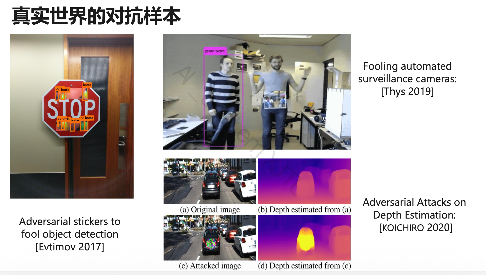

# 第8章：AI 安全与隐私

## 8.1 本章主线

这一章分三块：完整性、保密性、伦理。真正会算、会写公式的主要是完整性，也就是对抗攻击和防御。

| 类型 | 英文 | 代表内容 |
| ---- | ---- | ---- |
| 完整性 | Integrity | 对抗攻击与防御 |
| 保密性 | Confidentiality | 联邦学习、同态加密 |
| 伦理 | Ethics | AI 偏见、Deepfake、假新闻 |

## 8.2 风险分类

Integrity 看模型输出会不会被人恶意改掉，关键词：adversarial attack、example、patch、defense、smoothing、adversarial training。

Confidentiality 看数据或模型信息会不会泄露，关键词：federated learning、homomorphic encryption。

Ethics 看模型造成的社会问题，比如 AI bias、Deepfake、AI-generated fake news、人脸识别误用、自动决策歧视。

## 8.3 对抗攻击 Adversarial Attack

### 8.3.1 基本定义

对抗攻击就是在原始输入上加一小点扰动，让人看不出来，但模型会判断错。

$$x' = x_0 + \Delta x$$

| 符号 | 含义 |
| ---- | ---- |
| $x_0$ | 原始输入 |
| $\Delta x$ | 对抗扰动 |
| $x'$ | 对抗样本 |
| $f_\theta$ | 模型 |
| $y^{true}$ | 正确标签 |
| $y^{false}$ | 攻击目标标签 |

### 8.3.2 对抗样本目标

两个要求：看起来还像原图；模型输出变错。

$$d(x_0, x') \leq \varepsilon$$

$$x^* = \arg\min_{x'} L(x') \quad \text{s.t.} \quad d(x_0, x') \leq \varepsilon$$

直白说：固定模型，改输入；扰动不能太大，但要把预测结果带偏。

### 8.3.3 和训练神经网络的区别

训练模型：$x$ 固定，优化 $\theta$。

生成对抗样本：$\theta$ 固定，优化 $x'$。

!!! tip 可能考法：填空
    对抗样本生成与训练神经网络类似，但优化变量从模型参数 $\theta$ 变成了输入 $x'$。

### 8.3.4 攻击的损失函数


原始输入和对抗输入分别是：

$$y^0 = f_\theta(x^0)$$

$$y' = f_\theta(x')$$

| 符号 | 含义 |
| ---- | ---- |
| $x^0$ | 原始输入，例如正常猫图 |
| $x'$ | 对抗样本 |
| $y^0$ | 原始输入的输出 |
| $y'$ | 对抗样本的输出 |
| $y^{true}$ | 真实标签，例如 cat |
| $y^{false}$ | 希望模型输出的错误标签，例如 fish |
| $C(\cdot,\cdot)$ | 分类损失，例如 cross entropy |

#### 训练时

训练时优化模型参数，让输出接近真实标签：

$$L_{train}(\theta) = C(y^0, y^{true})$$

#### 无目标攻击 Untargeted Attack

不指定错成哪一类，只要不是正确类别即可。目标是让 $y'$ 远离 $y^{true}$：

$$\max_{x'} C(y', y^{true})$$

写成最小化就是：

$$L(x') = -C(y', y^{true})$$

#### 有目标攻击 Targeted Attack

指定错成 $y^{false}$。一边远离正确类别，一边靠近目标错误类别：

$$L(x') = -C(y', y^{true}) + C(y', y^{false})$$

其中 $-C(y', y^{true})$ 负责远离正确类别，$C(y', y^{false})$ 负责靠近指定错误类别。

#### 扰动约束

$$d(x^0, x') \leq \varepsilon$$

$x'$ 要和 $x^0$ 足够接近，扰动小到人眼不容易察觉。

## 8.4 距离度量：L2 与 L∞

这里就是范数：L2 看整体欧氏距离，L∞ 看单个维度上的最大改变量。

!!! caution 易错点
    同样的 L2 下，每个像素都改一点时 L∞ 较小；集中改一个像素时 L∞ 较大。

## 8.5 基于梯度的对抗攻击

### 8.5.1 基本流程

思路很像训练，只是现在更新的是输入：

```text
Start from original image x0
For t = 1 to T:
    1. 计算 loss 对输入 x 的梯度
    2. 按梯度方向更新 x
    3. 如果扰动超过 ε，则投影回合法范围
    4. 得到新的 x_t
```

课件写法：

$$x_t \leftarrow x_{t-1} - \eta \nabla L(x_{t-1})$$

如果 $d(x_0, x_t) > \varepsilon$，就用 $\text{fix}(x_t)$ 把它拉回约束范围。

### 8.5.2 投影 Projection

投影就是“越界了就拉回来”：

$$
\text{fix}(x_t)
= \arg\min_{x:\ d(x_0,x)\leq \varepsilon} d(x, x_t)
$$

如果 $x_t$ 没越界，不用动；越界了，就找约束范围内离它最近的点。

## 8.6 FGSM

$$x^* = x_0 - \varepsilon \cdot \text{sign}(\nabla_x L)$$

符号取决于 loss 怎么定义。记法别死背，核心是：固定模型，算输入梯度，取 sign，一步加扰动，大小由 $\varepsilon$ 控制。

## 8.7 白盒攻击与黑盒攻击

### 8.7.1 白盒攻击 White-box Attack

白盒攻击知道模型结构、参数、loss、梯度和训练细节，所以可以直接算梯度生成对抗样本。

### 8.7.2 黑盒攻击 Black-box Attack

黑盒攻击不知道内部细节，只能查输入输出。常见做法是查询目标模型，收集输入输出对，训练 proxy model，再在代理模型上做攻击。它能成功，靠的是对抗样本的 transferability。

!!! example "可能考法：简答"
    黑盒攻击为什么可行？

    答：

    攻击者可以查询目标模型，拿到输入输出对，再训练一个代理模型。对抗样本有迁移性，所以代理模型上的对抗样本也可能骗过目标模型。

## 8.8 Adversarial Patch 对抗补丁

Adversarial patch 是贴在图像局部区域的特殊图案，用来骗过分类器或检测器。



它不需要改整张图，可以打印出来贴到真实物体上，所以比全图扰动更适合物理世界攻击。典型对象：图像分类器、YOLO、Faster R-CNN 等目标检测器。

!!! example "可能考法：简答"
    为什么 adversarial patch 更适合现实世界攻击？

    答：

    全图扰动要求精确修改大量像素，现实中很难做；patch 只要贴一个局部图案，更容易打印、粘贴和复现。

## 8.9 对抗防御 Defense

### 8.9.1 被动防御：输入预处理

输入进模型前先处理一下，尽量削弱扰动。不改模型参数，所以叫被动防御。


| 方法 | 英文 | 核心思想 |
| ---- | ---- | ---- |
| 平滑 | Smoothing | 用滤波降低高频噪声影响 |
| 特征减缩 | Feature Squeezing | 降低输入自由度，压掉细微扰动 |
| 尺寸调整 | Resizing | 用缩放、重采样破坏扰动结构 |

Smoothing：Gaussian blur、Median filter、Mean filter。

Feature Squeezing：降低颜色深度，例如 8-bit 变 4-bit；对相近像素值量化；减少细粒度变化。

Resizing：缩小再放大、随机 resize、resize 后 padding。

优点：简单，不用重新训练，可作为预处理模块。缺点：防御有限，可能降低正常准确率；遇到强攻击或自适应攻击容易被绕过。

### 8.9.2 Adversarial Training 对抗训练

把对抗样本加入训练集，本质上是一种数据增强：

```text
Given training data X = {(x1, y1), ..., (xN, yN)}
For each epoch:
    For each sample xn:
        用攻击算法生成对抗样本 x_adv
    使用原始样本 + 对抗样本训练模型
```

它通常对训练时见过的攻击有效，但泛化不稳；训练成本更高，鲁棒性和正常准确率也可能互相拉扯。

## 8.10 保密性：联邦学习与同态加密

### 8.10.1 Federated Learning 联邦学习

联邦学习的口诀：数据不动，模型动。各参与方不上传原始数据，只上传参数、梯度或模型更新。

流程：Server 下发全局模型；Client 本地训练；Client 上传更新；Server 聚合；得到新全局模型；重复多轮。

优点是原始数据留在本地，适合多机构联合建模。风险也别忘了：梯度或更新本身可能泄露隐私，所以常配合安全聚合、差分隐私；另外通信开销大，非 IID 数据也会影响训练。

!!! example "可能考法：简答"
    联邦学习如何保护隐私？

    答：

    各参与方在本地训练，只上传模型参数或梯度更新，由服务器聚合。原始数据不出本地，因此降低了直接泄露风险。

### 8.10.2 Homomorphic Encryption 同态加密

同态加密允许服务器直接在密文上算，解密后的结果等价于明文计算结果：

$$
\mathrm{Dec}(\mathrm{Enc}(a) \oplus \mathrm{Enc}(b)) = a + b
$$

$$
\mathrm{Dec}(\mathrm{Enc}(a) \otimes \mathrm{Enc}(b)) = a \times b
$$

好处是服务器看不到明文，适合隐私保护推理或训练。问题也很现实：慢、实现复杂，对深度学习算子的支持有限。

## 8.11 Ethics：AI 伦理问题

AI 伦理这块不太算公式，主要记例子和原因。

### 8.11.1 AI Bias

AI bias 是模型输出不公平或带偏见。例子：人脸识别对不同群体准确率不同；PULSE 把有色人种超分辨成白人；自动决策对某些群体不公平。

原因通常在数据和目标函数里：训练数据偏、标签偏、采样偏，或者优化目标根本没管公平性。

### 8.11.2 Deepfake

Deepfake 是 AI 换脸或伪造媒体。成本低、逼真、难识别，放到社交媒体里传播很快，常见风险是诈骗、造谣和舆论操纵。

### 8.11.3 AI 生成假新闻

AI 假新闻的麻烦在于量大、成本低、内容多样、传播快，还不容易追溯来源。

---
