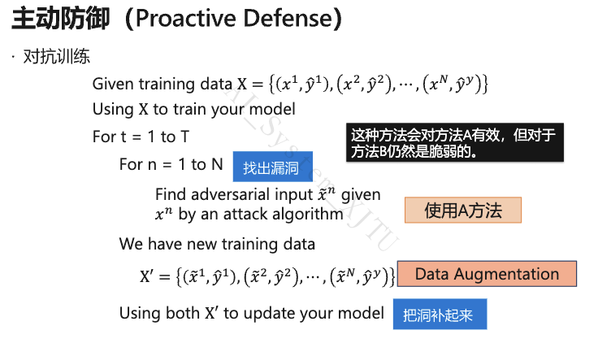

# 深度学习工具与平台 考题汇总（第1-8章）

---

## 选择题

**1. CPU 和 GPU 的结构特点**

- **CPU**：核心由复杂的控制单元和大容量缓存组成，计算单元（ALU）较少。计算密度较低，但控制逻辑复杂，擅长单线程、控制密集型的复杂逻辑程序，支持分支预测、乱序执行。
- **GPU**：由上千个简单核心组成，控制单元简单，缓存较小，但拥有海量计算单元（ALU）。计算密度高，高并发，擅长规则、稠密的数据并行计算（如矩阵运算），**不支持**复杂的分支预测和乱序执行，采用 SIMT（单指令多线程）执行模型。

---

**3. All-Reduce 的两种实现方式**

1. **Reduce + Broadcast**：中心节点先 Reduce 汇总 → 再 Broadcast 分发。缺点：中心带宽瓶颈。

2. **Scatter-Reduce + All-Gather（Ring AllReduce）**：
   - 阶段一 Scatter-Reduce（N-1 轮）：数据分 N 块，环形传递累加，每节点最终持有某个 chunk 的全局和
   - 阶段二 All-Gather（N-1 轮）：环形广播，所有节点获得完整全局和
   - 优点：无中心瓶颈，单节点通信量 $O(K)$，带宽负载均衡

---

**4. 将数据转移到 GPU 上的方法（PyTorch）**

- `tensor.cuda()`：直接将数据转移到默认的 GPU 设备上。
- `tensor.to(device)`：更灵活，`device` 可指定为 `'cuda:0'` 或 `'cpu'`。
- *注：`.numpy()` 是转为 CPU 上的 numpy 数组，`.copy()` 是复制，均不是转移到 GPU 的方法。*

---

**7. Docker 包括的主要技术**

**答案：镜像、容器、仓库。**

> Docker 属于虚拟化技术而非虚拟机，最重要的区别即没有完整的操作系统。但在非 Linux 内核系统上，往往会使用虚拟机来运行一个 Linux（如 WSL）。

---

## 填空题

**1. （第1-3章）ASICs 减少访存的核心是？**

**答案：脉动阵列（Systolic Array）**

CPU 和 GPU 通常需要花费大量功耗去读取寄存器的值。TPU 设计的核心是**脉动阵列**，其思想是将多个 ALU 运算单元串起来，数据在 ALU 之间像水流一样流转传递，从而避免每次计算都要去读取寄存器，极大地减少了访存开销。

---

**1. （第4-6章）传统编译器 Pass 指的是？**

**答案：对源程序的一次完整扫描与优化处理。**

Pass 是编译器对 IR 进行分析或变换的基本单元。LLVM 中由多个 Pass 组成优化管线，每个 Pass 完成特定任务（如死代码消除、常量传播等），多个 Pass 串联构成完整的优化流程。

---

**2. 前端优化中算子融合能够减少 `____` 和 `____`**

**答案：内核启动开销（Kernel Launch Overhead）、内存读取（Memory Access）**

融合后多个算子合并为一个算子，一次 kernel 调用即可完成，同时中间结果无需写回主存再读出，减少访存次数，提高计算密度。

---

**3. 被动防御的含义**

**答案：在不修改模型的情况下找到对抗样本**

> - 被动防御：在不修改模型的情况下找到对抗样本
> - 主动防御：训练一个能够抵抗攻击的模型

---

**4. PyTorch 实现 GPU/节点同步通信原理**

1. **初始化进程组**：`dist.init_process_group(backend='nccl', rank=rank, world_size=world_size)`
2. **通信后端**：NCCL（GPU 优化）、Gloo（通用）、MPI（HPC 标准）
3. **梯度同步**：各节点独立前向/反向 → `dist.all_reduce(gradient)` 聚合求平均
4. **同步机制**：AllReduce 本身是同步操作，所有节点到达后才执行

---

**5. HiveD 算法的核心思想**

**答案：尽可能先从 high-level 分配资源满足租户的需求。**

> 来自 PPT 图注

---

**6. （同第2题）前端优化中算子融合能够减少 `____` 和 `____`**

**答案：内存访问（或访存开销）、Kernel 启动开销**

在深度学习框架中，每一次算子执行都会在 GPU 上启动一个 Kernel，并伴随数据从内存读到缓存/寄存器再写回的过程。算子融合可以减少 Kernel 调用次数，同时中间结果保留在寄存器中直接被下一步使用，大幅减少读写全局内存的次数。

---

**7. 模型量化的优点/缺点**

**优点：**

- **减小模型体积**：将 FP32 权重压缩为 INT8 甚至三值，存储占用降至原来的 $1/4$ 甚至更低
- **加速推理**：整数运算在 CPU/GPU/NPU 上均快于浮点运算，且数据搬运带宽需求更小
- **降低功耗**：整数运算能耗远低于浮点运算，尤其适合边缘设备部署
- **不改变参数数量**：矩阵形状不变，无需修改网络结构即可直接替换算子

**缺点：**

- **精度损失**：将连续浮点值映射到离散整数域，存在舍入误差，模型输出质量会下降
- **极端量化困难**：INT4 / 二值 / 三值等极端压缩可能带来严重的精度退化
- **需要校准**：量化参数（scale、zero point）需要根据实际数据分布确定，不同层敏感度不同
- **训练与推理不一致**：量化感知训练（QAT）需在训练时模拟量化噪声，增加训练复杂度

---

**8. 4 worker Gloo 跑 test.py 的 Horovod 启动命令**

```bash
horovodrun --gloo -np 4 python test.py
```

---

## 判断题

**1. （第1-3章）动态数据流图可以全局图优化**

**答案：×（错误）**

- **静态图**（如 TensorFlow 1.x 的 Define-and-run）是先定义完整的计算图再执行，框架能看到全图信息，可以进行**全局图优化**（如死代码消除、内存静态分配等）。
- **动态图**（如 PyTorch 的 Define-by-run）是边定义边运行，无法提前获知全图结构，因此**无法**进行全局图化简优化。

---

**1. （第4-6章）前端优化是独立于机器的优化，与硬件无关**

**答案：√（正确）**

前端优化主要作用于计算图级别（DAG），通过图的等价变换化简计算图，降低计算复杂度或内存开销，不涉及具体硬件指令、内存层次或算子实现，因此与硬件平台无关。

---

**2. 结构化剪枝比非结构化剪枝稀疏率更高**

**答案：×（错误）**

恰恰相反，**非结构化剪枝的稀疏率更高**（可达 80%~90%），而结构化剪枝的稀疏率相对较低（通常停留在 50%~70%）。

原因是：非结构化剪枝按单个权重绝对值大小独立裁剪，颗粒度最细，可以精准打击不重要的权值。结构化剪枝要求以整个通道/滤波器/神经元为单位裁剪，必然会误伤其中数值较大的权重，因此不能剪太多，否则精度急剧下降。

| | 非结构化（细粒度） | 结构化（粗粒度） |
| :--- | :--- | :--- |
| **剪枝粒度** | 单个权重 | 整个通道/滤波器/神经元 |
| **甜区范围** | 80% ~ 90% | 50% ~ 70% |
| **稀疏率** | **更高** | 较低 |

---

**3. 激活稀疏是一种静态的模型稀疏化方法**

**答案：×（错误）**

激活稀疏是**动态**的。原因如下：

- 激活稀疏由 ReLU 等非线性激活函数 $\phi(z) = \max(0, z)$ 产生——当输入 $z < 0$ 时输出严格为 0
- 具体哪些神经元输出为 0 **取决于当前输入样本**，不同输入会导致完全不同的稀疏模式
- 权重剪枝完成后拓扑固定，是**静态**的；激活稀疏随样本动态变化，是**数据驱动**的

| 维度 | 权重稀疏 | 激活稀疏 | 梯度稀疏 |
| :--- | :--- | :--- | :--- |
| **动态/静态** | 静态：剪枝后拓扑固定 | **动态：随输入样本变化** | 动态：每步迭代位置跳变 |

---

**4. SIMD 是多数据多指令**

**答案：×（错误）**

SIMD 的全称是 Single Instruction, Multiple Data，即**单指令流多数据流**。一个控制器控制多个处理器，同时对一组数据中的每一个执行**相同**的操作（单指令），常用于向量、矩阵等数组运算加速（如 AVX/SSE 指令集）。多指令多数据是 MIMD。

---

**5. 同步通信 = 阻塞通信，异步通信 = 非阻塞通信？**

**答案：×（错误）**

两个不同维度：

| 维度 | 同步/异步 | 阻塞/非阻塞 |
| :--- | :--- | :--- |
| **关注点** | 通信双方是否协调时间步 | 函数调用是否立即返回 |
| **同步/阻塞** | 发送方等待接收方确认 | `send`/`recv` 不返回，等待完成 |
| **异步/非阻塞** | 双方独立运行 | `isend`/`irecv` 立即返回，`wait` 同步 |

同步 SGD（Barrier + AllReduce）底层可用非阻塞 `isend`/`irecv` 实现计算通信重叠。

---

**6. 一个容器包含多层镜像，容器可读可写，镜像只读**

**答案：√（正确）**

容器 Container = 镜像 Image 的多层只读层 + 容器自己的可读写层。准确的说，一个容器包含一个可写的容器层，并共享其底层镜像的多层只读层。

---

**7. 深度学习作业下，被抢占的作业当前只能失败，checkpoint 之后的训练成果将被丢弃**

**答案：√（正确）**

> PPT 原话，见 Chapter 7 Slide 35。这里应理解为"最后一次 checkpoint"。

---

**8. （同判断1第4-6章）前端优化是独立于机器的优化，与硬件无关**

**答案：√（正确）**

深度学习框架的编译器分为前端和后端。前端优化针对的是**计算图（DAG）**本身，如表达式化简、常量折叠、公共子表达式消除等，只改变数学逻辑结构，不涉及具体硬件，因此是硬件无关的。后端优化才涉及针对特定硬件的内存分配、指令调度和 Kernel 生成。

---

## 简答题

**1. IR 的定义以及作用**

**定义：** IR（Intermediate Representation，中间表示）是编译器中的核心数据结构，用于表示源代码转换过程中的中间形式，连接编译器的前端和后端。在深度学习框架中，**数据流图（DAG）** 就是一种高层的中间表示。

**作用：**

| 作用 | 说明 |
| :--- | :--- |
| 跨平台支持 | 不同语言前端统一生成 IR，不同硬件后端统一从 IR 生成代码 |
| 解耦前后端 | 新增语言只需写前端，新增硬件只需写后端——M×N 问题变为 M+N 问题 |
| 优化基础 | 在 IR 层面进行与语言、硬件均无关的通用优化 Pass |
| 分层抽象 | AI 编译器中分为 High-level IR（计算图级）和 Low-level IR（算子表达式级） |

**AI 编译器中的 IR 层级对比：**

| | High-level IR | Low-level IR |
| :--- | :--- | :--- |
| 描述对象 | 算子间的数据依赖关系（图结构） | 单个算子内部的计算逻辑 |
| 粒度 | 图级别 | 算子/循环级别 |
| 典型表达 | Convolution, Matmul, Transformer 等 | load, store, add, mul 等 |

---

**2. 前端优化和后端优化的对象，以及优化方式，各举 4 个例子**

*（注：在部分试卷中编号为第3题）*

**前端优化（图级优化，硬件无关）：**

| 序号 | 优化方式 | 说明 |
| :--- | :--- | :--- |
| 1 | 公共子表达式消除（CSE） | 搜索计算图中相同结构的子图，复用计算结果消除冗余 |
| 2 | 死代码消除（DCE） | 移除对程序输出无影响的节点（如推理时删除训练专用子图） |
| 3 | 常量折叠 | 编译时预先计算常量表达式（如 BN 折叠：将 BN 参数吸收进卷积权重） |
| 4 | 算子融合（Operator Fusion） | 将多个连续算子合并为一个，减少 kernel 启动和内存读写开销 |

*其他还包括：算术表达式化简、布局转换（NCHW↔NHWC）、内存分配优化（Inplace Operation / Memory Sharing）等。*

**后端优化（算子级优化，硬件相关）：**

| 序号 | 优化方式 | 说明 |
| :--- | :--- | :--- |
| 1 | 循环展开（Loop Unrolling） | 展开循环体减少循环控制开销，暴露指令级并行机会 |
| 2 | 循环分块（Loop Tiling） | 将数据分块适配 Cache 大小，提高数据局部性，减少 Cache Miss |
| 3 | 循环融合（Loop Fusion） | 合并相邻独立循环，减少访存次数，改善缓存局部性 |
| 4 | 循环拆分（Loop Split） | 将大循环分解为多个小循环，便于后续向量化或满足硬件约束 |

*其他还包括：内存分配优化（显存池化、In-place）、数据布局转换（NCHW→NHWC）、硬件算子自动调优等。*

---

**2. （第7-8章）主动防御的过程简述以及缺点**

**过程：**

1. 先用原始训练数据 X 训练模型。
2. 对每个训练样本 x，用攻击算法生成对应的对抗样本 x̃。
3. 把这些对抗样本和原来的标签组成新的训练数据。
4. 用原始样本 + 对抗样本一起继续训练模型。
5. 重复多轮以提高模型鲁棒性。

**缺点：**

1. 泛化能力不足。对攻击方法 A 有效的对抗样本，对 B 不一定有效。
2. 额外计算开销。



---

**4. 算子间并行的主要方式及优缺点**

**1. 数据并行：**

- 做法：各设备存完整模型副本，数据均匀分片，各自前向/反向，梯度 AllReduce 聚合
- 优点：实现简单，负载均衡容易，通信量可控
- 缺点：每设备需存完整模型（大模型放不下）；并行度受 batch size 限制

**2. 模型并行：**

- 做法：计算图拆分到不同设备，跨设备传中间激活
- 优点：可训练单卡放不下的大模型；每设备仅存部分模型
- 缺点：GPU 空闲等待；设备间拷贝激活耗时；负载均衡困难；受层间依赖限制

**3. 流水线并行（模型并行的优化）：**

- 做法：mini-batch 切分为 micro-batch 流水线执行（GPipe/PipeDream）
- 优点：减少 GPU 空闲 Bubble，提高利用率
- 缺点：实现复杂；仍有少量 Bubble；micro-batch 不宜过多

---

**5. 用 pybind11 将 C++ 编写的张量运算扩展为 PyTorch 架构时的 5 步**

1. **编写 C++ 计算逻辑**：实现前向传播（Forward）和反向传播（Backward）的具体 C++ 或 CUDA 代码逻辑。
2. **使用 pybind11 绑定接口**：使用 `PYBIND11_MODULE` 宏，将写好的 C++ 函数注册并暴露给 Python 解释器。
3. **编写 `setup.py` 编译脚本**：使用 PyTorch 提供的 `cpp_extension` 模块（如 `CudaExtension`）配置编译参数。
4. **编译与安装**：在终端运行 `python setup.py install` 或 `build` 将 C++ 代码编译成 Python 可调用的动态链接库（.so 文件）。
5. **在 PyTorch 中封装调用**：在 Python 代码中继承 `torch.autograd.Function`，在 `forward` 和 `backward` 静态方法中调用刚编译好的 C++ 底层模块，从而融入 PyTorch 的自动求导计算图中。

---

## 综合题

**1. 按三次拆分一个 63 次循环，并解释循环拆分的作用**

循环拆分的作用：

- 将一个循环分解成多个循环，每个子循环的数据集更小，便于放入 Cache，提高缓存局部性
- 拆分后各段独立，便于后续优化 Pass 分别处理
- 可满足特定硬件对循环次数的约束

```c
for (int i = 0; i < 63; i++) {
    A[i] = a[i] + b[i];
    c[i] = 2 * a[i];
    if (temp[i] > data) {
        d[i] = a[i];
    }
}
// 拆分后
for (int i = 0; i < 63; i++) {
    A[i] = a[i] + b[i];
}
for (int i = 0; i < 63; i++) {
    c[i] = 2 * a[i];
}
for (int i = 0; i < 63; i++) {
    if (temp[i] > data) {
        d[i] = a[i];
    }
}
```

---

**2. 计算矩阵相乘时，不分块与分块的内存读取次数**

假设计算 $C = A \times B$，矩阵维度均为 $N \times N$。

- **不分块（Naive 朴素实现）**：计算 $C$ 中的每一个元素 $C[i,j]$ 时，需要读取 $A$ 的一行（$N$ 个元素）和 $B$ 的一列（$N$ 个元素）。$C$ 共有 $N^2$ 个元素，总的数据读取次数为 $O(N^3)$ 级别。由于 Cache 容量有限，$B$ 的列读取会导致严重的 Cache Miss。
- **分块（Blocked GEMM / Tiling）**：将矩阵切分为大小为 $B_s \times B_s$ 的小块（Tile），使得几个数据块可以完全装入高速缓存（CPU 的 L1 Cache 或 GPU 的 Shared Memory/Registers）。读取一个数据块进入缓存后，可以被重复利用执行多次乘加计算。此时内存到缓存的数据搬运次数将从 $O(N^3)$ 降至大约 $O(N^3 / B_s)$ 级别，大幅提高了访存计算比（Arithmetic Intensity），突破了内存带宽的瓶颈。

---

**3. Ring AllReduce 画图说明**

1. **环形拓扑图**：N 个 GPU 围成环，每个节点同时向右 Send、从左 Receive

2. **Scatter-Reduce 阶段（N-1 轮）**：
   - 数据分为 N 等大 chunk
   - 第 k 轮：每个节点发第 (自身块 - k) 块，收邻居发来的块并累加
   - N-1 轮后：每个节点持有一个完整 chunk 的全局和

3. **All-Gather 阶段（N-1 轮）**：
   - 每个节点将已规约好的完整块发给邻居，邻居替换/转发
   - N-1 轮后：所有节点拥有全部 chunk 的全局和

4. **标注结论**：
   - 总通信量 = $2(N-1)K/N$，单节点 $O(K)$，几乎与 N 无关
   - 无中心瓶颈，所有节点带宽负载均衡

---

**4. DRF 资源分配算法，绘制分配过程表格**

**DRF 算法的详细步骤：**

Step 1: 计算用户对每类资源，所使用的资源的占比
Step 2: 对每个用户取最大占比那一项（Dominant Share）
Step 3: 找 Dominant Share 最少的用户
Step 4: 优先调度该用户的 task
Step 5: 更新资源分配，重复以上步骤

---

**5. Dockerfile 文件中命令的解释，包括 FROM, RUN, WORKDIR, ENV, ENTRYPOINT**

- **FROM**：指定基础镜像
- **RUN**：在构建镜像时执行命令
- **WORKDIR**：指定工作目录，后续的命令都会在这个工作目录下进行
- **ENV**：设置环境变量
- **ENTRYPOINT**：指定容器启动时默认执行的程序（不易被覆盖）

补充：

- **CMD**：指定容器启动后的默认命令或默认参数

> RUN：构建镜像时执行；CMD：容器启动时的默认命令，可被覆盖；ENTRYPOINT：容器启动时的固定入口，参数可追加，不可被覆盖。
