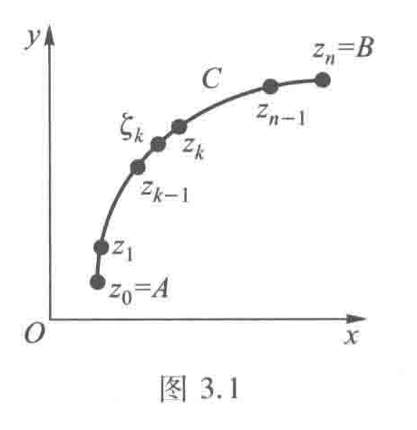
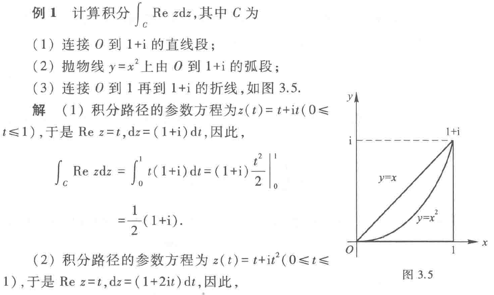

## 3.1 复积分的概念
积分路径是**复平面上的一条曲线C**（从点A到点B）。这里$z = x + iy$是复数， $f(z)$ 是复变函数。复积分可以理解为 **“在复平面上沿着一条路径做积分”**。

计算积分时需要注意C是**有向**的(由$z_{0}$到$z_{n})$，方向改变, 积分变号,$\int_{c}f(z)dz=-\int_{-c}f(z)dz$
对于闭曲线，与高数一样，我们规定逆时针方向为正向。
### 常规的计算方法
1. 化为两个二元实变函数的线积分。
   如书上定理3.1所示，f(z)连续时简单的做虚实部分离即可,即
   $$\int_{c} f(z)dz=\int_{c}udx-\int_{c}vdy+i\int_{c}vdx+i\int_{c}udy，
   \\(f(z)=u(x,y)+iv(x,y))$$
2. 参数方程法
   同上，不过附加一个条件，曲线的参数方程$C:z(t)=x(t)+iy(t)$，根据高数中积第一型线积分的计算公式和法1的化简结果可以得到 $$\int_{c} f(z)dz=\int_{a}^b f(z(t))z'(t)dt$$
### 一个重要积分
$$\oint_{|z-z_{0}|=r} \frac{1}{(z-z_{0})^n}dz=\begin{cases}2\pi i,&n=1\\0,&n\neq 1\end{cases}$$
其中n为任意整数，且以上结果与圆心$z_{0}$和半径$r$无关
### 复积分的基本性质
大部分曲线积分的性质(线性性、可加性、不等式)都适用于复积分

1. （方向改变, 积分变号）$\displaystyle \int_{C} f(z)\mathrm{d}z = -\int_{C^-} f(z)\mathrm{d}z$

2. （线性性质）$\displaystyle \int_{C} kf(z)\mathrm{d}z = k\int_{C} f(z)\mathrm{d}z$（$k$ 为常数）

3. （对积分路径的可加性）
若 $C$ 由 $C_1$ 与 $C_2$ 连接而成，则
$$\displaystyle \int_{C} f(z)\mathrm{d}z = \int_{C_1} f(z)\mathrm{d}z + \int_{C_2} f(z)\mathrm{d}z$$

4. （不等式性质）
曲线 $C$ 的长度为 $L$, 函数 $f(z)$ 在 $C$ 上满足 $|f(z)| \leq M$, 那么
$$\left| \int_{C} f(z)\mathrm{d}z \right| \leq \int_{C} |f(z)|\mathrm{d}s \leq ML \tag{3.5}$$
——《复变函数复习资料》P40
需要提示的是，上课强调了求一个积分上界的题型，这里贴上书本上的例题。
#### 例 3.4 
>设 \( C \) 为从原点到点 \( 3+4\text{i} \) 的直线段, 试求积分 \( \int_{C} \frac{1}{z - \text{i}} \mathrm{d}z \) 绝对值的一个上界.

解答:
> \( C \) 的方程为 \( z=(3+4\text{i})t, 0\leqslant t\leqslant 1 \). 由估值不等式 (3.6) 和
\[
\left| \int_{C} \frac{1}{z - \text{i}} \mathrm{d}z \right| \leqslant \int_{C} \left| \frac{1}{z - \text{i}} \right| \mathrm{d}s
\]
知, 在 \( C \) 上
\[
\left| \frac{1}{z - \text{i}} \right| = \frac{1}{|3t + (4t - 1)\text{i}|} = \frac{1}{\sqrt{25\left(t - \frac{4}{25}\right)^2 + \frac{9}{25}}} \leqslant \frac{5}{3},
\]
及
\[
\left| \int_{C} \frac{1}{z - \text{i}} \mathrm{d}z \right| \leqslant \frac{5}{3}\int_{C} \mathrm{d}s,
\]
而 \( \int_{C} \mathrm{d}s = 5 \), 所以
\[
\left| \int_{C} \frac{1}{z - \text{i}} \mathrm{d}z \right| \leqslant \frac{25}{3}.
\]

## 3.2 柯西积分定理
### 柯西积分定理
若$f(z)$在单连通区域$D$内解析，则沿着区域$D$内任一分段光滑闭曲线的积分值为0.
注:若曲线为边界曲线，如果还有闭区域$D$上连续，则定理依然成立
### 闭路变形原理
闭合曲线C 连续改变且不经过不解析的点, 则$\int_{c}f(z)dz$的值不变
即对于多联通区域，只需构造辅助线分割为单连通区域，即可使用定理计算积分.
#### 推论:复合闭路定理

设 \(f\) 在某区域 \(D\) 上解析，除有限个孤立奇点 \(\{a_1,\dots,a_n\}\) 外。令 \(C\) 为位于 \(D\) 内且不经过任何奇点的分段光滑闭曲线，取正向（逆时针）；对每个奇点 \(a_k\) 取互不相交且均位于 \(C\) 内的小圆周 \(C_k\)（均取正向）。若 \(C\) 可在不穿越奇点的前提下连续变形为这些小圆周的并集，则有
\[
\oint_C f(z)\,\mathrm{d}z \;=\; \sum_{k=1}^n \oint_{C_k} f(z)\,\mathrm{d}z.
\]
方向约定应一致（若某小圈方向与 \(C\) 相反，则对应项带负号）。
感到眼熟？这一部分将在留数定理粉墨登场
关于复合闭路的方向？和高数一样，可以用“沿着线走，左手在区域内”判断

### 原函数与牛-莱公式
这部分基本照搬实函数积分，建议参考书本或越杰学组复习资料
## 3.3 柯西积分公式
设$f(z)$在闭圆盘$|z-z_{0}|\leq \rho_{0}$上解析且在边界上连续，$C$ 为其边界圆周。由多联通区域的柯西积分定理可得：
$$\oint_{C}{\frac{f(z)}{z-z_{0}}dz}=2\pi if(z_{0})$$
此处用的是便于直接求积分的形式
### 推论1：平均值公式
设$f$在以$z_0$为圆心、半径$\rho$的闭圆盘上解析，则有如下推论：
$$
f(z_0)=\frac{1}{2\pi}\int_{0}^{2\pi} f\bigl(z_0+\rho e^{it})\,dt.
$$
证明（要点）：由柯西积分公式
$$f(z_0)=\frac{1}{2\pi i}\oint_{|z-z_0|=\rho}\frac{f(z)}{z-z_0}\,dz$$
取参数化$z=z_0+\rho e^{it},\ dz=i\rho e^{it}dt$即可得到上式。
### 最大模原理
若 f 在连通开集 $D$ 上解析。且$f(z)$不是常函数，则$|f(z)|$在$D$上没有最大值
#### 推论1：
若$f$在连通区域内解析且在某点$z_0$取得模的局部最大值，则$f$在该连通区域上为常函数。

证明：利用平均值公式可得该点周围每个圆周上的平均值等于中心值，从而模不变并可推广到整个连通区域。
#### 推论2：
若$f(z)$在有界区域$D$内解析，在闭区域$\bar D$连续，则最大模$|f(z)|$一定在边界上取得
## 3.4 高阶导数
若$f(z)$在区域$D$内解析，在闭区域$\bar D$连续，C是闭区域的边界，则其各阶导函数都在D内解析，且对D内任意一点$z_0$有
\[
f^{(n)}(z_0)=\frac{n!}{2\pi i}\oint_{C}\frac{f(z)}{(z-z_0)^{\,n+1}}\,dz,\qquad n=0,1,2,\dots
\]
同样的，这个公式有两方面的用处，笔者同样指出其更主要的目的是计算特定形式的积分。

### Cauchy 估计
从高阶导数公式推理得到的结果
（边界上取最大值 \(M=\max_{|z-z_0|=r}|f(z)|\)）：
\[
\bigl|f^{(n)}(z_0)\bigr|\le\frac{n!\,M}{r^{n}}.
\]
于是很快推出下面的定理:
### 刘维尔定理：
若$f(z)$在全平面上解析且有界，其必为常函数。
简单的在Cauchy 估计中令$n=1,R \rightarrow +\infty$即得到导函数为0对任意点成立。
## 习题
由于柯西积分定理可以看作留数定理对一阶极点的特殊形式，笔者没有选择较多的例题，建议读者可结合辅导书上的例题复习。
### 求函数上界
上课提到的3.4/3.5题，已在前文插入，笔者认为略微留意一下这种题型即可
### 例1 （辅导书 例1）

#### 解
> (1) 积分路径的参数方程为 $z(t) = t + \mathrm{i}t\ (0 \leq t \leq 1)$, 于是 $\operatorname{Re} z = t$, $\mathrm{d} z = (1+\mathrm{i})\mathrm{d} t$, 因此,
\[
\begin{split}
\int_{C} \operatorname{Re} z \mathrm{d} z &= \int_{0}^{1} t(1+\mathrm{i}) \mathrm{d} t = (1+\mathrm{i}) \left. \frac{t^2}{2} \right|_{0}^{1} \\
&= \frac{1}{2}(1+\mathrm{i}).
\end{split}
\]
(2) 积分路径的参数方程为 $z(t) = t + \mathrm{i}t^2\ (0 \leq t \leq 1)$, 于是 $\operatorname{Re} z = t$, $\mathrm{d} z = (1+2\mathrm{i}t) \mathrm{d} t$, 因此,
\[
\begin{split}
\int_{C} \operatorname{Re} z \mathrm{d} z &= \int_{0}^{1} t(1+2\mathrm{i}t) \mathrm{d} t \\
&= \left. \left( \frac{t^2}{2} + \frac{2\mathrm{i}}{3}t^3 \right) \right|_{0}^{1} = \frac{1}{2} + \frac{2}{3}\mathrm{i}.
\end{split}
\]
(3) 积分路径由两条直线段构成, $x$ 轴上由 $O$ 到 $1$ 的线段的参数方程为 $z =t(0 \leq t \leq 1)$, 此时 $\mathrm{d} z = \mathrm{d} t$, $\operatorname{Re} z = t$; 由 $1$ 到 $1+\mathrm{i}$ 的线段的参数方程为 $z = 1+\mathrm{i}t\ (0 \leq t \leq 1)$, 此时, $\mathrm{d} z = \mathrm{i}\mathrm{d} t$, $\operatorname{Re} z = 1$, 因此,
\[
\begin{split}
\int_{C} \operatorname{Re} z \mathrm{d} z &= \int_{0}^{1} t \mathrm{d} t + \int_{0}^{1} 1 \cdot \mathrm{i}\mathrm{d} t = \left. \left( \frac{t^2}{2} + \mathrm{i}t \right) \right|_{0}^{1} = \frac{1}{2} + \mathrm{i}.
\end{split}
\]
### 例2 (辅导书 例10) 
> 计算积分: $\oint_{C} \frac{\sin \frac{\pi}{4} z}{z^2 - 1} \mathrm{d} z$, 其中
> 1.  $C: |z+1| = \frac{1}{2}$;
> 2. $C: |z-1| = \frac{1}{2}$;
> 3.  $C: |z| = 2$.

#### 解
> (1)
$$
\begin{aligned}
\oint_{|z+1| = \frac{1}{2}} \frac{\sin \frac{\pi}{4} z}{z^2 - 1} \mathrm{d} z &= \oint_{|z+1| = \frac{1}{2}} \frac{\frac{\sin \frac{\pi}{4} z}{z-1}}{z+1} \mathrm{d} z \\
&\stackrel{\text{柯西积分公式}}{=} 2\pi\mathrm{i} \left. \frac{\sin \frac{\pi}{4} z}{z-1} \right|_{z=-1} \\
&= 2\pi\mathrm{i} \cdot \frac{\frac{\sqrt{2}}{2}}{-2} = \frac{\sqrt{2}}{2}\pi\mathrm{i}.
\end{aligned}
$$
(2)
$$
\begin{aligned}
\oint_{|z-1| = \frac{1}{2}} \frac{\sin \frac{\pi}{4} z}{z^2 - 1} \mathrm{d} z &= \oint_{|z-1| = \frac{1}{2}} \frac{\frac{\sin \frac{\pi}{4} z}{z+1}}{z-1} \mathrm{d} z \\
&\stackrel{\text{柯西积分公式}}{=} 2\pi\mathrm{i} \left. \frac{\sin \frac{\pi}{4} z}{z+1} \right|_{z=1} \\
&= 2\pi\mathrm{i} \cdot \frac{\frac{\sqrt{2}}{2}}{2} = \frac{\sqrt{2}}{2}\pi\mathrm{i}.
\end{aligned}
$$
(3) 由复合闭路定理，得
$$
\begin{aligned}
\oint_{|z| = 2} \frac{\sin \frac{\pi}{4} z}{z^2 - 1} \mathrm{d} z &= \oint_{|z+1| = \frac{1}{2}} \frac{\sin \frac{\pi}{4} z}{z^2 - 1} \mathrm{d} z + \oint_{|z-1| = \frac{1}{2}} \frac{\sin \frac{\pi}{4} z}{z^2 - 1} \mathrm{d} z \\
&\stackrel{\text{由(1)、(2)}}{=} \frac{\sqrt{2}}{2}\pi\mathrm{i} + \frac{\sqrt{2}}{2}\pi\mathrm{i} = \sqrt{2}\pi\mathrm{i}.
\end{aligned}
$$

### 例3 （辅导书 例18）
注：这是最后一节课举的例子，读者可以试着采用留数定理试证，注意定义法(级数)和公式法的选择

> 计算积分 $\oint_{C} \frac{\mathrm{d} z}{(z-1)^3(z+1)^4}$, 其中
(1) $C$ 是圆心在 $z=1$, 半径 $R<2$ 的圆周;
(2) $C$ 是圆心在 $z=-1$, 半径 $R<2$ 的圆周;
(3) $C$ 是圆心在 $z=1$ 或 $z=-1$, 半径 $R>2$ 的圆周.
#### 解 
> (1) $C$ 内只有一个奇点 $z=1$, 所以
$$
\begin{aligned}
\oint_{C} \frac{\mathrm{d} z}{(z-1)^3(z+1)^4} &= \frac{2\pi\mathrm{i}}{2!} \left. \left[ \frac{1}{(z+1)^4} \right]'' \right|_{z=1} \\
&= \pi\mathrm{i} \cdot (-4)(-5) \left. \frac{1}{(z+1)^6} \right|_{z=1} \\
&= \frac{5}{16}\pi\mathrm{i}.
\end{aligned}
$$
(2) $C$ 内只有一个奇点 $z=-1$, 所以
$$
\begin{aligned}
\oint_{C} \frac{\mathrm{d} z}{(z-1)^3(z+1)^4} &= \oint_{C} \frac{\frac{1}{(z-1)^3}}{(z+1)^4} \mathrm{d} z \\
&= \frac{2\pi\mathrm{i}}{3!} \left. \left[ \frac{1}{(z-1)^3} \right]''' \right|_{z=-1} \\
&= \frac{\pi\mathrm{i}}{3} (-3)(-4)(-5) \left. \frac{1}{(z-1)^6} \right|_{z=-1} \\
&= -\frac{5}{16}\pi\mathrm{i}.
\end{aligned}
$$
(3) $C$ 内有两个奇点 $z=1,z=-1$. 作简单闭曲线 $C_1,C_2$ 分别包围点 $-1,1$, 且 $C_1$ 和 $C_2$ 互不包含、互不相交. 利用复合闭路定理和 (1), (2) 小题的结果, 有
$$
\begin{aligned}
\oint_{C} \frac{\mathrm{d} z}{(z-1)^3(z+1)^4} &= \oint_{C_1} \frac{\mathrm{d} z}{(z-1)^3(z+1)^4} + \oint_{C_2} \frac{\mathrm{d} z}{(z-1)^3(z+1)^4} \\
&= \frac{5}{16}\pi\mathrm{i} - \frac{5}{16}\pi\mathrm{i} = 0.
\end{aligned}
$$
