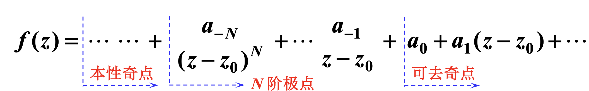

## 基础知识

### 零点

设函数 $f(z)$  在 $z_0$ 处解析，

(1) 若 $f(z_0) = 0$，则称 $z = z_0$ 为 $f(z)$ 的**零点**；

(2) 若 $f(z) = (z - z_0)^m \varphi(z)$，$\varphi(z)$ 在 $z_0$ 处解析且 $\varphi(z_0) \neq 0$，则称 $z = z_0$ 为 $f(z)$ 的 $m$ 阶零点。

##### 判断零点阶数的方法

1.  **求导**：若函数 $f(z)$ 在 $z_0$ 处解析，且满足 $f(z_0) = f'(z_0) = \cdots = f^{(m-1)}(z_0) = 0$，但 $f^{(m)}(z_0) \neq 0$，则称 $z_0$ 是 $f(z)$ 的 $m$ 阶零点。
2.  **泰勒展开**：若函数 $f(z)$ 在 $z_0$ 处可表示为 $f(z) = (z - z_0)^m \varphi(z)$，其中 $\varphi(z)$ 在 $z_0$ 处解析且 $\varphi(z_0) \neq 0$，则称 $z_0$ 是 $f(z)$ 的 $m$ 阶零点。

#### 孤立奇点

设$z_0$为$f(z)$的奇点，且存在$\delta > 0$，使得$f(z)$在去心邻域$0 < |z - z_0| < \delta$内解析，则称$z_0$为$f(z)$**孤立奇点**。

**人话**：一个奇点边上没有其他奇点挨着。

#### 孤立奇点的分类
设 $z_0$ 是函数 $f(z)$ 的孤立奇点，则在 $z_0$ 的某个去心邻域 $0 < |z - z_0| < R$ 内，$f(z)$ 可以展开为洛朗级数：

$$
f(z) = \sum_{n=-\infty}^{\infty} a_n (z - z_0)^n
$$

根据负幂项的情况，孤立奇点分为三类：

1. **可去奇点**：洛朗展开式中不含负幂项（$a_n = 0, \forall n < 0$）。
2. **极点**：洛朗展开式中只含有限个负幂项。
   - 若 $a_{-m} \neq 0$，而 $a_n = 0$ 对所有 $n < -m$，则 $z_0$ 称为 $m$ 阶极点
3. **本性奇点**：洛朗展开式中含有无穷多个负幂项。

**如何进行孤立奇点的分类**：

洛朗级数展开

*   **可去奇点**：若 $\lim\limits_{z \to z_0} f(z) = c$ (常数)。
*   **极点**：若 $\lim\limits_{z \to z_0} f(z) = \infty$。
    *   更精确地，若 $f(z)$ 在 $z_0$ 处的洛朗级数展开式为 $f(z) = \dfrac{a_{-N}}{(z-z_0)^N} + \cdots + \dfrac{a_{-1}}{z-z_0} + a_0 + a_1(z-z_0) + \cdots$，其中 $a_{-N} \neq 0$ 且 $N \ge 1$，则称 $z_0$ 为 $f(z)$ 的 $N$ 阶极点。
*   **本性奇点**：若 $\lim\limits_{z \to z_0} f(z)$ 不存在且不为 $\infty$。

**判断极点阶数的方法**：

1.  若 $f(z)=\frac{\varphi(z)}{(z-z_0)^m}$，其中 $\varphi(z)$ 在 $z_0$ 点的邻域内解析，且 $\varphi(z_0)\neq 0$，则 $z_0$ 为 $f(z)$ 的 $m$ 阶极点。
2.  若 $f(z)=\frac{P(z)}{Q(z)}$，且 $z_0$ 是 $P(z)$ 的 $n$ 阶零点，是 $Q(z)$ 的 $m$ 阶零点，即 $P(z)=(z-z_0)^n P_1(z)$ 且 $Q(z)=(z-z_0)^m Q_1(z)$，其中 $P_1(z_0) \neq 0$ 且 $Q_1(z_0) \neq 0$。
    *   当 $n \ge m$ 时，$z_0$ 为 $f(z)$ 的可去奇点。
    *   当 $n < m$ 时，$z_0$ 为 $f(z)$ 的 $(m - n)$ 阶极点。

**注意！！！如下判断本性奇点的方法是有问题的**

$f(z)=g\left(\frac{\varphi(z)}{\psi(z)}\right)\xrightarrow{\text{函数 }g(z)\text{连续}}\begin{cases}
\lim\limits_{z\to z_0}f(z)=g(c)&\text{可去奇点},\\
\lim\limits_{z\to z_0}f(z)=g(\infty)&\text{本性奇点?}
\end{cases}$

例如：$f(z) = \frac{1}{z}$。当$z \to 0$时，$\frac{1}{z} \to \infty$。这是一个一阶极点。

#### 留数的定义
函数 $f(z)$ 在孤立奇点 $z_0$ 处的洛朗展开式中，$(z - z_0)^{-1}$ 项的系数 $a_{-1}$ 称为 $f(z)$ 在 $z_0$ 处的**留数**，记作：

$$
\text{Res}[f(z), z_0] = C_{-1}
$$

#### 留数定理
设函数 $f(z)$ 在区域 $D$ 内除有限个孤立奇点 $z_1, z_2, \ldots, z_n$ 外处处解析，$C$ 是 $D$ 内包围所有奇点的一条正向简单闭曲线，则：

$$
\oint_C f(z) \, dz = 2\pi i \sum_{k=1}^{n} \text{Res}[f(z), z_k]
$$

### 留数的计算方法

#### 1. 可去奇点
留数为 $0$。

#### 2. 一阶极点
若 $z_0$ 是 $f(z)$ 的一阶极点，则：

$$
\text{Res}[f(z), z_0] = \lim_{z \to z_0} (z - z_0) f(z)
$$

特别地，若 $f(z) = \frac{P(z)}{Q(z)}$，其中 $P(z_0) \neq 0$，$Q(z_0) = 0$，$Q'(z_0) \neq 0$，则：

$$
\text{Res}[f(z), z_0] = \frac{P(z_0)}{Q'(z_0)}
$$

#### 3. $m$ 阶极点
若 $z_0$ 是 $f(z)$ 的 $m$ 阶极点，则：

$$
\text{Res}[f(z), z_0] = \frac{1}{(m-1)!} \lim_{z \to z_0} \frac{d^{m-1}}{dz^{m-1}} [(z - z_0)^m f(z)]
$$

#### 4. 本性奇点
需要展开洛朗级数，找出 $(z - z_0)^{-1}$ 项的系数。

#### 5. 无穷远点的留数
若 $f(z)$ 在 $|z| > R$ 内解析，则在无穷远点的留数为：

$$
\text{Res}[f(z), \infty] = -a_{-1}
$$

其中 $a_{-1}$ 是 $f(z)$ 在 $\infty$ 处洛朗展开式 $f(z) = \sum_{n=-\infty}^{\infty} a_n z^n$ 中 $z^{-1}$ 的系数。

$$
\text{Res}[f(z), \infty] = -\text{Res}\left[f\left(\frac{1}{w}\right) \cdot \frac{1}{w^2}, 0\right]
$$

> **提示：**
> 注意无穷远点留数的定义中本身带有一个**负号**。
> 即 $\text{Res}[f(z), \infty] = -a_{-1}$，这与有限远点 $z_0$ 处的留数 $a_{-1}$ 定义符号相反。这是因为积分方向（顺时针包围无穷远点）导致的。
> 另外，若 $f(z)$ 在扩充复平面上只有有限个奇点，则所有奇点（包括无穷远点）的留数之和为 $0$。这常用来反求某个难求的留数。

### 留数定理的应用

#### 计算实积分

##### 类型一：三角函数有理式的积分

**形式**：$I = \int_0^{2\pi} R(\cos\theta, \sin\theta) \, d\theta$，其中 $R(\cos\theta, \sin\theta)$ 是关于 $\cos\theta$ 和 $\sin\theta$ 的有理函数。

**计算方法**：

1. **变量替换**：令 $z = e^{i\theta}$，则：
   - $\cos\theta = \frac{z + z^{-1}}{2} = \frac{z^2 + 1}{2z}$
   - $\sin\theta = \frac{z - z^{-1}}{2i} = \frac{z^2 - 1}{2iz}$
   - $d\theta = \frac{dz}{iz}$

2. **转化为单位圆上的积分**：当 $\theta$ 从 $0$ 到 $2\pi$ 变化时，$z$ 沿单位圆 $|z| = 1$ 逆时针绕行一周。因此：
   $$I = \oint_{|z|=1} R\left(\frac{z^2+1}{2z}, \frac{z^2-1}{2iz}\right) \frac{dz}{iz}$$

3. **求奇点和留数**：找出被积函数在单位圆内的所有孤立奇点，计算每个奇点的留数。

4. **应用留数定理**：
   $$I = 2\pi i \sum \text{Res}[f(z), z_k]$$

##### 类型二：无穷积分

**形式**：$I = \int_{-\infty}^{\infty} R(x) \, dx$

令
$$R(z)=\frac{P(z)}{Q(z)}=\frac{a_{0} z^{n}+a_{1} z^{n-1}+\cdots+a_{n}}{b_{0} z^{m}+b_{1} z^{m-1}+\cdots+b_{m}} \quad\left(a_{0} b_{0} \neq 0, m-n \geqslant 2\right),$$
（1）$Q(z)$比$P(z)$至少高两次，  
（2）$Q(z)$在实轴上无零点，  
（3）$R(z)$在上半平面$\operatorname{Im} z>0$内的极点为$z_{k}(k=1,2, \cdots, n)$，则有
$$
\int_{-\infty}^{+\infty} R(x) \mathrm{d} x=2 \pi \mathrm{i} \sum_{k=1}^{n} \operatorname{Res}\left[R(z), z_k\right].
$$

##### 类型三：含三角函数或指数函数的无穷积分

**形式**：$I = \int_{-\infty}^{\infty} R(x) \cos(ax) \, dx$ ， $\int_{-\infty}^{\infty} R(x) \sin(ax) \, dx$ 或 $\int_{-\infty}^{\infty} R(x)e^{iax}dx$，其中 $a > 0$

**适用条件**：与类型二类似，由 Jordan 引理条件 1 可放宽为 $f(z)$ 为真分式。

$$
\int_{-\infty}^{+\infty} R(x) \mathrm{e}^{\mathrm{i} a x} \mathrm{~d} x=\int_{-\infty}^{+\infty} \frac{P(x)}{Q(x)} \mathrm{e}^{\mathrm{i} a x} \mathrm{~d} x=2 \pi \mathrm{i} \sum_{k=1}^{n} \operatorname{Res}\left[f(z), z_{k}\right],
$$

### 例题

> $\text{Res}\left[\cos \frac{z}{z - 1}, 1\right] =$

$$\begin{aligned}
\cos \frac{z}{z-1} &= \cos(1+\frac{1}{z-1})\\
                   &= \cos 1 \cos(\frac{1}{z-1}) - \sin 1 \sin(\frac{1}{z-1})
\end{aligned}$$

将 $\sin \frac{1}{z-1}$ 展开即可得到 $(z-1)^{-1}$ 的系数是 $-\sin 1$。

即留数为 $-\sin 1$.

> 求积分
> $$\int_{-\infty}^{+\infty} \frac{\sin^2 x}{(x^2 + 1)^2} dx$$

三角公式降低分子的次数即可，答案为$\frac{\pi (1-3\text{e}^{-2})}{4}$。

> 设 $f(z)$ 为复平面上的解析函数，则 $\text{Res}\left[\left(\frac{1}{z} + \frac{1}{z^2}\right)f(z), 0\right] = (\quad)$

直接洛朗级数展开，答案为$f(0) + f'(0)$

> 设 $f(z) = z^4 \text{e}^{\frac{1}{z}}$，则 $\text{Res}[f(z), 0] = \underline{\quad\quad}$。

同样，直接展开，答案为$\frac{1}{120}$。

> 求 $\oint_{C} \overline{z}^{2}\text{e}^{-3z}\text{d}z$（其中 $C$ 为圆周 $|z|=1$ 的正向）的值.

解 因 $z\overline{z}=|z|^{2}=1$，所以在圆周 $|z|=1$ 上，$\overline{z}=\frac{1}{z}$. 故被积函数 $\overline{z}^{2}\text{e}^{-3z}$ 变为 $\frac{\text{e}^{-3z}}{z^{2}}$. 该函数在 $|z|=1$ 内仅 $z=0$ 为二阶极点. 被积函数的洛朗展开式为：
$$\frac{\text{e}^{-3z}}{z^{2}}=\frac{1}{z^{2}}-\frac{3}{z}+\frac{9}{2!}-\dots$$
其中 $\frac{1}{z}$ 项（留数）系数为 $-3$.

根据留数定理，沿正向闭曲线 $C$ 的积分
$$\oint_{C}\frac{\text{e}^{-3z}}{z^{2}}\text{d}z=2\pi\text{i}\cdot\text{Res}[f(z),0]=2\pi\text{i}\cdot(-3)=-6\pi\text{i}$$

> 计算 $\oint_{|z-\frac{3}{2}|=1} \frac{z+\mathrm{e}^{z}}{\cos z} \mathrm{d} z$ 的值.

被积函数为 $\frac{z+e^{z}}{\cos z}$，在圆 $|z-\frac{3}{2}|=1$ 内，余弦函数的零点为 $z=\frac{\pi}{2}$（因 $\cos \frac{\pi}{2}=0$ 且 $|\frac{\pi}{2}-\frac{3}{2}|<1$）。

该点为简单极点，留数计算如下：
$\text{Res}\left( \frac{z+e^{z}}{\cos z},\frac{\pi}{2} \right)=\lim_{z \to \frac{\pi}{2}}(z-\frac{\pi}{2})\frac{z+e^{z}}{\cos z}=-\left( \frac{\pi}{2}+e^{\frac{\pi}{2}} \right)$

由留数定理，积分值为：
$\oint_{|z-\frac{3}{2}|=1}\frac{z+e^{z}}{\cos z}dz=2\pi i \times \left( -\left( \frac{\pi}{2}+e^{\frac{\pi}{2}} \right) \right)=-2\pi i \left( \frac{\pi}{2}+e^{\frac{\pi}{2}} \right)$

答案：
$-2\pi i \left( \frac{\pi}{2}+e^{\frac{\pi}{2}} \right)$

> 计算积分$\int_{0}^{+\infty} \frac{x \sin(4x)}{(x^2 + 1)(x^2 + 4)}\text{d}x$的值.

可以使用留数定理求得

$\int_{-\infty}^{\infty} \frac{x e^{i4x}}{(x^2+1)(x^2+4)} dx = 2\pi i \left( \frac{e^{-4}}{6} - \frac{e^{-8}}{6} \right) = \frac{\pi i (e^{-4} - e^{-8})}{3}$。

取虚部，我们得到：

$\text{Im} \left( \int_{-\infty}^{\infty} \frac{x e^{i4x}}{(x^2+1)(x^2+4)} dx \right) = \frac{\pi (e^{-4} - e^{-8})}{3}$。而原函数是偶函数。因此，我们有：

$\int_{0}^{\infty} \frac{x \sin(4x)}{(x^2+1)(x^2+4)} dx = \frac{1}{2} \cdot \frac{\pi (e^{-4} - e^{-8})}{3} = \frac{\pi (e^{-4} - e^{-8})}{6}$。

> （实轴上有奇点的情况）计算积分 $\int_{0}^{+\infty} \frac{\sin 2x}{x(1+x^2)}\text{d}x$.

$$
\int_{0}^{+\infty} \frac{\sin 2x}{x(1+x^{2})}\text{d}x=\frac{1}{2}\text{Im}\left( \int_{-\infty}^{+\infty} \frac{\text{e}^{2\text{i}x}}{x(1+x^{2})}\text{d}x \right),
$$

$$
R(z)=\frac{\text{e}^{2\text{i}z}}{z(1+z^{2})}
$$
在线路内只有奇点$z=\text{i}$，因而

$$
I=\frac{1}{2}\text{Im}\left\{ 2\pi\text{i}\ \text{Res}[R(z),\text{i}]-\lim_{r \to 0}\int_{C_{r}} \frac{\text{e}^{2\text{i}z}}{z(1+z^{2})}\text{d}z \right\},
$$

$C_r$ 是 $|z|=r\left(r=\frac{1}{2}R\right)$ 的上半圆周,故
$$
\lim _{r \rightarrow 0} \int_{C_r} \frac{\mathrm{e}^{2 \mathrm{i} z}}{z\left(1+z^2\right)} \mathrm{d} z=-\pi \mathrm{i},
$$
从而
$$
\begin{aligned}
I & =\frac{1}{2} \operatorname{Im}\left\{2 \pi \mathrm{i} \lim _{z \rightarrow \mathrm{i}} \frac{\mathrm{e}^{2 \mathrm{i} z}}{z(z+\mathrm{i})}+\pi \mathrm{i}\right\} \\
& =\frac{1}{2} \cdot \operatorname{Im}\left\{2 \pi\left(-\frac{\mathrm{e}^{-2}}{2}\right)+\pi \mathrm{i}\right\}=\frac{\pi}{2}\left(1-\mathrm{e}^{-2}\right) .
\end{aligned}
$$

> 计算积分 $\int_{0}^{+\infty} \frac{\sin^3 x}{x^3} \mathrm{d}x$.

降低分子次数得
$$\int_{0}^{+\infty} \frac{\sin ^{3} x}{x^{3}} \mathrm{~d} x=-\frac{1}{4} \int_{0}^{+\infty} \frac{\sin 3 x-3 \sin x}{x^{3}} \mathrm{~d} x.$$

取类似于上上题的积分路径，使 $C$ 内无奇点，即当 $R \to \infty$，$r \to 0$ 时，
$$
\int_{-R}^{-r}-\int_{C_{r}}+\int_{r}^{R}+\int_{C_{R}}=0,
$$
而 $\int_{C_{R}}=0$, 故
$$
\begin{aligned}
2 \mathrm{i} \int_{0}^{+\infty} \frac{\sin 3 x-3 \sin x}{x^{3}} \mathrm{~d} x & =\lim _{r \rightarrow 0} \int_{C_{r}} \frac{\mathrm{e}^{\mathrm{i} 3 z}-\mathrm{e}^{\mathrm{i} z}}{z^{3}} \mathrm{~d} z \\
& =\lim _{r \rightarrow 0} \oint_{C_{r}} \frac{\left(1+3 \mathrm{i} z+\frac{1}{2 !}(3 \mathrm{i} z)^{2}+\cdots\right)-3\left(1+\mathrm{i} z+\frac{1}{2 !}(\mathrm{i} z)^{2}+\cdots\right)}{z^{3}} \mathrm{~d} z \\
& =\lim _{r \rightarrow 0} \oint_{C_{r}}\left(-\frac{2}{z^{3}}-\frac{3}{z}+\cdots\right) \mathrm{d} z=-3 \pi \mathrm{i} .
\end{aligned}
$$
从而
$$
\int_{0}^{+\infty} \frac{\sin 3 x-3 \sin x}{x^{3}} \mathrm{~d} x=\frac{3}{8} \pi .
$$

> 证明 $\int_{0}^{+\infty} \frac{\mathrm{d}x}{1+x^{n}}=\frac{\pi}{n \cdot \sin \frac{\pi}{n}}$（$n \geq 2$,$n$ 为整数）.

取$R(z)=\frac{1}{1+z^n}$，它的一阶极点为$\mathrm{e}^{\mathrm{i}\frac{\pi}{n}},\cdots,\mathrm{e}^{\mathrm{i}\frac{2n-1}{n}\pi}$，有$n$个。当$n \geq 2$时，点$\mathrm{e}^{\mathrm{i}\frac{\pi}{n}}$总位于上半平面。为此选积分线路如图，在闭曲线内只有$R(z)$的一个奇点$\mathrm{e}^{\mathrm{i}\frac{\pi}{n}}$。这时有
$$
\int_{0}^{R} R(x) \mathrm{d}x + \int_{C_R} R(z) \mathrm{d}z + \int_{L} f(z) \mathrm{d}z = 2\pi\mathrm{i} \cdot \mathrm{Res}[R(z), \mathrm{e}^{\mathrm{i}\frac{\pi}{n}}] = 2\pi\mathrm{i} \cdot \left(-\frac{1}{n}\mathrm{e}^{\mathrm{i}\frac{\pi}{n}}\right).
$$

​                                                                                     

当$R \to \infty$时，$\int_{C_R} R(z)dz = 0$. 而在$L$上，令$z = re^{\text{i}\frac{2\pi}{n}}$，有

$$
\begin{aligned}
\lim_{R \to \infty} \int_L \frac{dz}{1+z^n} &= \lim_{R \to \infty} \int_R^0 \frac{e^{\text{i}\frac{2\pi}{n}}dr}{1+r^n} \\
&= \lim_{R \to \infty} -\int_0^R \frac{e^{\text{i}\frac{2\pi}{n}}dr}{1+r^n} = -\lim_{R \to \infty} \int_0^R \frac{e^{\text{i}\frac{2\pi}{n}}dx}{1+x^n},
\end{aligned}
$$

而

$$
\lim_{R \to \infty} \int_0^R R(x)dx = \lim_{R \to \infty} \int_0^R \frac{1}{1+x^n}dx.
$$

则

$$
\begin{aligned}
\lim_{R \to \infty} \left[ \int_0^R R(x)dx + \int_{C_R} R(z)dz + \int_L f(z)dz \right] &= \int_0^{+\infty} \frac{dx}{1+x^n} + 0 + \left( -e^{\text{i}\frac{2\pi}{n}} \right) \int_0^{+\infty} \frac{dx}{1+x^n} \\
&= \left( 1 - e^{\text{i}\frac{2\pi}{n}} \right) \int_0^{+\infty} \frac{dx}{1+x^n} \\
&= 2\pi \text{i} \left( -\frac{1}{n} e^{\text{i}\frac{\pi}{n}} \right),
\end{aligned}
$$

即

$$
\begin{aligned}
\int_0^{+\infty} \frac{dx}{1+x^n} &= \frac{ -\frac{2\pi \text{i}}{n} e^{\text{i}\frac{\pi}{n}} }{1 - e^{\text{i}\frac{2\pi}{n}}} \\
&= \frac{ -\frac{2\pi \text{i}}{n} e^{\text{i}\frac{\pi}{n}} }{e^{\text{i}\frac{\pi}{n}} \left( e^{-\text{i}\frac{\pi}{n}} - e^{\text{i}\frac{\pi}{n}} \right)}
\end{aligned}
$$