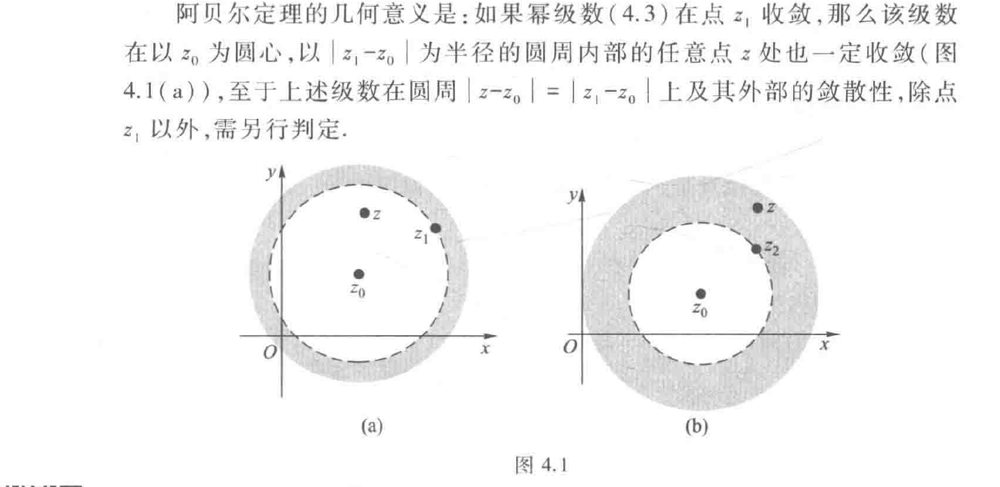
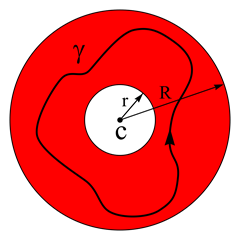

## 4.1复数项级数
如果对高数中关于级数的部分基础比较牢的话，这部分内容即将原本的级数概念扩展到复平面上，故序列的极限、部分和等概念笔者此处跳过
### 一些判敛的基础方法
#### 复级数收敛的充分必要条件
设$z_n=x_n+iy_n$,则其收敛的充分必要条件为$x_n$和$y_n$都收敛
这是比较显然的
#### 绝对收敛判敛
若$\sum_{n=1}^ \infty |Z_n|$收敛，则$\sum_{n=1}^ \infty Z_n$也收敛
同样的有绝对收敛、条件收敛与发散三种情况，与高数中定义相同，此处不再赘述
## 4.2 复变函数项级数
### 定义
复变函数项级数是指在区域或集合 D 上由复值函数项构成的级数
$$\sum_{n=1}^\infty f_n(z)\quad (f_n:D\to\mathbb C).$$
### 幂级数
形如
$$\sum_{n=0}^\infty c_n (z-z_0)^n,\qquad c_n\in\mathbb C,\ z_0\in\mathbb C$$
的级数称为以$z_0$为中心的幂级数，其中$c_n$为系数.
根据高数中的阿贝尔定理，我们可以得到,
#### 复数域的Abel定理
若幂级数在某点$z_1$收敛，则其在圆域$|z-z_0|<|z_1-z_0|$内绝对收敛

##### Abel定理的一个推论
若幂级数在$z_2$发散，则满足$|z-z_0|>|z_2-z_0|$的任意点都使得级数发散。
与高数一样，我们得到级数的敛散性同样存在三种情况，对应收敛半径为0，R,$\infty$，此处不再详细给出定义
#### 收敛半径的判断
收敛半径：在圆周$|z-z_0|=R$内级数绝对收敛，在圆周外级数发散。
特别强调，**收敛半径上的点，其敛散性未知**.

同样的，可以使用比值法与根值法来计算收敛半径

比值法（若极限存在）：
$$L=\lim_{n\to\infty}\left|\frac{c_{n+1}}{c_n}\right|\quad\Longrightarrow\quad
R=\frac{1}{L}=\lim_{n\to\infty}\left|\frac{c_n}{c_{n+1}}\right|.$$
当 $L=0$ 时 $R=\infty$；当 $L=\infty$ 时 $R=0$。

根值法（Cauchy–Hadamard 公式）：
$$\rho=\lim_{n\to\infty}|c_n|^{1/n}\quad\Longrightarrow\quad R=\frac{1}{\rho}.$$
当 $\rho=0$ 时 $R=\infty$；当 $\rho=\infty$ 时 $R=0$。
### 收敛圆内部的性质
1. 和函数是解析函数
2. 和函数允许逐项求导和逐项积分
3. 幂级数的加与乘法则
### 幂级数的加法与乘法法则

设两幂级数（同心）
\[
f(z)=\sum_{n=0}^\infty a_n (z-z_0)^n,\qquad
g(z)=\sum_{n=0}^\infty b_n (z-z_0)^n
\]
的收敛半径分别为 \(R_f,R_g\)，令 \(R=\min(R_f,R_g)\)。则在开圆盘 \(|z-z_0|<R\) 内：

- 加法：可逐项相加，得到
    \[
    f(z)+g(z)=\sum_{n=0}^\infty (a_n+b_n)\,(z-z_0)^n,
    \]
    该级数在 \(|z-z_0|<R\) 一致收敛并等于 \(f+g\)。其收敛半径至少为 \(R\)。

- 乘法（Cauchy 乘积）：可逐项相乘并重排为卷积形式
    \[
    f(z)g(z)=\sum_{n=0}^\infty c_n\,(z-z_0)^n,\qquad
    c_n=\sum_{k=0}^n a_k\,b_{n-k}.
    \]
    在 \(|z-z_0|<R\) 上该级数一致收敛且等于 \(f(z)g(z)\)。因此乘积的收敛半径也至少为 \(R\)。

说明：在任一小圆盘 \(|z-z_0|\le r<R\) 上，两级数均绝对且一致收敛，故上述逐项加、乘是合法的；边界点的敛散性须逐点判定。  
## 4.3 Taylor级数
### 定义

设函数 \(f\) 在点 \(z_0\) 的某一邻域内解析，则存在 \(R>0\)，使得对一切 \(|z-z_0|<R\) 有唯一的幂级数表示
\[
f(z)=\sum_{n=0}^\infty a_n\,(z-z_0)^n,
\qquad
a_n=\frac{f^{(n)}(z_0)}{n!}.
\]
该级数称为函数 \(f\) 在 \(z_0\) 处的泰勒级数（中心为 \(z_0\) 的泰勒展开）。当 \(z_0=0\) 时称为麦克劳林级数。

主要性质：
- 收敛半径 \(R\) 等于点 \(z_0\) 到离它最近的奇点的距离。
- 在收敛圆 \(|z-z_0|<R\) 内，级数一致收敛，和函数与原函数相等且解析。
- 可以在收敛圆内逐项求导与逐项积分，且所得级数对应导数与不定积分的泰勒展开。
- 泰勒系数由导数确定，因此表示唯一。
- 边界 \(|z-z_0|=R\) 上的敛散性需逐点判定。
- 若在整个复平面解析，则泰勒级数收敛半径为 \(\infty\)（即为全纯的幂级数展开）。
#### 一个重要结论
函数在一点解析$\Longleftrightarrow$在这点的邻域内，可以展开为幂级数
### 一个重要展开(几何级数)
$$1+z+z^2+...+z^n+...=\frac{1}{1-z},∣z∣<1$$
请务必记住这个公式，它将几乎在后面的整个复变函数章节发挥作用。
## 习题
### 例1（教材例 4.2）
> 判别下列级数的收敛性：
(1) $\sum_{n=1}^{\infty}\left(\frac{1}{n} + \frac{\mathrm{i}}{2^n}\right)$
(2) $\sum_{n=1}^{\infty} \frac{\mathrm{i}^n}{n}$
(3) $\sum_{n=1}^{\infty} \frac{\mathrm{i}^n}{n^2}$
#### 解 
> (1) 由 $\sum_{n=1}^{\infty} \frac{1}{n}$ 发散,所以根据定理 4.2 即知 $\sum_{n=1}^{\infty}\left(\frac{1}{n} + \frac{\mathrm{i}}{2^n}\right)$ 发散.
> (2) 显然
$$
\sum_{n=1}^{\infty} \frac{\mathrm{i}^n}{n}=-\left(\frac{1}{2} - \frac{1}{4} + \frac{1}{6} - \frac{1}{8} + \cdots\right) + \mathrm{i}\left(1 - \frac{1}{3} + \frac{1}{5} - \frac{1}{7} + \cdots\right)
$$
的实部与虚部(两级数)都收敛,故 $\sum_{n=1}^{\infty} \frac{\mathrm{i}^n}{n}$ 收敛. 但是
$$
\sum_{n=1}^{\infty} \left| \frac{\mathrm{i}^n}{n} \right| = \sum_{n=1}^{\infty} \frac{1}{n}
$$
发散,因而 $\sum_{n=1}^{\infty} \frac{\mathrm{i}^n}{n}$ 是条件收敛级数.
> (3) 由于 $\sum_{n=1}^{\infty} \left| \frac{\mathrm{i}^n}{n^2} \right| = \sum_{n=1}^{\infty} \frac{1}{n^2}$ 是收敛的正项级数,所以根据定理 4.4 知级数 $\sum_{n=1}^{\infty} \frac{\mathrm{i}^n}{n^2}$ 收敛,且为绝对收敛.
### 例2 (辅导书 例16)
> 写出下列函数关于 $z$ 的幂级数展开式：
(1) $\sin^3 z$；
(2) $\frac{z\cos\theta - z^2}{1 - 2z\cos\theta + z^2}$；
(3) $\mathrm{e}^z \sin z$.
#### 解
这道题指出，很多时候我们会采用化简的方式将函数化简为熟悉的一些初等函数，用已知的幂级数展开来拼凑结果，当然也可以直接使用泰勒定理，因为我们已经提到过，任何方法求出的展开式都是唯一的。
> (1) 
\[
\begin{align*}
\sin^3 z &= \frac{3}{4}\sin z - \frac{1}{4}\sin 3z \\
&= \frac{3}{4}\sum_{n=0}^{\infty} (-1)^n \frac{z^{2n+1}}{(2n+1)!} \\
&\quad - \frac{1}{4}\sum_{n=0}^{\infty} (-1)^n \frac{3^{2n+1}z^{2n+1}}{(2n+1)!} \\
&= \frac{3}{4}\sum_{n=0}^{\infty} (-1)^{n+1} \frac{3^{2n}-1}{(2n+1)!}z^{2n+1} \quad (|z| < \infty).
\end{align*}
\]
(2)
\[
\begin{align*}
\frac{z\cos\theta - z^2}{1 - 2z\cos\theta + z^2} &= -1 - \frac{1}{2}\left[ \frac{\cos\theta + \mathrm{i}\sin\theta}{z - (\cos\theta + \mathrm{i}\sin\theta)} + \frac{\cos\theta - \mathrm{i}\sin\theta}{z - (\cos\theta - \mathrm{i}\sin\theta)} \right] \\
&= -1 + \frac{1}{2}\left( \frac{1}{1 - z\mathrm{e}^{-\mathrm{i}\theta}} + \frac{1}{1 - z\mathrm{e}^{\mathrm{i}\theta}} \right) \\
&= -1 + \frac{1}{2}\left( \sum_{n=0}^{\infty} \mathrm{e}^{-\mathrm{i}n\theta} z^n + \sum_{n=0}^{\infty} \mathrm{e}^{\mathrm{i}n\theta} z^n \right) \\
&= \sum_{n=1}^{\infty} \cos n\theta \, z^n \quad (|z| < 1).
\end{align*}
\]
(3)
一个比较显然（捷径）的方法是采用乘法法则
\[
\begin{align*}
\mathrm{e}^z \sin z &= \left( 1 + z + \frac{1}{2!}z^2 + \cdots + \frac{1}{n!}z^n + \cdots \right) \\
&\quad \times \left[ z - \frac{1}{3!}z^3 + \frac{1}{5!}z^5 - \cdots + (-1)^n \frac{z^{2n+1}}{(2n+1)!} + \cdots \right] \\
&= z + z^2 + \frac{1}{3}z^3 - \frac{1}{30}z^5 + \cdots + \frac{(-4)^n z^{4n+1}}{(4n+1)!} \\
&\quad + \frac{2(-4)^n z^{4n+2}}{(4n+2)!} + \frac{2(-4)^n z^{4n+3}}{(4n+3)!} + \cdots \quad (|z| < +\infty).
\end{align*}
\]
也可以使用拼凑或者Taylor法，读者可自行查阅学习辅导书P123页
### 例3 (辅导书 例23)
> 将 $f(z)=\frac{4z^2+30z+68}{(z+4)^2(z-2)}$ 展为 $z$ 的幂级数.

#### 解 
> 将 $f(z)=\frac{4}{z-2}-\frac{2}{(z+4)^2}$ 分项展开.
\[
\begin{align*}
\frac{4}{z-2} &= \frac{-2}{1-\frac{z}{2}} = -2\left(1+\frac{z}{2}+\frac{z^2}{2^2}+\cdots\right) \\
&= -2\sum_{n=0}^{\infty} z^n/2^n, \ |z| < 2.
\end{align*}
\]
\[
\begin{align*}
\frac{-2}{(z+4)^2}
&= \frac{-2}{16\left(1+\frac{z}{4}\right)^2}
= -\frac{1}{8}\cdot\frac{1}{\left(1+\frac{z}{4}\right)^2}. \\
\text{令 } t&=\frac{z}{4},\quad |t|<1. \\
\text{由几何级数 } &\frac{1}{1+ t}=\sum_{n=0}^\infty (-1)^n t^n \quad (|t|<1). \\
\text{两边对 } t \text{ 求导得 } &
-\frac{1}{(1+t)^2}=\sum_{n=1}^\infty (-1)^n n t^{\,n-1}. \\
\text{因此 } &
\frac{1}{(1+t)^2}=\sum_{n=1}^\infty (-1)^{n+1} n t^{\,n-1}. \\
\text{改标号 } (k=n-1) \Rightarrow &
\frac{1}{(1+t)^2}=\sum_{k=0}^\infty (-1)^k (k+1) t^k. \\
\text{代回并乘 } -\tfrac{1}{8}: \quad
\frac{-2}{(z+4)^2}
&= -\frac{1}{8}\sum_{k=0}^\infty (-1)^k (k+1) \left(\frac{z}{4}\right)^k \\
&= \frac{1}{8}\sum_{k=0}^\infty (-1)^{k+1}(k+1)\left(\frac{z}{4}\right)^k, |z|<4.
\end{align*}
\]
故
\[
\begin{align*}
f(z) &= -2\sum_{n=0}^{\infty} \frac{z^n}{2^n} + \frac{1}{8}\sum_{n=0}^{\infty} (-1)^{n+1}(n+1)\left(\frac{z}{4}\right)^n \\
&= \sum_{n=0}^{\infty} \left[ (-1)^{n+1}\frac{n+1}{2^{2n+3}} - \frac{1}{2^{n-1}} \right] z^n, \ |z| < 2.
\end{align*}
\]

注1:收敛半径 $R=\min\{R_1,R_2\}$.这里2恰好是 $z_0=0$ 到最近奇点 $z=2$ 的距离,即奇点在收敛圆上.

注2：一眼盯出因式分解实属不易，这里我们详细的给出部分分式分解的待定系数法过程
> 我们需要将 \( f(z)=\frac{4z^2+30z+68}{(z+4)^2(z-2)} \) 拆分为 \( \frac{A}{z-2} + \frac{B}{z+4} + \frac{C}{(z+4)^2} \)（因为分母有 \( (z+4)^2 \) 和 \( (z-2) \)，所以部分分式要包含 \( (z+4) \) 的一次、二次项）。

> 计算系数：
将拆分式通分，分子需等于 \( 4z^2+30z+68 \)：
\[
A(z+4)^2 + B(z+4)(z-2) + C(z-2) \\= 4z^2+30z+68
\]
步骤1：求 \( C \)
令 \( z=-4 \)（消去 \( A、B \)），代入得：
\[
C(-4-2) = 4\times(-4)^2 + 30\times(-4) + 68\\ \implies -6C = 64 - 120 + 68 = 12 \implies C = -2
\]
步骤2：求 \( A \)
令 \( z=2 \)（消去 \( B、C \)），代入得：
\[
A(2+4)^2 = 4\times2^2 + 30\times2 + 68 \implies \\36A = 16 + 60 + 68 = 144 \implies A = 4
\]
步骤3：求 \( B \)
展开通分后的分子：
\[
A(z^2+8z+16) + B(z^2+2z-8) + C(z-2)\\ = (A+B)z^2 + (8A+2B+C)z + \\(16A-8B-2C)
\]
对比原分子 \( 4z^2+30z+68 \) 的系数：
\( z^2 \) 项：\( A+B=4 \)，代入 \( A=4 \) 得 \( B=0 \)；
因此，部分分式分解结果为：
\[
f(z) = \frac{4}{z-2} + \frac{0}{z+4} + \frac{-2}{(z+4)^2} \\= \frac{4}{z-2} - \frac{2}{(z+4)^2}
\]

## 洛朗级数
### 基础知识
泰勒级数要求函数在展开点是解析的，而洛朗级数允许函数在展开点处有奇点，它只要求函数在该点的某个环形邻域内解析即可。有时无法把函数表示为泰勒级数，但可以表示为洛朗级数。它不仅包含了正数次幂的项，也包含了负数次幂的项。

函数 $f(z)$ 在一段解析的圆环内关于点 $c$ 的洛朗级数由下式给出：
$$
f(z) = \sum_{n=-\infty}^{\infty} a_n (z - c)^n
$$

其中 $a_n$ 是常数，由以下的曲线积分定义，它是柯西积分公式的推广：

$$
a_n = \frac{1}{2\pi i} \oint_{\gamma} \frac{f(z) \, dz}{(z - c)^{n+1}}
$$

积分路径 $\gamma$ 是位于圆环域内的一条逆时针方向的可求长曲线，把 $c$ 包围起来，在这个圆环内 $f(z)$ 解析的。在图中，该环用红色显示，其内有一合适的积分路径 $\gamma$。

但一般来说，上述的积分公式并不是计算给定的函数 $f(z)$ 系数 $a_n$ 最实用的方法；我们常常通过**拼凑已知的泰勒展开式**来求出洛朗级数。因为**函数的洛朗展开式只要存在就是唯一的**，实际上在圆环中任何与 $f(z)$ 相等的，以上述形式表示的给定函数的表达式一定就是 $f(z)$ 的洛朗展开式。

### 解题方法

#### 展开

1.  观察与变形：识别函数中含有的标准函数形式（如 $e^u, \sin u, \frac{1}{1-u}$ 等）。如果是在 $z=z_0$ 处展开，通常需将函数通过代数变形凑出 $(z-z_0)$ 的项。
2.  变量代换：
    -   **常规代换**：若函数包含复合项（如 $e^{1/z}$），令 $u = 1/z$ 直接代入泰勒公式。
    -   **圆环域适配**：对于分式函数 $\frac{1}{1-z}$，根据展开区域的不同（$|z|<1$ 或 $|z|>1$），选择合适的展开变量（$z$ 或 $1/z$）以满足收敛条件。
3.  代入级数公式：利用熟知的泰勒级数公式进行展开。
4.  整理：合并同类项，写成 $\sum_{n=-\infty}^{\infty} a_n (z-c)^n$ 的标准洛朗级数形式。

**必须熟记的泰勒级数公式：**

*   **几何级数 (最常用于有理分式)**
    $$ \frac{1}{1-u} = \sum_{n=0}^{\infty} u^n = 1 + u + u^2 + \cdots \quad (|u| < 1) $$
    > **提示**：若要在 $|z| > 1$ 域展开，需变形为 $\frac{1}{1-z} = \frac{1}{-z(1 - 1/z)} = -\frac{1}{z} \sum_{n=0}^{\infty} (\frac{1}{z})^n = -\sum_{n=0}^{\infty} \frac{1}{z^{n+1}}$，此时公比为 $1/z$，满足 $|1/z| < 1$。

*   **指数与三角函数 (全平面收敛)**
    *   $e^u = \sum_{n=0}^{\infty} \frac{u^n}{n!} \quad (|u| < \infty)$
    *   $\sin u = \sum_{n=0}^{\infty} \frac{(-1)^n u^{2n+1}}{(2n+1)!} \quad (|u| < \infty)$
    *   $\cos u = \sum_{n=0}^{\infty} \frac{(-1)^n u^{2n}}{(2n)!} \quad (|u| < \infty)$
*   **对数函数**
    $$\ln(1-z) = -\sum_{n=1}^{\infty} \frac{z^n}{n} \quad (|z| < 1)$$
    > 提示：$\ln(1-z)$ 的导数是 $\frac{-1}{1-z}$，通过积分可以得到这个级数。

#### 分式函数展开
当函数 $f(z)$ 为有理分式 $\frac{P(z)}{Q(z)}$ 时。

1.  分解：将有理函数分解为若干个简单的部分分式之和（或之积）。
2.  确定区域：明确所求洛朗级数的收敛圆环域（例如 $r < |z-z_0| < R$）。
3.  变形展开：
    *   对于每一项 $\frac{A}{z-a}$，根据 $|z|$ 与 $|a|$ 的相对大小（即 $|z/a|<1$ 还是 $|a/z|<1$），将其转化为 $\frac{1}{1-u}$ 的形式。
    *   情况 1 ($|z| < |a|$)： $\frac{1}{a-z} = \frac{1}{a(1-z/a)} = \sum \frac{z^n}{a^{n+1}}$ (泰勒级数部分)
    *   情况 2 ($|z| > |a|$)： $\frac{1}{a-z} = \frac{1}{-z(1-a/z)} = -\sum \frac{a^n}{z^{n+1}}$ (洛朗级数主要部分)
4.  合并：将各部分的级数合并，得到最终的洛朗展开式。

### 例题

> 将 $f(z)=\frac{1}{(1+4z^{2})^{2}}$ 在 $|z|>\frac{1}{2}$ 内展开成以 $z=0$ 为中心的 Laurent 级数.

**最典型的例题实际上为书本例4.13以及课后练习题，现举一些不典型的例子作为补充**

> （洛朗级数定义）试证
>
> $$
> \cosh\left(z+\frac{1}{z}\right) = C_0 + \sum_{n=0}^{\infty} C_n\left(z^n + z^{-n}\right),
> $$
>
> 其中$C_{n}=\frac{1}{2\pi}\int_{0}^{2\pi}\cos n\varphi\cosh(2\cos\varphi)\text{d}\varphi,$

**观察到 $C_n$ 很可能是以定义的形式计算得出的**

证 因为$w = z + \frac{1}{z}$在$z$平面上只有$z = 0$一个奇点，而
$$
\cosh w = 1 + \frac{w^2}{2!} + \frac{w^4}{4!} + \cdots,
$$
对于$w$的收敛半径为$+\infty$，故$\cosh\left(z + \frac{1}{z}\right)$在$z$平面上也只有一个奇点$z = 0$，在去心邻域$0 < |z| < +\infty$内解析。由洛朗定理，得
$$
\cosh\left(z + \frac{1}{z}\right) = \sum_{n=-\infty}^{\infty} C_n z^n,
$$
这里
$$
C_n = \frac{1}{2\pi\text{i}} \int_{\Gamma_{\rho}} \frac{\cosh(z + z^{-1})}{z^{n+1}} \text{d}z,
$$
$\Gamma_{\rho}$表示任意圆周$|z| = \rho (\rho > 0)$。

取$\rho = 1$，则沿圆周$\Gamma_{\rho}: z = \text{e}^{\text{i}\varphi}, 0 \leq \varphi \leq 2\pi$，有
$$
\begin{aligned}
C_n &= \frac{1}{2\pi} \int_{0}^{2\pi} \cosh(\text{e}^{\text{i}\varphi} + \text{e}^{-\text{i}\varphi}) \text{e}^{-\text{i}n\varphi} \text{d}\varphi \\
&= \frac{1}{2\pi} \int_{0}^{2\pi} \cosh(2\cos\varphi) \cos n\varphi \text{d}\varphi - \frac{\text{i}}{2\pi} \int_{0}^{2\pi} \cosh(2\cos\varphi) \sin n\varphi \text{d}\varphi.
\end{aligned}
$$
由于右边积分中的被积函数周期为 $2\pi$，由周期函数在任意一个周期内积分值相等可知它等价于 $\frac{\text{i}}{2\pi} \int_{-\pi}^{\pi} \cosh(2\cos\varphi) \sin n\varphi \text{d}\varphi$。又因为被积函数是奇函数，所以该积分等于 $0$，因此：
$$
C_n = \frac{1}{2\pi} \int_{0}^{2\pi} \cosh(2\cos\varphi) \cos n\varphi \text{d}\varphi,\ C_n = C_{-n},
$$
$$
\cosh\left(z + \frac{1}{z}\right) = C_0 + \sum_{n=1}^{\infty} C_n (z^n + z^{-n}).
$$

> 将 $\text{e}^z \cos z$ 和 $\text{e}^z \sin z$ 展开为 $z$ 的幂级数.

固然可以将 $\text{e}^z$ 和三角函数分别展开再相乘，可以得到前几项的系数但是得不到 $C_n$ 的一般表达式。将第二个函数乘以$i$与第一个函数相加减，通过欧拉公式$e^{iz} = \cos z + i \sin z$得到$e^z \cos z \pm i e^z \sin z = e^z e^{\pm iz} = e^{(1 \pm i)z}$。因而直接用指数函数的幂级数展开式先求得上式右端的幂级数展开式，从而易得所给函数的幂级数。

解 由于  
$$
\begin{aligned}
\mathrm{e}^{z}(\cos z+\mathrm{i} \sin z) &=\mathrm{e}^{(1+\mathrm{i}) z} \\
&=\sum_{n=0}^{\infty} \frac{((1+\mathrm{i}) z)^{n}}{n!}=1+\sqrt{2} \mathrm{e}^{\mathrm{i} \frac{\pi}{4}} z+\sum_{n=2}^{\infty} \frac{(\sqrt{2})^{n} \mathrm{e}^{\mathrm{i} \frac{n \pi}{4}}}{n!} z^{n},
\end{aligned}
$$
同理  
$$
\begin{aligned}
\mathrm{e}^{z}(\cos z-\mathrm{i} \sin z) &=\mathrm{e}^{(1-\mathrm{i}) z} \\
&=\sum_{n=0}^{\infty} \frac{(1-\mathrm{i})^{n} z^{n}}{n!}=1+\sqrt{2} \mathrm{e}^{-\mathrm{i} \frac{\pi}{4}} z+\sum_{n=2}^{\infty} \frac{(\sqrt{2})^{n} \mathrm{e}^{-\mathrm{i} \frac{n \pi}{4}}}{n!} z^{n}.
\end{aligned}
$$
两式相加并除以 2，得  
$$
\mathrm{e}^{z} \cos z=1+\sqrt{2} \cos \frac{\pi}{4} z+\sum_{n=2}^{\infty} \frac{(\sqrt{2})^{n} \cos \frac{n \pi}{4}}{n!} z^{n},\quad |z|<+\infty。
$$
两式相减并除以$2\mathrm{i}$，得  
$$
\mathrm{e}^{z} \sin z=\sqrt{2} \sin \frac{\pi}{4} z+\sum_{n=2}^{\infty} \frac{(\sqrt{2})^{n} \sin \frac{n \pi}{4}}{n!} z^{n},\quad |z|<+\infty。
$$

因此，在遇到含有指数与三角函数的乘法幂级数展开时，可以利用$\mathrm{e}^{\mathrm{i} k z}=\cos k z+\mathrm{i} \sin k z$来求出通项。

> 求函数$f(z) = \frac{z \sin z}{(1 - e^{z})^{3}}$在圆环域$0 < |z| < 2\pi$内洛朗级数的主要部分。

解 将 $\sin z$ 与 $\text{e}^z$ 在 $z=0$ 处的泰勒展开式代入 $f(z)$ 的表达式中,得
$$
\begin{aligned}
f(z) &=\frac{z\left(z-\frac{z^3}{3!}+\frac{z^5}{5!}-\frac{z^7}{7!}+\cdots\right)}{-\left(z+\frac{z^2}{2!}+\frac{z^3}{3!}+\frac{z^4}{4!}+\cdots\right)^3} \\
&=-\frac{1}{z} \frac{\left[1-\frac{z^2}{3!}+\frac{z^4}{5!}-\frac{z^6}{7!}+\cdots\right]}{\left[\left(1+\frac{z}{2!}+\frac{z^2}{3!}+\frac{z^3}{4!}+\cdots\right)\right]^3}
\end{aligned}
$$
容易知道,右端方括号内的分子与分母都是在复平面内收敛的幂级数,因而它们的和函数在复平面内解析. 又分母在 $z=0$ 处不为零, 因此, 方括号内部分收敛于一个在 $z=0$ 解析的函数,故必可展开为幂级数 $1+c_1 z+c_2 z^2+\cdots+c_n z^n+\cdots$. 从而可知
$$
f(z)=-\frac{1}{z}-c_1-c_2 z-c_3 z^2-\cdots
$$
