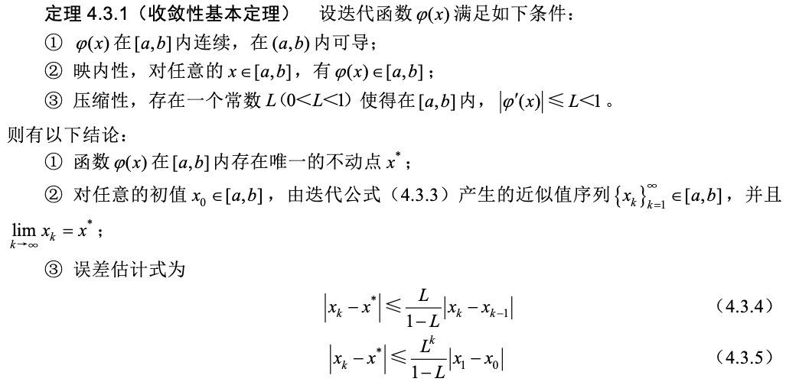

1. **求解方程的起手式**：找到**隔离区间**。只有一个根的子区间称为根的隔离区间。所以无论如何，都要**先分析函数形态**，确认在端点处函数值异号，并说明区间内只有一个根。
2. **二分法精度公式**：区间 $[a,b]$ 二分 $k$ 次后区间长度是 $\frac{1}{2^k}(b - a)$，由于取区间中点作为结果，所以绝对误差限 $\delta(x) = \frac{1}{2^{k+1}}(b - a)$。由此可以得到二分次数的求法：$2^{k+1} \ge \frac{b-a}{\delta(x)}$。
3. **收敛性基本定理**

1. **局部收敛定理**

1. **牛顿迭代法公式**：$x_{k+1} = x_k - \frac{f(x_k)}{f'(x_k)}$。收敛阶数是**二阶收敛**，条件是 $x^*$ 为**单根**，或 $f'(x^*)\ne 0$。
2. **单点弦截法公式**：$x_{k+1} = x_k - f(x_k)\frac{x_k - x_0}{f(x_k) - f(x_0)}$。收敛速度为**线性收敛**。
3. **两点弦截法公式**：$x_{k+1} = x_k - f(x_k)\frac{x_k - x_{k-1}}{f(x_k) - f(x_{k-1})}$。在与牛顿迭代法具有同等的前提条件下，具有**局部收敛性**，并且收敛阶数约为 **1.618**。由于弦截法是两步法，它不属于不动点迭代，因此不能用不动点迭代理论证明它的收敛性。
4. **弦截法和牛顿迭代法收敛的充分条件**：
