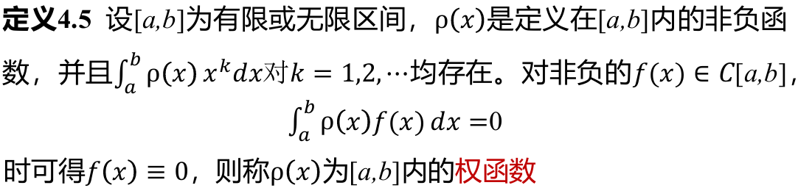

- **插值**：构造插值函数 $P_{n}(x) = a_{0}+a_{1}x+\dots+a_{n}x^n$, 使得 $P_{n}(x_{i})=y_{i}$：

$\qquad$ 性质：**存在唯一性**

- **逼近**（以连续型为例，离散型类似）：构造一个 $p(x)$，使得 $p(x)$ 与 $f(x)$ 的误差在某种度量意义下最小。常见的两种度量：
  
  $\qquad$ **一致逼近**：以 $f(x)$ 与 $p(x)$ 的最大误差
  
  $$
  \qquad \qquad \left\Vert p-f\right\Vert _{\infty}=\max_{a\leq x\leq b}\left\vert p(x)-f(x) \right\vert
  $$
  
  $\qquad$ 作为度量。

  $\qquad$ 若 $\lim\limits_{n\rightarrow\infty}\left\Vert p_{n}(x)-f(x)\right\Vert _{\infty}=0$，
  
  $\qquad$ 则 $\{p_{n}(x)\}$ 在 $[a,b]$ 内一致收敛到 $f(x)$ , 其为对 $f(x)$ 的一致逼近。
  
  $\qquad$ **平方逼近**：以积分
  
  $$
  \qquad \qquad \left\Vert p-f\right\Vert _{2}^2 = \int_{a}^b{(p(x)-f(x))^2}
  $$
  
  $\qquad$ 作为度量。

  $\qquad$ 若 $\lim_{n\rightarrow\infty}\left\Vert p_{n}(x)-f(x)\right\Vert _{2}^2=0$，

  $\qquad$ 则 $\{p_{n}(x)\}$ 在 $[a,b]$ 内一致收敛到 $f(x)$，其为对 $f(x)$ 的平方逼近。

- **权函数**：
  
  

- **内积**：
  
  $$
  (f,g)=\begin{cases}
  \displaystyle\int_a^b\rho(x)f(x)g(x)dx&,\text{连续区间}\\
  \displaystyle\sum^m_{i=0}\omega_if(x_i)g(x_i)&,\text{离散节点}
  \end{cases}
  $$
  
  性质：
  1. $(f,g)=(g,f)$
  2. $(c_1f+c_2g,h)=c_1(f,h)+c_2(g,h)$
  3. $(f,f)\geq0$，当且仅当 $f\equiv0$ 时，$(f,f)=0$

- **正交**：$(f,g)=0$

- **正交函数系**：$\{\varphi_1(x),\dots,\varphi_n(x)\}$, 其中 $\varphi_i(x)$ 是 $[a,b]$ 内的连续函数，若
  
  $$
  (\varphi_k(x),\varphi_j(x))=\begin{cases}
  0,&k\neq j\\
  A_j >0,&k=j
  \end{cases}
  $$
  由此也可以得出**正交多项式系**的类似定义