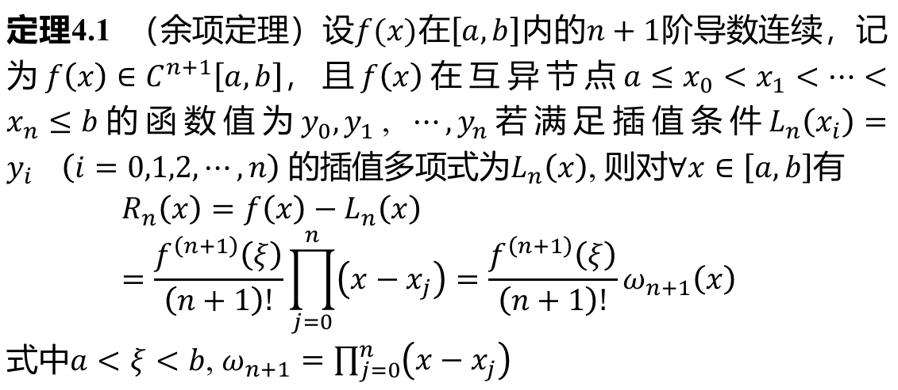
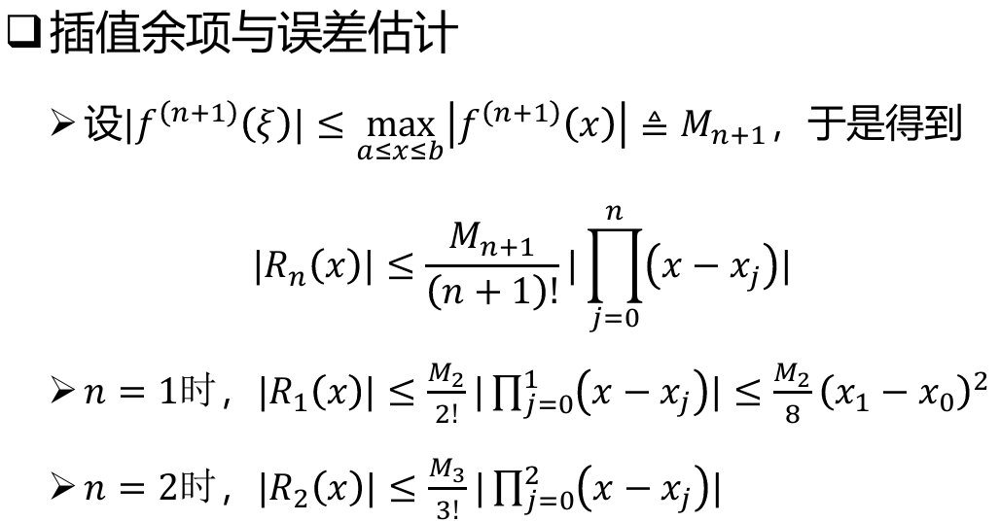
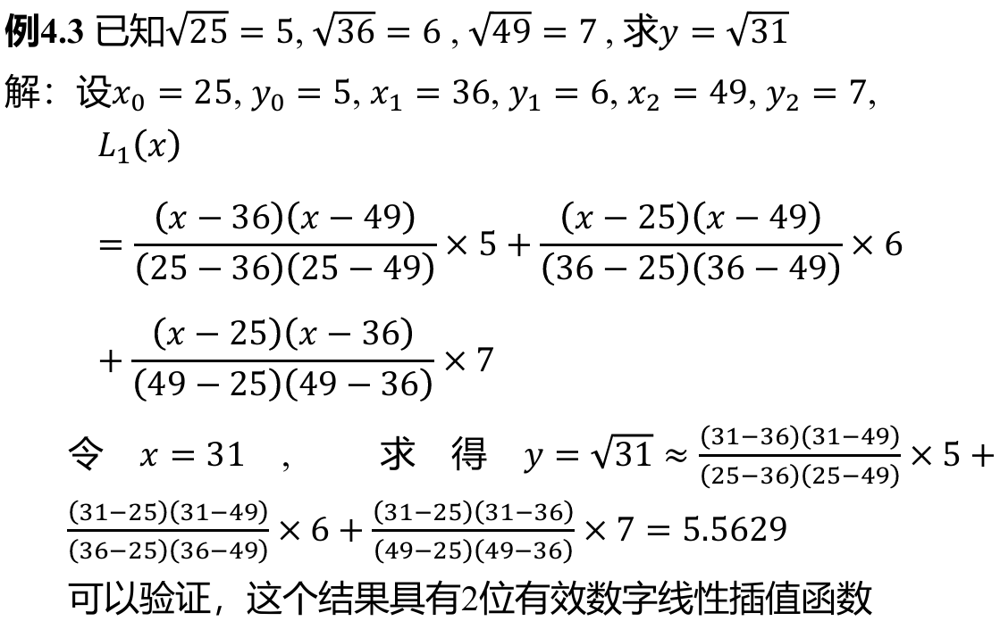

- **余项定理**
  
  
  
  性质：
  1. $R_{n}(x)$ 与 $f$ 的联系更紧密
  2. 余项定理对**所有插值**均成立

- **拉格朗日插值**

  $$
  L_{n}(x)=\sum_{i=0}^ny_{i}l_{i}(x)
  $$

  其中，$l_{i}(x)=\prod_{j=0,j\not=i}^{n}\frac{x-x_{j}}{x_{i}-x_{j}}$, 即：

  $$
  L_{n}(x)=\sum_{i=0}^n\left(\prod_{j=0,j\not=i}^n\frac{x-x_{j}}{x_{i}-x_{j}}\right)y_{i}
  $$

  插值余项 $R_{n}(x)=f(x)-L_{n}(x)$, 也称误差

- **误差估计**
  

  事后误差估计：设有三个插值点 $x_0,x_1,x_2$, 分别用 $x_0,x_1$ 和 $x_0,x_2$ 插值，得到 $L_1(x)$ 和 $\overline{L_1}(x)$，则 $\left\vert f(x)-L_{1}(x) \right\vert\leq \left\vert \frac{x-x_1}{x_1-x_2}\right\vert \cdot \left\vert L_1(x)-\overline{L_1}(x) \right\vert$

拉格朗日插值的缺点：高次时会出现**龙格现象**

**例题1：【课件原题】**

**例题2：【课件原题】**

