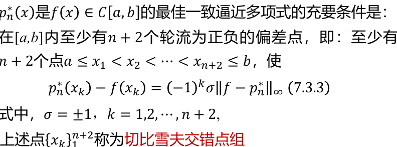
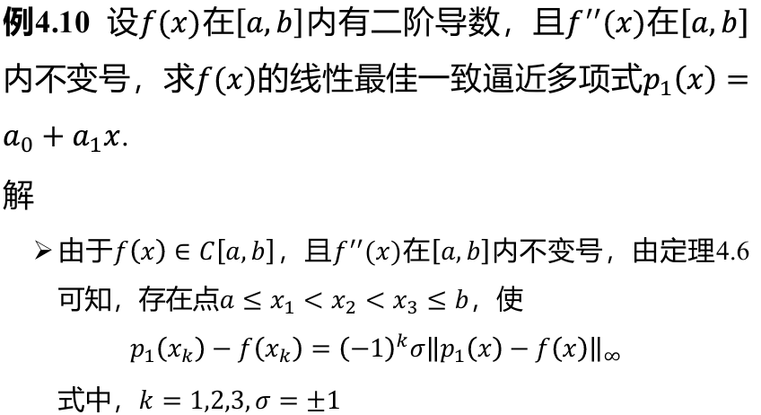

### 切比雪夫多项式

$T_n(x)=\cos(n\arccos x),\quad n=0,1,\dots$

其本质为 $x$ 的 $n$ 次多项式。

性质：

1. 首项系数为$2^{n-1}(n\geq 1)$
2. 正交性: $m\neq n$ 时, $(T_n,T_m)=0$；$m=n=0$ 时,$(T_n,T_m)=\pi$；$m=n\not=0$ 时,$(T_n,T_m)=\frac{\pi}{2}$。
3. **递推公式**：
  $$
  T_{n+1}(x)=2xT_n(x)-T_{n-1}(x)\quad n=1,2,\dots
  $$
  且有：$T_0(x)=1,T_1(x)=x$
4. 奇偶性：$T_n(-x)=(-1)^nT_n(x)$
5. 在 $[-1,1]$ 内的零点为
  $$
  x_k=cos\frac{2k-1}{2n}\pi~~~(k=1,2,……,n)
  $$
  极值点为
  $$
  y_k=cos\frac{k}{n}\pi~~~(k=0,1,……,n)
  $$

**常用的前几项**：

$$
\begin{aligned}
&T_2(x)=2x^2-1\\
&T_3(x)=4x^3-3x\\
&T_4(x)=8x^4-8x^2+1\\
&T_5(x)=16x^5-20x^3+5x
\end{aligned}
$$

### 最佳一致逼近多项式

- Weierstrass 定理：$f(x)\in C[a,b]$，则 $\forall \varepsilon>0$，$\exists p(x)$ 使 $\max\limits_{a\leq x\leq b}\left\vert p(x)-f(x) \right\vert<\varepsilon$。

- Bernstein 一致逼近多项式：
  $$
  \begin{aligned}
  B_n(f,x)&=\sum^n_{k=0}f\left(\frac{k}{n}\right)P_k(x)~~,~~x\in[0,1]\\
  P_k(x)&=C^k_nx^k(1-x)^{n-k}
  \end{aligned}
  $$

- 贝塞尔曲线：
  
  $$
  B_n(t)=\sum^n_{k=0}C^k_nt^k(1-t)^{n-k}P_k
  $$

- 偏差：
  

- **最佳一致逼近多项式**：设 $f(x)\in C[a,b]$，若 $\exist p_n^*(x)\in P_n$ 满足：
  
  $$
  \left\Vert f-p_n^*\right\Vert _{\infty}=\min_{p\in P_n}\left\Vert f-p\right\Vert _{\infty}
  $$
  
  则称 $p_n^*(x)$ 为 $f(x)$ 在 $[a,b]$ 内的最佳一致逼近多项式$，且拥有**存在唯一性**。

- **切比雪夫定理**：
  

- **在所有最高项系数为1的n次多项式中，在区间 $[-1,1]$ 与零偏差最小的多项式是 $\tilde{T}_n(x)=\frac{1}{2^{n-1}}T_n(x)$，其中 $T_n(x)$ 是 $n$ 次切比雪夫多项式**

### 最佳一致逼近多项式求解方法
  
1. 作变量代换 $x\rightarrow t$, 使得t的定义域为 $[-1,1]$。
2. 将 $f(x)$ 中的 $x$ 用 $t$ 替换得到 $g(t)$。
3. 由目标函数 $g(t)$ 确定最高次 $n$。
4. 找到 $\tilde{T}_n(t)$。
5. 将 $\tilde{T}_n(t)$ 乘上 $g(t)$ 的最高次项系数 $\alpha$。
6. 因为 $\alpha \tilde{T}_n(t)$ 是所有最高项系数为$\alpha$的n次多项式中与 $0$ 偏差最小的，所以 $g(t)-\alpha \tilde{T}_n(t)$ 即为 $g(t)$ 的最佳一致逼近多项式，记为 $g^*(t)$。
7. 此时再将 $g^*(t)$ 中的 $t$ 换回 $x$ 即可得到 $f(x)$ 的最佳一致逼近多项式 $f^*(x)$。

**例题7：【2024真题回忆版】** 用切比雪夫多项式求 $f=2x^3+5x^2+7$ 在[0,1]上的二次最佳逼近函数。

**解：** 首先，令 $t=2x-1$，即 $x=\frac{1}{2}(t+1)$，此时 $t\in [-1,1]$。代入，得：

$$
g(t) = f(x) =\frac{1}{4}t^3+2t^2+\frac{13}{4}t+\frac{17}{2}
$$

求 $\tilde{T}_3(t)=t^3-\frac{3}{4}t$。所以：

$$
g^*(t)=g(t)-\frac{1}{4}\tilde{T}_3(t)=2t^2+\frac{55}{16}t+\frac{17}{2}
$$

所以 $f^*(x)=g^*(2x-1)=8x^2-\frac{9}{8}x+\frac{113}{16}$。

**例题8【课件原题】：**

