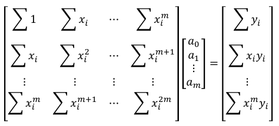
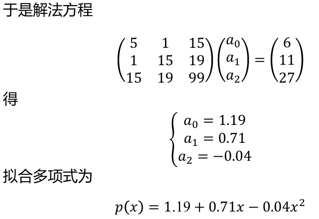

**希尔伯特矩阵**：

若取 $\varphi_k(x)=x^k$，则 $(\varphi_i,\varphi_j)=\frac{1}{i+j+1}$。此时记 $G_n$ 为 $H_n$，则：
  

**定义**：

**具有存在唯一性**。

### 求解方法

核心：解**法方程**

$$
\sum^n_{j=0}(\varphi_j(x),\varphi_k(x))a_j=(f(x),\varphi_k(x))\quad k=0,1,\dots,n
$$

**常见一般情况：**

$$
\begin{aligned}
\varphi_k(x)&=x^k,f(x)\in C[a,b]\\
\rho(x)&=1,\Phi=\text{span}\{1,x,x^2,……,x^n\}
\end{aligned}
$$

此时，要求解的 $P^*_n(x)=a^*_0+a^*_1x+…+a^*_nx^n$。设：

$$
\begin{aligned}
d_k&=\int_a^bf(x)x^k\mathrm dx=(f,\varphi_k) \\h_{ij}&=\int_a^b\varphi_i(x)\varphi_j(x)\mathrm dx=(\varphi_i,\varphi_j)
\end{aligned}
$$

则只需求解方程：

$$
\pmb{H_na=d}
$$

解得的 $\pmb a$ 即为 $\pmb a^*=(a_1^*,a^*_2,\dots,a^*_n)$, 由此得到 $P^*_n(x)$。

**特殊情况一：**${\Phi=\text{span}\{\phi_0,\dots,\phi_n\}}$ **为正交基**。此时：

$$
a^*_k=\frac{(f,\varphi_k)}{(\varphi_k,\varphi_k)}=\frac{(f,\varphi_k)}{\left\Vert \varphi_k\right\Vert ^2_2}
$$

由此得到$P^*_n(x)$。

**特殊情况二：在离散意义下的最佳平方逼近**

已知节点$(x_i,y_i), \quad i=1,2,\dots,n$。矩阵方程变为：

其余步骤类似。

**例题9：【2024真题回忆版】** 求解$e^x$ 的最佳平方逼近多项式，空间是 $\text{span}\{1,x\}$。

**解：**（因为是回忆版，条件不完整，缺少一个区间，这里以[0,1]为例）

适用**情况一** ，

$$
\begin{aligned}
d_0&=\int_0^1e^x\mathrm dx=e-1 \\
d_1&=\int_0^1 e^x\cdot x\mathrm dx=1 \\
\pmb d&=\begin{pmatrix}
e-1\\
1
\end{pmatrix} \\
h_{11}&=\int_0^1\mathrm dx=1 \\ 
h_{12}&=h_{21}=\int_0^1x\mathrm dx=\frac{1}{2} \\
h_{22}&=\int_0^1x^2\mathrm dx=\frac{1}{3} \\
H_2&=\begin{pmatrix}
1&\frac{1}{2}\\
\frac{1}{2}&\frac{1}{3}
\end{pmatrix}
\end{aligned}
$$

解 $\pmb{H_2a=d}$ 得：

$$
a_0^*=4e-10,a_1^*=6(3-e)
$$

所以 $P_n^*(x)=a_0^*+a_1^*x=4e-10+6(3-e)x$。

**例题10：【课件原题】**

