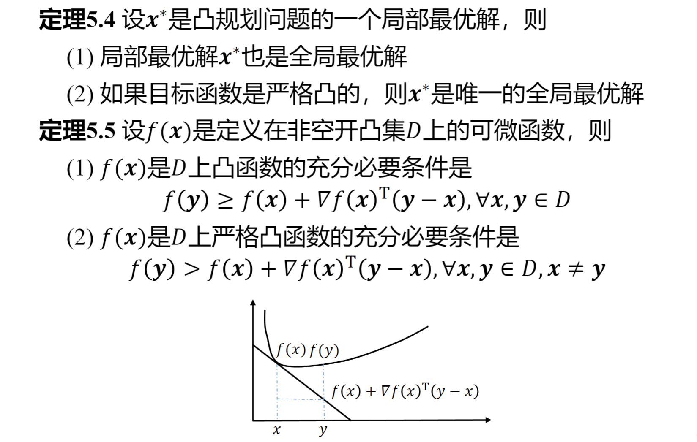

- **填空题**：23年涉及了不少必须要了解知识点概念才能做的填空题，编者在每一个板块都把涉及到的所有概念列举了出来。
- **计算题**：连续两年都涉及到了黄金分割求最小值。编者猜测今年大概率会出二分法求最小值。
- **证明题**：必会出凸函数、凸集相关的证明，并且都是通过定义去证明。

### 常见凸集
- **超平面**：$H=\{p^Tx=\alpha\}$, 可以认为是超越二维的平面
- **闭半空间**：$H^-=\{p^Tx \leq \alpha\}$ 或 $H^-=\{p^Tx \geq \alpha\}$  超平面某侧(包络超平面本身)
- **开半空间**：$H^-_{0}=\{p^Tx<\alpha\}$或$H^-_{0}=\{p^Tx>\alpha\}$ 超平面某侧(不包括超平面本身)

### 凸集的性质

- 两个凸集的交集是凸集
- 两个凸集的和 $D_{1}+D_{2}=\{x+y\ \mid \ x \in D_{1},y\in D_{2} \}$ 是凸集
- 两个凸集的差 $D_{1}-D_{2}=\{x-y\ \mid \ x \in D_{1},y\in D_{2} \}$ 是凸集
- 对于任意非零实数 $\alpha$，集合 $\alpha D_{1}=\{\alpha x \ \mid \ x \in D_{1}\}$ 是凸集

**定理**：$D\in \mathbf{R}^n$ 是凸集的充要条件是 $D$ 中任意 $m$ 个点 $x^{(i)}(i=1,2,\dots,m)$ 的凸组合仍属于 $D$

$$
\sum_{i=1}^{m}\alpha_{i}x^{(i)}\in D, \alpha_{i}\geq 0(i=1,2,\dots ,m),\sum_{i=1}^m\alpha_{i}=1
$$

PS:超平面的分离和严格分离、投影定理

### 凸函数

**概念**：凸函数与严格凸函数（是否取等）

#### 凸函数的性质

个人认为这些偏向数学原理的部分简单记住就好。同时注意 Hessen 矩阵的正定与半正定和严格凸函数之间的关系——函数严格凸是只能证明 Hessen 矩阵半正定而不是正定。
