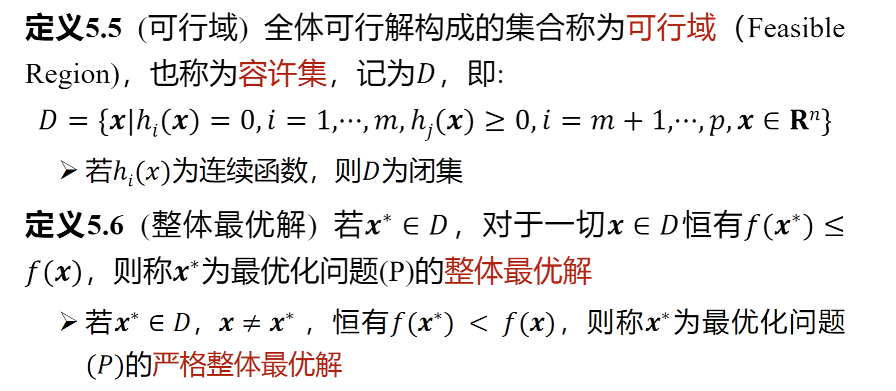
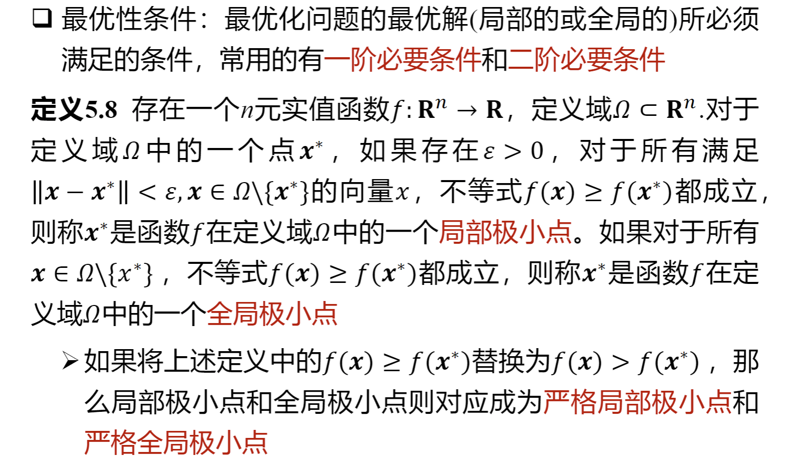
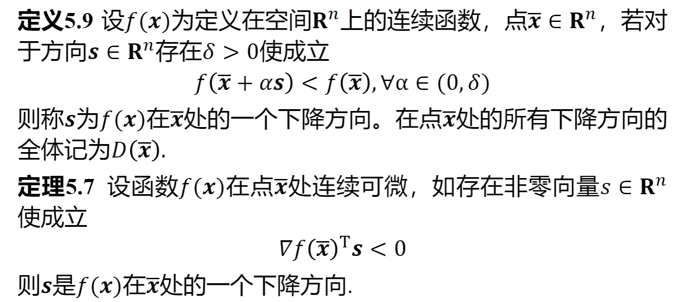
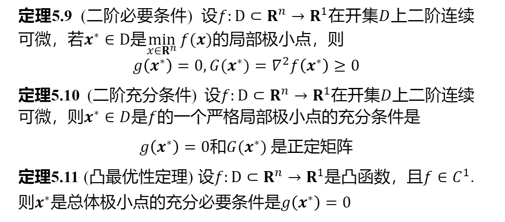
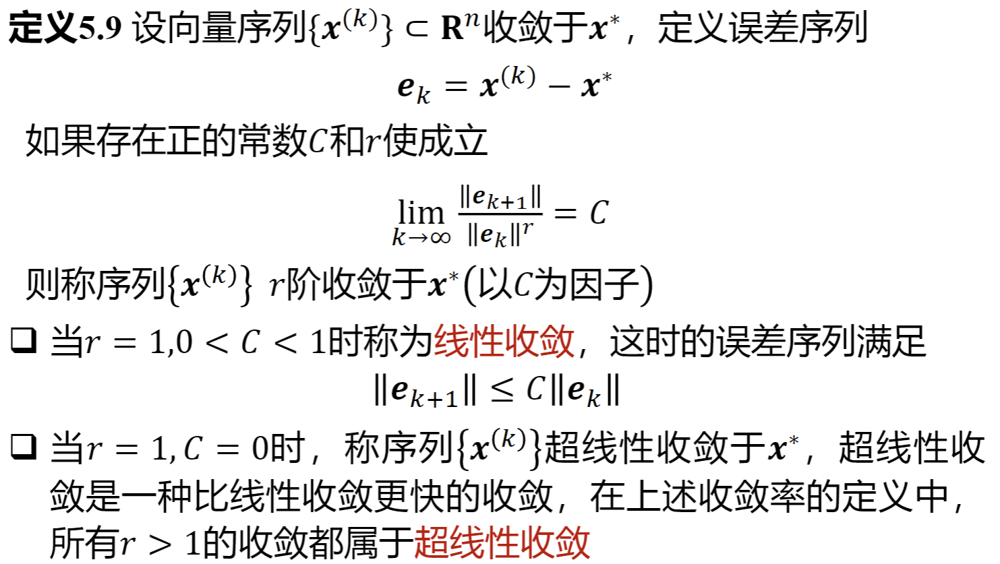

### 总体需要记住的概念

可行解、等式约束、不等式约束、整体最优解/严格整体最优解、局部最优解/严格局部最优解、一阶/二阶必要条件、二阶充分条件、凸最优性定理、(严格)局部/全局极小点、下降方向、局部收敛算法、全局收敛算法、收敛速度。

### 基础知识

**可行解**: 满足约束条件(**等式约束**、**不等式约束**)的$x$称为可行解(可行点、容许点)

**下降方向**

**局部收敛与全局收敛**：一般情况下只有全局收敛的算法才有实用意义，但是算法的局部收敛性分析也是全局收敛性分析的基础

**线性收敛与超线性收敛**

### 最优化算法的终止

1. $\left\Vert x^{(k+1)}-x^{(k)}\right\Vert \le \varepsilon$ 或 $\frac{\left\Vert x^{(k+1)}-x^{(k)}\right\Vert}{\left\Vert x^{(k)}\right\Vert}\le \varepsilon.$

2. $\left\vert  f(x^{(k+1)})-f(x^{(k)})  \right\vert \le \varepsilon$ 或 $\frac{\left\vert  f(x^{(k+1)})-f(x^{(k)}) \right\vert}{\lvert f(x^{(k)})\rvert} \le \varepsilon.$

3. $\left\Vert \nabla f(x^{(k)}) \right\Vert \le \varepsilon.$

4. 上面三种准则的组合。

其中 $\varepsilon>0$ 是预先给定的。

### 最优化方法

- 黄金分割法
- 二分法
- 无约束优化

#### 黄金分割法

利用黄金分割比例  

$$
\varphi=\frac{1+\sqrt5}{2}\approx1.618,\quad \rho=\frac1\varphi\approx0.618
$$

在区间内选取两点，使得缩短后新区间长度始终为旧区间的 $\rho$ 倍，从而稳定地逼近极值点。

1. 初始化区间 $[a,b]$，设容差 $\varepsilon>0$。
2. 计算  
   $$
   x_1=b-\rho(b-a),\qquad x_2=a+\rho(b-a)
   $$
   并求 $f(x_1),f(x_2)$。
3. 若 $f(x_1)\le f(x_2)$：令 $b=x_2$，并把旧 $x_1\leftarrow x_1$、旧 $x_2\leftarrow x_1$ 的角色前移，只需**一次**新函数评估来更新
   $$
   x_2=a+\rho(b-a).
   $$
   否则：令 $a=x_1$，并更新
   $$
   x_1=b-\rho(b-a).
   $$
4. 重复步骤 3，直到 $b-a\le\varepsilon$。输出 $x^*=\frac{a+b}{2}$ 作为极小点近似。

#### 二分法

**基本思想**：通过计算目标函数导数的符号来缩短搜索区间。

- 设初始区间为 $[a_1,b_1]$，第 $k$ 步的搜索区间为 $[a_k,b_k]$，满足  
  $$
  \varphi'(a_k)\le 0,\qquad \varphi'(b_k)\ge 0 .
  $$

- 取**中点**$c_k=\tfrac12\,(a_k+b_k)$,  若 $\varphi'(c_k)\ge 0$
  则令  
  $$
  a_{k+1}=a_k,\qquad b_{k+1}=c_k ;
  $$
  若$\varphi'(c_k)\le 0,$则令  
  $$
  a_{k+1}=c_k,\qquad b_{k+1}=b_k .
  $$

- 如此迭代，直到搜索区间长度小于**预定容限**为止。

- 二分法每次迭代都将区间缩短一半，收敛比为 $\tfrac12$ .
  
- 若要求最后区间长度至多为 $\delta$，则迭代次数 $n$ 需满足$\left(\tfrac12\right)^n \le \frac{\delta}{\,b_1-a_1\,}.$

**计算步骤**

1. 给出初始区间 $[a_1,b_1]$，最后区间长度 $\delta$，令 $k=1$。
2. 取 $c_k=\tfrac12\,(a_k+b_k)$ 计算 $\varphi'(c_k).$
   - 如果 $\varphi'(c_k)=0,$ **停止**，$c_k$ 为最优解；
   - 如果 $\varphi'(c_k)>0,$ 转 3.
   - 如果 $\varphi'(c_k)<0,$ 转 4.
3. 置 $a_{k+1}=a_k,\quad b_{k+1}=c_k$，转 5.
4. 置 $a_{k+1}=c_k,\quad b_{k+1}=b_k$，转 5.
5. 若 $b_{k+1}-a_{k+1}\le \delta$，**停止**；否则令 $k\leftarrow k+1$，转 1.

### 无约束优化

- 直接法：通过函数值本身构造
- 解析法(导数法)：通过梯度或者Hessen矩阵构造

#### 梯度方法(最速下降法)

最速下降法以**负梯度方向**作为下降方向，是无约束最优化中最简单的迭代极小化方法。设目标函数在 $x_k$ 附近可微，记 $g_k=\nabla f(x_k)\ne 0$。在 $x_k$ 处一阶泰勒展开
$$
f(x)\approx f(x_k)+g_k^{\mathsf T}(x-x_k).
$$
令 $x-x_k=\alpha d_k$ 得 $f(x_k+\alpha d_k)\approx f(x_k)+\alpha\,g_k^{\mathsf T}d_k$。因此只要 $g_k^{\mathsf T}d_k<0$，方向 $d_k$ 即为下降方向。

为了使沿单位方向的“下降最快”，解
$$
\min_{d}\ g_k^{\mathsf T}d\quad \text{s.t.}\ \left\Vert d\right\Vert=1
$$
可得最优单位方向 $d_k^*=-\dfrac{g_k}{\left\Vert g_k\right\Vert}$（与梯度反向，夹角 $\pi$）。

**迭代格式**

$$
x_{k+1}=x_k-\alpha_k g_k,
$$

步长 $\alpha_k>0$ 由线性搜索策略确定（如精确线搜索、Armijo/Wolfe 条件等）。

**最速下降法步骤**
1. 给定初值 $x_0\in\mathbb{R}^n$、容差 $0<\varepsilon\ll1$，置 $k=0$。
2. 计算梯度 $g_k=\nabla f(x_k)$；若 $\left\Vert g_k\right\Vert\le\varepsilon$ 停止。
3. 取方向 $d_k=-g_k$，通过线性搜索确定步长 $\alpha_k$。
4. 置 $x_{k+1}=x_k+\alpha_k d_k$，令 $k:=k+1$，转步骤 2。

#### 牛顿法

利用目标函数在迭代点 $x_k$ 的二次泰勒展开作为**模型函数**，并以该二次模型的极小点序列去逼近原函数的极小点。设 $f(x)$ 二次连续可微、$x_k\in\mathbb{R}^n$，且 Hessian $\nabla^2 f(x_k)$ 正定。

**二次模型与最优性条件**

$$
f(x_k+s)\;\approx\; q^{(k)}(s)
= f(x_k)+\nabla f(x_k)^{\!T}s+\tfrac12\,s^{T}\nabla^{2}f(x_k)s,
$$

其中 $s=x-x_k$。极小化右式，令

$$
\nabla q^{(k)}(s)=\nabla f(x_k)+\nabla^{2}f(x_k)s=0
$$

得牛顿步 $s_k=-\big[\nabla^{2}f(x_k)\big]^{-1}\nabla f(x_k)$，于是

$$
x_{k+1}=x_k+s_k
= x_k-\big[\nabla^{2}f(x_k)\big]^{-1}\nabla f(x_k).
$$

记 $G_k\equiv\nabla^{2}f(x_k)$、$g_k\equiv\nabla f(x_k)$，上式为 $x_{k+1}=x_k-G_k^{-1}g_k$。

**带步长因子的牛顿法**

1. 选取初始点 $x_0$、终止误差 $\varepsilon>0$，令 $k\leftarrow 0$。  
2. 计算梯度 $g_k=\nabla f(x_k)$；若 $\left\Vert g_k\right\Vert\le\varepsilon$ 则停止，输出 $x_k$。  
3. 解线性方程组构造牛顿方向 $G_k d_k=-g_k$（无需显式求逆）。  
4. 线性搜索确定步长 $\alpha_k>0$，使
$$
f(x_k+\alpha_k d_k)\;=\;\min_{\alpha\ge 0}\, f(x_k+\alpha d_k).
$$
5. 令 $x_{k+1}=x_k+\alpha_k d_k$，置 $k:=k+1$，转 2.。

**说明**：当 $G_k$ 正定且在最优解邻域内，牛顿法局部二次收敛；实际实现中常用阻尼/线性搜索以增强全局收敛性。
