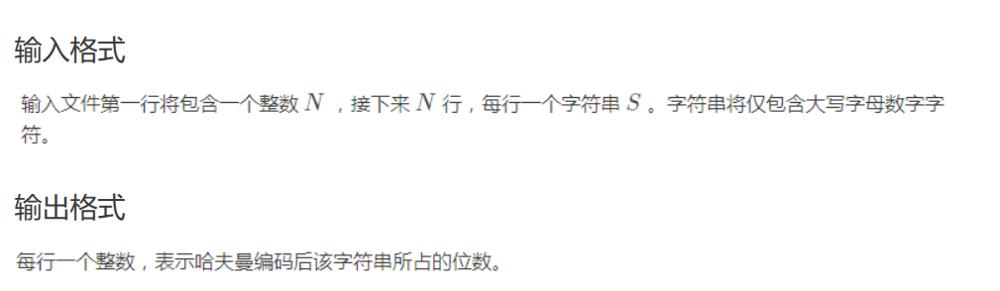

所谓“参考代码”，是课上提到并讲解了，但是难度较大或者用处较少的算法和数据结构的代码。
### 哈夫曼树



??? note "参考代码"
    ```cpp
    #include <bits/stdc++.h>
    using namespace std;
    #define ll long long
    const int MAXN = 1e3 + 5;
    char s[MAXN];
    int main() {
        int T;
        scanf("%d", &T);
        while (T--) {
            priority_queue<int, vector<int>, greater<int>> q;
            map<int, int> mp;
            scanf("%s", s + 1);
            int len = strlen(s + 1), cnt = 0;
            for (int i = 1; i <= len; ++i) {
                mp[int(s[i])]++;
            }
            for (auto it = mp.begin(); it != mp.end(); ++it) {
                int x = it->second;
                q.push(x);
            }
            while (!q.empty()) {
                if (q.size() == 1) {
                    printf("%d\n", cnt);
                    break;
                }
                int ans = q.top();
                q.pop();
                ans += q.top();
                q.pop();
                q.push(ans);
                cnt += ans;
            }
        }
        return 0;
    }
    ```

### 二叉查找树

??? note "参考代码"
    ```cpp
    struct TreeNode {
        int key;
        TreeNode *left;
        TreeNode *right;
        // 维护其他信息，如高度，节点数量等
        int size;  // 当前节点为根的子树大小
        int count; // 当前节点的重复数量
    
        TreeNode(int value)
            : key(value), size(1), count(1), left(nullptr), right(nullptr) {}
    };
    
    TreeNode *findMinNode(TreeNode *root) {
        while (root->left != nullptr) {
            root = root->left;
        }
        return root;
    }
    
    bool search(TreeNode *root, int target) {
        if (root == nullptr) {
            return false;
        }
        if (root->key == target) {
            return true;
        } else if (target < root->key) {
            return search(root->left, target);
        } else {
            return search(root->right, target);
        }
    }
    
    TreeNode *insert(TreeNode *root, int value) {
        if (root == nullptr) {
            return new TreeNode(value);
        }
        if (value < root->key) {
            root->left = insert(root->left, value);
        } else if (value > root->key) {
            root->right = insert(root->right, value);
        } else {
            root->count++; // 节点值相等，增加重复数量
        }
        root->size = root->count + (root->left ? root->left->size : 0) +
                     (root->right ? root->right->size : 0); // 更新节点的子树大小
        return root;
    }
    
    // 此处返回值为删除 value 后的新 root
    TreeNode *remove(TreeNode *root, int value) {
        if (root == nullptr) {
            return root;
        }
        if (value < root->key) {
            root->left = remove(root->left, value);
        } else if (value > root->key) {
            root->right = remove(root->right, value);
        } else {
            if (root->count > 1) {
                root->count--; // 节点重复数量大于1，减少重复数量
            } else {
                if (root->left == nullptr) {
                    TreeNode *temp = root->right;
                    delete root;
                    return temp;
                } else if (root->right == nullptr) {
                    TreeNode *temp = root->left;
                    delete root;
                    return temp;
                } else {
                    TreeNode *successor = findMinNode(root->right);
                    root->key = successor->key;
                    root->count = successor->count; // 更新重复数量
                    // 当 successor->count > 1时，也应该删除该节点，否则
                    // 后续的删除只会减少重复数量
                    successor->count = 1;
                    root->right = remove(root->right, successor->key);
                }
            }
        }
        // 继续维护size，不写成 --root->size;
        // 是因为value可能不在树中，从而可能未发生删除
        root->size = root->count + (root->left ? root->left->size : 0) +
                     (root->right ? root->right->size : 0);
        return root;
    }
    
    ```

### 平衡树

??? note "参考代码"
    ```cpp
    #include <bits/stdc++.h>
    using namespace std;
    
    struct AVL_tree {
        struct point {
            int val;
            int height;
            point *ls;
            point *rs;
            point *fa;
            point() {
                val = 0;
                height = 1;
                ls = rs = fa = NULL;
            }
        };
        point *root;
        AVL_tree() { root = NULL; }
        inline void push_up(point *p) {
            if (p != NULL) p->height = max(h(p->ls), h(p->rs)) + 1;
        }
        inline int h(point *p) {
            if (p == NULL) return 0;
            return p->height;
        }
        inline void take_place(point *q, point *p) {
            if (root == p) root = q;
            else if (p->fa->ls == p) p->fa->ls = q;
            else p->fa->rs = q;
            if (q != NULL) q->fa = p->fa;
        }
        point *search(point *p, int val) {
            if (p == NULL || val == p->val) return p;
            if (val < p->val) return search(p->ls, val);
            return search(p->rs, val);
        }
        point *maximum(point *p) {
            while (p->rs != NULL) p = p->rs;
            return p;
        }
        point *minimum(point *p) {
            while (p->ls != NULL) p = p->ls;
            return p;
        }
        void turn_right(point *p) {
            take_place(p->ls, p);
            p->fa = p->ls;
            p->ls = p->fa->rs;
            if (p->fa->rs != NULL) p->fa->rs->fa = p;
            p->fa->rs = p;
        }
        void turn_left(point *p) {
            take_place(p->rs, p);
            p->fa = p->rs;
            p->rs = p->fa->ls;
            if (p->fa->ls != NULL) p->fa->ls->fa = p;
            p->fa->ls = p;
        }
        void balance(point *p) {
            if (h(p->ls) - h(p->rs) == 2) {
                if (h(p->ls->rs) > h(p->ls->ls)) turn_left(p->ls);
                turn_right(p);
            } else if (h(p->ls) - h(p->rs) == -2) {
                if (h(p->rs->ls) > h(p->rs->rs)) turn_right(p->rs);
                turn_left(p);
            }
        }
        void insert(point *r, point *p) {
            if (p->val < r->val) {
                if (r->ls == NULL) {
                    r->ls = p;
                    p->fa = r;
                } else insert(r->ls, p);
            } else {
                if (r->rs == NULL) {
                    r->rs = p;
                    p->fa = r;
                } else insert(r->rs, p);
            }
            push_up(r);
            balance(r);
        }
        void ins(int val) {
            point *p = new point();
            p->val = val;
            if (root == NULL) {
                root = p;
                p->fa = NULL;
                return;
            }
            insert(root, p);
        }
        void print(point *p) {
            if (p != NULL) {
                print(p->ls);
                printf("%d ", p->val);
                print(p->rs);
            }
        }
        void del_one(point *p) {
            point *q = p->ls;
            if (q == NULL) q = p->rs;
            take_place(q, p);
            delete p;
        }
        void del(point *p) {
            point *q;
            if (p->ls == NULL || p->rs == NULL) q = p;
            else {
                q = minimum(p->rs);
                p->val = q->val;
            }
            point *r = q->fa;
            del_one(q);
            while (r != NULL) {
                push_up(r);
                balance(r);
                r = r->fa;
            }
        }
        void del(int val) {
            point *p = search(root, val);
            if (p == NULL) return;
            del(p);
        }
    };
    ```

### Dijkstra

朴素实现：

```cpp
struct edge {
  int v, w;
};

vector<edge> e[MAXN];
int dis[MAXN], vis[MAXN];

void dijkstra(int n, int s) {
  memset(dis, 0x3f, (n + 1) * sizeof(int));
  dis[s] = 0;
  for (int i = 1; i <= n; i++) {
    int u = 0, mind = 0x3f3f3f3f;
    for (int j = 1; j <= n; j++)
      if (!vis[j] && dis[j] < mind) u = j, mind = dis[j];
    vis[u] = true;
    for (auto ed : e[u]) {
      int v = ed.v, w = ed.w;
      if (dis[v] > dis[u] + w) dis[v] = dis[u] + w;
    }
  }
}
```

优先队列优化：

```cpp
struct edge {
  int v, w;
};

struct node {
  int dis, u;

  bool operator>(const node& a) const { return dis > a.dis; }
};

vector<edge> e[MAXN];
int dis[MAXN], vis[MAXN];
priority_queue<node, vector<node>, greater<node>> q;

void dijkstra(int n, int s) {
  memset(dis, 0x3f, (n + 1) * sizeof(int));
  memset(vis, 0, (n + 1) * sizeof(int));
  dis[s] = 0;
  q.push({0, s});
  while (!q.empty()) {
    int u = q.top().u;
    q.pop();
    if (vis[u]) continue;
    vis[u] = 1;
    for (auto ed : e[u]) {
      int v = ed.v, w = ed.w;
      if (dis[v] > dis[u] + w) {
        dis[v] = dis[u] + w;
        q.push({dis[v], v});
      }
    }
  }
}
```

### Floyd

```cpp
for (k = 1; k <= n; k++) {
  for (x = 1; x <= n; x++) {
    for (y = 1; y <= n; y++) {
      f[x][y] = min(f[x][y], f[x][k] + f[k][y]);
    }
  }
}
```

### Bellman/SPFA

Bellman：

```cpp
struct Edge {
  int u, v, w;
};

vector<Edge> edge;

int dis[MAXN], u, v, w;
constexpr int INF = 0x3f3f3f3f;

bool bellmanford(int n, int s) {
  memset(dis, 0x3f, (n + 1) * sizeof(int));
  dis[s] = 0;
  bool flag = false;  // 判断一轮循环过程中是否发生松弛操作
  for (int i = 1; i <= n; i++) {
    flag = false;
    for (int j = 0; j < edge.size(); j++) {
      u = edge[j].u, v = edge[j].v, w = edge[j].w;
      if (dis[u] == INF) continue;
      // 无穷大与常数加减仍然为无穷大
      // 因此最短路长度为 INF 的点引出的边不可能发生松弛操作
      if (dis[v] > dis[u] + w) {
        dis[v] = dis[u] + w;
        flag = true;
      }
    }
    // 没有可以松弛的边时就停止算法
    if (!flag) {
      break;
    }
  }
  // 第 n 轮循环仍然可以松弛时说明 s 点可以抵达一个负环
  return flag;
}
```

队列优化：SPFA

```cpp
struct edge {
  int v, w;
};

vector<edge> e[MAXN];
int dis[MAXN], cnt[MAXN], vis[MAXN];
queue<int> q;

bool spfa(int n, int s) {
  memset(dis, 0x3f, (n + 1) * sizeof(int));
  dis[s] = 0, vis[s] = 1;
  q.push(s);
  while (!q.empty()) {
    int u = q.front();
    q.pop(), vis[u] = 0;
    for (auto ed : e[u]) {
      int v = ed.v, w = ed.w;
      if (dis[v] > dis[u] + w) {
        dis[v] = dis[u] + w;
        cnt[v] = cnt[u] + 1;  // 记录最短路经过的边数
        if (cnt[v] >= n) return false;
        // 在不经过负环的情况下，最短路至多经过 n - 1 条边
        // 因此如果经过了多于 n 条边，一定说明经过了负环
        if (!vis[v]) q.push(v), vis[v] = 1;
      }
    }
  }
  return true;
}
```

### Prim

??? note "参考代码"
    ```cpp
    // 使用二叉堆优化的 Prim 算法。
    #include <cstring>
    #include <iostream>
    #include <queue>
    using namespace std;
    constexpr int N = 5050, M = 2e5 + 10;
    
    struct E {
        int v, w, x;
    } e[M * 2];
    
    int n, m, h[N], cnte;
    
    void adde(int u, int v, int w) { e[++cnte] = E{v, w, h[u]}, h[u] = cnte; }
    
    struct S {
        int u, d;
    };
    
    bool operator<(const S &x, const S &y) { return x.d > y.d; }
    
    priority_queue<S> q;
    int dis[N];
    bool vis[N];
    
    int res = 0, cnt = 0;
    
    void Prim() {
        memset(dis, 0x3f, sizeof(dis));
        dis[1] = 0;
        q.push({1, 0});
        while (!q.empty()) {
            if (cnt >= n) break;
            int u = q.top().u, d = q.top().d;
            q.pop();
            if (vis[u]) continue;
            vis[u] = true;
            ++cnt;
            res += d;
            for (int i = h[u]; i; i = e[i].x) {
                int v = e[i].v, w = e[i].w;
                if (w < dis[v]) {
                    dis[v] = w, q.push({v, w});
                }
            }
        }
    }
    
    int main() {
        cin >> n >> m;
        for (int i = 1, u, v, w; i <= m; ++i) {
            cin >> u >> v >> w, adde(u, v, w), adde(v, u, w);
        }
        Prim();
        if (cnt == n) cout << res;
        else cout << "No MST.";
        return 0;
    }
    ```

### Kruskal

??? note "参考代码"
    ```cpp
    #include <algorithm>
    #include <iostream>
    using namespace std;
    
    int fa[1010]; // 定义父亲
    int n, m, k;
    
    struct edge {
        int u, v, w;
    };
    
    int l;
    edge g[10010];
    
    void add(int u, int v, int w) {
        l++;
        g[l].u = u;
        g[l].v = v;
        g[l].w = w;
    }
    
    // 标准并查集
    int findroot(int x) { return fa[x] == x ? x : fa[x] = findroot(fa[x]); }
    
    void Merge(int x, int y) {
        x = findroot(x);
        y = findroot(y);
        fa[x] = y;
    }
    
    bool cmp(edge A, edge B) { return A.w < B.w; }
    
    // Kruskal 算法
    void kruskal() {
        int tot = 0; // 存已选了的边数
        int ans = 0; // 存总的代价
        for (int i = 1; i <= m; i++) {
            int xr = findroot(g[i].u), yr = findroot(g[i].v);
            if (xr != yr) {    // 如果父亲不一样
                Merge(xr, yr); // 合并
                tot++;         // 边数增加
                ans += g[i].w; // 代价增加
            }
            if (tot >= (n - k)) { // 检查选的边数是否满足 k 个棉花糖
                cout << ans << '\n';
                return;
            }
        }
        cout << "No Answer\n"; // 无法连成
    }
    
    int main() {
        cin >> n >> m >> k;
        for (int i = 1; i <= n; i++) { // 初始化
            fa[i] = i;
        }
        for (int i = 1; i <= m; i++) {
            int u, v, w;
            cin >> u >> v >> w;
            add(u, v, w); // 添加边
        }
        sort(g + 1, g + m + 1, cmp); // 先按边权排序
        kruskal();
        return 0;
    }
    ```

### KMP

[https://www.luogu.com.cn/problem/P3375](https://www.luogu.com.cn/problem/P3375)

```cpp
#include <bits/stdc++.h>
using namespace std;

char s1[1000010], s2[1000010];
int kmp[1000010];

int main() {
    scanf("%s", s1 + 1);
    int l1 = strlen(s1 + 1);
    scanf("%s", s2 + 1);
    int l2 = strlen(s2 + 1);
    int j = 0;
    for (int i = 2; i <= l2; i++) {
        while (j && s2[j + 1] != s2[i]) j = kmp[j];
        if (s2[j + 1] == s2[i]) j++;
        kmp[i] = j;
    }
    j = 0;
    for (int i = 1; i <= l1; i++) {
        while (j && s2[j + 1] != s1[i]) j = kmp[j];
        if (s2[j + 1] == s1[i]) j++;
        if (j == l2) {
            printf("%d\n", i - l2 + 1);
            j = kmp[j];
        }
    }
    for (int i = 1; i <= l2; i++) {
        printf("%d%c", kmp[i], " \n"[i == l2]);
    }
    return 0;
}
```

### 哈希表

拉链法：

```cpp
constexpr int SIZE = 1000000;
constexpr int M = 999997;

struct HashTable {
  struct Node {
    int next, value, key;
  } data[SIZE];

  int head[M], size;

  int f(int key) { return (key % M + M) % M; }

  int get(int key) {
    for (int p = head[f(key)]; p; p = data[p].next)
      if (data[p].key == key) return data[p].value;
    return -1;
  }

  int modify(int key, int value) {
    for (int p = head[f(key)]; p; p = data[p].next)
      if (data[p].key == key) return data[p].value = value;
  }

  int add(int key, int value) {
    if (get(key) != -1) return -1;
    data[++size] = Node{head[f(key)], value, key};
    head[f(key)] = size;
    return value;
  }
};
```

线性探查法：

```cpp
constexpr int N = 360007;  // N 是最大可以存储的元素数量

class Hash {
 private:
  int keys[N];
  int values[N];

 public:
  Hash() { memset(values, 0, sizeof(values)); }

  int& operator[](int n) {
    // 返回一个指向对应 Hash[Key] 的引用
    // 修改成不为 0 的值 0 时候视为空
    int idx = (n % N + N) % N, cnt = 1;
    while (keys[idx] != n && values[idx] != 0) {
      idx = (idx + cnt * cnt) % N;
      cnt += 1;
    }
    keys[idx] = n;
    return values[idx];
  }
};
```