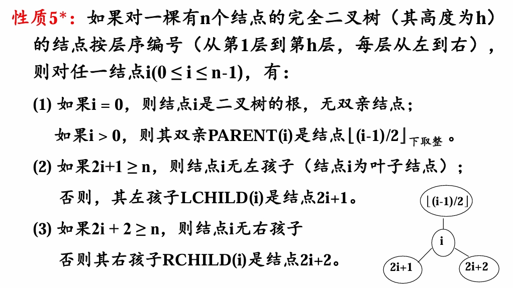

## 1. 基础知识
本章内容文字较多，且多为记忆性的基础概念，依照老师的说法，大概不会考？我看群里的期末题也只有一个填空题，所以时间不够可以略过概念这部分，从[概述](#_7)开始。

### 数据结构的基本概念
用计算机解决实际问题，大概分为三个步骤：
1. 分析实际问题，抽象数学模型。
2. 为数学模型设计合适的数据结构。
3. 设计实现具体操作算法。

### 数据结构的术语
- **数据**：计算机能接受和处理的一切对象，存储在计算机中可用二进制表示的内容都是数据，包括整数、实数、字符、文字、表格、图像、程序等等。
- **数据元素**：组成数据的基本单位，在计算机中作为整体考虑处理的对象。数据元素一般又由若干**数据项**组成，数据项是有独立含义的最小数据单位。

学籍管理系统中，认为“学生”是数据元素，而“学生”的姓名、学号、年龄、家庭住址、联系方式就是数据项。

- **数据对象**：具有相同性质的数据元素的集合，例如，自然数的数据对象就是自然数集合$\mathbb{N}$，学生数据对象就是包含所有学生的集合。
- **数据结构**：研究数据及数据间关系的学科，包括：
	- 数据的逻辑结构：依据实际情况描述的数据元素间的逻辑关系。
	- 数据的存储结构或物理结构：数据在计算机中的表示和存储方式。
	- 数据的操作实现：在相应的存储结构下提供的基本操作的算法实现。
这是PPT给出的数据逻辑关系图：

数据的逻辑结构强调数据元素之间的关系，反映了数据的特性。
可以类比图论中图的定义，任何数据结构都是由数据集和关系集组成，即

$$
DS = (D, R)
$$

其中$D$为数据集，而$S$为关系集。

### 数据的存储方式

优先记忆局限性
- **顺序存储**：将每个数据元素按顺序存储在一段连续的存储单元（内存或者硬盘）中。**局限性：需要足够大的连续存储空间，难以利用零碎空间；在事先不能知道所需空间时，预留过大或者过小空间都不合理。**
- **链式存储**：将每个数据元素按照**结点**结构存储，结点中同时存放数据元素的信息和下一个或上一个结点的存储地址，称为**指针项**，指针项可以有多个。**局限性：需要额外存储大量指针，空间利用率低；数据元素通过指针连接，查询效率低；增删结点需要同时维护多个指针，维护难度大。**
- **索引存储**：按关键字段建立索引表，用结点的索引号来确定结点的存储地址，将结点的元素数据按一定规律顺序存放。**局限性：创建和维护索引表需要时间成本，且随数据量增大而增大；创建和维护索引表需要额外的空间成本；每次增删改都需要动态维护索引表，时间成本大。**
- **散列(hash)存储**：设计散列函数，结点的存储位置由散列函数得到。**局限性：支持随机存取和高效查找，但是不支持顺序存取；存在冲突问题。**

------

为了解决问题选择数据结构时，需要以下三步：
1. 分析问题，确定解决问题需满足的资源限制。
2. 确定满足资源限制的基本操作，如增删改查。
3. 根据时间和空间资源限制，选择满足要求的数据结构。

### 抽象数据结构ADT

抽象数据结构是忽略了数据结构的具体实现细节，仅保留一类数据结构的本质特征而得到的一种抽象的理论模型。抽象数据结构只是提供了成员函数的接口定义，而没有具体的成员函数的实现。抽象数据结构可以用三元组表示：

$$
ADT=(D,R,P)
$$

其中，D是数据对象的定义，R是数据关系的定义，P是基本操作的定义

栈可以是一种抽象的数据结构，他的包含一组有序的项，支持向栈顶push一个数据元素，和从栈顶pop出一个元素，并返回该元素，也可以仅查看top栈顶的元素。在这里我们不讨论这些操作的具体实现方法和数据元素的存储形式，仅仅给出操作的定义和实现的功能，那么这就是一个抽象数据结构。

### 问题、算法和程序
- 问题：计算机需要完成的任务。
- 算法：计算机对问题求解步骤的描述，是指令的有穷序列。

#### 算法的特性
1. 有穷性：对任何合法输入，算法的执行步骤有限，且每一步可在有限时间内完成。
2. 确定性：算法中每个步骤都是明确的，每条指令有确切含义，无歧义；且在任意给定输入下，算法只有一条实际的执行路径，相同的输入会得到相同的输出。
3. 可行性：指令能够在现有的计算技术基础上实现，即算法有效。
4. 输入/输出：任何算法都是对输入数据的加工过程，最终给出输出结果。
5. 通用性：算法要有一般性，对一般的数据集合都要成立。
6. 可读性：具备良好可读性的算法有利于查错和理解。
7. 健壮性：输入非法时，算法能适当的处理并做出反应，而不应出现死机或输出异常结果。

#### 算法分析的两个重要因素
- 时间复杂度：如何使得算法执行的尽可能快，执行时间尽可能短。
- 空间复杂度：如何使得算法执行所需的存储量尽可能小。

任何算法可以用自然语言、伪代码或某种计算机语言描述。

- 程序：一组指示计算机每一步动作的指令序列，通常用某种程序设计语言编写，运行在某种目标体系结构上。

用计算机解决问题的一般步骤：
1. 首先从问题中抽象出数学模型；
2. 然后设计求解数学模型的算法；
3. 选择合适的数据结构；
4. 编出程序，调试直到得到解答。

### 概述
用高级语言编写的程序在计算机上运行消耗的时间取决于：
1. 算法采用的策略。
2. 问题的规模。
3. 编写程序采用的计算机语言，一般语言越高级执行效率越低。
4. 编译和运行环境。

#### 渐进算法分析
- **渐近算法分析或算法分析**是一种方法，用以估计随问题规模变大时算法和程序的效率和开销，有时间复杂度和空间复杂度两个指标。
- **渐近时间复杂度**是指算法和程序运行所需的时间函数。算法中基本操作重复执行的次数一般是关于问题规模$n$的函数，计作$f(n)$，我们记算法的时间度量为：

$$
T(n)=\mathrm{O}(f(n))
$$

这表示，随着问题规模增大，算法的执行时间的增长率与$f(n)$的增长率相同。由于输入规模一般是影响运行时间的最主要因素，所以经常把运行时间$T$写成输入规模$n$的函数，即$T(n)$，它是非负的。
- **算法增长率**是指当输入规模$n$很大时，算法的时间或空间代价的增长率。通过渐近复杂度分析，可以将算法的复杂度函数化简到某个函数类别上。


1. 标记为$n$的函数图像为直线，对应复杂度为$\mathrm{O}(n)$，称为线性阶，表示当问题规模增很大时，运行时间随问题规模$n$线性增加；
2. 标记为$n^2$的函数图像为直线，对应复杂度为$\mathrm{O}(n^2)$，称为平方阶，如果运行时间函数的最高次项为平方项，则称为二次增长率；
3. 标有$2^n$的曲线属于指数增长率，对应复杂度为$\mathrm{O}(2n)$，称为指数阶；
4. 此外，还有常数阶$\mathrm{O}(1)$，对数阶$\mathrm{O}(logn)$等。

同理还有**渐近空间复杂度**，是指算法编制程序后在计算机中运行所占的存储空间函数。
存储空间包括：
- 指令、常数、变量；
- 输入数据；
- 辅助空间；
- 运行栈区（静态、动态）等。
空间复杂度作为算法所需存储空间的度量，记作：

$$
S(n)=\mathrm{O}(f(n))
$$

### 时间复杂度

**这理应是必考的重要知识点**

时间复杂度分析分为两个步骤：
1. 算法分析：对算法或数据结构进行分析，用$T(n)$测量复杂度；
2. 渐近分析：分析$T(n)$，确定它属于的复杂度类型（线性、平方、对数等等）

下面介绍时间复杂度的严格分析规则，可以略过
#### 严格分析规则

1. a可以假设一个时间单位；
2. 执行以下任意一个操作，花费的时间计为$1$；
	- a赋值运算
	- b单一的输入输出操作
	- c布尔运算、数据比较
	- d算术返回
	- e函数返回
	- f数组下标操作、指针引用
3. 选择语句的执行时间：条件计算+运行时间最长的选择支的执行时间；
4. 循环的执行时间：循环体执行时间+循环条件检查和更新操作时间+创建循环的时间，同时通常假设循环执行最大的可能迭代次数。
5. 函数调用的执行时间：创建函数时间$(1)$+所有参数计算时间+函数体执行时间。


#### 简化分析方法

要想严格地分析算法或程序的时间复杂度是较复杂的，假设程序每步执行时间为单位时间$1$，我们有如下的简单方法：
1. 对于任意一段不含递归的代码，将其分为循环部分和非循环部分，其复杂度为两部分复杂度的较大者；
2. 非循环部分的复杂度为常数复杂度$\mathrm{O}(1)$，如果含有一个或多个函数调用，则其复杂度为这些函数调用的复杂度的最大者；循环部分的复杂度为循环次数乘以循环体的复杂度，如果含有多个循环，则其复杂度为这些循环复杂度的最大者；
3. 递归执行1、2步直到得到整段代码的时间复杂度。

对于递归代码，参考CSAI这门课介绍的方法，即通过递归方程求解。

下面是一个例子。
```cpp
void function(int n)
{
	int a = 0;
	int b = 0;
	int sum = 0;
	
	for (int i = 0; i < n; i++)
	{
		b = b + 1;
		for (int j = 0; j < n / 2; j++)
		{
			sum += i;
			sum += a;
			a += sum;
		}
	}
	
	return;
}
```
首先分为
```cpp
	int a = 0;
	int b = 0;
	int sum = 0;
	return;
```
```cpp
	for (int i = 0; i < 100; i++)
	{
		b = b + 1;
		for (int j = 0; j < n / 2; j++)
		{
			sum += i;
			sum += a;
			a += sum;
		}
	}
```
两部分，非循环部分不含函数调用，复杂度为常数，第二部分为循环，循环次数为$100$，循环体为
```cpp
		b = b + 1;
		for (int j = 0; j < n / 2; j++)
		{
			sum += i;
			sum += a;
			a += sum;
		}
```
分为
```cpp
		b = b + 1;
```
```cpp
		for (int j = 0; j < n / 2; j++)
		{
			sum += i;
			sum += a;
			a += sum;
		}
```
两部分，第一部分为常数复杂度，第二部分循环次数为$\frac{n}{2}$，循环体复杂度为常数，故循环部分复杂度为$\frac{n}{2}\mathrm{O}(1)=\mathrm{O}(n)$，进而整体复杂度也为$\mathrm{O}(n)$。
再回到这个循环
```cpp
	for (int i = 0; i < 100; i++)
	{
		b = b + 1;
		for (int j = 0; j < n / 2; j++)
		{
			sum += i;
			sum += a;
			a += sum;
		}
	}
```
循环次数为$100$，循环体复杂度为刚刚得到的$\mathrm{O}(n)$，循环复杂度为$100\mathrm{O}(n)=\mathrm{O}(n)$。
从而原代码复杂度为$\mathrm{O}(1)$与$\mathrm{O}(n)$中的较大者，即$\mathrm{O}(n)$。
下面给出各复杂度的大小关系：
$$
\mathrm{O}(1)<\mathrm{O}(logn)<\mathrm{O}(n)<\mathrm{O}(nlogn)<\mathrm{O}(n^m)<\mathrm{O}(2^n)<\mathrm{O}(n!)<\mathrm{O}(n^n)
$$
其中$m$为大于$1$的常数。
严格讲这种大小比较是不合理的，因为$\mathrm{O}$记号实际上表示一类函数，所以这个不等式链实际表示了一种包含关系。我们将在下一节中讨论$\mathrm{O}$记号的定义。
### 渐近分析

这一节是一些很数学的东西，所以编写的时候舍弃了部分内容。
#### 上限表示法
算法运行时间的上限是用以估计问题所需某种资源的复杂程度的界限函数，它表示该算法可能有的**最高增长率**。算法的上限还应与输入规模$n$有关。为了表示起来更简单，采用大$n$表示法，给出函数$f(n)$的一个上限。
##### $\mathrm{O}$记号
设$f(n)$和$g(n)$是两个关于整数$n$的非负函数，若存在两个正常数$c$和$n_0$，对所有的$n\gt n_0$， 有$f(n)\leq cg(n)$，则称$f(n)$在集合$\mathrm{O}(g(n))$中，简记为$f(n)=\mathrm{O}(g(n))$。其中，常数$n_0$是使上限成立的$n$的最小值，$c$是某个确定的常数。

若$f(n)=T(n)$，则对于问题的所有（如最差情况）输入， 只要输入规模足够大（即$n\gt n_0$），算法总能在$cg(n)$ 步以内完成。

可以证明对幂函数$f(n)$，若其最高次为$m$，且$a_m>0$，则$f(n)=\mathrm{O}(n^m)$。

#### 下限表示法

同上限表示法一样，算法运行时间的下限也是估计问题所需某种资源的复杂程度的界限函数，它表示该算法可能有的**最小增长率**。与大$\mathrm{O}$表示法类似，用符号大$\Omega$来估算函数$f(n)$的下限值。
##### $\Omega$记号
设$f(n)$和$g(n)$是两个关于整数$n$的非负函数，若存在两个正常数$c$和$n_0$，对所有的$n\gt n_0$， 有$f(n)\geq cg(n)$，则称$f(n)$在集合$\Omega(g(n))$中，简记为$f(n)=\Omega(g(n))$。其中，常数$n_0$是使上限成立的$n$的最小值，$c$是某个确定的常数。

#### 第三种表示法

以上大$\mathrm{O}$表示法和大$\Omega$表示法是描述某一算法的界限函数。当界限函数的上、下限相等时，即如果一种算法既在$\mathrm{O}(h(n))$中，又在$\Omega(h(n))$中，则用$\Theta$表示法，称其为$\Theta(h(n))$。
##### $\Theta$记号
假设$f (n)$和$g(n)$是关于整数$n$的非负函数，$f(n)= Θ(g(n))$当且仅当存在正常数$c1$，$c2$和某个$n_0$，使得对于所有的$n\geq n0$，有$c_1g(n) \leq f (n) \leq c_2 g (n)$。

##### 化简法则
1. 传递性：如果$f(n)=\mathrm{O}(g(n))$，且$g(n)=\mathrm{O}(h(n))$，则$f(n)=\mathrm{O}(h(n))$。也就是说函数上界的上界仍然是函数的上界，实际问题中，我们总试图找到其最紧的上界。
2. 系数提取：如果$f(n)= \mathrm{O}(kg(n))$，对常量$k\gt 0$，则$f(n)=\mathrm{O}(g(n))$。即$\mathrm{O}$记号中的常系数是无关紧要的。
3. 加法规则：如果$f_1(n)=\mathrm{O}(g_1(n))$，且$f_2(n)=\mathrm{O}(g_2(n))$， 则$f_1(n)+f_2(n)= \mathrm{O}(max(g_1(n),g_2(n)))$。实际上我们在上一节中已经运用了这一法则，这是我们对于并列程序只考虑复杂度较大者的理论基础。
4. 乘法规则：如果$f_1(n)= \mathrm{O}(g_1(n))$，且$f_2(n)= \mathrm{O}(g_2(n))$， 则$f_1(n)*f_2(n)= \mathrm{O}(g_1(n)*g_2(n))$。这是我们认为循环复杂度是循环次数与循环体复杂度相乘的理论基础。

### 空间复杂度

空间复杂度指当问题的规模以某种单位从$1$增加到$n$时，解决这个问题的算法在执行时所占用的存储空间也以某种单位由$1$增加到$f(n)$，则称此算法的空间复杂度为$f(n)$。研究算法的空间复杂度，只需要分析除了算法程序和输入数据之外的额外空间。

算法所需空间主要由两部分构成：
1. 指令空间：就是指用来存储经过编译之后的程序指令所需的空间。
2. 数据空间：就是指用来存储所有常量和所有变量值所需的空间。

任意程序$P$所面的空间复杂度$S(P)$可表示为：
$$
S(P) = C + SP(L)
$$
$C$表示固定空间的需求，$SP(L)$表示可变空间的需求，包括复合变量所需的空间（这些变量依赖于所解决的具体问题），动态分配的空间（依赖于某一实例的特征$L$）及递归栈空间的大小（对于每个递归函数而言，该空间主要依赖于局部变量及形式参数所需要的空间，还依赖于递归的深度）。

## 2. 线性表

### 线性表基础

**线性表**是由$n$（$n \geq 0$)）个数据元素组成的有限序列

$$
\mathrm{L} = (a_0, a_1, \ldots, a_{n-1})
$$

$n=0$时称为**空表**，$\mathrm{L}$为线性表的名称。

线性表具有**线性结构**的所有基本特点，对非空线性表：
- 存在唯一的**首元结点**（第一个元素$a_0$）和**尾元结点**（最后一个元素$a_{n-1}$）。  
- 除首元外，每个元素$a_i$有且仅有一个**直接前驱**$a_{i-1}$；除尾元外，每个元素有且仅有一个**直接后继**$a_{i+1}$。

根据定义，其有形式化描述：
长度为 $n$ 的线性表是一种数据结构 $\mathrm{L}=(\mathrm{D}, \mathrm{R})$。

其中：

- $\mathrm{D}$：数据元素集合$\mathrm{D} = \{a_i \mid i=0,\ldots,n-1\}$。  
- $\mathrm{R}$：关系集合$\mathrm{R} = \{ <a_{i-1}, a_i> \mid a_{i-1}, a_i \in D, i=1,\ldots,n-1\}$。

### 顺序存储结构

顺序存储结构是用一组**连续的存储单元**来存储线性表，即利用数据元素之间的相对位置表示它们之间的次序关系。采用顺序存储的线性表称为**顺序表**，特点是：
- 线性表的逻辑顺序与物理顺序一致。
- 数据元素之间的关系通过物理位置的相邻关系来体现。

因而顺序表也有地址计算上的特征，假设每个存储元素占用$c$个存储单元，那么：
- 相邻数据元素的地址差为$c$。
- 下标差为$k$的数据元素地址差为$kc$。
#### 各操作的复杂度：  

| 操作       | 平均时间复杂度  | 最坏情况        |
| ---------- | --------------- | --------------- |
| 插入/删除  | $\mathrm{O}(n)$ | $\mathrm{O}(n)$ |
| 按位置访问 | $\mathrm{O}(1)$ | $\mathrm{O}(1)$ |
| 追加元素   | $\mathrm{O}(1)$ | $\mathrm{O}(1)$ |

### 链式存储结构

链式存储结构不要求逻辑上相邻的数据元素在物理位置上也必须相邻，即不要求后继结点存放在固定间隔距离的位置上，在存储单元中的顺序可以是任意的，既可以是连续的，也可以是零散分布的。

优势在于插入删除操作时不需要移动元素，复杂度为$\mathrm{O}(1)$，同时由于不需要连续空间，对存储空间利用率更高。但它失去了顺序表随机访问复杂度为$\mathrm{O}(1)$的优势，还需要额外空间来存储指针域，故更适合结点数据域所占空间较大的情况。
##### 四种链表

| 类型         | 结构特点                            | 优势场景                     |
| ------------ | ----------------------------------- | ---------------------------- |
| **单链表**   | 结点含数据域 `data` + 指针域 `next` | 空间开销小                   |
| **双向链表** | 增加 `prev` 指针指向前驱            | 可双向遍历，插入删除更高效   |
| **循环链表** | 尾结点指针指向头结点形成环          | 从任意结点出发访问全表       |
| **静态链表** | 用数组模拟链表，游标代替指针        | 无动态内存分配，适合受限环境 |

##### 各操作复杂度：  

| 操作       | 平均时间复杂度  | 最坏情况        |
| ---------- | --------------- | --------------- |
| 插入/删除  | $\mathrm{O}(1)$ | $\mathrm{O}(1)$ |
| 按位置访问 | $\mathrm{O}(n)$ | $\mathrm{O}(n)$ |
对于许多应用，插入和删除是最主要的操作，因此它们的时间效率是很重要的。仅就这个原因而言，链表经常比顺序表效率更高。

### 关键理论考点

1. 头结点与头指针
   - **头结点**：链表中第一个无实际数据的结点（简化操作，统一空表与非空表处理）。  
   - **头指针**：指向链表第一个结点的指针（若存在头结点，则指向头结点）。  

2. 静态链表的实现原理
   - 利用数组存储结点，结点包含 `data` 和游标 `cur`（指示下一个结点的数组下标）。  
   - 需管理**已用链表**和**空闲链表**（通过游标链结未使用位置）。  

3. 循环链表的遍历条件
   - 循环条件：`p != head` 或 `p->next != head`（区别于单链表的 `p != NULL`）。  

4. 存储结构的选择依据

| 场景                   | 推荐结构 | 理由                     |
| ---------------------- | -------- | ------------------------ |
| 频繁随机访问           | 顺序表   | $\mathrm{O}(1)$按位访问  |
| 频繁插入删除           | 链表     | $\mathrm{O}(1)$操作      |
| 元素数量未知或变化大   | 链表     | 动态扩展无需预分配空间   |
| 元素数量固定且空间敏感 | 顺序表   | 无指针开销，空间利用率高 |

---

### 应用
##### 一元多项式表示

按照多项式中项的幂次分布的稀疏与稠密，选择不同的存储结构：

- **稀疏多项式**：对于有着较高次数与很多零系数项的稀疏多项式，采用链式存储（结点含 `系数coef` + `指数exp`），避免顺序存储的空间浪费。  
- **稠密多项式**：对于次数较低且分布较为连续的稠密多项式，可采用顺序存储（数组下标作为幂次）。

##### 约瑟夫问题

使用**循环链表**模拟围坐一圈的人，通过循环报数删除结点。  
##### 商品库存更新

利用**有序单链表**合并商品数据（按编号排序），更新已有商品数量并插入新商品。  

## 3. 受限线性表
### 栈

**栈（或堆栈）**，是一种被限定仅在表尾进行插入和删除操作的线性表。能够进行插入删除操作的一端称为**栈顶**（top），另一端称为**栈底**（bottom）。栈顶位置会随着插入删除不断变化，需要通过**栈顶指针**记录栈顶位置，而栈底位置不变。在栈顶插入称为**入栈**，在栈顶删除称为**出栈**。若栈内没有数据元素，则称为**空栈**。

栈的特点称为为”**先进后出，后进先出**“，即**FILO（FIrs In Last Out)**，需要与队列的特点相区别。

#### 存储结构

##### 顺序栈

采用顺序存储结构的栈称为**顺序栈**。顺序栈的存储空间连续，一个指针指向栈底，一个指针变量指向栈顶，可以用一维数组和一个表示栈顶的变量实现。

由于栈中的元素数目可变，而数组空间固定，当用数组存放栈时，可能会发生溢出：
- 数组为空时进行出栈，称为下溢；
- 数组已满时进行入栈，称为上溢。

所以在对栈进行出栈入栈操作时，首先应该检查栈是否空或满。

顺序栈和顺序表一样，由于需要提前分配空间，可能有空间浪费。

##### 链栈

为了克服顺序栈的溢出问题和空间浪费问题，考虑使用链式存储结构。

采用链式存储结构的栈称为**链栈**。链栈将数据元素存保存在链表中，结构与单链表类似，但操作受限。

一般将插入删除操作限定在单链表的表头进行，从而头指针就是栈的栈顶指针。链栈可以有头结点，也可以没有，如果带头结点，那么栈顶指针指向头结点，栈顶元素为头结点的后继节点；如果不带头结点，那么栈顶指针指向栈顶元素。

若不带头结点，入栈和出栈操作都是对头指针指向结点进行的，比较直观，因而默认链栈不带头结点。

#### 应用

##### 括号匹配

括号匹配，是指在一个表达式中的左右括号不仅要个数相等，而且必须类型相同、先左后右的出现，以此来界定一 个范围的起始和结束位置。

实现算术表达式中括号匹配检验可以使用一个栈来保存一个或多个嵌套的左括号，如果遇到右括号，则将栈顶的左括号弹出栈，并检查其是否与该右括号匹配，若匹配，接收下一个括号，若不匹配，程序报错。若算式表达式处理结束时，栈为空，则表达式中括号是匹配的；否则括号匹配出错。

##### 递归

递归算法包括递推和回归两部分：
- 递推：将规模较大的原问题分解为一个或多个规模较小而又类似的原问题的子问题，确定一个或多个不需要分解、可直接求解的最小子问题。
- 回归：当最小子问题得到解后，回归到原问题的解上。

递归过程是借助栈来实现的，这个栈称为递归工作栈。在递归执行过程中，每次调用都在栈顶保存一个工作记录，包括返回地址、参数、局部变量；当调用结束后则从栈顶释放相应的工作记录。

事实上，计算机系统中函数或过程调用都是借助栈实现的。

当有多个函数构成的嵌套调用时，总是遵循“先调用、后返回”的原则，因此调用函数和被调用函数之间的信息传递和控制转移都可以利用栈来实现。

每当一个函数被调用时，就为它在栈顶分配一个存储区，存储相应的工作记录；每当一个函数返回时，就要从栈顶释放它所占用的存储区。

### 队列

**队列**是限定只能在一端进行插入操作而在另一端进行删除操作的线性表。可以进行插入操作的一端称为**队尾**，可以进行删除操作的一端称为**队头**。插入操作称为**入队**，删除操作称为**出队**。

队列的特点称为”**先进先出**“，即**FIFO**（First In First Out）
#### 存储结构

##### 顺序队列

采用顺序结构存储的队列称为**顺序队列**。**队头指针**指向队头，**队尾指针**指向队尾的下一个元素，如果两个指针指向同一位置，则队列为空，称为**空队列**。

顺序队列也常用数组存储，这个时候由于队头指针和队尾指针的后移，可能导致**假溢出**的情况，即队尾指针已经指向数组的最后一个元素的后继，但队头指针前仍有大量位置空闲。

可以用循环队列解决这个问题，即在队尾指针指向数组最后一个元素时，执行入队操作让队尾指针指向数组第一个位置（如果空闲），而非指向最后一个元素的后继。


##### 链队列

采用链式存储结构的队列称为链队列。链队列就是用一个链表来依次存放从队列头到队列尾的所有数据元素。存放队头地址的指针称为队头指针，存放队尾地址的指针称为队尾指针。和链栈一样，链队列可以带也可以不带头结点。

#### 应用

##### 杨辉三角

有个重要的性质是除第一行数字初始化为1之外，杨辉三角形从第二层开始，每个数字都是其左右肩上两个数字之和，如果其左肩或右肩上没有数字，默认其左肩或右肩上的数字为0，而后进行计算。

因此，若要求得杨辉三角形的第i行元素，可根据第i-1行的 元素从左到右按依次计算。

##### 火车车厢重排

一列货运火车共$n$节车厢，每节车厢需要停放在不同的车站。假设一列火车有$n$节车厢，车厢编号分别为$1\to n$，货运火车按照第$n$站到第$1$站的次序经过每个车站。车厢的编号与各个目的车站的编号相同。为了方便从火车上卸载相应的车厢，必须重排火车车厢，即将火车车厢按照一定的编号序列排列，使各个车厢从前到后按照编号从$1$到$n$的顺序排列。如果所有车厢按照这种顺序排列，每次只需要卸载火车最后一节车厢即可。

火车车厢重排工作安排在转轨站进行。转轨站中有一个入轨、一个出轨和$h$个缓冲铁轨。假设缓冲铁轨位于入轨和出轨之间，由于这些缓冲铁轨必须按照先进先出的原则运行，所以，可以将其视为队列。

### 字符串

字符串简称为**串**，是$n(n\geq 0)$个字符的一个有限序列。通常可记为：
$$
S = a_0a_1 \ldots a_{n-1}
$$
$S$为串名，可以为变量或常量名，等号右边的序列称为串值，其中字符的个数称为串的长度，它不包括串的结束符号`\0`，长度为零的串称为空串。

#### 串的存储结构

串的存储方式可以有两种处理方式：
- 将串定义为字符型数组，需要提前分配存储空间，后续不能更改，称为串的静态存储，也即串的顺序存储结构。
- 将串的存储空间在程序运行时动态分配，称为动态存储，常见的是链式存储结构。

##### 顺序存储结构

串的顺序存储结构有时称为**顺序串**。在顺序串中，串中的字符被依次存放在一组连续的存储单元里。一般来说，一个字节（$8$位二进制）可以表示一个字符（即该字符的ASCII码）。

其缺点在于：需要预先设定串能存储的最大字符数，会造成空间浪费；同时由于限定了最大字符个数，串的置换、连接等操作都会受限。

##### 链式存储结构

可分为两类：
1. 结点大小为$1$的链式存储：用单链表表示一个串，链表的结点个数就是串的长度。优点在于可以高效地进行串的插入删除，但由于每个结点只存储一个字符，造成指针域的大小要大于字符所占空间，存储效率低。
2. 结点大小为$K(K \geq 2)$的链式存储：采用结点大小为K的链式存储，可以有效地解决存储密度过低的问题，这种存储结构又叫块链存储。主要方法是让每个结点存储更多的字符，从而降低了指针域占存储空间的比例，提高了存储密度。但是这种结构不方便进行串的插入删除。

#### 串模式匹配

**模式匹配**即寻找子串在主串中的位置，又将子串称为**模式串**

有如下算法：
1. Brute-Force算法：即从第一个字符开始，假设该字符就是模式串的第一个字符，逐个比较接下来的字符，若匹配失败则对下一个字符进行相同的操作，直到匹配成功或遍历完整个串。记模式串和主串长度分别为$m$和$n$，其最坏时间复杂度为$\mathrm{O}(m\times n)$（每轮都在模式串最后出现字符不匹配），最佳时间复杂度为$\mathrm{O}(m)$（第一次匹配即成功），平均时间复杂度为$\mathrm{O}(m\times n)$。
2. KMP算法：比较复杂，这里略过，见**参考代码**部分。其时间复杂度为$\mathrm{O}(m + n)$。

## 4. 扩展线性表
### 数组

数组(Array)是由$n(n \gt 1)$个具有相同数据类型的数据元素$a_0，a_1，…，a_{n-1}$组成的有序序列，且该有序序列必须存储在一块地址连续的存储单元中。
有如下特点：
1. 数组是一种均匀的结构：数组中各数据元素类型相同；
2. 数组是一种随机存取的结构：给定下标就可以访问对应数据元素，复杂度为$\mathrm{O}(1)$；
3. 数组中数据元素个数固定。

#### 数组的存储结构


#### 矩阵的压缩存储

**压缩存储**是指将多个相同的矩阵元素分配同一个存储空间，值为$0$的矩阵元素不分配空间的存储方式。

称所有矩阵元素相同的或者$0$元素分布存在规律的矩阵为**特殊矩阵**。

如果矩阵中$0$元素占绝大部分（占比大于等于$95$%），则称该矩阵为**稀疏矩阵**。

##### 对称矩阵的存储

考虑对称性，可以通过下标的对称，用线性表存储略大于一半的数据。

##### 稀疏矩阵的存储

用（下标1，下标2，数据）这样的三元组来表示一个非零元素，通过非零元的线性表来表示该稀疏矩阵。

### 广义表

**广义表**（Lists, 又称列表）：是线性表的推广，是$n \ (n \geq 0)$个元素 $a_1, a_2, ..., a_n$ 的有限序列，记作：
$$
LS = (a_1, a_2, ..., a_n)
$$
$LS$ 是表名，$a_i$ 可以是**原子**（单个元素）或**子表**

#### 术语
| 术语     | 说明                       | 示例                           |
| -------- | -------------------------- | ------------------------------ |
| **长度** | 最外层包含的元素个数       | $(a, (b, c))$ 的长度为 2       |
| **深度** | 嵌套的最大层数             | $((a), b)$ 的深度为 2          |
| **表头** | 表的第一个元素（Head）     | $\text{Head}((a,b,c)) = a$     |
| **表尾** | 剩余元素组成的子表（Tail） | $\text{Tail}((a,b,c)) = (b,c)$ |
| **空表** | 长度为0的表                | $()$                           |

#### 特点

- **层次结构**：元素可以是原子或子表
- **递归性**：可用自身定义自身
- **共享性**：不同表可共享子表
- **动态性**：长度和深度可动态变化

#### 链式存储结构

链式存储是广义表存储的主流方式。其结构如下：


#### 性质

1. **多层次结构**：广义表是树形结构（特殊的有向图）
2. **递归性质**：
   - 广义表 = 表头 + 表尾
   - 任何非空广义表表尾一定是子表
3. **深度计算**：
   - 空表深度 = $1$
   - 原子深度 = $0$
   - 表深度 = $1 + \max\{所有子表深度\}$
#### 例子

| 广义表            | 长度 | 深度     | 表头 | 表尾       |
| ----------------- | ---- | -------- | ---- | ---------- |
| $A = ()$          | 0    | 1        | 无   | 无         |
| $B = (e)$         | 1    | 1        | $e$  | $()$       |
| $C = (a, (b, c))$ | 2    | 2        | $a$  | $((b, c))$ |
| $D = (A, B, C)$   | 3    | 2        | $()$ | $(B, C)$   |
| $E = (a, E)$      | 2    | $\infty$ | $a$  | $(E)$      |

#### 应用

1. **多层次数据表示**：文件目录结构
2. **数学表达式表示**：$f(x, (x+y)*z)$
3. **人工智能**：LISP语言的基础数据结构
4. **数据库系统**：处理非结构化数据
5. **图形表示**：树/图的存储

广义表这一部分最核心的内容是其递归定义

## 5. 树和二叉树
### 树的定义与术语

#### 定义

**树**是$n(n\geq 0)$个结点的有限集合。当$n=0$时称为空树；非空树满足：
1. 有且仅有一个**根结点**（Root），该结点无前驱；
2. 其余结点可分为$m(m\geq 0)$个互不相交的有限集，每个集合本身又是一棵树，称为根的**子树**（Subtree）。

树结构具有递归特性，即子树本身也是树结构。这种递归定义决定了树的很多操作和性质也可以用递归解决。

#### 相关基本术语

- **结点的度**：结点拥有的子树数目。度为$0$的结点称为**叶子结点**（Leaf）或终端结点。
- **树的度**：树内所有结点度的最大值。
- **分支结点**：度不为$0$的结点，又称为非终结点或内部结点。
- **孩子结点与双亲结点**：树中结点的子树的根称为根结点的孩子结点或子结点，而该结点又称为其孩子结点的双亲结点。
- **兄弟**：拥有相同双亲结点的结点。
- **堂兄弟**：双亲在同一层的结点。
- **祖先**：一个结点的祖先是从根结点到该结点所经分支上的所有结点。
- **子孙**：一个结点的子孙是以该结点为根的子树中的所有结点。
- **层次与深度**：根结点为第1层，其子结点为第2层，以此类推。树中结点的最大层次称为**深度**或高度。
- **有序树**：树中结点的各子树从左至右有严格顺序（不可互换）。二叉树是特殊的有序树。
- **无序树**：如果将树中每个结点的各子树看成是无顺序的（即可互换），则称该树为无序树。
- **森林**：由m（m≥0）棵互不相交的树组成的集合。树删除根结点后即形成森林。

---

### 二叉树

#### 定义
**二叉树**是$n(n\geq 0)$个结点的有限集，它或为空树$(n=0)$，或由根结点和两个互不相交的子树组成——分别称为**左子树**和**右子树**。  
**关键特征**：  
1. 每个结点至多有两棵子树（二叉树不存在度大于2的结点）；
2. 子树有严格的左右之分，即使只有一棵子树也必须明确是左子树还是右子树。

#### 性质
1. **第$i$层最大结点数**：至多 $2^{i-1}$ 个结点$(i\geq 1)$
2. **深度为$k$的二叉树**：总结点数至多为 $2^k - 1$$(i\geq 1)$
3. **叶结点与度$2$结点关系**：对任意二叉树，叶结点数 $n_0$ 与度为$2$的结点数 $n_2$ 满足 $n_0 = n_2 + 1$
4. **n个结点的二叉树**：最小深度为 $\lfloor \log_2{n} \rfloor + 1$


##### 满二叉树
深度为$k$且包含 $2^k - 1$ 个结点的二叉树。特征：  
- 每层结点数均达最大值；
- 叶子结点全部位于最底层；
- 不存在度为$1$的结点。

##### 完全二叉树
深度为$k$的二叉树，其$n$个结点与深度为$k$的满二叉树中编号$1\sim n$的结点**一一对应**。特征：  
- 叶子结点仅出现在最下两层；
- 最底层叶子结点**连续紧邻**在左侧；
- 度为$1$的结点最多有$1$个（且只能是左孩子）。

---

#### 存储结构

##### 顺序存储结构
使用**连续内存空间**按层序存储结点：  
- 结点`i`的左孩子：`2i`（若$2i\leq n$）
- 结点`i`的右孩子：`2i+1`（若$2i+1\leq n$）
- 结点`i`的父结点：`⌊i/2⌋`（$i\gt 1$时）  
**优点**：计算高效，适合完全二叉树  
**缺点**：非完全二叉树存储时空洞率高

##### 链式存储结构
**二叉链表**（最常用）：
```cpp
struct node {
    ElemType data;          // 数据域
    struct node *lchild;    // 左孩子指针
    struct node *rchild;    // 右孩子指针
}
```
**三叉链表**：增加父结点指针便于回溯  
**优势**：灵活表示任意树形结构  
**劣势**：存储指针消耗额外空间

---

### 二叉树的遍历
遍历是二叉树所有操作的基础，需掌握三种递归遍历方式及其应用。

#### 先序遍历（DLR）

访问顺序：  
1. 访问根结点  
2. 递归遍历左子树  
3. 递归遍历右子树  

**结果特征**：序列首位是根结点

#### 中序遍历（LDR）
访问顺序：  
1. 递归遍历左子树  
2. 访问根结点  
3. 递归遍历右子树  

**结果特征**：根结点将左/右子树序列分隔

#### 后序遍历（LRD）
访问顺序：  
1. 递归遍历左子树  
2. 递归遍历右子树  
3. 访问根结点  

**结果特征**：序列末位是根结点

#### 二叉树遍历算法与表达式表示法的关系

**表达式树**特征：  
- 叶结点 → 操作数  
- 非叶结点 → 运算符  

| 遍历方式 | 表达式类型 | 括号需求 |
| -------- | ---------- | -------- |
| 中序遍历 | 中缀表达式 | 需加括号 |
| 先序遍历 | 前缀表达式 | 无需括号 |
| 后序遍历 | 后缀表达式 | 无需括号 |

#### 二叉树遍历算法的复杂度分析
- **时间复杂度**：$\mathrm{O}(n)$（每个结点恰好访问一次）  
- **空间复杂度**：$\mathrm{O}(h)$（递归栈深度等于树高$h$）  
  - 平衡二叉树：$\mathrm{O}(\log n)$
  - 斜树：$\mathrm{O}(n)$

---

### 二叉树的应用

#### 哈夫曼树
**定义**：带权路径长度（WPL）最小的二叉树。
$$
\text{WPL} = \sum_{i=1}^{n} w_i \times l_i
$$
其中：  
- $w_i$ 为叶子结点的权值。
- $l_i$ 为从根结点到该叶子结点的路径长度。
- $\sum$ 表示对树中所有叶子结点求和。

**构造方法**（贪心策略）：  
1. 选权值最小的两棵树合并；
2. 新树根权值=子树权值和；
3. 重复直至只剩一棵树。

这样构造出的是带权路径长度WPL最小的二叉树，称为哈夫曼树或最优二叉树。

#### 哈夫曼编码
哈夫曼树可以用来设计二进制的前缀编码，既满足前缀编码的条件，译码时不会产生二义性，又能保证报文的总编码长度最短。

**核心思想**：高频字符用短编码，低频字符用长编码  

**性质**：  
1. 是**前缀编码**（任一编码不是其他编码的前缀）  
2. 编码长度等于该字符在哈夫曼树中的路径长度  

#### 二叉查找树（BST）
**定义**：左子树所有结点值 < 根值 < 右子树所有结点值  
**操作复杂度**：  
- 平衡时：查找/插入/删除 $\mathrm{O}(\log m)$
- 退化为链表：$\mathrm{O}(n)$

##### 平均查找长度（ASL）

###### 成功查找的平均查找长度（ASL<sub>success</sub>）
设二叉查找树有 $n$ 个结点，结点 $i$ 的查找概率为 $p_i$，其所在层次为 $d_i$（根结点为第1层），则：
$$
\text{ASL}_{\text{成功}} = \sum_{i=1}^{n} (p_i \times d_i)
$$
当各结点查找概率相等时（$p_i = \frac{1}{n}$）：
$$
\text{ASL}_{\text{成功}} = \frac{1}{n} \sum_{i=1}^{n} d_i
$$

###### 失败查找的平均查找长度（ASL<sub>failure</sub>）
设二叉查找树有 $m$ 个失败结点（空指针位置，通常 $m = n+1$），失败结点 $j$ 的查找概率为 $q_j$，其所在层次为 $l_j$（指向该空指针的父结点层次），则：
$$
\text{ASL}_{\text{失败}} = \sum_{j=1}^{m} (q_j \times l_j)
$$
当各失败情况概率相等时（$q_j = \frac{1}{n+1}$）：
$$
\text{ASL}_{\text{失败}} = \frac{1}{n+1} \sum_{j=1}^{n+1} l_j
$$

> **说明**：  
> - $d_i$：成功查找到结点 $i$ 所需的比较次数（等于结点所在层数）  
> - $l_j$：查找到失败结点 $j$ 所需的比较次数（等于其父结点所在层数）  
> - 平衡二叉树的 ASL 接近 $O(\log n)$，退化成链表的 BST 的 ASL 为 $O(n)$
#### 平衡二叉树（AVL树）
**定义**：任意结点左右子树高度差绝对值$\leq 1$

##### 平衡因子
结点左子树高度减去右子树高度，取值限于 $\{-1, 0, 1\}$

##### 平衡化旋转
比较复杂，可以参看课上的视频[平衡二叉树](https://www.bilibili.com/video/BV1tZ421q72h/?spm_id_from=333.337.search-card.all.click&vd_source=56a2267fbc45b885f5d9f0805f82669b)

| 失衡类型 | 旋转方式     | 适用场景           |
| -------- | ------------ | ------------------ |
| LL型     | 右单旋转     | 左孩子的左子树插入 |
| RR型     | 左单旋转     | 右孩子的右子树插入 |
| LR型     | 先左后右旋转 | 左孩子的右子树插入 |
| RL型     | 先右后左旋转 | 右孩子的左子树插入 |

#### 堆与优先队列
假定每个对象都包含一个关键值，称为对象的优先级，按照优先级或重要性来组织的对象被称为**优先队列**(Priority Queue)。
优先队列可以通过几种已经介绍过的数据结构实现：
(1) 使用有序链表，插入时找到合适位置，时间代价为$\mathrm{O}(n)$；删除元素时代价为$\mathrm{O}(1)$。
(2) 使用简单链表，在表头进行插入，时间代价为$\mathrm{O}(1)$；删除元素时找到最小值需遍历该链表，复杂度$\mathrm{O}(n)$。
(3) 使用二叉查找树，平均情况下插入和删除操作的时间代价均为$\mathrm{O}(\log n)$。但是由于插入和删除操作可能导致二叉查找树失去平衡，这将导致二叉查找树的性能变得很差。

为了较高的操作效率，提出**堆**这种数据结构

**堆的性质**：  
- 大顶堆：父结点值$\geq$子结点值  
- 小顶堆：父结点值$\leq$子结点值  

**存储结构**：完全二叉树的顺序存储，即数组表示。

**操作复杂度**：  
- 插入/删除：$\mathrm{O}(\log n)$
- 建堆：$\mathrm{O}(n)$

---

### 树与森林

#### 树的存储结构
1. **双亲表示法**：数组存储结点+父结点索引（高效找父）
2. **孩子表示法**：数组+孩子链表（高效找子）  
3. **孩子兄弟法**：二叉链表存储（树→二叉树转换基础）  
   - 左指针 → 第一个孩子  
   - 右指针 → 右兄弟  

#### 树、森林、二叉树的转换
**转换本质**：树的孩子兄弟表示法  
- **树$\to$二叉树**：  
  1. 左链连第一个孩子  
  2. 右链连右兄弟  
- **森林$\to$二叉树**：  
  1. 每棵树转二叉树  
  2. 后续树作为前一棵树根结点的右子树  

#### 树与森林的遍历
**树遍历与二叉树遍历**：  

| 树遍历   | 对应二叉树遍历 |
| -------- | -------------- |
| 先根遍历 | 先序遍历       |
| 后根遍历 | 中序遍历       |

**森林遍历与二叉树遍历**：  

| 森林遍历 | 对应二叉树遍历 |
| -------- | -------------- |
| 先序遍历 | 先序遍历       |
| 中序遍历 | 中序遍历       |

## 6. 图

### 定义和术语

基本和离散数学课程一致，在此不赘叙。

### 图的存储结构

#### 邻接矩阵存储方法

基本和离散数学课程一致，在这里讲解注意点
1. 除了用二维数组存放邻接关系，还要用一维数组存放顶点集合。
2. 无向图的邻接矩阵是对称阵；有向图的邻接矩阵往往不对称。
3. 有向图的邻接矩阵的行表示表示弧的发射关系，列表示接入关系。
4. 完全图的邻接矩阵中，对角元素为0，其余全为1。

##### 复杂度分析
1. 确定是否相邻（边关系）：$\mathrm{O}(1)$
2. 增删一条边：$\mathrm{O}(1)$
3. 寻找一个顶点的所有邻接点：$\mathrm{O}(n)$
4. 存储边的空间复杂度：$\mathrm{O}(n^2)$

##### 缺点

增加或删除一个顶点需要重新建邻接矩阵，由此操作变得很复杂，时间复杂度变得很高。因此，邻接矩阵比较适合静态表，即表中的结点不发生变化的情况。

#### 邻接表存储方法

图的邻接表存储是一种链式存储方式。对每个顶点都建立一个单链表，链表中的每个非表头结点表示一个与该顶点相邻的顶点。

通常将表头结点存放在一维数组中，以随机访问任意顶点的邻接链表。

对于有向图，若链表中存放的是出边，则称邻接表，否则为逆邻接表

##### 复杂度分析

1. 确定边关系：$\mathrm{O}(n)$
2. 增删一条边：$\mathrm{O}(n)$
3. 寻找一个顶点的所有邻接点：$\mathrm{O}(n)$
4. 无向图存储边的空间复杂度：$\mathrm{O}(n + 2e)$
5. 有向图存储边的空间复杂度：$\mathrm{O}(n + 2e)$

##### 缺点

删除和增加结点同样相对困难，可通过将表头结点的一维数组改成一个链表结构，即将表头变为动态结构来解决此问题。

#### 其他方法

除了邻接矩阵和邻接表两种常用的方法外，还有两种不常用的存储方法：十字链表和邻接多重表。

### 图的遍历

图的遍历存在两个问题：
- 图中可能存在回路；
- 图可能不是连通的。

在图的遍历过程中，需要设置一个数组以记录每个顶点是否被访问过。

图的遍历实质上是查找每个顶点的邻接点的过程，通常有深度优先搜索和广度优先搜索两种方式。
#### 深度优先搜索DFS

深度优先搜索(Depth-First Search，DFS)遍历类似于树的先根遍历。其特点是按照顶点邻接关系，尽可能先对纵深方向进行搜索。
##### 复杂度分析

对于递归过程：
1. 每个顶点至多被访问一次，调用一次DFS函数
2. 因此时间主要耗费在搜索顶点的所有邻接点上，这取决于图的存储结构
3. 用邻接矩阵表示图时，查找每一个顶点的邻接点都要从头扫描该顶点所在行$\mathrm{O}(n)$，因此，遍历全部顶点所需的时间为$\mathrm{O}(n^2)$。
4. 而当用邻接表表示图时，查找所有顶点的邻接点所需的时间为$\mathrm{O}(e)$。因此，深度优先搜索图的时间复杂度为$\mathrm{O}(n + e)$。

深度优先搜索得到一棵树：$n$个结点，$(n-1)$条边，无回路，是一棵深度优先生成树。（访问过的点和用到的边）

#### 广度优先搜索BFS

广度优先搜索(Breadth-First Search，BFS)遍历类似于树的按层次遍历。其特点是按路径长度搜索，尽可能先对横向进行搜索。

广度优先遍历算法采用队列结构保存按层遍历需要访问的顶点。

广度优先搜索是一个非递归算法。

图的遍历是将非线性结构数据进行线性化的过程，结点的访问顺序至关重要。

##### 复杂度分析

广度优先搜索实质上与深度优先搜索相同，只是对顶点的访问顺序不同而已。因此两者的时间复杂度也相同。

一般情况下，广度优先搜索和深度优先搜索的结果是不同的，且对有向图的遍历可能得到一个生成森林，每调用一次遍历程序就生成一棵生成树。

### 图的应用

#### 拓扑排序

*   **应用场景：** 对有向无环图的所有顶点进行线性排序，使得对于图中任意一条有向边 `(u -> v)`，顶点 `u` 在排序中都出现在顶点 `v` 的前面。常用于**任务调度、依赖解析、课程安排、编译顺序（源文件/模块依赖）**等场景。
*   **核心算法思路：**
    1.  **Kahn 算法 (基于入度/BFS)：**
        *   不断寻找图中**入度为 0** 的顶点（即没有任何依赖的任务/顶点）。
        *   将该顶点输出到拓扑序列中。
        *   **移除**该顶点及其所有**出边**（相当于完成该任务，并解除它对后继任务的依赖）。
        *   移除出边后，更新其邻接顶点的入度（入度减 1）。
        *   重复上述过程，直到图中没有顶点或找不到入度为 0 的顶点（后者说明图中存在环）。
    2.  **基于 DFS 的算法：**
        *   对图进行深度优先搜索（DFS）。
        *   当一个顶点完成其所有邻接顶点的访问（即 DFS 递归返回）时，将该顶点**压入一个栈**中。
        *   最终，按**出栈顺序**得到的序列就是拓扑排序的一个逆序（或直接反向输出即可得到拓扑序）。
        *   在 DFS 过程中需要检测回边（指向祖先节点的边）以判断环的存在。
*   **时间复杂度：** $\mathrm{O}(n + e)$。其中$n$是顶点数，$e$ 是边数。两种算法都需要遍历所有顶点和所有边一次。

#### 最短路径问题

*   **应用场景：** 在**带权图**中，寻找两个顶点之间路径权值之和（即路径长度）最小的路径。广泛应用于**地图导航（GPS）、网络路由、交通规划、任务调度关键路径、资源分配优化**等。
*   **不同场景的算法选择**
    1.  **单源最短路径 (Single-Source)：** 求一个顶点（源点）到图中**所有其他顶点**的最短路径。
        *   **Dijkstra 算法** (适用于**非负权边**图)
    2.  **所有顶点对最短路径 (All-Pairs)：** 求图中**每一对顶点**之间的最短路径。
        *   **Floyd-Warshall 算法**
*   **时间复杂度：**
    *   **Dijkstra:** $\mathrm{O}((n + e)\log n)$ （使用优先队列，如二叉堆优化）。$\mathrm{O}(n^2)$ （使用邻接矩阵存储）。
    *   **Floyd-Warshall:** $\mathrm{O}(n^3)$。

| 算法               | 问题类型   | 适用图类型        | 时间复杂度                                     | 额外功能           |
| :----------------- | :--------- | :---------------- | :--------------------------------------------- | :----------------- |
| **Dijkstra**       | 单源       | **非负权边**      | $\mathrm{O}((n + e)\log n)$或$\mathrm{O}(n^2)$ | -                  |
| **Floyd-Warshall** | 所有顶点对 | 一般权边 (无负环) | $\mathrm{O}(n^3)$                              | 计算所有点对间距离 |

#### 最小生成树

*   **应用场景：** 在一个**连通无向带权图**中，找到一棵包含图中所有顶点、且边的**权值总和最小**的生成树（子图）。应用于**网络设计（如通信网、电力网布线）、电路设计、聚类分析、近似算法**等。
*   主要有Prim算法和Kruskal算法。
-   对连通图才构造最小生成树，非连通图无生成树。对带权连通图构造生成树必须满足以下约束条件：
	1. 必须使用且仅使用图中的$n-1$条边；
	2. 不能使用产生回路的边。
*   **时间复杂度：**
    *   **Prim:** $\mathrm{O}(n^2)$，使用邻接矩阵。
    *   **Kruskal:** 使用快速排序时，时间复杂度为$\mathrm{O}(e\log e)$。时间主要花费在对边排序。

| 算法        | 核心策略 | 时间复杂度            | 适用场景倾向 |
| :---------- | :------- | :-------------------- | :----------- |
| **Prim**    | 顶点生长 | $\mathrm{O}(n^2)$     | 稠密图       |
| **Kruskal** | 边合并   | $\mathrm{O}(e\log e)$ | 稀疏图       |

## 7. 排序算法

### 概念

假定文件由一组数据元素（或记录）组成，数据元素又由若干个数据项组成，其中用来唯一标识一个数据元素的数据项称为关键字项，该数据项的值称为关键字。

排序就是将数据元素（或记录）的任意序列，按关键字重新排序成有序序列。

排序算法就是重新排列一组记录，使其关键字按非递增（或非递减）有序。

#### 特点：

- 如果数据元素中的关键字是唯一的，则排序后所得序列也是唯一的。
- 如待排数据元素中存在多个相同的关键字，则排序结果可能不唯一。
- 排序稳定性：经过排序后，具有相同关键字的数据元素的相对位置没有发生变化，称这种排序算法是稳定的。反之，则称算法是不稳定的。
- 只有所有可能的待排序数据元素序列执行排序算法后得到的结果均符合稳定性要求时，该排序算法才是稳定的。

稳定性由算法决定，和待排序的数据元素序列无关。

待排序的数据通常有三种存储方式：
1. 以顺序表作为存储结构，即数据元素之间的次序关系是由其存储时的相对位置决定的，排序过程中必然会涉及到数据元素的移动。
2. 以链表作为存储结构，即数据元素之间的次序关系是由链表指针指示的。在排序过程中，仅需要修改指针，而不用移动数据元素。
3. 以二叉链表等树形存储，即以二叉树形式存放，方便动态查找算法。比如：二叉查找树、平衡二叉树、树形选择排序、堆排序等。

下面介绍几种常见的排序算法的思想以及其时空复杂度。算法的具体实现见代码模板部分。

### 简单排序

#### 简单插入排序
- **基本思想**：将待排序元素逐个插入到已排序序列的合适位置（类似整理扑克牌）
- **时间复杂度**：
  - 最好：$\mathrm{O}(n)$（当输入序列已有序时）
  - 最坏：$\mathrm{O}(n^2)$（当输入序列逆序时）
  - 平均：$\mathrm{O}(n^2)$
- **辅助存储复杂度**：$\mathrm{O}(1)$（原地排序）
- **稳定性**：稳定（相同元素插入时不会改变相对位置）

#### 冒泡排序
- **基本思想**：重复遍历序列，比较相邻元素，若顺序错误则交换，使较大元素逐渐"冒泡"到序列末端
- **时间复杂度**：
  - 最好：$\mathrm{O}(n)$（使用优化标志且序列已有序时）
  - 最坏：$\mathrm{O}(n^2)$（序列逆序时）
  - 平均：$\mathrm{O}(n^2)$
- **辅助存储复杂度**：$\mathrm{O}(1)$（原地排序）
- **稳定性**：稳定（相等元素不会交换位置）

#### 简单选择排序
- **基本思想**：每次从未排序序列中找到最小元素，存放到已排序序列的末尾
- **时间复杂度**：
  - 最好：$\mathrm{O}(n^2)$
  - 最坏：$\mathrm{O}(n^2)$
  - 平均：$\mathrm{O}(n^2)$（任何情况下都需要完整比较）
- **辅助存储复杂度**：$\mathrm{O}(1)$（原地排序）
- **稳定性**：**不稳定**（可能改变相同元素的原始相对顺序）

---

### 高级排序

#### 希尔排序
- **基本思想**：改进的插入排序，通过增量序列将元素分组，对每组进行插入排序，逐步减小增量至1
- **时间复杂度**：
  - 最好：$\mathrm{O}(n\log n)$（取决于增量序列）
  - 最坏：$\mathrm{O}(n^2)$（使用某些增量序列时）
  - 平均：$\mathrm{O}(n \log n) \sim \mathrm{O}(n^{1.3})$
- **辅助存储复杂度**：O(1)（原地排序）
- **稳定性**：**不稳定**（分组排序会改变相同元素位置）

#### 快速排序
- **基本思想**：采用分治策略，选取基准元素将序列划分为左右子序列（左小右大），递归排序子序列
- **时间复杂度**：
  - 最好：$\mathrm{O}(n\log n)$（每次划分平衡时）
  - 最坏：$\mathrm{O}(n^2)$（输入序列有序或逆序，且基准选择不当时）
  - 平均：$\mathrm{O}(n \log n)$
- **辅助存储复杂度**：平均$\mathrm{O}(\log n)$（递归栈深度），最坏$\mathrm{O}(n)$
- **稳定性**：**不稳定**（分区交换会改变相同元素顺序）

#### 归并排序
- **基本思想**：采用分治策略，将序列递归分成两半，分别排序后合并两个有序序列
- **时间复杂度**：
  - 最好：$\mathrm{O}(n \log n)$
  - 最坏：$\mathrm{O}(n \log n)$
  - 平均：$\mathrm{O}(n \log n)$（任何情况下都稳定）
- **辅助存储复杂度**：$\mathrm{O}(n)$（合并时需要临时数组）
- **稳定性**：稳定（合并时相同元素优先取左序列）

#### 堆排序
- **基本思想**：将序列构建为大顶堆，重复将堆顶元素（最大值）与末尾元素交换并重建堆
- **时间复杂度**：
  - 最好：$\mathrm{O}(n \log n)$
  - 最坏：$\mathrm{O}(n \log n)$
  - 平均：$\mathrm{O}(n \log n)$（建堆和调整过程）
- **辅助存储复杂度**：$\mathrm{O}(1)$（原地排序）
- **稳定性**：**不稳定**（堆调整会改变相同元素顺序）

---

### 非关键字比较的排序

#### 基数排序（桶排序变体）
- **基本思想**：按位数从低位到高位（LSD）或高位到低位（MSD）依次进行稳定排序（通常用计数排序作为子程序）
- **时间复杂度**：
  - 最好：$\mathrm{O}(d*(n+k))$（$d$为最大位数，$k$为基数）
  - 最坏：$\mathrm{O}(d*(n+k))$
  - 平均：$\mathrm{O}(d*(n+k))$
- **辅助存储复杂度**：$\mathrm{O}(n+k)$（需要桶存储空间）
- **稳定性**：稳定（依赖子排序算法的稳定性）

#### 多关键字排序
- **基本思想**：对具有多个关键字的记录（如扑克牌的花色和点数），先按次要关键字排序，再按主要关键字排序
- **时间复杂度**：取决于使用的子排序算法
- **辅助存储复杂度**：取决于使用的子排序算法
- **稳定性**：稳定（需使用稳定排序作为子程序）

### 总论


- 从平均时间性能而言，一般认为快速排序最佳，但快速排序在最坏情况下的时间性能不如堆排序和归并排序。对于n值很大而关键字位数较小的序列，基数排序的速度最快。
- 从稳定性而言，一般简单排序算法是稳定的，高级排序算法不稳定，但归并排序是稳定的。

## 8. 查找算法

### 基本概念
查找算法是在数据集合中定位特定元素的过程，核心评价指标是**查找长度**（比较次数）和**平均查找长度（ASL）**。ASL是衡量算法效率的关键指标，定义为：  
$$ ASL = \sum_{i=1}^{n} P_i \times C_i $$  
其中 $P_i$ 是查找第 $i$ 个元素的概率，$C_i$ 是找到该元素所需的比较次数。算法设计需权衡**时间复杂度**与**空间开销**。

---

### 静态查找表
适用于数据不变或极少变化的场景

#### 顺序表的查找
- **基本思想**：从表头开始逐个扫描元素，直到找到目标或遍历完整个表
- **时间复杂度**：
  - 最好：$O(1)$（目标在首位）
  - 最坏：$O(n)$（目标在末位或不存在）
  - 平均：$O(n)$
- **理论考点**：ASL计算（成功时 $\frac{n+1}{2}$，失败时 $n$）

##### 自组织表
- **优化原理**：根据**访问频率**动态调整元素位置（如移至表头），使高频元素快速定位
- **适用场景**：非均匀访问分布（80%访问集中在20%数据）
- **典型策略**：Move-to-Front（移至前端）、Transpose（交换相邻）

---

#### 折半查找（二分查找）
- **基本思想**：要求**有序顺序表**，通过不断缩小搜索区间定位目标
- **操作过程**：
  1. 设 $low=0, high=n-1$
  2. 计算 $mid = \lfloor (low+high)/2 \rfloor$
  3. 比较 $target$ 与 $a[mid]$，相等则返回
  4. 若 $target < a[mid]$，则 $high=mid-1$；否则 $low=mid+1$
  5. 重复步骤2-4直到 $low>high$
- **时间复杂度**：
  - 最好：$O(1)$
  - 最坏/平均：$O(\log n)$（由判定树高度决定）
- **理论考点**：
  - 判定树性质（平衡二叉树）
  - 最大比较次数：$\lfloor \log_2 n \rfloor + 1$
  - ASL推导：$ASL \approx \log_2(n+1)-1$

---

### 散列表（哈希表）
通过哈希函数 $H(key)$ 直接计算存储位置，实现 $O(1)$ 访问

#### 哈希函数构造方法
| 方法           | 公式                             | 适用场景                 |
| -------------- | -------------------------------- | ------------------------ |
| **直接定址法** | $H(key) = a \times key + b$      | 关键字分布连续（如学号） |
| **除留余数法** | $H(key) = key  \mod p$           | 通用场景（$p$取质数）    |
| **平方取中法** | 取 $key^2$ 的中间几位            | 关键字位数较大           |
| **随机数法**   | $H(key) = random(key)$           | 关键字长度不等           |
| **折叠法**     | 分割关键字后叠加（如1234→12+34） | 关键字位数大且分布均匀   |

#### 冲突解决方法
##### 开放定址法（闭散列）
所有元素都存储在散列表内，冲突时按探测序列寻找空位：  
$$ H_i = (H(key) + d_i) \mod m $$
- **线性探测**：$d_i = 1,2,3,\cdots$  
  - 问题：易产生**聚集现象**，ASL随填充因子 $\alpha$ 指数增长
- **平方探测**：$d_i = \pm1^2, \pm2^2, \pm3^2,\cdots$  
  - 优点：缓解聚集，要求 $m=4k+3$（质数）
- **随机探测**：$d_i$ 为伪随机序列  

##### 链地址法（开散列）
- **实现方式**：将冲突元素组织成单链表
- **ASL计算**：
  - 成功：$1 + \frac{\alpha}{2}$
  - 失败：$1 + \alpha$（$\alpha$ 为填充因子）
- **公共溢出区法**：冲突元素存入独立区域

#### 哈希表元素删除
- **开放定址法**：需标记为**逻辑删除**（tombstone），避免断链
- **链地址法**：直接移除链表节点

#### 性能分析
- **核心参数**：填充因子 $\alpha = \frac{n}{m}$（$n$元素数，$m$表长）
- **ASL变化**：随 $\alpha$ 增大而显著上升
- **理论极限**：当 $\alpha < 0.85$ 时，链地址法ASL接近 $O(1)$

---

### 线性索引

通过索引表加速查找，索引项格式：(关键字, 地址)

#### 优缺点
- **优点**：索引体积远小于原数据，可装入内存加速检索
- **缺点**：需额外存储空间，更新操作代价高

#### 分块索引
- **核心思想**：将数据分为若干块，块间有序（第 $i$ 块最大关键字 $< i+1$ 块最小关键字）
- **索引结构**：每块对应索引项（最大关键字, 块起始地址, 块长度）
- **查找过程**：
  1. 在索引表中二分查找确定块
  2. 在块内顺序查找
- **ASL**：$ASL = ASL_{index} + ASL_{block} \approx \log_2 b + \frac{s}{2}$  
  （$b$ 为块数，$s$ 为块大小）

---

### 树形索引

适用于磁盘存储的大规模数据

#### 2-3树
- **结点结构**：
  - 2结点：含1个关键字和2个子树
  - 3结点：含2个关键字和3个子树
- **性质**：
  - 所有叶子结点在同一层次
  - 插入通过结点分裂维持平衡
- **查找复杂度**：$O(\log n)$

#### B树（多路平衡树）
- **阶数 $m$**：每个结点最多 $m$ 棵子树
- **关键约束**：
  1. 根结点至少有2棵子树（除非为叶子）
  2. 非叶结点至少有 $\lceil m/2 \rceil$ 棵子树
  3. 所有叶子结点在同一层
- **操作特性**：
  - 插入：分裂结点（关键字数 $> m-1$）
  - 删除：合并结点（关键字数 $< \lceil m/2 \rceil -1$）
- **磁盘I/O优化**：高度 $h$ 满足 $h \leq \log_{\lceil m/2 \rceil} \frac{N+1}{2}$，显著减少磁盘访问

#### B+树
- **与B树的区别**：
  1. 非叶结点仅作索引（不存数据指针）
  2. 叶子结点包含全部关键字及数据指针
  3. 叶子结点通过指针链接形成有序链表
- **优势**：
  - 范围查询高效（$O(\log n + k)$）
  - 更适合文件系统和数据库索引
- **典型应用**：数据库聚集索引，文件系统目录