# 数电复习资料

*by: 人工智能学组 石皓文*

## `0x00` 二进制

关于二进制的内容，简单回顾如下：

**单位**：

- 最高有效位，最低有效位
- 一字节（byte）是八比特（bits）
- 半字节（nibble）
- $1\mathrm K = 2^{10}, 1\mathrm M = 2^{20}, 1\mathrm G = 2^{30}$

**符号**：

有符号数的原码是符号位+无符号绝对值；反码是原码基础上负数的绝对值部分取反；补码是反码加一，或绝对值的**按位取反加一**。

原码的问题包括：正负数无法直接相加减；有 +0 和 -0 两个 0。反码解决了第一个问题。补码则解决了第二个问题。对于 $b$ 位补码，能表示的数的范围是 $[-2^{b-1}, 2^{b-1} - 1]$。

例：将 $-21$ 转为 8 位原码/补码。

首先，写出 $21$ 的二进制表示：$(00010101)_2$。则原码是 $(10010101)_2$，补码是 $(11101010)_2 + 1 = (11101011)_2$。

**实数**：

实数有两种存储方式，分别是**定点数**和**浮点数**。

所谓定点数，就是整数部分和小数部分长度确定的数，例如约定前 $b_1$ 位整数，后 $b_2$ 位小数。聪明的读者不难发现，这就是以 $2^{-b_2}$ 为单位的整数，加减法的规则和整数完全相同，只有乘法最终截断的位置不同。所以，负定点数的表示，可以自然的使用整数的补码表示法：先取反，再在最低位加一（即加 $2^{-b_2}$）。

所谓浮点数，其实是科学计数法。下面以单精度浮点数为例，讲解浮点数的表示方法：

`float` 共 32bits，包括 1bit 符号位（S），8bits 指数位（E）和 23bits 尾数位（M）。

指数位表示科学计数法中 2 的幂次。由于幂次有正有负，因此 E 自带一个偏移量，为最高位位值减一。对于 8 位的 E，偏移量是 127。

尾数位从高到低表示了有效数字；并且，由于在二进制下，首个有效数字必然是 1，所以 M 实际上是从第二个有效数字开始表示的。

当E不全为 0 或不全为 1 时，表示的结果为：

$$
(-1)^S \cdot 2^{E - 127} \cdot (1 + M)
$$

当E全为0时，表示的结果为：

$$
(-1)^S \cdot 2^{-126} \cdot M
$$

当E全为1时，若M全为0，表示的结果为 `±inf`（取决于符号位）；若M不全为0，表示的结果为 `nan`。

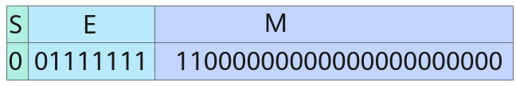

上图中 $S=0, E = 127, M = 2^{-1} + 2^{-2}$，最终表示的结果为 1.75。

其它常见浮点数的 S，E，M 分配如下：

|格式|总位数|符号位 S|指数位 E|尾数位 M|
|:--:|:--:|:--:|:--:|:--:|
|`float`|32|1|8|23|
|`double`|64|1|11|52|
|`half`|16|1|5|10|
|`bfloat16`|16|1|8|7|

## `0x04` 逻辑门

逻辑门是最简单的数字电路，是组合电路的基本单元。逻辑门对二进制变量进行布尔运算，可以联系离散数学内容学习。

常用的逻辑门如下：

|缩写|含义|符号|离散数学表达式|
|:--:|:--:|:--:|:--:|
|AND|与门|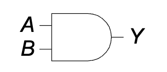|$p\land q$|
|OR|或门|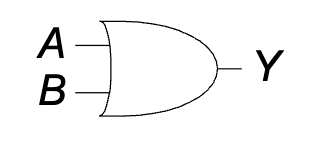|$p\lor q$|
|XOR|异或门|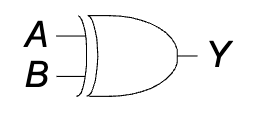|$(\lnot p\land q)\lor(p\land \lnot q)$|
|NOT|非门|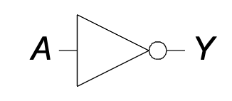|$\lnot p$|

特别的，在很多情况下，单个气泡就可以代表取反，在其它逻辑门的输入或输出端加上气泡，就可以产生更多逻辑门。比如与非门：

|缩写|含义|符号|离散数学表达式|
|:--:|:--:|:--:|:--:|
|NAND|与非门|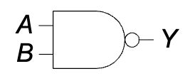|$\lnot (p\land q)$|

读者可以自己尝试构造 XNOR 门。

对于与门和或门，可以自然的扩展到多输入，只要多划一些线即可。自然地，基于与门和或门拓展的门也可以。可以证明，异或操作也具有结合律，因此多输入异或门也是有意义的，但是 PPT 上没有出现。

## `0x08` 噪声容限

在系统中，常用低电压 GND 表示 0，高电压 VDD 表示 1。电压传输过程中，往往会从 GND 或 VDD 的基础上产生一些噪声。逻辑门需要拥有处理噪声的能力，当然，逻辑门自己也会产生噪声。

对此，有四个参数来描述逻辑门的噪声特性：

|符号|含义|
|:--:|:--|
|$V_{IH}$|输入（**I**nput）的高（**H**igh）电平阈值，超过此阈值的输入视为 1|
|$V_{IL}$|输入（**I**nput）的低（**L**ow）电平阈值，低于此阈值的输入视为 0|
|$V_{OH}$|输出（**O**utput）的高（**H**igh）电平阈值，超过此阈值的输出视为 1|
|$V_{OL}$|输出（**O**utput）的低（**L**ow）电平阈值，低于此阈值的输出视为 0|

有了这四个参数，就能知道传输过程的噪声容限（**N**oise **M**argin）：

|符号|数值|含义|
|:--:|:--:|:--:|
|$NM_H$|$V_{OH} - V_{IH}$|对于高电平信号，能够容忍的最大噪声|
|$NM_L$|$V_{IL} - V_{OL}$|对于低电平信号，能够容忍的最大噪声|

注意你是没法控制噪声的正负号的。既然叫噪声，应该视为均值为 0 的正态分布。

可以参考此图辅助记忆，下左图描述了这样一个工程选择：如果逻辑门的电压特性函数为 $V_O = f(V_I)$，则选取使 $f' = 1$ 的两点作为输入和输出的分界线。显然，这样的设计能使 $NM_L$ 和 $NM_H$ 最大。

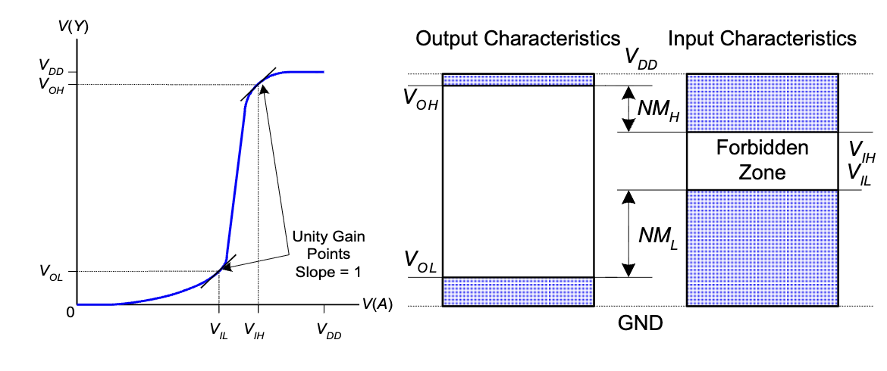

## `0x0c` 用符号表示组合逻辑

和离散数学中类似，数字电路中有另一套符号表示布尔代数。下面是基础的运算：

|符号|含义|离散数学表达式|
|:--|:--:|:--|
|$\overline A$|非|$\lnot A$|
|$A+B+C$|或|$A \lor B \lor C$|
|$ABC$|与|$A\land B \land C$|
|$A \oplus B$|异或|$(\lnot A\land B)\lor(A\land \lnot B)$|

特别的，使用 $(\cdot)'$ 表示**表达式求反**。被单引号修饰的表达式，所有的与变成或，每一个元素多一个取反。这很容易搞错，我们一般只用它当作取反的别名，相比起上划线更容易书写。

相比起离散数学中的符号，使用加法和乘法具有书写简单，符合直觉的优点。在后文，我将不区分**与或**和**积和**的区别，乘积就是指与的结果，求和就是指求或。重写一些布尔代数计算法则如下，因为已经学过，不做详细介绍：

**公理**：

- $B=0$ 若 $B\neq 1$
- $\overline 0 = 1$
- $0\cdot 0 = 0$
- $1\cdot 1 = 1$
- $1\cdot 0 = 0$

**单变量定理**：

- **恒等律**：$B\cdot 1 = B, B+0=B$
- **零元/一元律**：$B\cdot 0 = 0, B+1=1$
- **幂等律**：$BB = B, B+B=B$
- **互补律**：$B \cdot \overline B = 0, B+\overline B = 1$
- **双重否定律**：$\overline{\overline B} = B$

**多变量定理**：

- **交换律**：$BC = CB, B+C=C+B$
- **结合律**：$(BC)D = B(CD)$
- **分配律**：$B(C+D) = BC + BD, B+(CD) = (B+C)(B+D)$
- **覆盖律**：$B+BC = B, B(B+C) = B$
- **合并律**：$BC + B \cdot \overline C = B, (B+C)(B+\overline C) = B$
- **德摩根律**：$\overline{BC} = \overline B + \overline C, \overline{B+C} = \overline B \cdot \overline C$

## `0x10` 与或式和或与式

首先定义最大项和最小项。最小项是**包含全部输入变量的乘积项**，最大项则是**包含全部输入变量的和**。

记忆这个名字的方法是考虑真值表。以最大项 $A+B+\overline C$ 和最小项 $A \cdot \overline B \cdot C$ 为例，前者在七种情况下都能被满足，只有 $A=0,B=0,C=1$ 一种情况下得到 0。后者则只有 $A = 1, B = 0, C = 1$ 一种情况能满足。可满足情况数最大的项叫最大项，可满足情况数最小的项叫最小项。当然，我们不考虑恒 1 和恒 0 的平凡情况。

**与或式**就是在计算顺序上**先与后或**的式子，是**多个最小项的和**。在离散数学中，这被称为析取范式。由于每个最小项恰好指定了一种可满足情况，所以可以方便的从真值表构造与或式：对于每组真值为 1 的输入，写出其对应的最小项，最后将所有的最小项加起来。

**或与式**则是在计算顺序上**先或后与**的式子，是**多个最大项的积**。在离散数学中，这被称为合取范式。由于每个最大项恰好指定了一种不可满足情况，所以可以方便的从真值表构造或与式：对于每组真值为 0 的输入，写出其对应的最大项，最后将所有的最大项乘起来。

这样，我们就掌握了将任何有限布尔逻辑转化为表达式的方法：首先，我们列出真值表；然后，写出其与或式或者或与式。

**例题**：Ben正在野炊，如果下雨或者那儿有蚂蚁，Ben将不能享受野炊。

用 $A$ 表示有蚂蚁（**A**nt），$R$ 表示下雨（**R**ain），设 $E$ 表示能享受野炊，则列出真值表如下：

| $A$ | $R$ | $E$ |
| :---: | :---: | :---: |
| 0 | 0 | 1 |
| 0 | 1 | 0 |
| 1 | 0 | 0 |
| 1 | 1 | 0 |

**与或式**：
观察真值表，只有当 $A=0, R=0$ 时 $E=1$。对应的最小项为 $\overline A \cdot \overline R$。
因此，$E = \overline A \cdot \overline R$。

**或与式**：
观察真值表，当 $A, R$ 取其它值时 $E=0$。

- $A=0, R=1$，对应最大项 $A + \overline R$
- $A=1, R=0$，对应最大项 $\overline A + R$
- $A=1, R=1$，对应最大项 $\overline A + \overline R$
因此，$E = (A + \overline R)(\overline A + R)(\overline A + \overline R)$。

通过布尔代数化简，可以证明两者是等价的。当然，在这个例子中，直接翻译“不下雨且没有蚂蚁”得到 $E = \overline R \cdot \overline A$ 是最直观的。

## `0x14` 表达式化简

将一个表达式化简为乘积项的个数最少，其中每个乘积项的元素数量最少。在 PPT 上，乘积项被称为隐式/蕴涵式。

表达式化简，基本上就是运用 `0x0c` 中列出的布尔代数公理。公理运用是平凡的，但不容易观察到的是“添项展开”：

$$
\begin{aligned}
Y &= AB'C + ABC + A'BC \\
&= AB'C + ABC + ABC + A'BC \\
&= (AB'C + ABC) + (ABC + A'BC) \\
&= AC + BC
\end{aligned}
$$

若是化简成 $AC + A'BC$ 就犯了错。

总的来说，纯推导化简表达式很容易出错，我们一般采用 `0x18` 中介绍的卡诺图方法进行化简。

## `0x18` 卡诺图

卡诺图首先是一种多维的真值表表示方法。将一些变量的组合作为行标号，剩下的变量组合作为列标号，在表格中填入真值，就得到了一张二维的真值表：

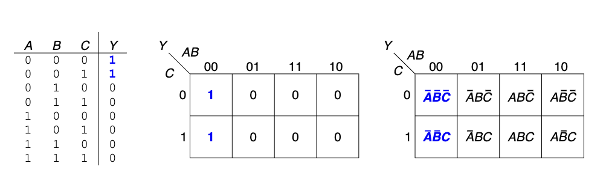

在这个图中，行标号的顺序值得注意：它并不是按照字典序（`00,01,10,11`）排序的，而是按照**格雷码**的顺序构造的。

格雷码是一种特殊的编码，无论是几位的格雷码，都具有这样的性质：**相邻两个数至多相差一个二进制位**，注意相邻的定义是循环的。对于二位格雷码，它是 `00,01,11,10`。格雷码具有通项公式：$i \oplus (i \gg 1)$，记不住也没关系，我们大概率只会用到二位格雷码。但还是给出三位格雷码如下：`000,001,011,010,110,111,101,100`。

使用格雷码的好处是：**在元素数不超过 4 的卡诺图中，任何一个长宽为 1，2，4 的长方形都恰好对应一个蕴涵项，或者说乘积项。长方形面积越大，乘积项元素数越小**。

比如上图中，由 $(0,01)$ 和 $(1,11)$ 两点确定的长方形，其对应的蕴涵项为 $B$。要确定蕴涵项也很简单，找到哪些元素在正方形中始终只有一种取值即可。这里要注意，**由于格雷码的循环性，卡诺图也是循环的**，也就是说，包含 $(0,00),(0,10)$ 的长方形也是合法的。

那么，回顾化简表达式的目标：用最少的蕴涵项覆盖所有真值，蕴涵项本身元素数最小。这对应到卡诺图上，就是：**用最少的边长为 1，2，4 的长方形覆盖所有 1 的方格，且长方形本身面积越大越好**。

下图给出了一个四输入卡诺图的例子。

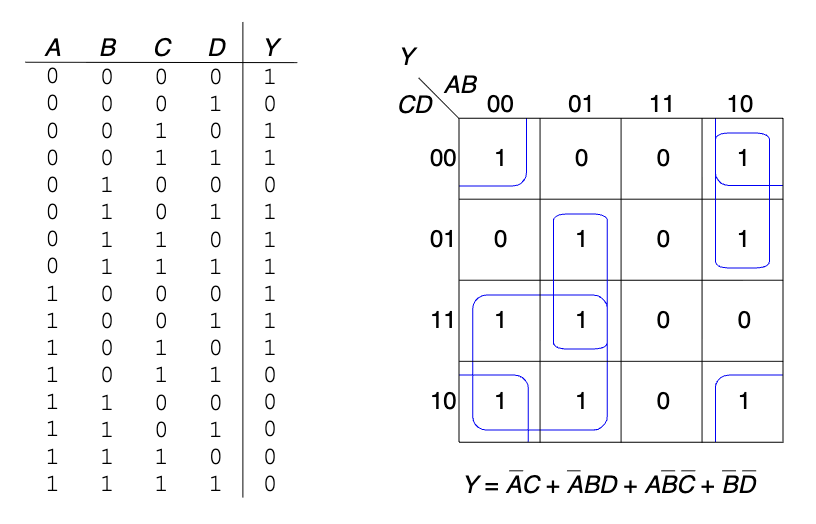

\***更多输入的卡诺图**：

如果要绘制更多输入的卡诺图，就会遇到问题。简单来说，蕴涵项在三位格雷码中并不总是连续的。比如，考虑 $ABC$ 组成的格雷码，蕴涵项 $C$ 对应的格雷码是两段：`000,[001,011],010,110,[111,101],100`。想要在卡诺图上正确的画出这样的“长方形”，无疑对人脑提出了很大考验。

另一方面，也并不是所有边长为 4 的长方形就对应一个蕴涵项。比如 `000,[001,011,010,110],111,101,100` 就无法被归为某个蕴涵项。

所以，卡诺图在这里只能提供一个既不充分也不必要条件，你可以选取任意边长为 1,2,8 以及与 2 对齐的 4 的长方形，覆盖所有的 1，这样得到的表达式比较简化，但并不是最简化的，还需要手动检查。

不过，这里还有另一种方法：升维。以 6 输入卡诺图为例，我们把多出来的两个输入按照 2 位格雷码放到第三个维度上，形成一个 $4\times 4 \times 4$ 的卡诺立方体，在这个立方体中，任意取一个边长为 1，2，4 的长方体，都恰好对应一个蕴涵项。如果你有更多的输入，并且恰好精通高维空间想象，你可以在 $n$ 维空间里解决 $2n$ 个输入的化简。

需要说明，三维方法不只是来搞笑的，对于 5 输入和 6 输入的情况，可以将第三维平铺到二维里，分别绘制两个和四个四输入卡诺图，具有一定实操性。

## `0x1c` 绘制组合逻辑电路

我们遵循如下规则绘制电路：

- 输入在图的左边或者顶部
- 输出在图的右边或者底部
- 门必须从左到右
- 最好直线无拐角
- 线总是在 T 型接头处连接
- 交叉线有点则连接，无点则不连接

下面给出一个例子：

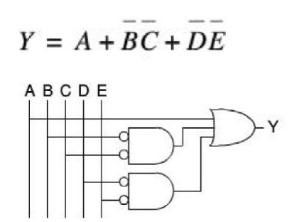

## `0x20` 竞争值与浮空值

竞争值 X 表示电路同时被 1 或 0 驱动。这意味着两个门输出端或电路输入端被直接连接，这种布线本身就是危险的。

浮空值 Z 表示电路没有被任何源驱动，一般出现于三态缓冲器：

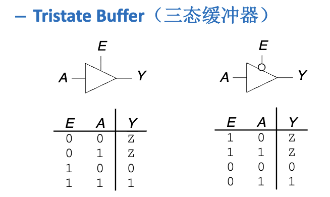

这种电路现在不怎么用了，但是它可以完成这样的功能：如果 Y 处还有其它的输出，那么可以通过 E 将 Y 设为高阻态，此时相当于 Y 处是断路，就不会在 Y 处出现竞争值，保证了数据安全。

## `0x24` 常见的组合逻辑模块

此处我们采取这样的方式介绍：列出所有模块的名字和功能，将 PPT 上给出的电路实现留作例题，可以打开 PPT 自行核对；PPT 上要求“自行实现”的基础内容将在下面给出。

### 半加器

半加器用于计算两个一位二进制数的和。

- **输入**：$A, B$
- **输出**：$S$ (Sum), $C_{out}$ (进位)
- **逻辑表达式**：
    - $S = A \oplus B$
    - $C_{out} = AB$


### 全加器

全加器用于计算两个一位二进制数与来自低位的进位的和。

- **输入**：$A, B, C_{in}$
- **输出**：$S, C_{out}$
- **逻辑表达式**：
    - $S = A \oplus B \oplus C_{in}$
    - $C_{out} = AB + BC_{in} + AC_{in} = AB + C_{in}(A \oplus B)$

留作例题。

### 多路选择器

多路选择器根据选择信号从多个输入数据中选出一个输出。

- **输入**：$2^n$ 个数据输入 $D_0, \dots, D_{2^n-1}$，$n$ 个选择信号 $S_0, \dots, S_{n-1}$。
- **输出**：$Y$
- **功能**：$Y = D_k$，其中 $k$ 是选择信号 $S$ 代表的数值。
- **逻辑表达式**（2选1）：$Y = S D_1 + \overline S D_0$

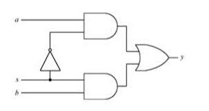

用双路选择器搭建多路选择器留作例题。

用多路选择器可以实现逻辑。以 3 输入为例，可以使用一个八路选择器，将三个输入作为控制位，按照真值表将 8 个输入分别连接 VDD 或 GND，则此时选择器就是真值表。

常见的题型为“只允许使用 4 路选择器和 1 个额外门”，此时就要改造真值表，比如以 AB 为输入，然后在输出中用含有 ABC 的组合逻辑表示真值。如果选择的变量和化简都得当，则可以使用少数门电路完成。需要注意，这种题一般就是与门、或门、非门，采用异或门可能会被判错。（我的作业就被判错了）

### 译码器

译码器将 $n$ 位输入代码翻译成 $2^n$ 个输出信号，其中只有一个有效。

- **输入**：$n$ 位地址/数据
- **输出**：$2^n$ 条线
- **功能**：当输入为 $k$ 时，第 $k$ 条输出线有效，其余无效。
- **应用**：地址译码、指令译码等。

电路留作例题。

译码器也可以用来实现真值表。由于每个输出恰好是一个最小项，只需要用一个多路或门，把真值为 1 的输出连在一起，就完全模拟了真值表。

## `0x28` 组合逻辑的时序

这是重点之一。要牢牢记住这里的缩写，否则到后面的时序逻辑和处理器分析要吃大亏。本身的概念倒是没什么难度，计算也很简单。

- $t_{pd}$：传播延迟（**P**ropagation **D**elay）。描述的是从输入改变到输出保证正确所需的时间。
- $t_{cd}$：最小延迟（**C**ontamination **D**elay）。描述的是从输入改变到输出改变所需的时间。不保证输出正确。Contamination，名词，使某物变脏或变毒的过程，或含有不需要的或危险物质的状态。

要计算电路整体的 $t_{pd}$ 和 $t_{cd}$，需要找到电路的关键路径和最小路径。

- 关键路径：经过的所有元件的 $t_{pd}$ 之和最大的路径。关键路径的 $t_{pd}$ 之和就是电路整体的 $t_{pd}$。
- 最小路径：经过的所有元件的 $t_{cd}$ 之和最小的路径。最小路径的 $t_{cd}$ 之和就是电路整体的 $t_{cd}$。

如果读者离散数学学的不错，就能发现，将电路看做有向无环图，$t_{pd}$ 和 $t_{cd}$ 与任务图的最晚完成时间和最早开始时间有异曲同工之妙。

## `0x2c` 锁存器

所谓锁存器，是指能够保持状态的电子元件。一个最基本的锁存器是**双稳态电路**，由两个首尾连接的非门组成。

<div style="display: flex; flex-wrap: nowrap; align-items: center;">
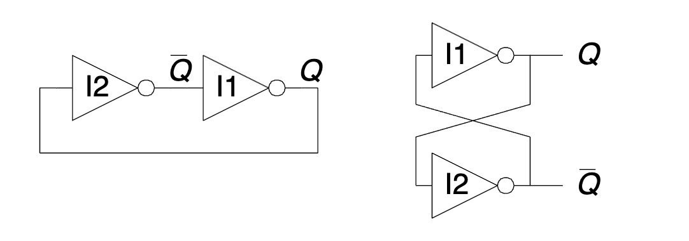
</div>

双稳态电路存储了一个二进制值 Q。这个 Q 不会是竞争态或浮空态，一定是稳态的 0 或 1。问题也很显然，我们没办法控制究竟是 0 还是 1。不要想着往 Q 端口输入信号，因为要知道非门其实是有电源的，这样只会造成竞争态 X，并不能大力出奇迹。你的输入是 VDD，非门的驱动也是 VDD，凭什么你能超过非门呢？

显然，锁存的基本结构应该是两个非门。但是，为了能够控制 Q，我们需要有一个输入信号，能够覆盖原有的 Q 值。什么东西能实现 overwrite 呢？不难想到，可以用或门。或门的一个输入是外部输入，另一个输入是锁存输入，当外部输入为 1 时，无论锁存输入是什么，输出结果都是 1。总的来说，我们需要两个或非门。这就是 **SR 锁存器**，具有 **S**et，**R**eset 两个输入端。

<div style="display: flex; flex-wrap: nowrap; align-items: center;">
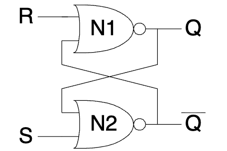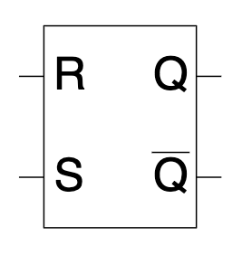
</div>

聪明的读者容易想到，与门也可以 overwrite。不妨自行尝试使用与门和非门构造 SR 锁存器。

SR 锁存器的一大问题是竞争问题。当 S 和 R 都是 1 时，内部会产生竞争态。为了解决这个问题，添加几个门就能得到 **D 锁存器**：

<div style="display: flex; flex-wrap: nowrap; align-items: center;">
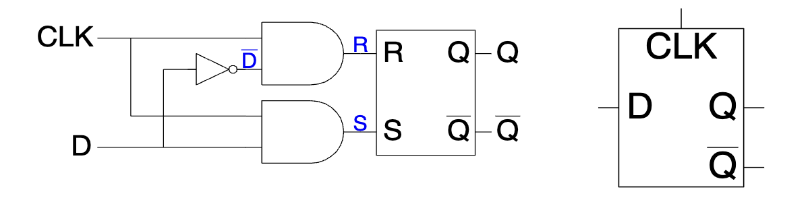
</div>

观察上面的电路图，可以得到这样的结论：

- 只有 CLK 的高电平时可以写入
- R 和 S 永远不会竞争
- 写入 Q 的值就是 D 的值

这是很聪明的设计。在 D 锁存器中，两个输入的地位是不对等的，有了清晰的功能分化。

## `0x30` 触发器

锁存器还有最后一个问题：在整个 CLK 高电平期间，D 的值必须保持不变，否则最终写入是 D 最后时刻的值。

理想的情况是对电路稍加修改，让 D 在 CLK 的上升沿（从 0 变成 1 的瞬间）被写入。这就是 D 触发器。

<div style="display: flex; flex-wrap: nowrap; align-items: center;">
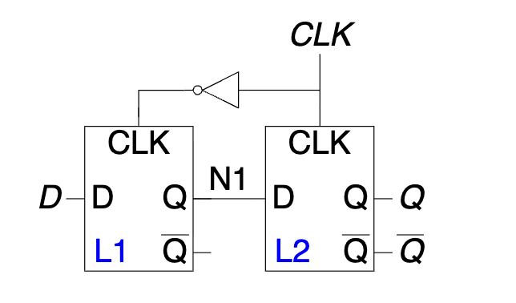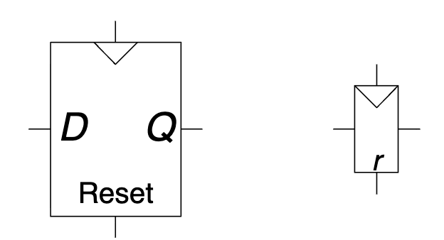
</div>

这里，我们命名左边的锁存器为**主锁存器**，右边的锁存器为**从锁存器**。

CLK 为 0 时，主锁存器的 D 被写入到 N1。CLK 为 1 时，N1 被写入到 Q。因此，在时钟的上升沿，D 被传输到 Q，随后 Q 一直不变。

那为什么在下降沿什么也不会发生呢？这里，就需要用到非门的时序特性：随着 CLK 的下降沿到来，因为非门有一个延迟 $t_{\mathrm{NOT}}$，所以是右边的锁存器先锁住，主锁存器的 D 再被复制到 N1，此时 N1 已经不会影响 Q 了。

触发器还可以有一些额外功能，包括**使能**（**EN**able），**复位（Reset）**。其中使能为 0 时触发器忽略时钟，变成锁存器。复位则有两种：

- **同步复位**：在时钟的上升沿，判断复位的值是否为 1，若为 1 则输出 0。
- **异步复位**：任意时刻，如果复位的值为 1，则输出 0。

对应的 SystemVerilog 代码如下：

```sv
// 同步复位
always_ff @(posedge clk) begin
  if (rst) begin
    // Set to 0
  end else begin
    // other 
  end
end
// 异步复位
always_ff @(posedge clk, posedge rst) begin 
/*
  如果你无法一下子理解为什么只多一个 posedge rst，
  请思考异步相比同步多了什么，
  是不是只提前了 rst 上升沿到下一个 clk 上升沿的时间把输出设为 0，
  所以只需要多一个 rst 上升沿处理就可以了
*/
  if (rst) begin
    // Set to 0
  end else begin
    // other 
  end
end
```

## `0x34` 同步电路与异步电路

类比同步复位和异步复位，可以定义**同步电路**：

- 每一个电路元件是寄存器或组合电路
- 至少有一个电路元件是寄存器
- 所有寄存器都接收同一个时钟信号
- 每个环路至少包含一个寄存器

不满足这样的条件则是**异步电路**。

## `0x38` 同步电路的时序

相比组合逻辑，同步电路只多了一个触发器，因此，只要考察触发器的时序要求，就可以得到同步电路的时序。

**触发器的时序特性**：在信号上升沿，从锁存器开始把 N1 复制到 Q。此时的 N1 是上升沿之前的 D，因此要求 D 在上升沿之前就保持稳定，这段时间被称为**建立时间** $t_{setup}$；要让 Q 完全稳定，需要等到主锁存器的 CLK 变为 0，这中间有一个 $t_{\mathrm{NOT}}$ 的延迟，锁存器本身也有一些延迟，因此在上升沿之后一段时间 D 也需要保持稳定，这段时间被称为**保持时间** $t_{hold}$。

触发器由于锁存器内部的延迟，也有类似于 $t_{pd}$ 和 $t_{cd}$ 的输出时序。用 $t_{pcq}$ 表示时钟到来后，Q 可用的最早时间（**P**ropagation **C**lock to **Q**）；$t_{ccq}$ 表示时钟到来之后，$Q$ 发生变化的最早时间（**C**ontamination **C**lock to **Q**）。

同步电路时序的模型如下：考虑相邻的两个触发器。时钟周期为 $T_c$，触发器之间的组合电路有时序 $t_{cd}$ 和 $t_{pd}$。不妨认为第一个上升沿在 $t=0$ 时到来。

考虑第一个触发器+组合电路的部分，这一部分在第一个上升沿 $t=0$ 之后，需要 $t_{pcq} + t_{pd}$ 的时间使输出稳定。而在第二个上升沿 $t=T_c$ 之后，最短 $t_{ccq} + t_{cd}$ 的时间使输出变化，因此，这一部分能让输出数据在 $[t_{pcq} + t_{pd}, T_c + t_{ccq} + t_{cd}]$ 内保持稳定。

再考虑第二个触发器。在第二个时钟上升沿 $t=T_c$，它要求数据在 $[T_c - t_{setup}, T_c + t_{hold}]$ 内保持稳定。

显然，第一个区间应该完全包含第二个区间，所以：

$$
\left\{
\begin{aligned}
T_c &\ge t_{pcq} + t_{pd} + t_{setup}\\
t_{hold} & \le t_{ccq} + t_{cd}
\end{aligned}\right.
$$

第一条约束被称作**建立时间约束**，而第二条约束被称作**保持时间约束**。

## `0x3c` 时钟偏移

在这里，我们研究的时钟偏移 $t_{skew}$ 的含义是**触发器之间的时钟偏移**。并且，可以认为这里隐含了一个条件，即**相对时间是完全准时**的，任何时钟的两个上升沿正好差距是 $T_c$。

所以，我们仍然可以认为 CLK1 在 0 和 $T_c$ 处接受上升沿，而我们关心的 CLK2 的第二个上升沿 $T_{c2} \in [T_c - t_{skew}, T_c + t_{skew}]$ 中的任何时刻到来。所以，在最坏情况下，第二个触发器希望数据在 $[T_c - t_{skew} - t_{setup}, T_c + t_{hold} + t_{skew}]$ 中都保持稳定。由此可以建立新的约束条件：

$$
\left\{
\begin{aligned}
T_c &\ge t_{pcq} + t_{pd} + t_{setup} + t_{skew}\\
t_{hold} & \le t_{ccq} + t_{cd} - t_{skew}
\end{aligned}\right.
$$

## `0x40` 异步电路与亚稳态

无论是触发器还是组合电路，只有在最小延迟之前和传播延迟之后，其输出才是稳定的。**从触发输入到输出稳定的时间被称为分辨时间 $t_{res}$**。对于同步电路，只要遵守孔径时间，触发器的分辨时间 $t_{res} = t_{pcq}$。

但异步电路是无法避免的。无论是两个同步电路之间的通信，还是用户的输入，都有可能在孔径时间内改变输入。

如果输入在孔径时间内改变，那么输出就可能进入**亚稳态**。最终也会自发的跌落到稳态，但这个过程是一个随机过程，到达时间 $t_{res}$ 满足如下概率分布函数：

$$
P(t_{res} > t) = \frac{T_0}{T_c}\exp\left(-\frac{t}{\tau}\right)
$$

$\frac{T_0}{T_c}$ 描述的是这样一个概率：“在孔径时间内的输入引发亚稳态的概率”，而后面的指数项刻画了亚稳态衰减的概率。

根据这个式子，我们可以估计异步失败频率：

$$
f_{fail} = f_{data} \cdot f_{clk} \cdot T_0 \cdot \exp\left(-\frac{t_{more}}{\tau}\right)
$$

其中，$t_{more}$ 是设计上允许输出等待的最长时间，也就是 $T_c - t_{pd} - t_{setup}$。$f_{data}$ 是来自异步电路的输入改变的频率，例如人手点击可能在 10Hz 量级。

为了尽可能延长 $t_{more}$，我们可以在所有异步信号输入后先接入**同步器**。同步器由两个背靠背直接连接的触发器组成，中间没有任何组合电路，因此 $t_{pd} = 0$，有 $T_c - t_{setup}$ 的时间等待输入变为正常，最大限度的降低 $f_{fail}$。

## `0x44` 有限状态机

有限状态机的核心是**状态**，也就是**所有被触发器保存的变量值**。在有限状态机中，触发器被称为状态寄存器。在时钟的两个上升沿之间，根据普通的组合逻辑，从当前状态 S 和输入 I 计算出下一个状态 S' 和输出 O。每个时钟上升沿，寄存器进行状态转移，执行 $S \leftarrow S'$。

有限状态机分为两类：

- Moore FSM：输出仅取决于当前状态。$O = f(S)$。
- Mealy FSM：输出取决于当前状态和输入值。$O = f(S, I)$。

设计状态机主要包括如下步骤：

1. 确定输入和输出，确定状态机类型
2. 画出状态图，确定状态个数和转换关系
3. 写出状态转换表
4. 选择状态编码
5. 写出真值表
6. 确定 $S', O$ 与 $S,I$ 的布尔表达式关系
7. 画出电路图

如果是大题，希望大家按照上面的方式完成。但如果过程不重要，那么往往可以跳过 3. 5. 步，节省很多时间和草稿纸。

## `0x48` 状态转换

状态转换图是描述状态机的状态随着输入变化关系的有向图，包含了状态、输入和输出信息。

对于 Moore FSM，状态就是输出，所以图的节点包含了状态和输出，边包含了输入，一条 $((S,O),(S',O'),I)$ 的边表示在 $S$ 状态下输出是 $O$，输入 $I$ 将让状态机转移至 $S'$，输出是 $O'$。

对于 Mealy 状态机，输出和输入有关，因此图的边包含了输入和输出。一条 $(S,S',(I,O))$ 的边表示在 $S$ 状态下，输入 $I$ 将产生输出 $O$，并让状态机转移至 $S'$。

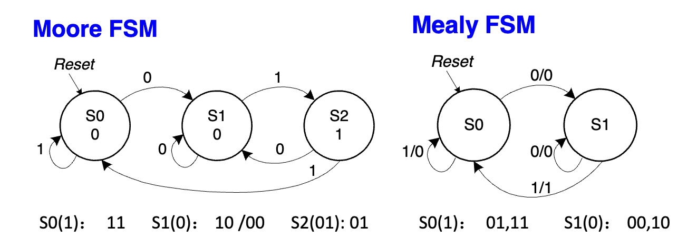

有了状态转换图，就可以列出状态转换表。这没有什么技术含量，其实就是把所有的边信息 $(S,S',I,O)$ 用表格的形式写下来。

## `0x4c` 状态编码

回顾一下，有限状态机的状态是**所有触发器保存的变量值**。在 `0x48` 中的状态是以节点的形式存在的，要将其转化为有限状态机的状态，就需要给每个节点赋一个变量值。也就是将状态编码。常用的编码有两种：

- 二进制编码：把节点从 0 开始标号，对应的二进制值就是节点在寄存器中的状态。若有 $n$ 个状态，需要 $\lceil \log_2 n\rceil$ 位的寄存器。
- 独热（One-hot）编码：用 $n$ 位的寄存器表示 $n$ 个状态，每个状态恰有一位为 1。

独热编码容易阅读，容易编写，但是使用的寄存器位数更多。

将 `0x48` 中的状态转换表的所有状态都改写成寄存器值，就得到了 $O,S'$ **关于 $I,S$ 的真值表**。接下来，使用 `0x10-0x18` 介绍的真值表转表达式技术和表达式化简技术，即可得到 $O,S'$ 关于 $I,S$ 的布尔表达式关系。

这一段过程推荐阅读 PPT 中的 FSM3 三页，非常清晰。

## `0x50` 绘制 FSM

绘制 FSM 的电路图有约定俗成的格式：输入在左边或上边，输出在右边。所有的状态都接在一个多位寄存器上，右边是 S'，左边是 S，通过下方走线把 S 走到最右端。如下图所示：

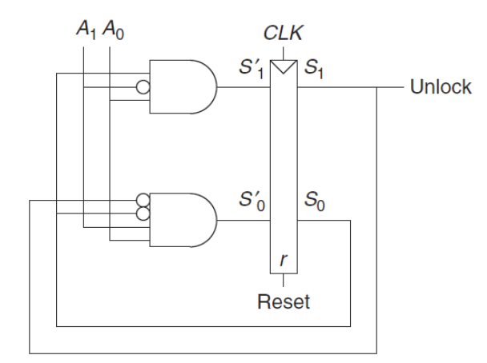

## `0x54` 并行

并行分为两种：时间并行与空间并行。

- 空间并行：申请整数倍的资源，将任务数量进行带余除法，分配给不同的资源来做。
- 时间并行：任务的不同阶段不一定调用所有资源，如果第二段的空闲资源可以完成第一段，那么就可以在第一份任务的第二段同时完成第二份任务的第一段，又称流水线。

衡量并行效率的数值是**延迟**和**吞吐量**。延迟的含义是：**从开始到第一个任务完成所需要的时间**。而吞吐量的含义是：**从第一个任务完成后，单位时间能完成的任务数量**。

对于流水线来说，由于启动后多任务并行，吞吐量往往大于延迟的倒数。在具体的时序逻辑中，计算延迟和吞吐量的思路如下：

1. 计算各级延迟：每一级的延迟是 $t_{pcq} + t_{setup} + t_{pd}$。
2. 确定时钟周期：$T_c$ 是所有阶段延迟的最大值。
3. 确定延迟：第一个任务需要 $nT_c$ 才能完成，$n$ 是阶段数量。
4. 确定吞吐量：吞吐量是时钟周期的倒数，又称频率。

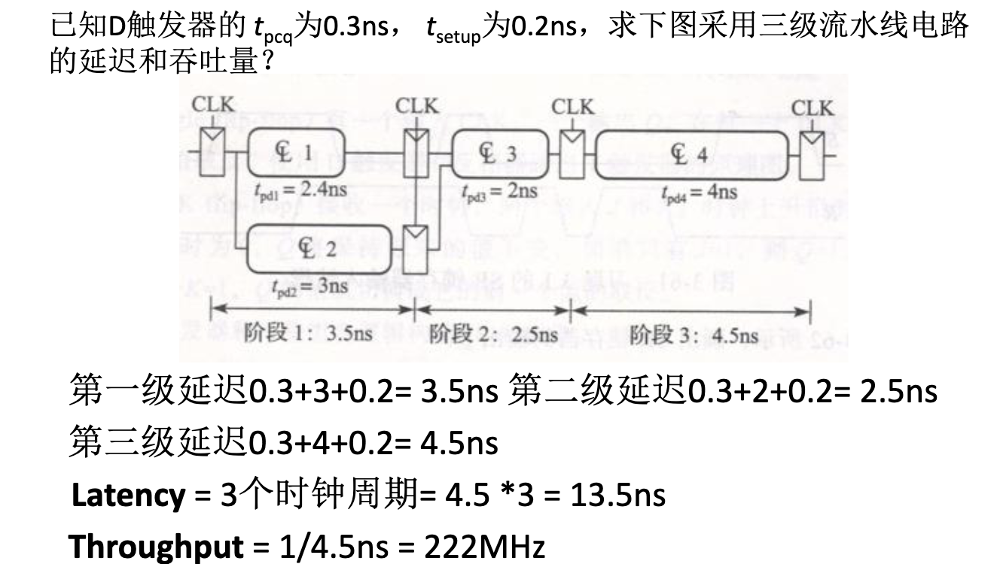

空间并行不能加快延迟，但可以翻倍吞吐量。不过，由于带余除法的余数以及结果的通信问题，最终效果往往达不到任务数除以吞吐量的理想情况。

## `0x58` 存储器和存储阵列

存储分为两类：

- **RAM**（随机存取存储器）：易失性存储器，断电后数据丢失。支持快速读写。
    - **SRAM**（静态 RAM）：使用锁存器结构存储位，速度快但集成度低、成本高，常用于缓存（Cache）。
    - **DRAM**（动态 RAM）：使用电容存储位，需要定期刷新以维持电荷，速度较慢但集成度高、成本低，常用于主存。
- **ROM**（只读存储器）：非易失性存储器，断电后数据不丢失。
    - 现代 ROM（如 Flash）实际上支持擦写，但速度远慢于 RAM。
    - 常见类型包括 PROM（可编程 ROM）、EPROM（可擦除可编程 ROM）、EEPROM（电可擦除可编程 ROM）等。

通过 RAM 和 ROM，我们可以存储单个 bit。但现代计算机一次能处理 32 个或 64 个 bits，把存储器用固定模式组合在一起，能够一次性访问多个 bits，就是存储阵列。

对于 RAM，我们使用字线和位线结构：

- **字线（Wordline）**：由地址译码器驱动，负责选中存储阵列中的某一行。
- **位线（Bitline）**：连接同一列的所有存储单元，负责传输该列的数据（读或写）。
- **存储单元（Cell）**：位于字线和位线的交叉点，是存储 1 bit 数据的基本单元。

一个具有 $2^n$ 个字、每个字 $m$ 位的存储阵列，需要 $n$ 位地址输入。地址经过**译码器**产生 $2^n$ 条字线，每次只有一条字线被激活。被激活行的数据通过 $m$ 条位线输出。

为了提高集成度，大容量存储器通常采用二维译码结构（行译码 + 列译码），将存储阵列排列成接近正方形的形状，通过多路选择器（Mux）从选中的行中挑出目标位。如果再算上位线，实际上就有了三维结构，激活两条字线共同确定一个字目标，再通过位线输出信号。

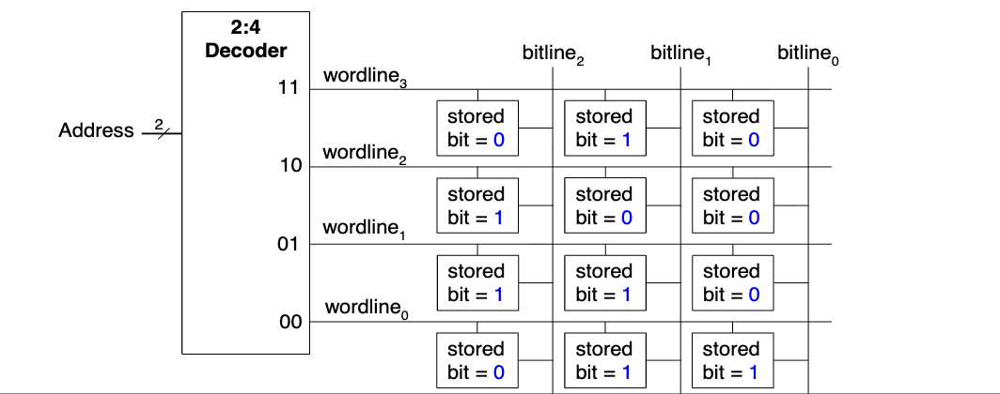

而传统的静态 ROM 实际上就是一张固定表，可以通过电路结构来实现。在 `0x24` 中，我们已经了解了如何用译码器来模拟真值表，这其实就是一种字长为 1bit 的 ROM。通过引入多组输出线，实际上就有实现了多 bits 的 ROM。信息是通过线之间是否联通硬编码在电路里的，真正的 Read Only。

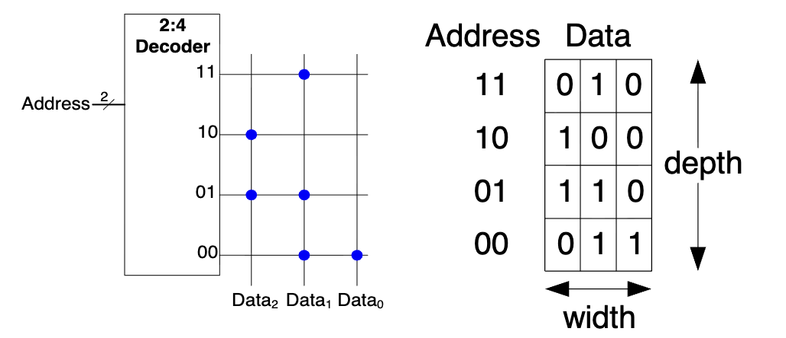

存储器逻辑只是用存储器模拟真值表的平凡应用，不做展开，这样的模块又被称作查找表（LUT），其好处是延迟极低，无需计算，一步到位。

## `0x5c` 高级数字电路模块

本节介绍在第五章提到的各式数字模块。其中一些需要了解功能和核心算法，另一些的实现是平凡的，需要记住功能。对于 ALU 和寄存器文件两个在体系结构中至关重要的模块，将在另一个讲解 SystemVerilog 语言的资料中，分别作为组合逻辑和时序逻辑的例子进行讲解。

### 加法器

加法器是算术运算的核心。我们在 `0x24` 中已经见过了一位全加器，因此可以简单得到：

**行波进位加法器 (Ripple Carry Adder, RCA)**：

- **原理**：将 $N$ 个全加器串联，低位的进位输出 $C_{out}$ 连接到高位的进位输入 $C_{in}$。
- **特点**：结构简单，但延迟随位数 $N$ 线性增长 ($t_{\text{delay}} \propto N$)，因为高位必须等待低位进位传播。

我们发现，等待进位的时间是加法器的主要瓶颈，因此，对进位的优化催生了很多进位加法器。他们都遵循这样的基本原理：

$$
S_i = A_i \oplus B_i \oplus C_{i-1}, C_{-1} = C_{in}
$$

其中，$A,B$ 是输入，$C_i$ 是来自低位的进位。得到 $C_i$ 后，只需要常数延迟就能得到 $S_i$，因此关键就是分析 $C_i$。

进位的来源有两种可能：一种是两个输入都是 1，我们称作**产生进位**，另一种是至少有一个是 1，并且低位有进位，我们称作**传递进位**。产生进位 $G_i$ 和传递进位 $P_i$ 的条件如下：

$$
G_i = A_iB_i, P_i = A_i + B_i
$$

则可以得到 $C_i$ 的递推公式：

$$
C_i = G_i + P_iC_{i - 1}
$$

**先行进位加法器 (Carry Lookahead Adder, CLA)**：

所谓“先行进位”是这样一个函数 $\mathrm{CLA}(G,P)$：**给定一个连续段的 $G[b-1:0],P[b-1:0]$ 信息和低位进位 $C_{-1}$，在常数时间内直接得到 $C[b:0]$**。其原理是用空间换时间，把递推式一口气展开到 $C_{-1}$ 级，这样，每个进位通过两层门电路就直接得到了。

整个 32 位的先行进位是非常昂贵的。因此要采用分组的方式。具体来说，如果把 $[31:24],[23:16],[15:8],[7:0]$ 四块看成四个整体，它们的行为无非就是接受一个低位输入，产生一个高位输出，因此也有 $G,P$ 信息。

注意此处，块进位 $C_{7:0}$ 和单个位进位 $C_{7}$ 是相等的，但是其 $G,P$ 的含义不相同，一个是单个位是否产生进位，一个是整块是否产生进位。

通过手动分析的形式，可以知道 $G_{7:0}$ 和 $P_{7:0}$ 的表达式，也是一种展开，如下：

$$
\begin{aligned}
G_{7:0} &= G_7 + G_6P_7 + \dots + G_0P_1P_2P_3P_4P_5P_6P_7 \\
P_{7:0} &= P_0P_1P_2P_3P_4P_5P_6P_7
\end{aligned}
$$

这样，我们首先进行 $\mathrm{CLA}([G_{31:24},G_{23:16},G_{15:8},G_{7:0}], [P_{31:24},P_{23:16},P_{15:8},P_{7:0}])$，得到 $[C_{31:24},C_{23:16},C_{15:8},C_{7:0}]$。我们知道，块进位其实就是最高位的单个进位，这样，就把 32 位拆成了 4 组 8 位的 $G,P$ 对，每一组的低位进位都是已知的，再调用四次 $\mathrm{CLA}$ 即可。

在第一次实验的附件中，有详细的先行进位加法器教程。

**前缀加法器 (Prefix Adder)**：

反思先行进位加法器的设计，我们发现“整块的 $G,P$ 信息”是很有趣的。如果我们能知道 $G_{b:0}$ 和 $P_{b:0}$，就可以立刻得到 $C_b = G_{b:0} + P_{b:0}C_{-1}$。

所以，这就转化成了关于 $G$ 和 $P$ 的前缀信息查询。此时，就需要左转 OI-wiki [树状数组](https://oi-wiki.org/ds/fenwick/)。如果你不会，那么，下面的图也足够直观，总之可以在 $\log_2 b$ 个门电路后完成加法。

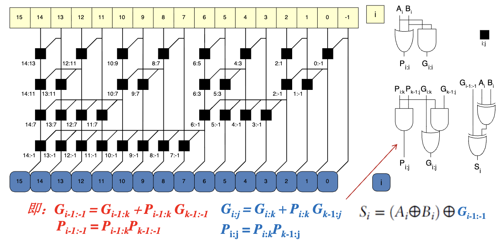

### 比较器

比较器用于判断两个二进制数 $A$ 和 $B$ 的大小关系（$=, <, >$）。

- **相等比较器**：基于异或非门（XNOR）。若每一位都相等 ($A_i \oplus B_i = 0$)，则两数相等。
- **大小比较器**：从高位向低位逐位比较。若高位 $A_i > B_i$，则 $A > B$；若 $A_i < B_i$，则 $A < B$；若相等则继续比较下一位。可以通过减法器实现（检查结果符号位和零标志位）。

### 移位器

移位器将二进制数向左或向右移动。

- **逻辑移位**：空位补 0。
- **算术移位**：右移时空位补符号位（保持正负号不变），左移补 0。
- **循环移位**：移出的位填补到另一端的空位。
- **桶形移位器 (Barrel Shifter)**：利用多路选择器阵列，可以在一个时钟周期内完成任意位数的移位，常用于处理器 ALU 中。

### 乘法器

乘法比加法复杂得多。

- **部分积法**：类似手工乘法，计算 $N$ 个部分积（Partial Products），然后将它们相加。
- **阵列乘法器**：使用加法器阵列并行计算部分积的和。
- **Booth 算法**：通过对乘数进行编码（如将连续的 1 视为 $2^k - 2^j$），减少部分积的数量，从而加速运算。
- **Wallace 树**：使用压缩器（Compressors）并行压缩部分积，减少加法层级，显著降低延迟。

在第一次实验的附件中，有详细的 Booth 编码 + Wallace 树实现乘法器的教程。

### 除法器

除法是四则运算中最慢的。

- **试商法 (Restoring/Non-restoring Division)**：类似手工长除法。每次减去被除数，若结果为正则商 1，否则商 0 并恢复（或不恢复调整）。需要 $N$ 次循环。
- **阵列除法器**：将试商过程展开为组合逻辑阵列，速度快但面积大。
- **牛顿-拉夫逊迭代法**：将除法转化为乘法和求倒数，通过迭代逼近结果，常用于浮点除法。

### 时钟计数器

计数器是特殊的时序电路，用于记录脉冲个数或分频。

- **同步计数器**：所有触发器由同一时钟驱动，状态变化同步，速度快。
- **异步计数器（行波计数器）**：前一级触发器的输出作为后一级的时钟，结构简单但延迟累积大。
- **应用**：定时器、程序计数器 (PC)、频率分频等。

### 移位寄存器

移位寄存器具有存储和移位功能。

- **串行输入并行输出 (SIPO)**：数据逐位进入，一次性读出。
- **并行输入串行输出 (PISO)**：数据一次性写入，逐位读出。
- **应用**：串行通信（UART, SPI）、数据延迟、伪随机数生成（LFSR）。
