

  <h1 style="margin-bottom: 1px; padding: 0; line-height: 1.2;
             -webkit-print-color-adjust: exact; print-color-adjust: exact;">
    第三章 完全且完美信息动态博弈
  </h1>
  

  <h2 style="margin-bottom: 1px; padding: 0;
             -webkit-print-color-adjust: exact; print-color-adjust: exact;">
    1. 基本知识
  </h2>
  

<em>1.1 表示法：</em>

* 扩展形：由于动态博弈含有多个决策阶段，又称为“多阶段博弈”。用一颗树来表示动态博弈的过程被认为是理想的，这能体现选择次序和博弈阶段。
* 得益矩阵形：又称策略形，即把各个博弈方完整的决策链条的“总计划”像静态博弈那样写成得益矩阵。本质上，就是把扩展形这棵树写成矩阵形式。

<em>1.2 基本特点：</em>
一个完整决策计划对应一个结果；动态博弈具有不对称性。不对称性会引发“相机选择”问题，即“可信性”的问题。
<figure class="center">

  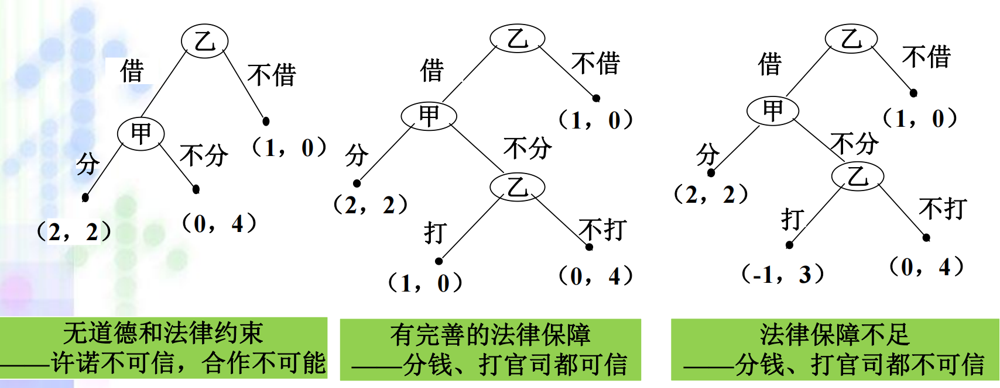

<figcaption><small>金矿博弈反映可信性问题，不同条件可信性有差异。</small></figcaption></figure>

<em>1.3 分析方法：</em>

* **逆推归纳法**：从动态博弈最后一个阶段博弈方的行为开始分析，<u>逐步倒推</u>回前一个阶段相应博弈方的行为分析，一直倒推至第一个阶段的博弈方的行为分析，最后对倒推分析进行<u>归纳总结</u>的博弈分析方法。
* **顺推归纳法**：根据博弃方在博弈<u>前面各阶段</u>的行为（包括偏离特定均衡路径的行为），推断他们的思路并<u>为后面阶段博弈提供依据</u>的分析方法。

  <h2 style="margin-bottom: 1px; padding: 0;
             -webkit-print-color-adjust: exact; print-color-adjust: exact;">
    2. 子博弈完美纳什均衡
  </h2>
  

<em>2.1 **子博弈**：</em>
定义：由一个<u>动态博弈第一阶段以外</u>的某阶段开始的后续博弈阶段构成，有初始信息集和进行博弈所需的<u>全部信息</u>，能够自成一个博弈的原博弈组成部分。
<figure class="center">

  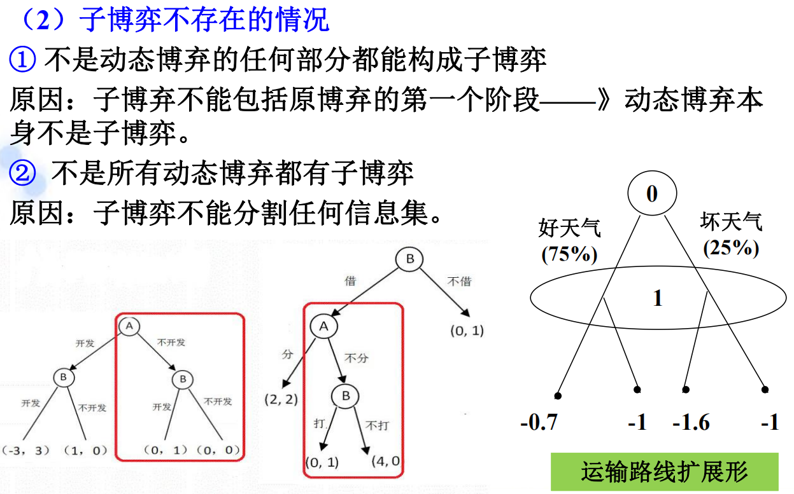

<figcaption><small>直观来讲，子博弈可表示为不包含根节点的从扩展形里取出的子树；值得注意，子博弈也可能不存在，比如信息集不可分割时。</small></figcaption></figure>

<em>2.2 **子博弈完美纳什均衡**：</em>
由经济学家泽尔腾提出。
定义：如果一个完全且完美信息动态博弈的一个策略组合，满足在<u>整个</u>动态博弈及它的<u>所有子博弈</u>中都构成纳什均衡，那么该均衡就是一个子博弈完美纳什均衡。
在子博弈完美纳什均衡中，在扩展形上有一个实际决策组合产生的**均衡路径**，而有些结点不在路径上，但那些结点上的选择也对整个均衡的有着重要作用，不能说就不看了。

<em>*2.3 经典博弈例子：</em>

*2.3.1 抢20博弈：*
用逆推归纳法，我抢20$\Rightarrow$你得到18或19$\Rightarrow$我抢17...最后类推得到抢$2\equiv 20\,\text{mod}\,3$ 。

*2.3.2 寡占的斯塔克伯格模型：*
列出得益函数，采用逆推归纳法可知，得益函数跟古诺博弈是一样的，但由于决策先后，后决策的最优产量被先决策的博弈方的产量完全确定，这种不对称性造成了差异。

*2.3.3 分配方案博弈：*
体现双方的不对称性。用逆推归纳法可求解。注意仔细分类归纳讨论。

*2.3.4 委托--代理博弈：*
又可以分为无确定性的，有不确定性可监督的，有不确定性且不可监督的，连续条件的。都使用逆推归纳法，画出扩展形。连续报酬和连续努力水平的情况下画不出扩展形，但也只需初等的数学计算。

  <h2 style="margin-bottom: 1px; padding: 0;
             -webkit-print-color-adjust: exact; print-color-adjust: exact;">
    3. 有同时选择的动态博弈模型
  </h2>
  

<em>3.1 标准模型：</em>
四个博弈方，第一阶段其中两个同时进行决策，第二阶段两外两个在观察后同时进行决策，得益得以最终确定。

<em>3.2 求解与例子：</em>
依然用逆推归纳法，但博弈的一个阶段可以用得益矩阵来表示。最初阶段的得益矩阵可能依赖于后续阶段，通过逆推归纳法可以使其确定。记得分析子博弈完美纳什均衡，这样的决策组合才是具备稳定性的。

<em>*3.3 存款与挤兑博弈：</em>
逆推归纳法，从第二个阶段得益矩阵中出发，讨论两种子博弈的纯策略均衡的情况（到期，到期）和（提前，提前），将得益写道第一个阶段博弈的（存款，存款）中，再对得益矩阵分析。最终获得两个子博弈完美纳什均衡。结论也很朴素：存就共同等资金回流，怕挤兑就不要存。

  <h2 style="margin-bottom: 1px; padding: 0;
             -webkit-print-color-adjust: exact; print-color-adjust: exact;">
    4. 反思逆推归纳法
  </h2>
  

<em>4.1 逆推归纳法的问题：</em>

1. 如果可能路径（尤其是博弈结束的可能情况太多）太多，有推理困难。
2. 对理性要求较高，依赖所谓**理性的共同知识**，其实解决问题可能还需要考虑其他博弈方偏离子博弈纳什均衡的情况。

<em>4.2 蜈蚣博弈：</em>
蜈蚣博弈解释了逆推归纳法的局限性。在阶段较少的蜈蚣博弈中合作的可能更低，逆推归纳法比较符合；但在阶段多的情况下理性的博弈方更倾向合作先把蛋糕做大，再在一个普遍更高的得益水平上进行竞争。
<figure class="center">

  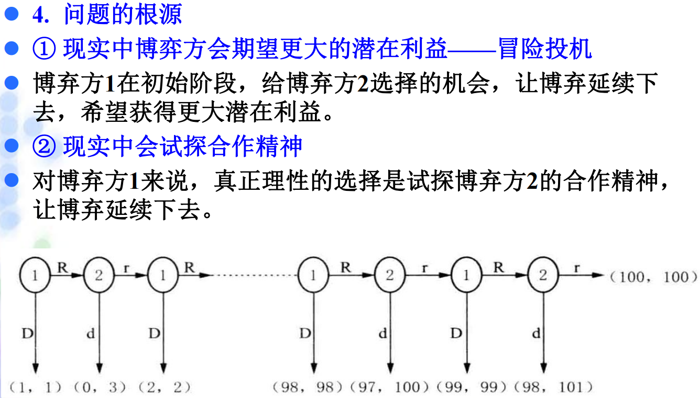

<figcaption><small>先合作后竞争，更接近理性博弈方的行为。</small></figcaption></figure>

<em>4.3 **颤抖手均衡**：</em>
由经济学家泽尔腾提出。<small>$\small{\sout{有趣的是，他的家乡也被一个“颤抖手”给搞丢了}}$。</small>
定义：假设一个博弈方<u>以小概率偏离</u>了原来的子博弈完美纳什均衡路径，并错选了其他非最优行动，但如果其他博弈方的行动<u>仍能构成对其错选行动的最优反应</u>，且<u>原子博弈完美纳什均衡</u>仍能维持，并且是<u>稳定的</u>，则该**子博弈完美纳什均衡**被称为颤抖手均衡。

*4.3.1 颤抖手均衡条件：*
<figure class="center">

  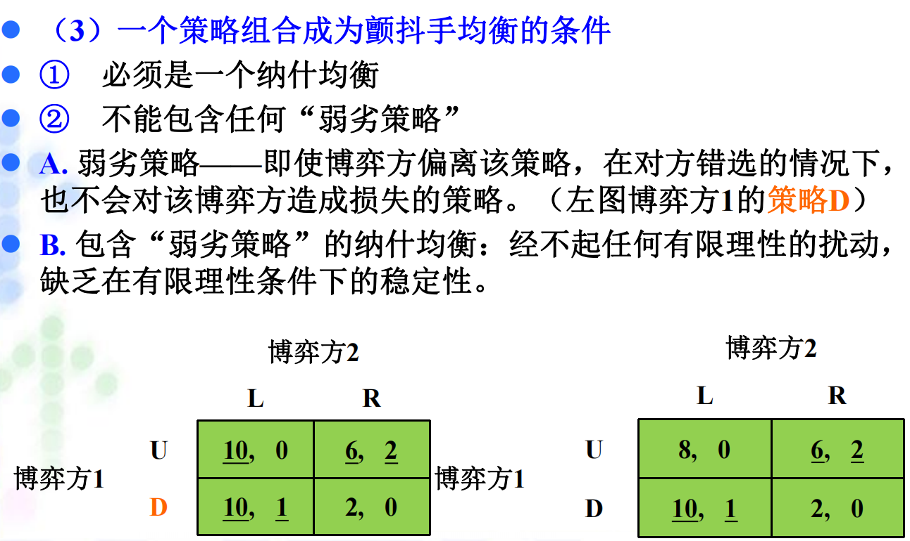

<figcaption><small>颤抖手均衡直观地说就是不怕对方乱来，所以不能包含那些不稳的策略。</small></figcaption></figure>

*4.3.2 颤抖手均衡的例子：*
<figure class="center">

  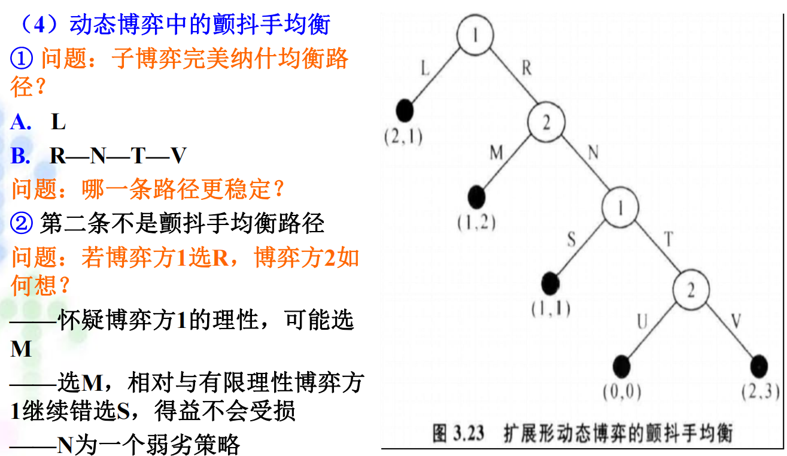

<figcaption><small>解释：对于博弈方一，选择R不会获得比L更高的得益，R是一个弱劣策略。而且博弈方2可能担心第三阶段博弈方1错选，可能选M，所以这条路径是很不稳定的。</small></figcaption></figure>

<figure class="center">

  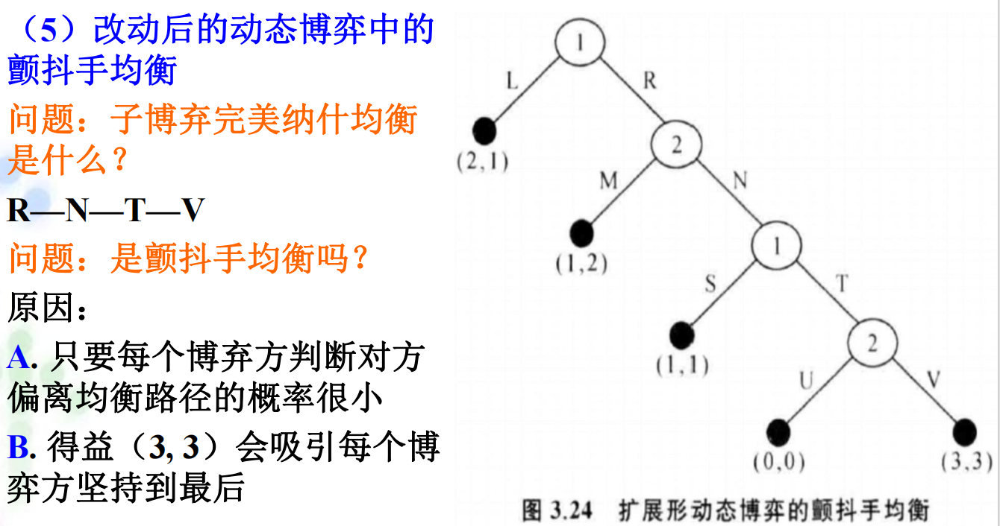

<figcaption><small>解释：(3,3)收益是帕累托最优的，偏离的概率大大下降了而且R-N-T-V是唯一的子博弈完美纳什均衡。</small></figcaption></figure>

<em>4.4 顺推归纳法：</em>

定义已于<em>**1.3**</em>中给出。不难看出是精炼纳什均衡的方法，即为有意偏离子博弈完美均衡来追求更高得益提供了方法。比如在蜈蚣博弈和van Damme博弈中。

<figure class="center">

  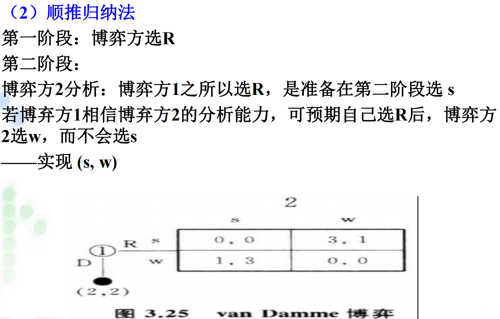

<figcaption><small>与颤抖手的提防对方犯错不同，顺推归纳是阅读对方偏离的目的，从而“协作”获得稳定而较优的得益。</small></figcaption></figure>

  <h2 style="margin-bottom: 1px; padding: 0;
             -webkit-print-color-adjust: exact; print-color-adjust: exact;">
    5. 章节重要简答题汇总
  </h2>
  

*限于篇幅，暂时隐去课后思考题四，补充练习题二、六。*

*5.1 思考练习一：动态博弈分析中为什么要引进子博弈完美纳什均衡策略，它与纳什均衡有什么关系？*
先默写子博弈完美纳什均衡得定义（或许不用）。
<figure class="center">

  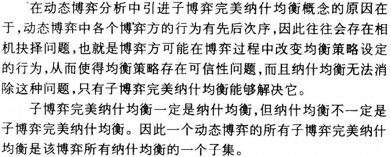

<figcaption><small></small></figcaption></figure>

*5.2 思考练习四*
<figure class="center">

  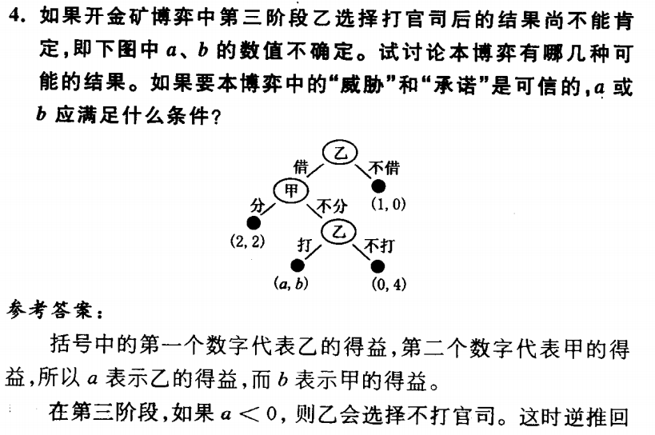

<figcaption><small></small></figcaption></figure>

<figure class="center">

  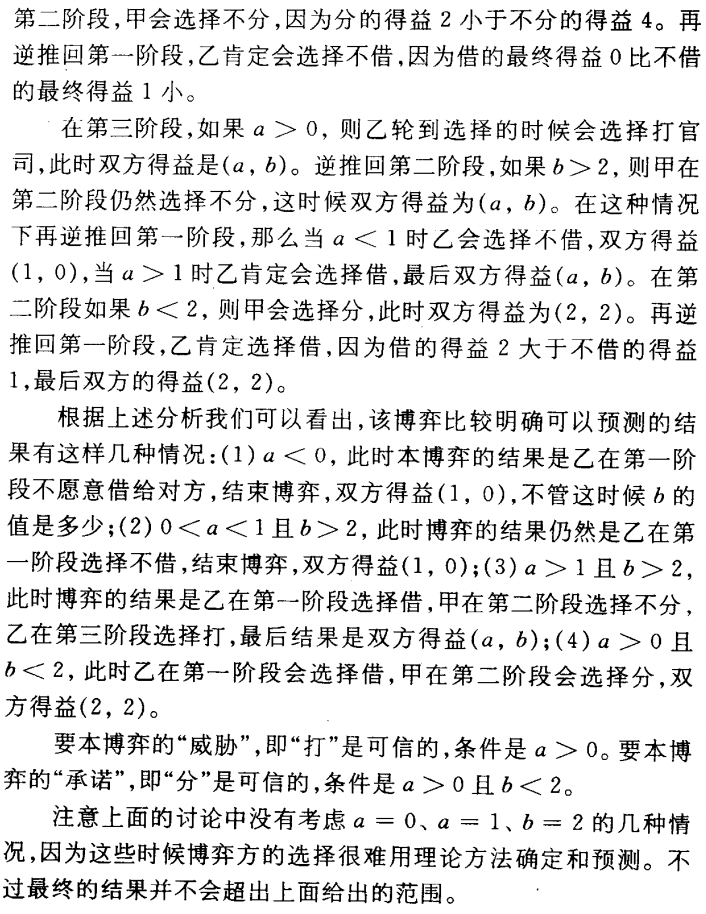

<figcaption><small></small></figcaption></figure>

*5.2 思考练习五：设一四阶段两博弈方之间的动态博弈如下图所示。找出全部子博弈，讨论该博弈中的可信性问题，求子博弈完美纳什均衡策略组合和博弈的结果：*
<figure class="center">

  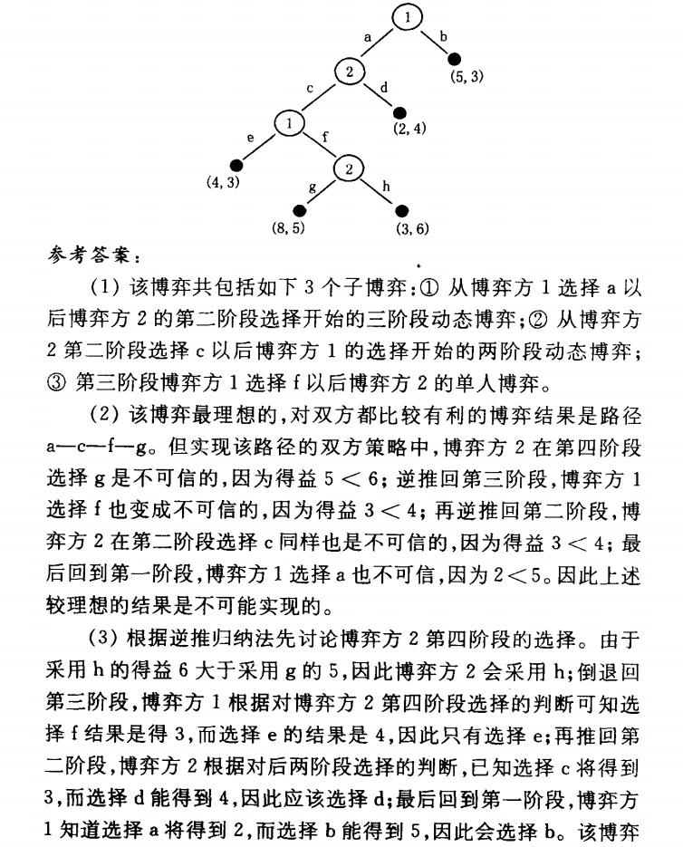

<figcaption><small>博弈方1第一阶段选b第三阶段e;博弈方2第二阶段选d第四阶段选h。结果为博弈方1第一阶段选b结束博弈，得益为(5,3)。</small></figcaption></figure>

*5.3 思考练习题七：*
<figure class="center">

  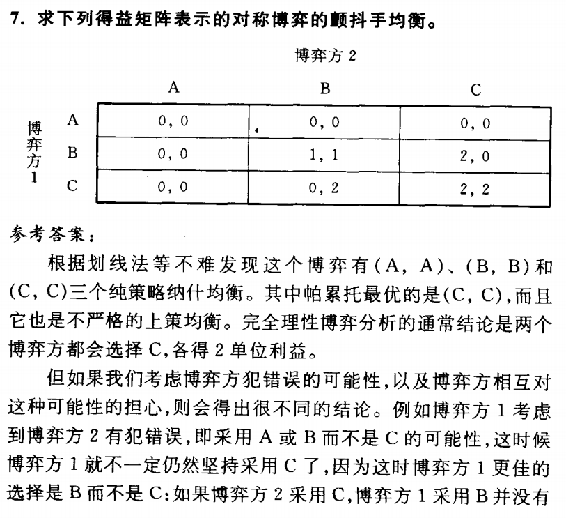

<figcaption><small></small></figcaption></figure>

<figure class="center">

  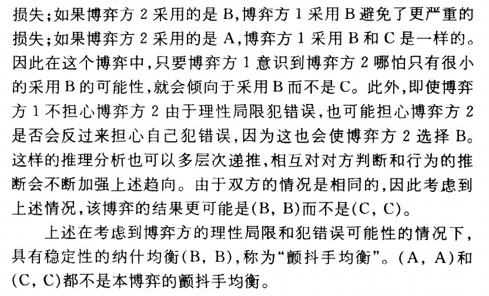

<figcaption><small></small></figcaption></figure>

*5.5 补充练习题二：*
<figure class="center">

  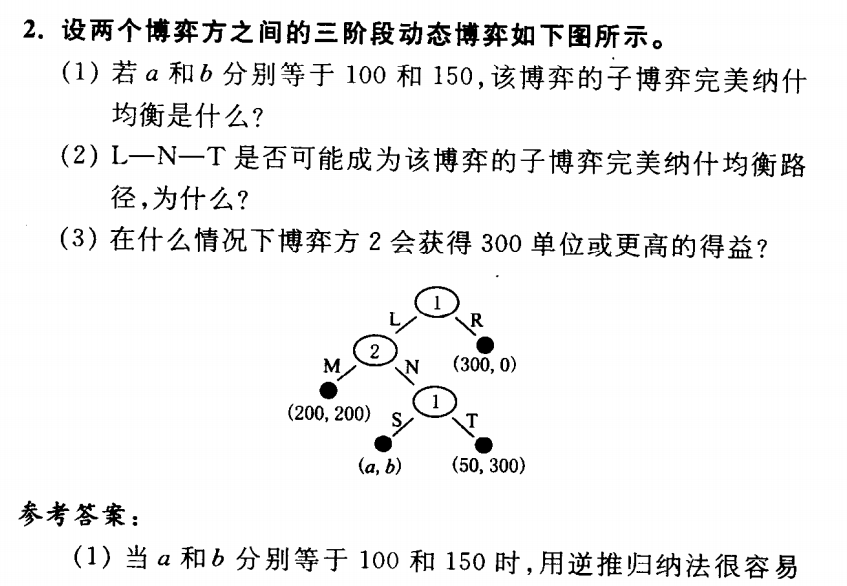

<figcaption><small></small></figcaption></figure>

<figure class="center">

  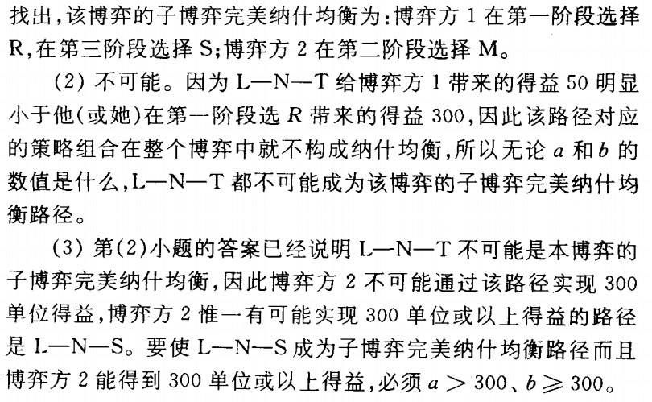

<figcaption><small></small></figcaption></figure>

*5.6 补充练习题六：*
<figure class="center">

  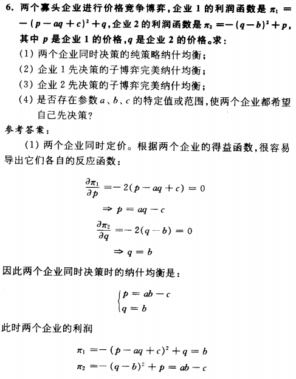

<figcaption><small></small></figcaption></figure>

<figure class="center">

  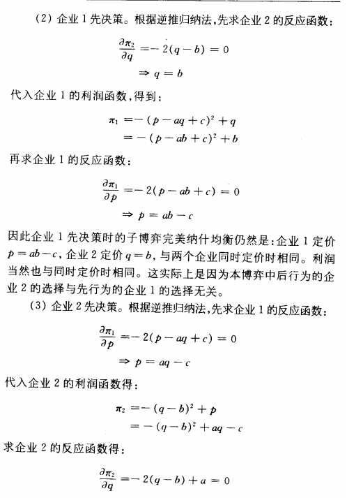

<figcaption><small></small></figcaption></figure>

<figure class="center">

  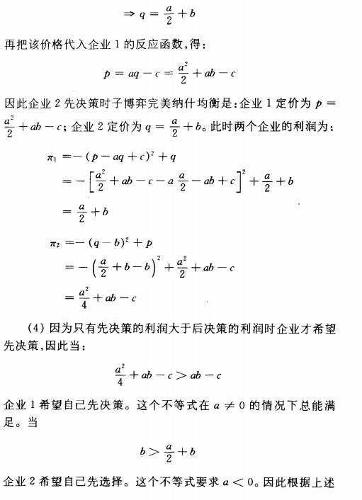

<figcaption><small></small></figcaption></figure>

<figure class="center">

  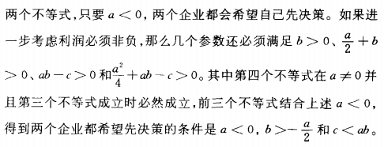

<figcaption><small></small></figcaption></figure>

