

  <h1 style="margin-bottom: 1px; padding: 0; line-height: 1.2;
             -webkit-print-color-adjust: exact; print-color-adjust: exact;">
    第四章 重复博弈
  </h1>
  

  <h2 style="margin-bottom: 1px; padding: 0;
             -webkit-print-color-adjust: exact; print-color-adjust: exact;">
    1. 基本知识
  </h2>
  

<em>1.1 重复博弈的定义与意义：</em>

* **定义**：一个静态或动态的基本博弈（原博弈 $\mathrm{G}$）重复进行构成的博弈。
* 分类：
  * **有限次重复博弈**：给定一个基本博弈$\mathrm{G}$（静态博弈或动态博弈），重复进行$\mathrm{T}$次，每次重复博弈时博弈方都能观察到以前的博弈结果，这样的博弈过程称为“$\mathrm{G}$的$\mathrm{T}$次重复博弈”，记为$\mathrm{G(T)}$。 
  * **无限次重复博弈**：如果一个重复博弈在理论上可以无限次重复进行下去，则称其为“无限次重复博弈”，记为$\mathrm{G(\infty)}$。
  * 随机结束的重复博弈：重复次数或结束时间不确定的有限次重复博弈，称为“随机结束的重复博弈”。某种意义上与无限次重复博弈接近。
* 意义：重复博弈能解释短期一次性博弈无法解释的合作现象，它体现了长期关系对行为的约束，以及*信誉和合作*机制的形成。

<em>1.2 核心概念：</em>

* 策略：类似动态博弈的多个阶段，重复博弈的策略也是每次轮到行为时，针对每种可能而做的决策的完整计划。这个计划对应的策略组合序列就是路径。不难发现，对于$\mathrm{G(T)}$，如果每个阶段有$m$种策略组合，那么总的路径有$\mathrm{m^T}$次，枚举有困难。
* 子博弈：某个阶段（不包括第一次的某次重复）开始，包括以后所有博弈阶段的重复博弈。
* 得益：需要整体把握博弈，考虑总体得益。
  * 直接的得益：直接对每个阶段得益求和得到**总得益**，除以总结段数得到**平均得益**。
  * 考虑时间先后的得益：需要考虑时间上的先后，权衡“现在”与“未来”得益的重要程度，尤其重复次数较大，时间间隔较长的情况下。为此引入了**贴现系数**:$$\mathrm{\delta=\frac{1}{1+\gamma}}$$ 其中$\mathrm{\gamma}$是一阶段为期限的市场利率，体现资源用于其他用途的收益，比如存在银行里的利率。显然利率越高，博弈方会更加关注当下的利益，这样可以吃更多利息。利用这个贴现系数，可以对每个阶段得益$\mathrm{\pi_i}$计算**总得益**为：\[\pi=\sum\limits_{i}^{T}\delta^{i-1}\pi_i\]这就是相当于乘上了一个重要性衰减指数。同时定义**平均得益**为能达到相同重复博弈总得益所要求的每轮的**相同**的得益，记作$\mathrm{\overline{\pi}}$，运用幂级数知识可解。

  <h2 style="margin-bottom: 1px; padding: 0;
             -webkit-print-color-adjust: exact; print-color-adjust: exact;">
    2. 有限次重复博弈
  </h2>
  

<em>2.1 双博弈方的零和博弈：</em>
结论是非常直观的，由于零和博弈中两个博弈方利益严格对立的，重复博弈中单个阶段没有与单次博弈的差别(就这而言，很容易可以推广到一切不含纯策略纳什均衡的情况)，所以**唯一**的子博弈纳什均衡就是所有博弈方简单重复原博弈的**混合策略纳什均衡**策略。

<em>2.2 唯一纯策略纳什均衡博弈：</em>

1. 如果唯一纯策略纳什均衡是*帕累托上策均衡*，显然双方会直接简单重复这个策略组合；
2. 对于纯策略非最优的情况，考虑子博弈完美纳什均衡：逆推归纳，从有限次重复博弈的最后一次出发，就子博弈均衡而言，显然策略组合必落于唯一的纳什均衡。将此时的得益直接加到倒数第二阶段的得益矩阵上，而这没有改变得益矩阵的大小关系，于是这还是一个唯一纯策略均衡的博弈，以此类推，可知双方必简单重复原博弈纳什均衡。
<figure class="center">

  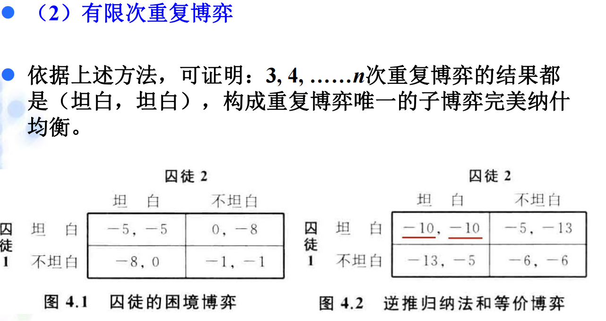

<figcaption><small>即使有潜在利益，但合作期限明确，也不能达成合作。</small></figcaption></figure>

3. 综上得到一个定理：设原博弈G有唯一的纯策略纳什均衡，则对有限次重复博弈G(T)（T为任意正整数），博弈方每个阶段都采用G的纯策略纳什均衡，是G(T)的唯一子博弈完美纳什均衡。

<em>2.3 多个纯策略纳什均衡博弈:</em>

<em>2.3.1 **有限次重复博弈民间定理**</em>：
设原博弈的一次性博弈有“均衡得益数组”优于“最差均衡得益数组”，那么在该博弈的多次重复中，对所有不小于“个体理性得益” 的“可实现得益”，都至少有一个子博弈完美纳什均衡的极限的平均得益来实现它们。
<figure class="center">

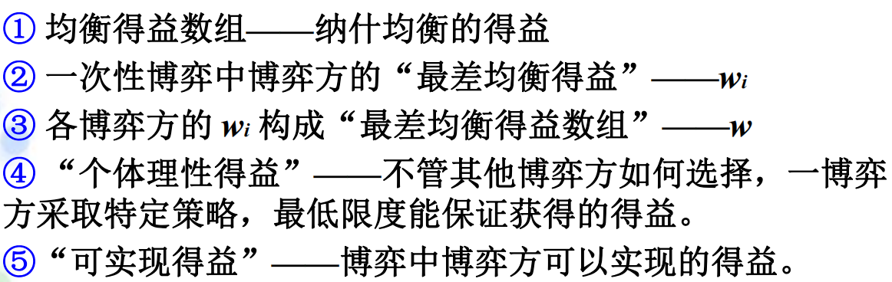

<figcaption><small>直观来讲，对于多纯策略，如果有潜在利益，那就有合作的办法。</small></figcaption></figure>

*2.3.2 **触发策略**：*
* 定义：博弈双方先试探合作，一旦发觉对方不合作，就选择不合作进行**惩罚**，这种策略组合称为“触发策略”。
* 意义：这是重复博弈中实现合作和提高博弈效率的关键机制，也是博弈分析分析的核心。

<em>2.3.3 *三价博弈例子：</em>
触发策略是否可行，要看具体的得益情况。三价博弈中含有两个纯策略纳什均衡(M,M)和(L,L)。
<figure class="center">

  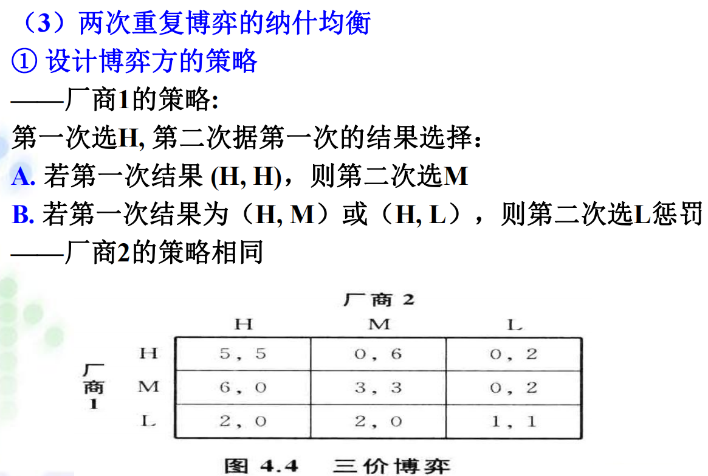

<figcaption><small>利用逆推归纳法，发现这样的决策第二阶段落于子博弈的均衡，同时第一阶段由于双方的触发策略都独自偏移会导致收益下降。</small></figcaption></figure>

更直观地判断可信性的方法是构造等价博弈：
<figure class="center">

  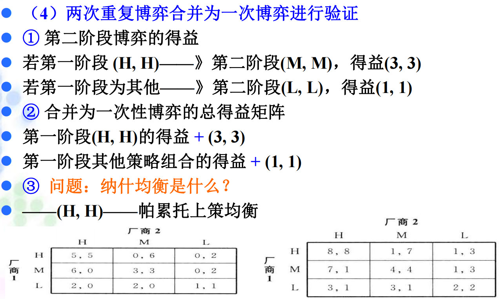

<figcaption><small>如果等价博弈的帕累托上策均衡就是所欲求的，则触发策略有效可信。这种思想易推广至更多次重复的情况。</small></figcaption></figure>

可见，触发策略的可信度来源于惩罚的力度和报复的决心。三价博弈中，若第二阶段不加以区分地为了自身最大利益选择M，那么等价博弈就只是原博弈的平移，不会改变平衡分布。当然，如果机制公平，那么触发策略是极度可信的：<figure class="center">

  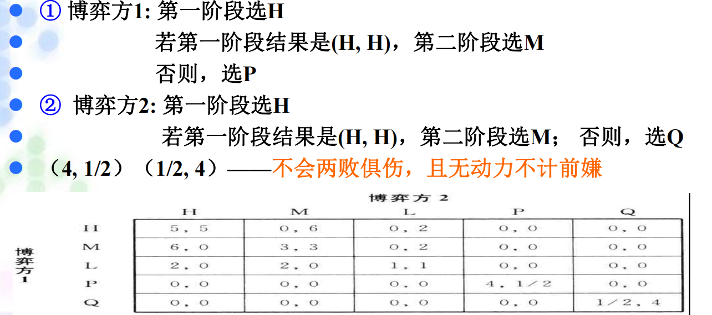

<figcaption><small>选择报复让对方损失巨大，自己的损失极小，这是较理想的状态。</small></figcaption>
</figure>

<em>2.3.4 *两市场博弈例子</em>： 
<figure class="center">

  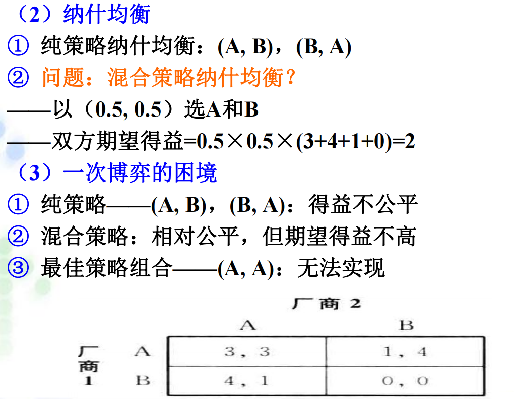

<figcaption><small>混合策略代表斗争，其期望是0.25X(3+4+1+0)=2是最低的。</small></figcaption></figure>

单单两次博弈也是无法实现第一阶段达到(3,3)收益的，因为两个纯策略纳什均衡收益不对等，第一阶段两方都有偏离的意愿。较为理想的是交替奖励对方，即决策先(A,B)后(B，A)或反之，平均得益为2.5，高于混合策略得益。这种策略叫**轮换策略**。当重复次数大于等于三时，就可以使用触发策略，这与2.3.3中的讨论同理。不同的是最后两个博弈方会选择轮换策略来使整个博弈成为子博弈完美纳什均衡。显然，当重复次数足够多，(A,A)决策组合的出现次数会占绝对主导，双方总的平均得益会趋近(3,3)，这验证了**有限次重复博弈民间定理**

  <h2 style="margin-bottom: 1px; padding: 0;
             -webkit-print-color-adjust: exact; print-color-adjust: exact;">
    3. 无限次重复博弈
  </h2>
  

<em>3.1 双博弈方的零和博弈：</em>
结论依旧显然，利益严格对立的博弈，不会有任何合作，这与有限次的重复的结果没有区别，可以下结论：原博弈是包括零和博弈等的没有纯策略纳什均衡的博弈，双方不会合作，会一直简单重复原博弈的**混合策略纳什均衡**。

<em>3.2 **无限次重复博弈民间定理**</em>：
设G是一个有n个博弈方的完全信息静态博弈。用 $\mathrm{(e_1, …, e_n)}$ 表示G的纳什均衡的得益，用 $\mathrm{(x_1,…, x_n)}$表示G的任意可实现得益。如果$\mathrm{x_i > e_i}$对任意博弈方i都成立，且当贴现系数$\delta$足够接近1，那么无限次重复博弈$\mathrm{G(\infty, \delta)}$ 中一定存在一个子博弈完美纳什均衡，使各博弈方的平均得益可达到$\mathrm{(x_1,…, x_n)}$。

<em>*3.3 无限次重复竞价博弈例子：</em>
显然如果唯一纯策略纳什均衡是帕累托最优上策均衡，那么直接重复该决策即可。
对于唯一纳什均衡非最优的情况，是分析的重点。对于无限次重复分析，必须引入时间的重要性权重，即贴现系数$\delta$来计算得益。考虑竞价博弈：<figure class="center">

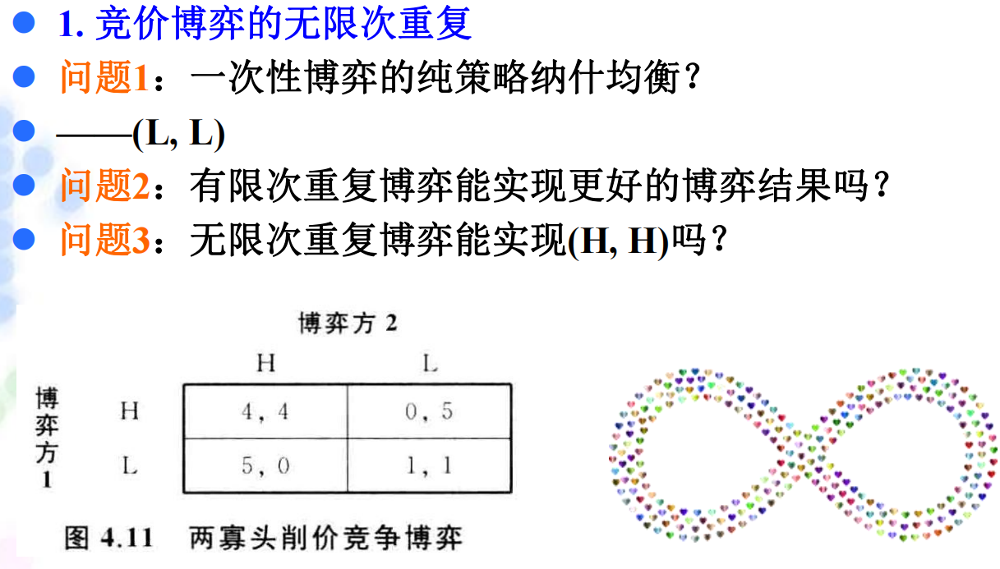

<figcaption><small>有限次重复当然不能合作。无限次可能有点小差异。</small></figcaption></figure>

一般博弈方为了获得最优，也会使用**触发策略**。<figure class="center">

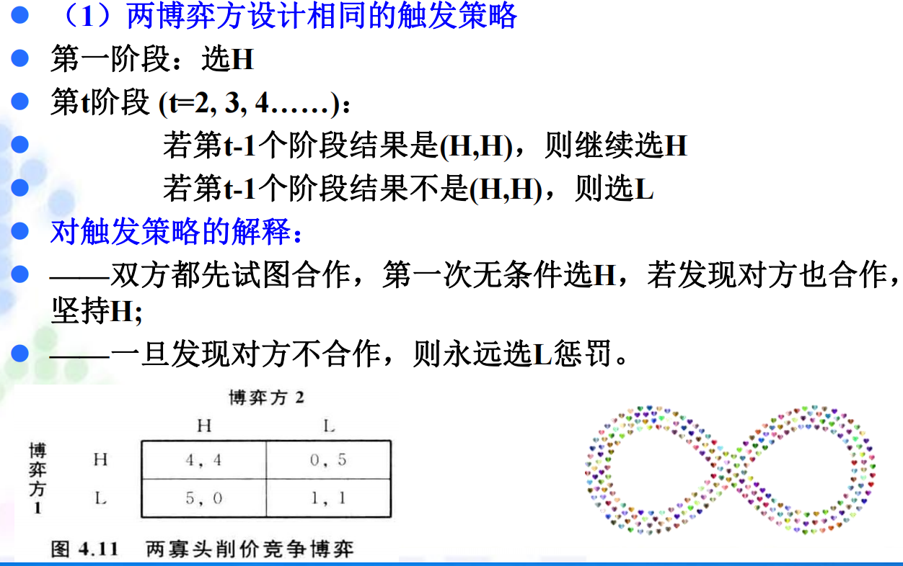

<figcaption><small>与之前不同的是，现在必须引入贴现系数来计算得益。</small></figcaption></figure>

让我们令$\mathrm{t=1}$不失一般性。若博弈方2第一阶段选L，双方得益(0, 5)引起博弈方1一直选L惩罚，博弈方2总得益现值：
$$
\pi_a=5+\sum_{i=1}^{\infty}1\cdot\delta^i=4+\frac{1}{1-\delta}$$ 若博弈方2第一阶段选H，双方得益(4, 4)下一阶段面临同样选择，充分考虑同一性，博弈方2总得益现值：
$$
\pi_b=4+\delta\cdot\pi_b
$$容易比较得出结论：当$\delta\geq 1/4$，上述触发策略组合构成竞价博弈的无限次重复博弈的子博弈完美纳什均衡。这启示我们，当贴现系数越大($\longrightarrow$1)，就是对未来的利益越重视，博弈方越趋向于达成长期的合作，这就是**无限次重复博弈民间定理**的精神。

<em>*3.4 无线次重复古诺博弈例子：</em>
根据对古诺博弈的了解，纳什均衡是双方生产$(2,2)$，得益是$(4,4)$。最佳单方垄断产量是3，而双方联合垄断生产$(1.5,1.5)$，得益是$(4.5,4.5)$。如果不合作单方面偏离的生产$2.25$，得益变为$5.0625 \gt 4.5$ 。由此制定触发策略：<figure class="center">

  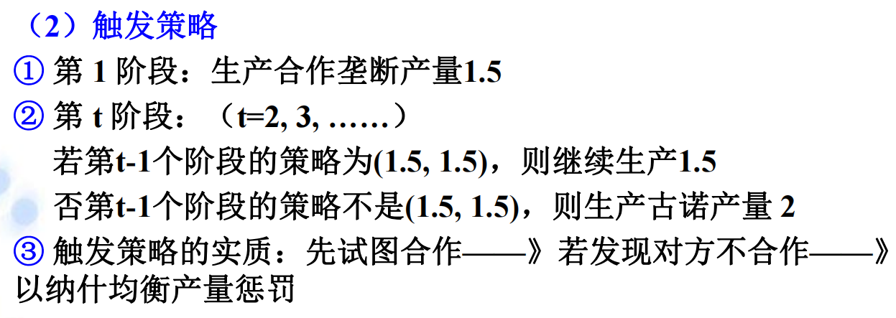

<figcaption><small></small></figcaption></figure><figure class="center">

  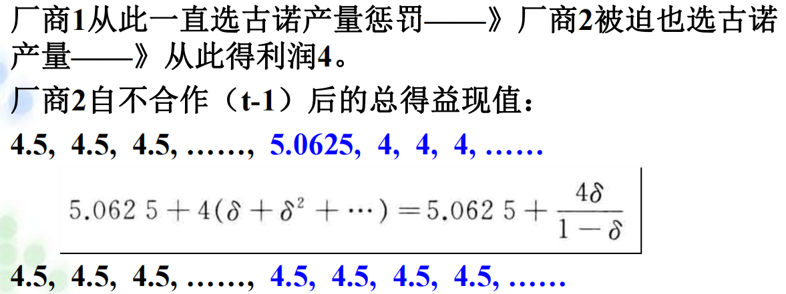

<figcaption><small></small></figcaption></figure>

简单比较得到$\delta\geq 9/17$，则触发策略是子博弈完美纳什均衡。反之，合作水平会变低，进一步可以讨论：
<figure class="center">

  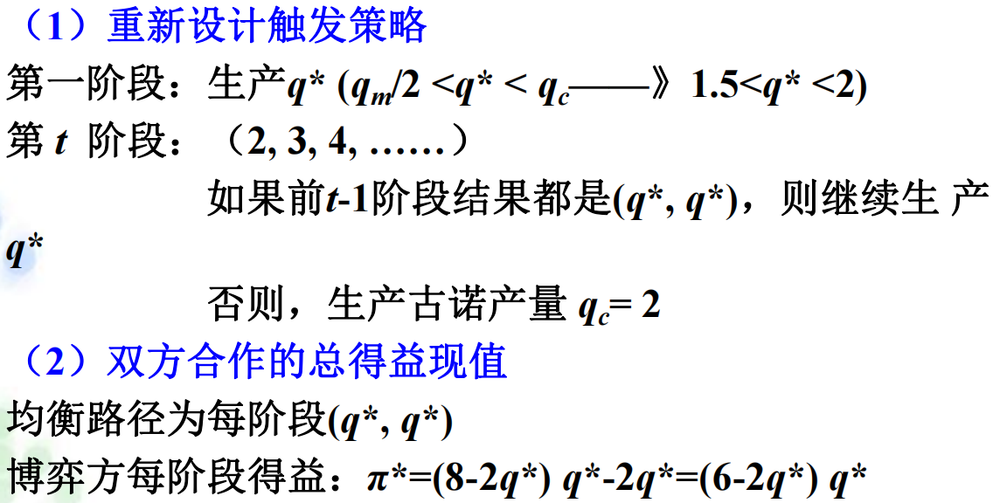

<figcaption><small>即维持在较低一些的合作水平联合生产q*。</small></figcaption></figure>

不难发现单方面偏离的最佳产量是$(6-q^*)/2$,得益是$(6-q^*)^2 /4$ 。同理可以计算偏离和不偏离的得益，进行比较：$$(6-2q^*)q^{ *}/(1-\delta)\geq (6-q^{ *})/4 +\frac{4}{1-\delta}$$得到弱合作的触发策略是子博弈完美纳什均衡的条件：$$q^* \geq \frac{2(9-5\delta)}{9-\delta}
$$

<em>*3.4 无限次重复有效工资博弈例子</em>：
这个例子探讨了资本家发死工资如何避免无产阶级偷懒(其劳动有不确定性且不可监督)，即发**有效工资**：既能降低厂商的劳动力成本，也能激励员工努力工作的工资。用类似3.3中的方法讨论各种具体条件即可。

  <h2 style="margin-bottom: 1px; padding: 0;
             -webkit-print-color-adjust: exact; print-color-adjust: exact;">
    4. 章节重要简答题汇总
  </h2>
  

*由于篇幅，暂时隐去思考练习题八，补充练习题二、六*

*4.1 思考练习题三*：

<figure class="center">

  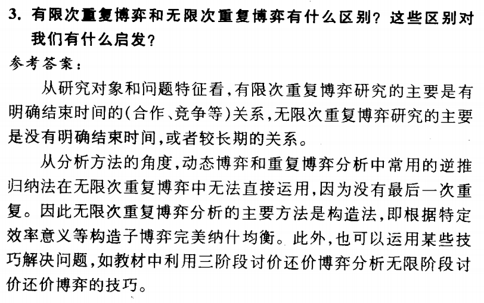

<figcaption><small></small></figcaption></figure>

<figure class="center">

  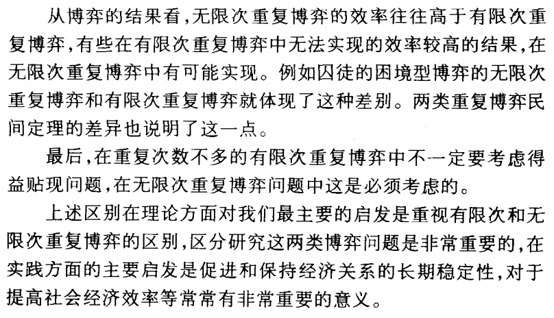

<figcaption><small></small></figcaption></figure>

*4.2 课后思考题七*：

<figure class="center">

  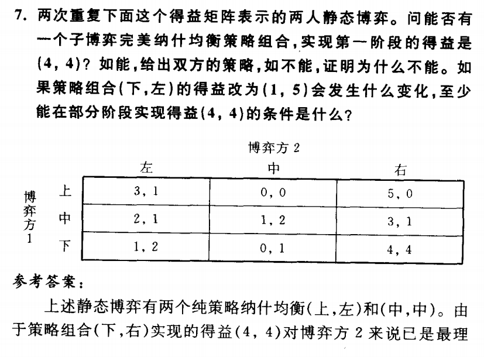

<figcaption><small></small></figcaption></figure>

<figure class="center">

  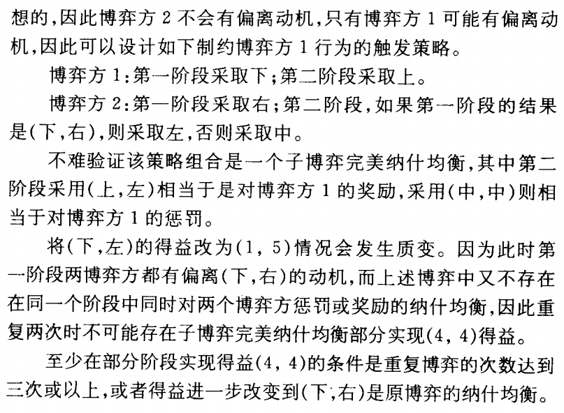

<figcaption><small></small></figcaption></figure>

*4.3 补充练习题十二*：
<figure class="center">

  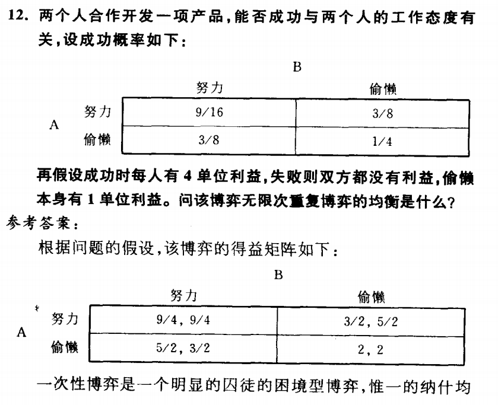

<figcaption><small></small></figcaption></figure>

<figure class="center">

  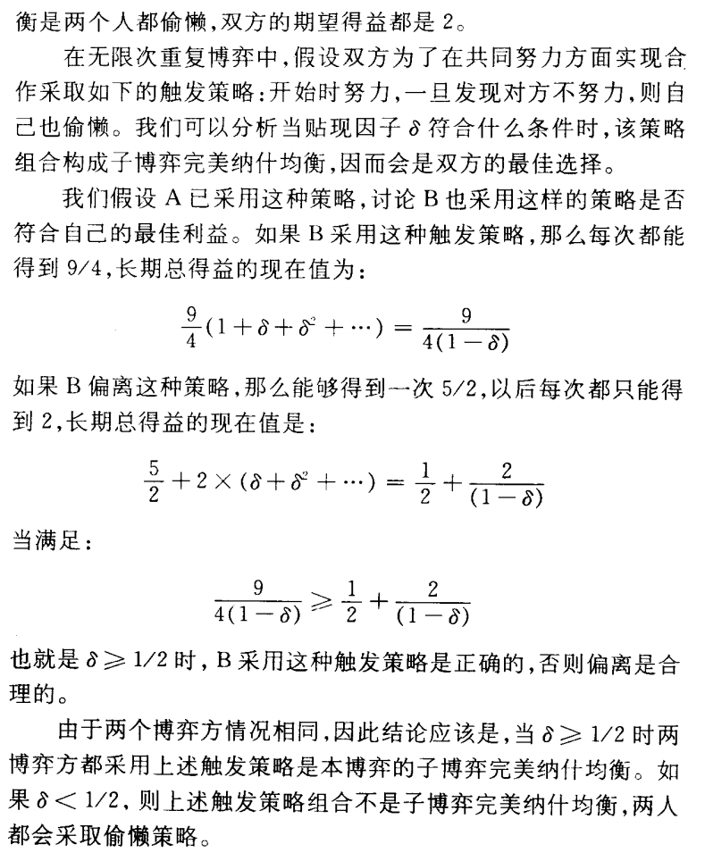

<figcaption><small></small></figcaption></figure>