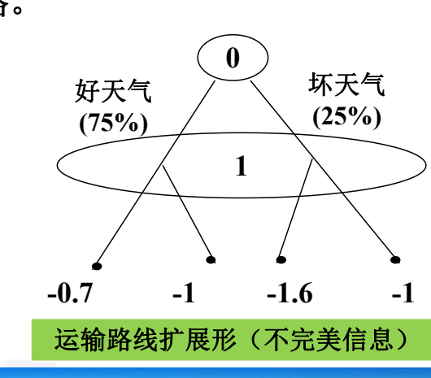
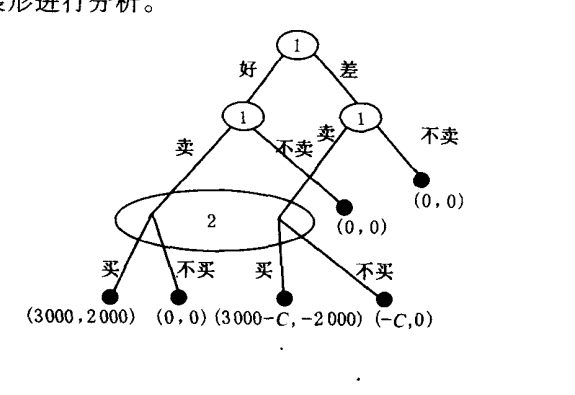
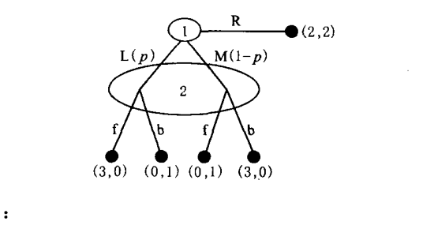
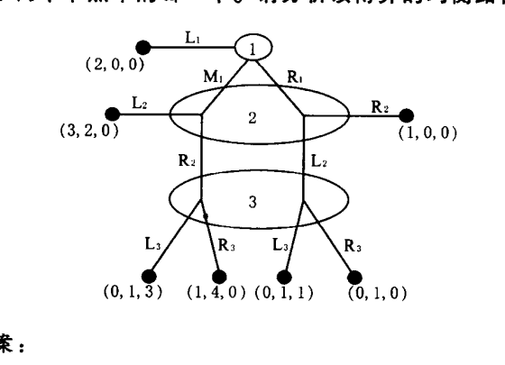

# 第五章 完全但不完美信息动态博弈知识详解

## 一、学习主线

第五章的中心问题是：**动态博弈中，行动有先后，但后行动者未必知道前面到底发生了什么**。这类问题称为**“完全但不完美信息动态博弈”**，本章的核心均衡概念是**完美贝叶斯均衡**。

核心为：如果一个信息集包含多个节点，后行动者将无法直接知道自己在哪个节点上行动，因此必须给出他对各节点的概率判断，并要求这种判断与策略相互一致。

## 二、基本概念辨析

### 1. 完全但不完美信息动态博弈（此为重点）
各博弈方对策略、得益等情况有**完全信息**，但对博弈进程没有**完美信息**的动态博弈。

这里要分清两层信息：

- **“完全信息”**说的是得益、策略空间、博弈结构等规则信息是清楚的。（关于博弈固有的条件是完全清楚的）——静态博弈和动态博弈都会出现
- **“不完美信息”**说的是行动历史**不完全**可观察，轮到某个博弈方行动时，他可能不知道前面某个博弈方究竟选了哪条路径。（用共节点表示）——仅仅存在于动态博弈中

所以它不是“不知道别人偏好或成本”的问题，而是**“不知道已经走到哪个节点”**的问题。

完全但不完美信息博弈的扩展形表示中采取**共节点**的形式进行表示。



此外，要注意的是，通过共节点的博弈**不能被称为子博弈**。

完全但不完美信息博弈的典型博弈为**二手车交易博弈**：买方看到车进入市场，但不能直接知道车是好车还是差车，这就是典型的不完美信息。

### 2. 判断（此为重点）

**判断**是本章最容易被忽略但最关键的概念。判断可以解释为：在**多节点信息集**处，行动者对博弈到达该信息集中各节点的**概率分布**。

例如买方面对“有车出售”这一信息集时，必须判断：

- `p(g|s)`：看到出售时车是好车的概率；
- `p(b|s)`：看到出售时车是差车的概率。

买方是否购买，不是直接由真实车况决定，而是由这些判断下的期望得益决定。因此完美贝叶斯均衡必须同时写出**“策略”和“判断”**。

### 3. 完美贝叶斯均衡（此为重点）

**完美贝叶斯均衡由策略组合和判断共同构成**。有以下四项要求：

1. **概率判断**：在各信息集处，行动者必须对信息集中每个节点的到达概率有判断。
2. **序列理性**：给定判断，每个博弈方在每个行动处都要选择能实现最大得益的行动。
3. **均衡路径上的判断符合均衡策略**：均衡路径上，判断由贝叶斯法则和均衡策略推出。
4. **非均衡路径上的判断符合均衡策略**：不在均衡路径上的多节点信息集处，判断也应尽量与贝叶斯法则和可能的均衡策略相符。

考试或作业中判断一个策略组合是否为完美贝叶斯均衡时，不能只验证“没人愿意偏离”。而应当按四步检查（可以以补充题9为例）：

- 是否写出每个相关信息集上的**概率判断**；
- 给定这些判断，各方选择是否**最优**；
- 在**均衡路径**上，判断是否能由策略推出；
- 在**非均衡路径**上，判断是否与策略和贝叶斯一致性要求冲突。

### 4. 市场均衡类型（往年资料部分）

课本章末还列出二手车模型中的市场均衡类型：

- **市场完全成功**：好商品进入市场，差商品不进入市场，买方愿意买，实现最大贸易利益。
- **市场完全失败**：存在潜在交易利益，但所有卖方都担心卖不出去而不卖，市场不能运作。
- **市场部分成功**：好差商品都进入市场，买方也都买。
- **市场接近失败**：好商品进入市场，部分差商品进入市场，买方以一定概率购买。
- **合并均衡**：不同类型卖方采用相同策略，买方难以从行动区分类型。
- **分开均衡**：不同类型卖方采用不同策略，行动本身传递类型信息。

这些概念都服务于同一条主线：不完美信息会影响买方判断，判断又影响交易是否发生。

### 5. 章末其他概念速辨（为了完整性）

**单一价格二手车交易模型**：市场只有一个统一价格。卖方按车况和伪装成本决定是否卖，买方根据“看到有车出售”形成对好车、差车的判断，并据此决定是否买。课本用它说明合并均衡、市场部分成功、完全成功、完全失败和接近失败等类型。

**双价二手车交易模型**：市场有高价、低价两种报价。卖方报价本身可能传递车况信息，买方需要分别形成 `p(g|h)、p(b|h)、p(g|l)、p(b|l)` 等判断。课本用它说明分开均衡：好车卖方要高价，差车卖方要低价，买方据此购买。

**有退款保证的二手车交易模型**：卖方可以通过退款保证一类承诺影响买方判断。其重点不在承诺本身，而在承诺是否足够可信、是否足够昂贵，从而能否把好车卖方与差车卖方区分开。

**伪装成本**：差车卖方把差车伪装成好车或进入市场时需要付出的成本。伪装成本越高，差车越不愿伪装出售，市场越可能从合并均衡转向分开均衡或完全成功型均衡。

**昂贵的承诺**：只有高质量类型愿意承担、低质量类型不愿承担的承诺。它能发挥信号作用，使买方从卖方行动中推断类型。

**逆向选择**：由于买方无法识别商品质量，低质量商品可能挤出高质量商品，导致潜在交易利益无法实现。课本二手车模型正是用来说明这种不完美信息下的市场效率损失。

## 三、补充题6详解

### 题目要点

一价二手车模型中：

- `V=5000`：好车对买方的价值；
- `W=1000`：差车对买方的价值；
- `P=3000`：成交价格；
- 差车概率为 `0.6`，好车概率为 `0.4`；
- 政府可控制伪装成本 `C`；
- 政府每提高一单位 `C` 自身付出 `0.5` 单位成本；
- 政府效用为买方交易利益减去政府成本。

### 解题思路



关键在于比较**差车卖方是否愿意伪装出售**。

若 `C<3000`，差车卖方出售的净收益为：

```text
P-C > 0
```

所以差车仍愿意进入市场。若好车、差车都卖，买方购买的期望得益为：

```text
0.4*(5000-3000)+0.6*(1000-3000)
= 0.4*2000 + 0.6*(-2000)
= -400
```

买方期望得益为负，因此**不会买**。此时市场失败或接近失败，政府提高 `C` 但未能改变交易结构，效用非正。

若 `C>3000`，差车卖方出售的净收益为：

```text
P-C < 0
```

差车不再出售。市场上只剩好车，买方看到出售时判断 `p(g|s)=1`，购买得益为：

```text
V-P = 5000-3000 = 2000 > 0
```

此时构成**市场完全成功型的完美贝叶斯均衡**：**好车卖方卖，差车卖方不卖，买方买**。

### 结论

政府应把**伪装成本提高到 `3000` 以上**。这样差车退出市场，好车进入市场，买方购买，形成市场完全成功型完美贝叶斯均衡。若取 `C=3001`，政府成本约为 `0.5C=1500.5`，买方利益为 `2000`，政府净效用仍为正。


## 四、补充题9详解

### 题目要点



博弈方1先选 `L、M、R`。若选 `R`，直接得到 `(2,2)`；若选 `L` 或 `M`，博弈方2在同一个信息集上选 `f` 或 `b`。博弈方2判断博弈方1选 `L` 的概率为 `p`，选 `M` 的概率为 `1-p`。

### 首先，没有纯策略完美贝叶斯均衡

若博弈方2确定选 `f`，博弈方1在 `L` 与 `M` 中会偏向能给自己较高得益的行动；但博弈方2据此更新判断后，`f` 又不是自己的最优选择。

若博弈方2确定选 `b`，同理博弈方1会选择另一条使自己得益更高的路径，而博弈方2在相应判断下又会改选 `f`。

所以任何纯策略组合都无法同时满足：

- 博弈方1的最优反应；
- 博弈方2在信息集上的序列理性；
- 判断与策略的一致性。

这就是**“无纯策略完美贝叶斯均衡”**的原因。

### 混合策略分析

设博弈方2以概率 `q` 选 `f`，以概率 `1-q` 选 `b`。由题图得：

```text
博弈方1选 L 的期望得益 = 3q
博弈方1选 M 的期望得益 = 3(1-q)
博弈方1选 R 的得益 = 2
```

若要让博弈方1在 `L` 与 `M` 之间混合，需要：

```text
3q = 3(1-q)
q = 1/2
```

但此时 `L` 和 `M` 给博弈方1的期望得益都是 `1.5`，小于选 `R` 的得益 `2`。因此**均衡路径上博弈方1应选择 `R`**。

在**非均衡路径**上，若博弈方1没有选 `R`，博弈方2的信息集被到达。为了使博弈方2在 `f` 与 `b` 之间混合，需要其对 `L` 与 `M` 的判断为：

```text
p = 1/2, 1-p = 1/2
```

### 结论

该博弈的**完美贝叶斯均衡**为：

- 博弈方1选择 `R`；
- 若博弈方2的信息集被到达，判断博弈方1选 `L` 和 `M` 的概率各为 `1/2`；
- 博弈方2在 `f` 和 `b` 间以各 `1/2` 的概率混合。

这体现了PBE中非均衡路径判断的重要性：虽然信息集在均衡路径上不会到达，但仍需给出能支持序列理性的判断。

## 五、补充题10详解

### 题目要点



三人三阶段博弈：

- 第一阶段博弈方1选 `L1、M1、R1`；
- 若选 `L1`，直接得到 `(2,0,0)`；
- 若选 `M1` 或 `R1`，博弈方2在不知道博弈方1确切选择的信息集上选 `L2、R2`；
- 若博弈继续到第三阶段，博弈方3在 `L3、R3` 中选择，且也不能区分具体节点。

### 逆推分析

尽管这个博弈信息并不完美，我们仍可以先尝试一下**逆推**。

先看第三阶段。题解指出，博弈方3的唯一理性选择是 `L3`，因为在第三阶段两个可能节点中，`L3` 相对于 `R3` 都给博弈方3更高得益。

再看第二阶段。博弈方2知道若进入第三阶段，博弈方3会选 `L3`。据此比较 `L2` 与 `R2`：

- 在博弈方1选 `M1` 的情况下，`L2` 给博弈方2的得益高于走向第三阶段后可得到的得益；
- 在博弈方1选 `R1` 的情况下，`L2` 也优于 `R2`。

因此博弈方2的唯一合理选择是 `L2`。

最后回到第一阶段。博弈方1预见到博弈方2会选 `L2`，因此比较：

- 选 `L1` 得益为 `2`；
- 选 `M1` 后博弈方2选 `L2`，博弈方1得益为 `3`；
- 选 `R1` 后继续推得的得益低于 `M1`。

所以博弈方1选择 `M1`。

### 结论

该博弈的**均衡路径**为：

```text
M1 -> L2
```

完整表述为：

- 博弈方1第一阶段选 `M1`；
- 博弈方2第二阶段判断博弈方1选择 `M1` 的概率为 `1`，并选 `L2`；
- 若到达第三阶段，博弈方3判断相应节点概率支持其选择 `L3`，并选 `L3`。

这题的重点不在复杂计算，而在说明：即使是不完美信息动态博弈，有时各阶段都有严格优势选择，也可以用类似逆推归纳的思路得到**纯策略完美贝叶斯均衡**。

但要注意：这种情况较幸运，多数不完美信息博弈不能只靠简单逆推解决。

## 六、复习提示

本章做题时建议固定使用以下顺序：

1. 找信息集：谁不知道什么？
2. 写判断：信息集中各节点概率是多少？
3. 算期望得益：给定判断，各方行动是否最优？
4. 检查一致性：均衡路径上能否用贝叶斯法则推出判断？非均衡路径判断是否与策略矛盾？
5. 给出均衡：必须同时写策略和判断。
