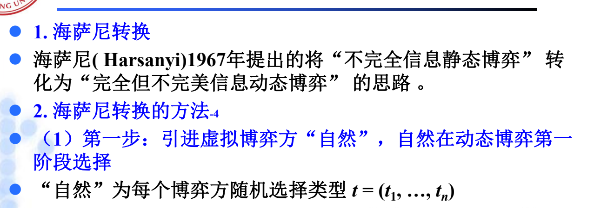
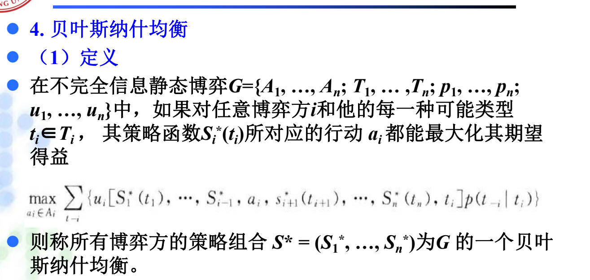
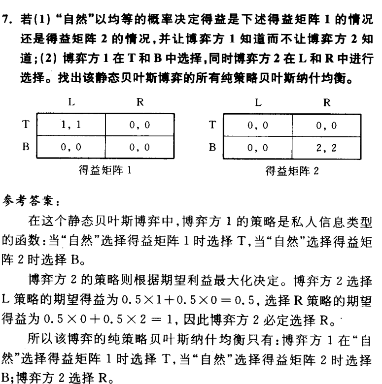
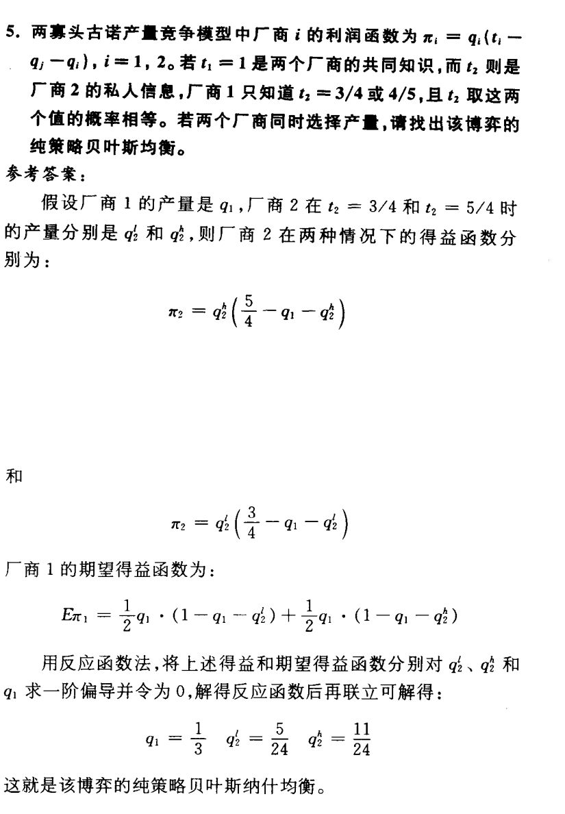

# 第六章 不完全信息静态博弈知识详解

## 一、学习主线

第六章的中心问题是：**静态博弈中，博弈方同时行动，但至少有人不知道其他博弈方的某些得益、成本、估价或需求参数**。课本把这类问题称为**“不完全信息静态博弈”**，PPT进一步用**“类型”**和**“海萨尼转换”**把它变成可分析的模型。

第五章处理的是**“动态过程中看不清历史”**，第六章处理的是**“静态选择前不知道对方类型”**。这一区别很重要。

## 二、基本概念辨析

### 1. 不完全信息博弈（此为重点）

至少一个博弈方不完全清楚其他博弈方的得益情况或相关私人信息的博弈。

注意它与“不完美信息”的区别：

- **不完全信息**：不知道对方类型、成本、估价、需求参数等影响得益的信息。
- **不完美信息**：不知道此前博弈路径或节点。

第六章中的**古诺模型、暗标拍卖、双方报价拍卖**，都是围绕**“私人类型”**展开的。

### 2. 不完全信息静态博弈（此为重点）

在静态博弈中，至少有一个博弈方不完全清楚其他某些博弈方的策略或得益等信息，但知道其策略或得益等信息空间的概率分布。

这里的**“静态”**表示行动同时发生，或者可看作同时发生；**“不完全信息”**表示行动前对他人类型只有概率判断。

### 3. 类型和类型空间（此为重点）

**类型**是博弈方的私人信息特征。课本和PPT中常见的类型包括：

- 古诺模型中的成本或市场需求参数；
- 拍卖中的估价；
- 二手车交易中的商品质量。

记号上：

- `Ti`：博弈方 `i` 的**类型空间**；
- `ti`：博弈方 `i` 的一个**具体类型**；
- `t-i`：除 `i` 以外其他博弈方的**类型组合**；
- `pi(t-i|ti)`：博弈方 `i` 在自己类型为 `ti` 时，对其他博弈方类型的**条件概率判断**。

不完全信息静态博弈的一般表示为：

```text
G={A1,...,An; T1,...,Tn; p1,...,pn; u1,...,un}
```

其中 `Ai` 是**行动空间**，`Ti` 是**类型空间**，`pi` 是**概率判断**，`ui` 是**得益函数**。

### 4. 海萨尼转换（此为重点）

**海萨尼转换**是把不完全信息静态博弈转化为**完全但不完美信息动态博弈**的思路。PPT给出的步骤是：

1. 引入虚拟博弈方**“自然”**；
2. **“自然”**为实际博弈方选择类型；
3. 每个博弈方**知道自己的类型**，但不知道其他博弈方的具体类型，只知道概率分布；
4. 实际博弈方**同时选择行动**；
5. 得益由**行动和类型**共同决定。

转换后的博弈是**“完全但不完美信息”**的：规则和概率分布是公共知识，但别人实际类型不可观察。



### 5. 贝叶斯纳什均衡（此为重点）

PPT强调，不完全信息静态博弈中的策略不是单一行动，而是**“针对自己各种可能类型如何选择行动的完整方案”**。也就是说，策略是**从类型到行动的函数**。

贝叶斯纳什均衡要求：对任意博弈方 `i` 和他的每一种可能类型 `ti`，给定其他博弈方的策略以及自己对其他类型的概率判断，自己的策略都能**最大化期望得益**。



简化理解：

```text
一种类型对应一种行动。
```

这也是本章计算题的主线：**先写各类型策略，再写期望得益或反应函数，最后联立求解**。

### 6. 章末其他概念速辨（为了完整性）

**暗标拍卖**：投标者密封递交标书，统一时间开标，通常最高报价者中标。课本把它作为不完全信息静态博弈的例子，因为每个投标者不知道其他投标者的估价，只能基于估价分布选择报价。

**不完全信息的古诺模型**：厂商同时选择产量，但至少一方不知道对方成本或市场需求参数，只知道可能类型及概率分布。求解时要把有私人信息一方的策略写成按类型区分的产量函数。

**双方报价拍卖**：买方报买价，卖方报卖价；若买方报价不低于卖方报价则成交，成交价通常由双方报价共同决定。课本用它说明不完全信息下交易效率与策略报价的关系。

**一价均衡**：双方报价拍卖中的一种均衡思路，买卖双方采用同一固定报价规则。它直观但效率较低，因为不同类型信息没有被充分反映到报价中。

**线性策略均衡**：报价或行动是类型的线性函数，如拍卖中报价随估价线性变化。课本指出在线性策略均衡中，策略更能随类型变化，通常比一价均衡有更高效率。

## 三、课后题1详解

### 题目

不完全信息静态博弈中，博弈方的策略有什么特点？为什么？

### 详解

不完全信息静态博弈中，博弈方的策略是**“类型到行动”的完整计划**，而不是只针对实际类型的一个行动。用数学的目光来说，就是可以将策略看作类型到行为的一个函数。

例如某博弈方可能有高成本、低成本两种类型，那么他的策略应写成：

```text
高成本时选什么；
低成本时选什么。
```

原因在于：虽然博弈方自己知道真实类型，但其他博弈方不知道，会把他可能属于各种类型都纳入判断。为了让每个博弈方能形成对他人行动的预期，策略必须覆盖所有可能类型。

所以本题的关键词是：

- 策略是**完整方案**；
- 策略是**类型空间到行动空间的函数**；
- **每一种可能类型**都要指定行动。

## 四、课后题2详解

### 题目

贝叶斯纳什均衡与完美贝叶斯均衡是什么关系？不完全信息静态博弈分析中，为什么要引进贝叶斯纳什均衡概念？

### 详解

习题指南给出的关系是：**贝叶斯纳什均衡是完美贝叶斯均衡在静态贝叶斯博弈中的特殊形式**。因此，**贝叶斯纳什均衡一定是完美贝叶斯均衡，但完美贝叶斯均衡不一定是贝叶斯纳什均衡。**

原因来自海萨尼转换：不完全信息静态博弈经过“自然”选择类型后，可以看作一个两阶段的完全但不完美信息动态博弈。在这个转换后的动态博弈中，若策略和判断满足完美贝叶斯均衡要求，在原来的静态贝叶斯博弈中就表现为贝叶斯纳什均衡。

引入贝叶斯纳什均衡的意义是：它把不完全信息静态博弈的分析简化为**“类型条件下的期望得益最大化”**。不必每次都完整画出海萨尼转换后的动态扩展形，而可以直接在类型、概率判断和策略函数上求解。

## 五、课后题3详解：不完全信息古诺模型

### 题目结构

需求函数：

```text
P(Q)=a-Q, Q=q1+q2
```

`a` 有两种可能：

- `a=ah`；
- `a=al`。


厂商1知道真实的 `a`，厂商2只知道：

```text
Pr(a=ah)=θ, Pr(a=al)=1-θ
```

双方成本为：

```text
C1=cq1, C2=cq2
```

### 策略空间

厂商1有私人信息，因此它的策略必须**针对两种类型分别指定产量**：

```text
q1h：当 a=ah 时的产量
q1l：当 a=al 时的产量
```

厂商2不知道真实 `a`，只能选择**一个产量**：

```text
q2
```

因此策略组合可写成：

```text
(q1h, q1l; q2)
```

### 利润函数

厂商1在两种状态下的利润为：

```text
π1h=(ah-q1h-q2)q1h-cq1h
π1l=(al-q1l-q2)q1l-cq1l
```

厂商2的期望利润为：

```text
Eπ2=θ(ah-q1h-q2)q2+(1-θ)(al-q1l-q2)q2-cq2
```

### 一阶条件

分别对 `q1h、q1l、q2` 求最优反应：

```text
ah-q2-2q1h-c=0
al-q2-2q1l-c=0
θ(ah-q1h-2q2)+(1-θ)(al-q1l-2q2)-c=0
```

联立解得：

```text
q2 = [θah+(1-θ)al-c]/3

q1h = [(3-θ)ah-(1-θ)al-2c]/6

q1l = [(2+θ)al-θah-2c]/6
```

### 结论

本博弈的**贝叶斯纳什均衡**是：

```text
当 a=ah 时，厂商1生产上述 q1h；
当 a=al 时，厂商1生产上述 q1l；
厂商2生产上述 q2。
```

这题的核心不是背公式，而是看出厂商1的策略是**“按类型分开的函数”**，厂商2的策略是在**概率判断下最大化期望利润**。

## 六、课后题6详解

### 题目结构

“自然”等概率选择得益矩阵1或矩阵2，博弈方1知道是哪一个矩阵，博弈方2不知道。博弈方1选择 `T` 或 `B`，博弈方2选择 `L` 或 `R`。

矩阵要点：

- 矩阵1中，只有 `(T,L)` 给双方正得益 `(1,1)`；
- 矩阵2中，只有 `(B,R)` 给双方正得益 `(2,2)`。



### 博弈方1的策略

博弈方1知道自然选择了哪个矩阵，因此他的策略要**分别指定**：

```text
矩阵1时选什么；
矩阵2时选什么。
```

显然：

- 若矩阵1发生，为配合 `L`，博弈方1应选 `T`；
- 若矩阵2发生，为配合 `R`，博弈方1应选 `B`。
- 或者说就是单纯的完全上策

### 博弈方2的选择

博弈方2不知道矩阵类型，只能比较 `L` 和 `R` 的**期望得益**。

若博弈方2选 `L`，在博弈方1按上述类型策略行动时：

```text
E(L)=0.5*1+0.5*0=0.5
```

若博弈方2选 `R`：

```text
E(R)=0.5*0+0.5*2=1
```

所以博弈方2选择 `R`。

### 结论

**纯策略贝叶斯纳什均衡**为：

```text
博弈方1：矩阵1时选 T，矩阵2时选 B；
博弈方2：选 R。
```

注意：虽然矩阵1下博弈方2选 `R` 会导致博弈方1得益为0，但博弈方2不能区分矩阵，只能按期望得益行动。
*这么一想是不是还挺简单的*

## 七、补充题5详解

### 题目结构

两寡头古诺产量竞争：

```text
πi=qi(ti-qj-qi), i=1,2
```

其中：

- `t1=1` 是共同知识；
- `t2` 是厂商2私人信息；
- 厂商1只知道 `t2=3/4` 或 `t2=5/4`，且概率相等；
- 两厂商同时选择产量。



### 策略设定

厂商1不知道厂商2类型，只能选择**一个产量**：

```text
q1
```

厂商2知道自己的类型，因此策略要**分类型**：

```text
q2l：t2=3/4 时的产量
q2h：t2=5/4 时的产量
```

### 利润与期望利润

厂商2两种类型下的利润：

```text
π2h=q2h(5/4-q1-q2h)
π2l=q2l(3/4-q1-q2l)
```

厂商1的期望利润：

```text
Eπ1=1/2*q1(1-q1-q2l)+1/2*q1(1-q1-q2h)
```

对 `q1、q2l、q2h` 求反应函数并联立，习题指南给出：

```text
q1 = 1/3
q2l = 5/24
q2h = 11/24
```

### 结论

该博弈的**纯策略贝叶斯纳什均衡**为：

```text
厂商1：生产 1/3；
厂商2：若 t2=3/4，生产 5/24；若 t2=5/4，生产 11/24。
```

这题和课后题3的结构一致：有私人信息的一方策略按类型写，没有私人信息的一方在概率判断下最大化期望利润。

## 八、复习提示

第六章做题时建议固定使用以下模板：

1. 找类型：谁有什么私人信息？
2. 写类型空间：可能类型有哪些，概率是多少？
3. 写策略函数：每个类型对应什么行动？
4. 写期望得益：未知类型用概率加权。
5. 求最优反应：对各类型分别求最优。
6. 联立求均衡：每一种类型都必须最优。