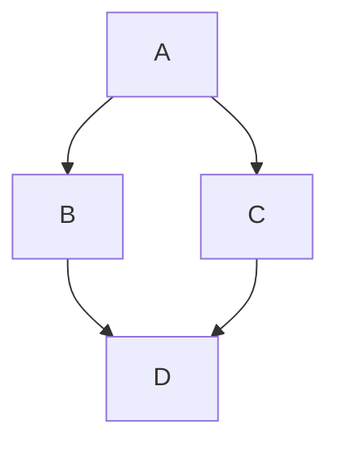
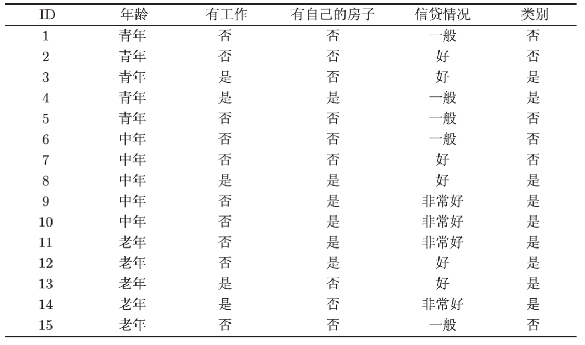
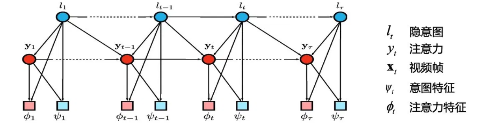
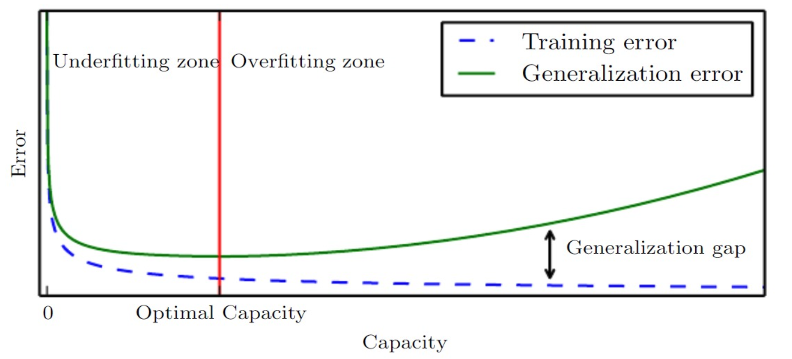
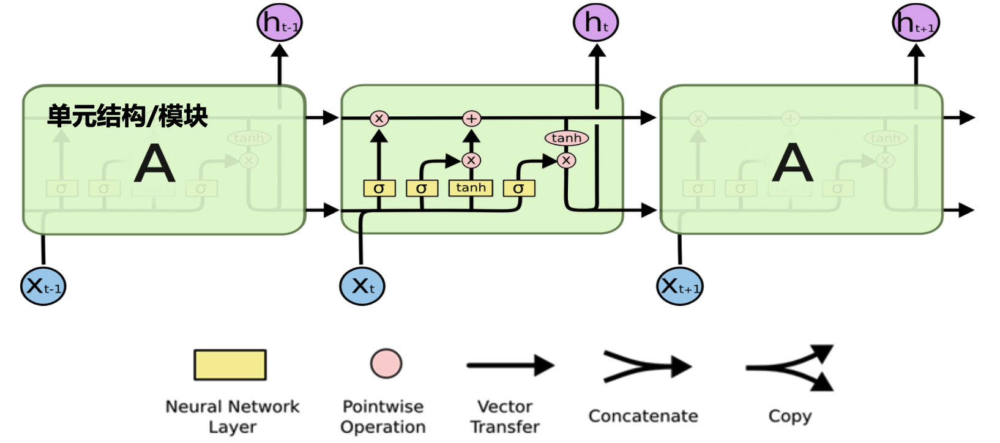
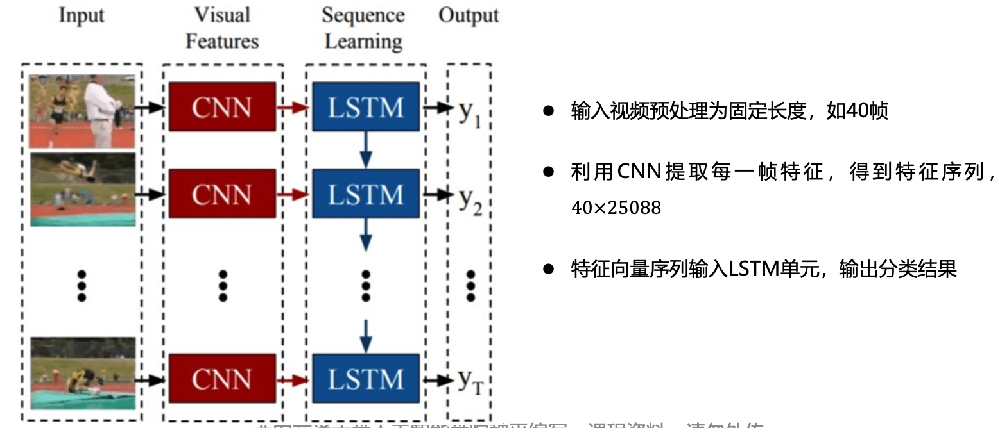
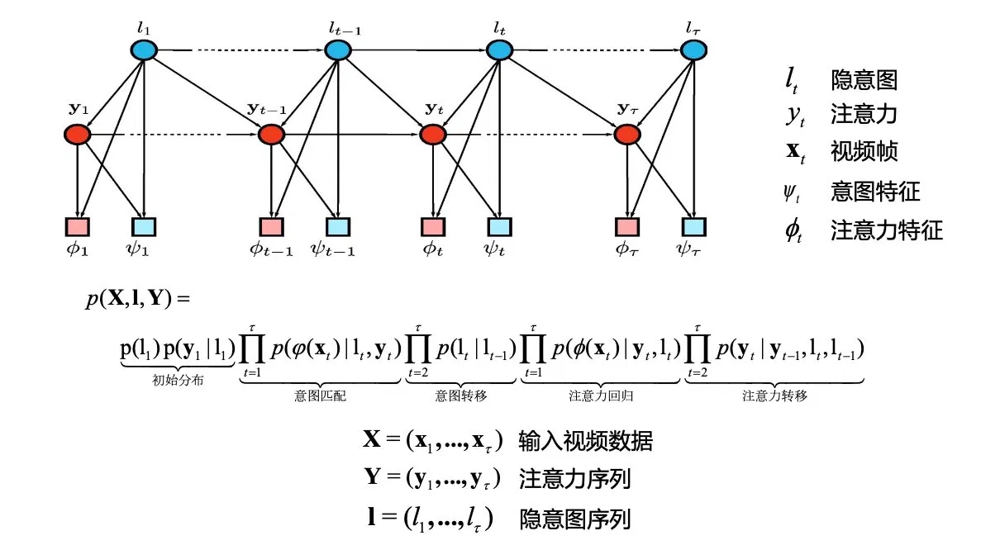
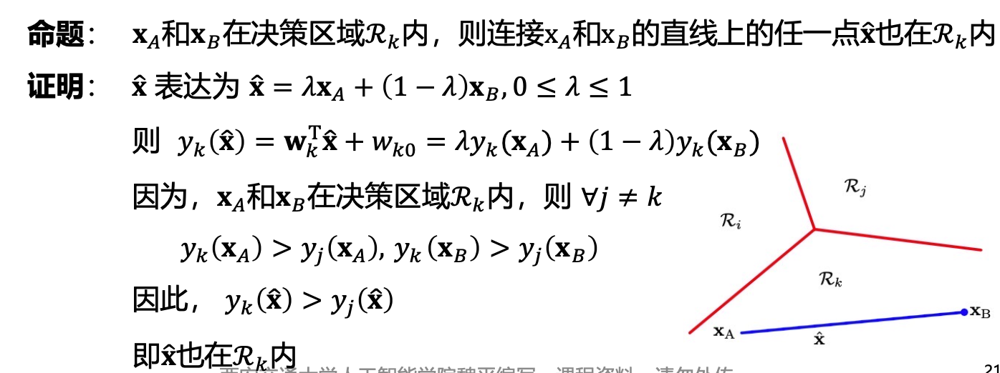
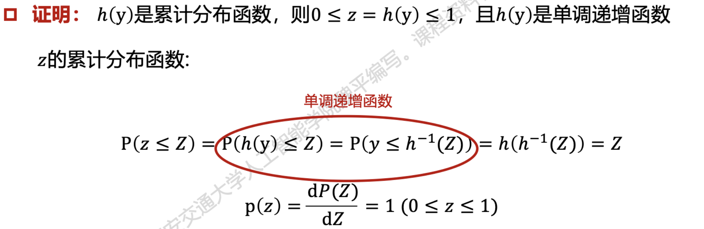

# 《机器学习》自测参考题

*by: 俞逸阳*

> 大部分题目主要依据 2022 年《机器学习》课程期末考试两份回忆版考点与课程 PPT 还原。另外笔者增加了一些并没有出现在回忆版内的题目，目的是尽量覆盖大部分知识点。**因此题目数量与正式考试不一致。题目风格也很可能与考试有较大出入**。
> 
> 题目内容用于复习自测，参考答案见卷末附录（部分题目符号习惯可能与PPT中略有不同），选择选项、计算数值、小题考点等为命题人设定，仅供解题思路参考。

---

## 一、选择题

**1.** 关于人工智能与机器学习的发展历史，下列说法错误的是（　　）

- A. 图灵（Alan Turing）提出了"图灵测试"，被誉为"人工智能之父"，并非冯·诺依曼
- B. 1956 年的达特茅斯会议被认为是人工智能学科的诞生标志
- C. 机器学习是人工智能的一个子领域，强调从数据中自动学习规律
- D. "人工智能"这一术语最早由图灵在达特茅斯会议上正式提出

**2.** 某系统输入一张街景照片中的门牌号图像，输出该门牌对应的阿拉伯数字序列（如 "3 4 7"）。该任务最准确地属于下列哪一类机器学习基本任务？（　　）

- A. 转录
- B. 分类
- C. 回归
- D. 输入缺失分类

**3.** 设二维连续随机变量 $(X, Y)$ 具有概率密度

$$f(x, y) = \begin{cases} 2x, & 0 < x < 1,\ 0 < y < 1, \\ 0, & \text{其他.} \end{cases}$$

记 $Z = \dfrac{X}{Y}$。下列关于 $P(X>Y)$、$Z$ 的概率密度 $f_Z(z)$ 以及 $\mathrm{Cov}(X,Y)$ 的结论中，全部正确的是（　　）

- A. $P(X>Y)=\dfrac{2}{3}$；当 $z\ge 1$ 时 $f_Z(z)=\dfrac{2}{3z^2}$；$\mathrm{Cov}(X,Y)=0$
- B. $P(X>Y)=\dfrac{1}{2}$；当 $z\ge 1$ 时 $f_Z(z)=\dfrac{2}{3}z$；$\mathrm{Cov}(X,Y)=0$
- C. $P(X>Y)=\dfrac{2}{3}$；当 $z\ge 1$ 时 $f_Z(z)=\dfrac{2}{3z^2}$；$\mathrm{Cov}(X,Y)=\dfrac{1}{6}$
- D. $P(X>Y)=\dfrac{1}{3}$；当 $0<z<1$ 时 $f_Z(z)=\dfrac{2}{3z^2}$；$\mathrm{Cov}(X,Y)=0$

**4.** 关于协方差与相关系数，下列说法正确的是（　　）

- A. 若 $\mathrm{Cov}(X, Y) = 0$，则 $X$ 与 $Y$ 一定相互独立
- B. 协方差 $\mathrm{Cov}(X, Y) = \mathbb{E}[XY] - \mathbb{E}[X]\mathbb{E}[Y]$
- C. 相关系数的取值范围是 $[0, 1]$
- D. 方差 $\mathrm{Var}(X)$ 可以取负值

**5.** 已知真实分布 $P = (0.5, 0.5)$，预测分布 $Q = (0.5, 0.5)$，则底数为 2 的情况下交叉熵 $H(P, Q)$ 等于（　　）

- A. $0$
- B. $0.5$
- C. $1$
- D. $2$

**6.** 设某离散随机变量有三个取值，其上两个概率分布为 $P = \left(\tfrac{1}{2}, \tfrac{1}{4}, \tfrac{1}{4}\right)$ 与 $Q = \left(\tfrac{1}{4}, \tfrac{1}{4}, \tfrac{1}{2}\right)$。以 $2$ 为底取对数，则 KL 散度 $D_{\mathrm{KL}}(P\|Q)$ 等于（　　）（单位：bit）

- A. $0$
- B. $0.25$
- C. $0.5$
- D. $0.75$

**7.** 在软间隔 SVM 中引入松弛变量 $\xi_i \ge 0$ 后，原始优化问题的约束条件为（　　）

- A. $y_i(\mathbf{w}^\mathsf{T}\mathbf{x}_i + b) \ge 1+\xi_i$
- B. $y_i(\mathbf{w}^\mathsf{T}\mathbf{x}_i + b) \ge 1 - \xi_i$
- C. $y_i(\mathbf{w}^\mathsf{T}\mathbf{x}_i + b) \le 1 - \xi_i$
- D. $|\mathbf{w}^\mathsf{T}\mathbf{x}_i + b - y_i| \le \xi_i$

**8.** 前馈神经网络通过 $\Phi(\mathbf{x})$ 将原始输入变换到新的特征空间。下列不属于课程中介绍的"构造 $\Phi$ 的三种方式"的是（　　）

- A. 将$x$变换至无限维空间
- B. 手工设计（以人的经验选择特征映射 $\Phi$）
- C. 通过学习得到 $\Phi$（即深度学习的思想，让网络自动学习 $\Phi$ 的参数）
- D. 令 $\Phi(\mathbf{x}) = \mathbf{x}$ 即线性恒等映射

**9.** 下列函数中，不是合法的核函数的是（　　）
（设 $\mathbf{x}, \mathbf{z}$ 为同维向量）

- A. $k(\mathbf{x}, \mathbf{z}) = (\mathbf{x}^\mathsf{T}\mathbf{z} + 1)^2$
- B. $k(\mathbf{x}, \mathbf{z}) = \exp\left(-\dfrac{\|\mathbf{x} - \mathbf{z}\|^2}{2\sigma^2}\right)$
- C. $k(\mathbf{x}, \mathbf{z}) = k_1(\mathbf{x}, \mathbf{z}) + k_2(\mathbf{x}, \mathbf{z})$，其中 $k_1$、$k_2$ 均为合法核
- D. $k(\mathbf{x}, \mathbf{z}) = -\exp(\mathbf{x}^\mathsf{T}\mathbf{z})$

**10.** 给定如下有向图模型：



下列联合概率分解正确的是（　　）

- A. $P(A,B,C,D) = P(A)P(B|A)P(C|A)P(D|B,C)$
- B. $P(A,B,C,D) = P(A)P(B)P(C)P(D)$
- C. $P(A,B,C,D) = P(A)P(B|A)P(C|B)P(D|C)$
- D. $P(A,B,C,D) = P(D)P(B|D)P(C|D)P(A|B,C)$

**11.** 某二分类器在测试集上：$\mathrm{TP}=40$，$\mathrm{FP}=10$，$\mathrm{FN}=40$，$\mathrm{TN}=10$。下列计算正确的是（　　）

- A. 准确率 = 0.5
- B. 精确率 $P = 0.8$
- C. 召回率 $R = 0.5$
- D. 以上 A、B、C 全部正确

**12.** 关于生成式模型与判别式模型、集成学习，下列说法错误的是（　　）

- A. 判别式模型直接建模 $P(y|\mathbf{x})$；生成式模型建模联合分布 $P(\mathbf{x}, y)$ 或 $P(\mathbf{x}|y)P(y)$
- B. Bagging 中各基学习并行训练；Boosting 中各基学习器存在强依赖关系，须串行生成
- C. Boosting 通过每轮调整样本分布、使被错分样本获得更多关注来提升性能
- D. 马尔科夫随机场（MRF）由五个要素决定：位点空间 $S=\{s_1,\dots,s_n\}$（表示变量的取值空间，如类别、几何属性）、相空间 $\Lambda=\{\lambda_1,\dots,\lambda_m\}$（表示位点的集合，如时间、空间坐标）、邻域系统 $N=\{N_i\}$、局部特性 $\{p^{(i)}\}_{i\in S}$、概率表达 $p(\mathbf{x})$

**13.** 在最大间隔分类器中，二分类器为 $y(\mathbf{x})=\mathbf{w}^\mathsf{T}\boldsymbol{\phi}(\mathbf{x})+b$，类别标签 $t_n\in\{+1,-1\}$。则样本点 $\mathbf{x}_n$ 到决策平面 $y(\mathbf{x})=0$ 的间隔表达式为（　　）

- A. $\dfrac{t_n\big(\mathbf{w}^\mathsf{T}\boldsymbol{\phi}(\mathbf{x}_n)+b\big)}{\|\mathbf{w}\|}$
- B. $t_n\big(\mathbf{w}^\mathsf{T}\boldsymbol{\phi}(\mathbf{x}_n)+b\big)$
- C. $\dfrac{\mathbf{w}^\mathsf{T}\boldsymbol{\phi}(\mathbf{x}_n)+b}{\|\mathbf{w}\|^2}$
- D. $\dfrac{\|\mathbf{w}\|}{t_n\big(\mathbf{w}^\mathsf{T}\boldsymbol{\phi}(\mathbf{x}_n)+b\big)}$

**14.** 关于 K 均值聚类、密度聚类（DBSCAN）与层次聚类（AGNES），下列说法错误的是（　　）

- A. K 均值以最小化簇内平方误差 $E=\sum_{i=1}^{k}\sum_{\mathbf{x}\in C_i}\|\mathbf{x}-\boldsymbol{\mu}_i\|_2^2$ 为目标，需预先指定簇数 $k$。
- B. 密度聚类（DBSCAN）基于样本分布的紧密程度、扩展聚类簇，能发现任意形状的簇、可在聚类的同时识别异常点，且无需预先指定簇数
- C. 层次聚类是采用"自底向上"聚合策略的层次聚类算法：初始时每个样本各成一簇，每步合并距离最近的两个簇，直至达到预设簇数
- D. K 均值能直接发现"同心圆""双月牙"等非凸形状的簇，而密度聚类只适用于凸形数据集

**15.** 某二分类器：$\mathrm{TP}=30$，$\mathrm{FP}=30$，$\mathrm{FN}=0$，$\mathrm{TN}=40$。则该分类器的 $F_2$ 度量为（　　）

- A. $\dfrac{5}{6}$
- B. $\dfrac{2}{3}$
- C. $0.5$
- D. $0.75$

**16.** 现有如下贷款申请训练集 $D$：



   则信息熵 $\mathrm{Ent}(D)$ 以及按信息增益选出的最优划分属性 $a^*=\arg\max_a \mathrm{Gain}(D,a)$ 分别为（　　）

- A. $\mathrm{Ent}(D)\approx 0.971$ bit，最优属性为"有自己的房子"
- B. $\mathrm{Ent}(D)\approx 0.971$ bit，最优属性为"有工作"
- C. $\mathrm{Ent}(D)=1$ bit，最优属性为"有自己的房子"
- D. $\mathrm{Ent}(D)\approx 0.971$ bit，最优属性为"信贷情况"

**17.** 关于自编码器（Auto Encoder）、生成对抗网络（GAN）与扩散模型（Diffusion），下列说法错误的是（　　）
- A. 自编码器由编码器与解码器两部分组成，编码器将高维输入压缩为低维隐变量 $h$、解码器据此重建输入 $\hat{x}$，训练目标是最小化重构误差 $\mathrm{dist}(x,\hat{x})$
- B. GAN 中生成器 $G$ 与判别器 $D$ 进行对抗，目标函数为 $\min_G\max_D\,\{\mathbb{E}_{x\sim p_{\text{data}}}\log D(x)+\mathbb{E}_{z\sim p_z}\log[1-D(G(z))]\}$，$D(x)$ 表示判别器输出样本为真的概率
- C. 扩散模型的正向过程逐步向数据添加高斯噪声，使其分布趋于近似标准高斯 $\mathcal{N}(0,I)$；逆向过程则学习逐步去噪以从噪声重建样本
- D. 在对生成模型的分类中，GAN 属于"显式法"，即通过显式建模并直接最大化数据似然 $p_\theta(x)$ 来训练

---

## 二、问答题

**1. 模型评估与泛化**

1. 简述 K 折交叉验证的基本流程，并各列举其一条优点和一条缺点。
2. 给出过拟合与欠拟合的定义；画出训练误差、泛化误差随模型容量变化的曲线，并指出欠拟合区、过拟合区与最优容量位置。
3. 什么是正则化？请说明正则化的用途，并写出 L2 正则化的目标函数一般形式。

**2. 集成学习**

1. 什么是集成学习？它主要解决什么问题？简要介绍它的两种主要方法。
2. 给定二分类问题 $y \in \{-1, +1\}$，写出 AdaBoost 算法流程。

**3. 线性模型**

1. 对二分类问题，设判别函数 $y = \mathbf{w}^\mathsf{T}\mathbf{x} + w_0$。写出 Fisher 线性判别准则和其中$S_B$、$S_W$ 的定义，并写出优化目标函数 $J(\mathbf{w})$以及最优解 $\mathbf{w}$ 的方向。
2. 写出逻辑回归模型 $P(y=1|\mathbf{x})$的表达式，并基于最大似然估计写出其似然函数和优化目标函数。

**4. 卷积神经网络与循环神经网络**

1. 画出 LSTM 单元的结构图，标出遗忘门、输入门、输出门、单元状态 $C_t$ 与隐状态 $h_t$，并写出各门控与状态更新的计算公式。
2. 给定 $4\times 4$ 单通道输入特征图 $X$ 与 $3\times 3$ 卷积核 $K$（步长 $\text{stride}=1$，填充 $\text{padding}=1$，零填充）：

$$X = \begin{bmatrix} 20 & 0 & 20 & 20 \\ 0 & -40 & 0 & 20 \\ 20 & 0 & 20 & 20 \\ 20 & 20 & 20 & 20 \end{bmatrix}, \qquad K = \begin{bmatrix} 0 & 1 & 0 \\ 1 & 1 & 1 \\ 0 & 1 & 0 \end{bmatrix}$$

   - 求卷积输出特征图的尺寸，及该卷积层的参数量；（注：实际考参数量更可能是给出一个完整的模型网络计算总参数，这时候只要把各层参数相加，要注意不同类型的层中参数计算方法）
   - 计算卷积输出特征图；
   - 对卷积输出应用 Leaky ReLU（负斜率 $\alpha=0.1$），写出表达式，并计算激活后的特征图；
   - 再对激活后的特征图做 $2\times 2$、步长 $2$ 的平均池化，计算输出图。
3. 现要对一段视频的连续帧进行动作识别。请画出一个结合 CNN + LSTM 的处理流程图，并辅以简要说明。

**5. 采样方法**

1. 简述逆变换采样的方法。
2. 设目标分布 $p(z)=\dfrac{1}{Z_p}\tilde{p}(z)$，其中$\tilde{p}(z)$ 为已知分布，$Z_p$ 为归一化因子。简述拒绝采样的步骤。其中 $k$ 的选取应该符合什么标准？
3. （其他也可能考）

**6. 概率和概率图模型**

1. 已知随机变量 $A$、$B$ 的联合分布 $P(A,B)$ 如下表，求边缘概率 $P(B{=}1)$。

   | $P(A,B)$ | $A=0$ | $A=1$ |
   |:--:|:--:|:--:|
   | $B=0$ | $0.32$ | $0.18$ |
   | $B=1$ | $0.08$ | $0.42$ |

2. 已知五个随机变量的联合分布可分解为
   $$P(a,b,c,e,f)=P(a)\,P(f)\,P(e\mid a,f)\,P(b\mid f)\,P(c\mid e),$$
   请画出与之对应的有向图（贝叶斯网络）。

3. 下图是一个用于视频动作识别的注意力图模型
   

   请写出该模型的联合概率分布 $p(\mathbf{X}, \mathbf{l}, \mathbf{Y})$ 的分解表达式。

**7.**
考虑一个简单的前馈神经网络：$2$ 个输入节点 $x_1,x_2$，$1$ 个隐藏层节点 $h$，$1$ 个输出节点 $y$。输入层到隐藏层的权重为 $w_{1h}=0.5,\ w_{2h}=0.3$；隐藏层到输出层的权重为 $w_{h1}=0.4$。激活函数采用 sigmoid 函数 $\sigma(z)=\dfrac{1}{1+e^{-z}}$。已知输入样本 $x_1=0.6,\ x_2=0.8$，期望输出 $t=0.7$，损失函数取均方误差 $E=\dfrac{1}{2}(t-y)^2$。

1. **前向传播**：计算隐藏层节点的输入 $z_h$ 与输出 $h$、输出层节点的输入 $z_y$ 与输出 $y$，以及损失 $E$。
2. **反向传播**：使用反向传播算法计算损失 $E$ 对隐藏层到输出层权重 $w_{h1}$ 的偏导数 $\dfrac{\partial E}{\partial w_{h1}}$。

**8. Transformer 与自注意力机制**

1. Transformer 编码器的输入编码由哪两部分相加得到？简述为什么需要位置编码。
2. Transformer 编码器中为什么引入 $Q,K,V$ 三个线性变换，而不直接用 $X$ 计算注意力。

**9. 朴素贝叶斯分类器**

试由表中的训练数据学习一个朴素贝叶斯分类器并确定 $x=(2,S)^\mathsf{T}$ 的类标记 $y$。表中 $X^{(1)}$，$X^{(2)}$ 为特征，取值的集合分别为 $A_1=\{1,2,3\}$，$A_2=\{S,M,L\}$，$Y$ 为类标记，$Y\in C=\{1,-1\}$。

|  | 1 | 2 | 3 | 4 | 5 | 6 | 7 | 8 | 9 | 10 | 11 | 12 | 13 | 14 | 15 |
|:--:|:--:|:--:|:--:|:--:|:--:|:--:|:--:|:--:|:--:|:--:|:--:|:--:|:--:|:--:|:--:|
| $X^{(1)}$ | 1 | 1 | 1 | 1 | 1 | 2 | 2 | 2 | 2 | 2 | 3 | 3 | 3 | 3 | 3 |
| $X^{(2)}$ | $S$ | $M$ | $M$ | $S$ | $S$ | $S$ | $M$ | $M$ | $L$ | $L$ | $L$ | $M$ | $M$ | $L$ | $L$ |
| $Y$ | $-1$ | $-1$ | $1$ | $1$ | $-1$ | $-1$ | $-1$ | $1$ | $1$ | $1$ | $1$ | $1$ | $1$ | $1$ | $-1$ |

**10. 前向算法**

考虑盒子和球模型 $\lambda=(P,Q,\pi)$，状态集合 $S=\{1,2,3\}$，观测集合 $V=\{\text{红},\text{白}\}$，

$$P=\begin{bmatrix} 0.5 & 0.2 & 0.3 \\ 0.3 & 0.5 & 0.2 \\ 0.2 & 0.3 & 0.5 \end{bmatrix},\qquad Q=\begin{bmatrix} 0.5 & 0.5 \\ 0.4 & 0.6 \\ 0.7 & 0.3 \end{bmatrix},\qquad \pi=\begin{bmatrix} 0.2 \\ 0.4 \\ 0.4 \end{bmatrix}$$

其中 $P=[p_{ij}]$ 为状态转移矩阵，$Q=[q_i(\cdot)]$ 为观测（发射）概率矩阵，$\pi=[\pi_i]$ 为初始状态分布。设 $n=3$，观测序列 $\mathbf{y}=(\text{红},\text{白},\text{红})$，试用前向算法计算 $p(\mathbf{y}\mid\lambda)$。


---

## 三、证明题

**1. KL 散度的性质**

设 $P$、$Q$ 为定义在同一离散样本空间上的两个概率分布。证明：

1. **非负性**：$D_{\mathrm{KL}}(P\|Q) = \sum_x p(x) \log\dfrac{p(x)}{q(x)} \ge 0$。
2. **不对称性**：一般情况下 $D_{\mathrm{KL}}(P\|Q) \ne D_{\mathrm{KL}}(Q\|P)$。

**2.** 已知在 ROC 曲线中曲线 I 完全优于曲线 II。证明：在 PR曲线中，曲线 I 同样优于曲线 II。

**3.**
设 $\mathbf{x}$、$\mathbf{y}$ 为 $n$ 维变量，$p(\mathbf{x})$ 为概率密度，$l$ 为离散型随机变量。证明下列函数是合法核函数：

$$k(\mathbf{x}, \mathbf{y}) = \exp\!\left(-\frac{(\mathbf{x} - \mathbf{y})^\mathsf{T}(\mathbf{x} - \mathbf{y})}{2}\right) \cdot \sum_l p(\mathbf{x}|l)\, p(\mathbf{y}|l)\, p(l)$$

**4.**
在隐马尔可夫模型中，观测序列为 $y_1,y_2,\dots,y_n$，隐状态 $s_t\in S$。定义前向变量
$$a_t(i)=p(y_1,y_2,\dots,y_t,\,s_t=i),$$
即部分观测序列 $y_1,\dots,y_t$ 与 $t$ 时刻状态为 $i$ 的联合概率。假设观测 $y_t$ 仅依赖当前状态 $s_t$；状态序列满足一阶马尔可夫性，证明前向变量满足递推关系
$$a_t = p(y_t\,|\,s_t)\sum_{s_{t-1}} a_{t-1}\,p(s_t\,|\,s_{t-1}),$$
并写出 $p(y_1,y_2,\dots,y_n)$ 的计算式。

**5.** 证明 K 类判别式方法的决策区域是单连通和凸的。

**6.** 考虑线性回归模型，假设目标值与输入满足
$$y^{(i)}=\boldsymbol{\theta}^\mathsf{T}\mathbf{x}^{(i)}+\epsilon^{(i)},$$
其中噪声 $\epsilon^{(i)}\sim\mathcal{N}(0,\sigma^2)$ 独立同分布，
给定 $m$ 个独立样本，似然函数 $L(\boldsymbol{\theta})=p(\vec{y}\mid X;\boldsymbol{\theta})$。证明：在最大似然估计下，最大化 $L(\boldsymbol{\theta})$ 等价于最小化最小二乘代价函数
$$\frac{1}{2}\sum_{i=1}^{m}\big(y^{(i)}-\boldsymbol{\theta}^\mathsf{T}\mathbf{x}^{(i)}\big)^2.$$

**7.** 设 $y$ 是一个连续随机变量，其概率密度函数为 $p(y)$，累计分布函数为 $h(y)=P(Y\le y)$，且 $h$ 是单调递增函数。令 $z=h(y)$。证明：$z$ 服从区间 $[0,1]$ 上的均匀分布。

**8.** 设扩散模型的正向过程为一阶马尔可夫链，每一步加噪定义为
$$q(x_t\mid x_{t-1})=\mathcal{N}\!\big(x_t;\ \sqrt{\alpha_t}\,x_{t-1},\ (1-\alpha_t)I\big),\qquad \alpha_t=1-\beta_t,$$
各步注入的噪声 $\epsilon_t\sim\mathcal{N}(0,I)$ 相互独立，且与 $x_0$ 独立。

证明：在给定 $x_0$ 与 $0<\beta_s<1$（$s$为任意正整数），且步数足够大时，$x_t$ 的分布近似为标准高斯分布 $\mathcal{N}(0,I)$。

---

# 附录：参考答案

## 一、选择题答案

| 题号 | 1 | 2 | 3 | 4 | 5 | 6 | 7 | 8 | 9 | 10 | 11 | 12 | 13 | 14 | 15 | 16 | 17 |
|------|---|---|---|---|---|---|---|---|---|----|----|----|----|----|----|----|----|
| 答案 | D | A | A | B | C | B | B | D | D | A  | D  | D  | A  | D  | A  | A  | D  |

**逐题解析：**

1. **D**。"人工智能"术语由 John McCarthy 等在 1956 年达特茅斯会议提出，并非图灵；图灵提出图灵测试且被称为"人工智能之父"，A、B、C 正确，错误项为 D。
2. **A**。
3. **A**（*提示：概率论并不是这门课的绝对重点，实际应该不会出那么难，但最好还是复习一下概率论相关知识*）。

   - **$P(X>Y)$**：在区域 $x>y$ 上积分，$P(X>Y)=\displaystyle\int_0^1 \mathrm{d}x\int_0^x 2x\,\mathrm{d}y=\int_0^1 2x^2\,\mathrm{d}x=\dfrac{2}{3}$。
   - **$Z=X/Y$ 的密度**：由商分布公式 $f_Z(z)=\displaystyle\int_{-\infty}^{+\infty}|y|\,f(yz,\,y)\,\mathrm{d}y=\int_0^1 y\cdot 2(yz)\,\mathrm{d}y$。当 $0<z<1$ 时积分上限为 $1$，$f_Z(z)=\displaystyle\int_0^1 2y^2z\,\mathrm{d}y=\dfrac{2}{3}z$；当 $z\ge 1$ 时上限为 $1/z$，$f_Z(z)=\displaystyle\int_0^{1/z} 2y^2z\,\mathrm{d}y=\dfrac{2}{3z^2}$；$z\le 0$ 时为 $0$。
   - **$\mathrm{Cov}(X,Y)$**：边缘密度 $f_X(x)=\displaystyle\int_0^1 2x\,\mathrm{d}y=2x$，$f_Y(y)=\displaystyle\int_0^1 2x\,\mathrm{d}x=1$。因 $f(x,y)=2x=f_X(x)f_Y(y)$，故 $X$ 与 $Y$ **独立**，从而 $\mathrm{Cov}(X,Y)=0$。
   - 三项与选项 A 完全一致，故选 **A**。
4. **B**。协方差定义即 $\mathbb{E}[XY]-\mathbb{E}[X]\mathbb{E}[Y]$。A 错（不相关 $\ne$ 独立），C 错（相关系数 $\in [-1,1]$），D 错（方差非负）。
5. **C**。$H(P,Q) = -(0.5\cdot\log_2 0.5 + 0.5\cdot\log_2 0.5) = -(0.5\cdot(-1)+0.5\cdot(-1)) = \mathbf{1}$ bit。
6. **B**。$D_{\mathrm{KL}}(P\|Q)=\sum_x p(x)\log_2\dfrac{p(x)}{q(x)}$，逐项代入：
   $$D_{\mathrm{KL}}(P\|Q)=\tfrac{1}{2}\log_2\tfrac{1/2}{1/4}+\tfrac{1}{4}\log_2\tfrac{1/4}{1/4}+\tfrac{1}{4}\log_2\tfrac{1/4}{1/2}=\tfrac{1}{2}(1)+\tfrac{1}{4}(0)+\tfrac{1}{4}(-1)=\tfrac{1}{2}-\tfrac{1}{4}=\mathbf{0.25}\ \text{bit}.$$
   注意 KL 散度不对称，本题若反过来算 $D_{\mathrm{KL}}(Q\|P)=\tfrac{1}{4}(-1)+0+\tfrac{1}{2}(1)=0.25$ 恰好也为 $0.25$（仅因该例数值对称所致，一般情况二者不相等）。
7. **B**。软间隔约束为 $y_i(\mathbf{w}^\mathsf{T}\mathbf{x}_i+b) \ge 1 - \xi_i$，$\xi_i \ge 0$。
8. **D**。**构建 $\phi$ 的三种方式：**

   - 通用映射 $\phi$，将 $x$ 变换至无限维空间 $\phi(x)$
   - 人工设计 $\phi$，以人的经验选择特征，如边缘、HOG、SIFT
   - 自主学习 $\phi$，从数据中挖掘和学习实现某一任务目标的最佳 $\phi(x)$。深度学习和神经网络即属于此类
9. **D**。核函数要求可以表示为一个内积，$k(x,y) = \langle \phi(x), \phi(y) \rangle$。A、B、C 都是合法核函数（多项式核、高斯核、核函数的线性组合仍是核函数），但 D 中如果 $k$ 是核函数，那么令 $y = x$ 时必然有 $k(x,x) = \|\phi(x)\|^2 \ge 0$，但带入 D 中的函数会得到负值，因此不是合法核函数。
10. **A**。按图结构：$A$ 无父；$B$ 父为 $A$；$C$ 父为 $A$；$D$ 父为 $B$、$C$。故 $P(A)P(B|A)P(C|A)P(D|B,C)$。
11. **D**。总样本 $=40+10+40+10=100$。$\mathrm{Accuracy}=\dfrac{\mathrm{TP}+\mathrm{TN}}{\text{总数}}=\dfrac{40+10}{100}=\mathbf{0.5}$；$P=\dfrac{\mathrm{TP}}{\mathrm{TP}+\mathrm{FP}}=\dfrac{40}{40+10}=\mathbf{0.8}$；$R=\dfrac{\mathrm{TP}}{\mathrm{TP}+\mathrm{FN}}=\dfrac{40}{40+40}=\mathbf{0.5}$。三项均正确，故选 D。
12. **D**。马尔可夫随机场确由五个要素决定（位点空间 $S$、相空间 $\Lambda$、邻域系统 $N$、局部特性 $\{p^{(i)}\}_{i\in S}$、概率表达 $p(\mathbf{x})$），但 D 把**位点空间**与**相空间**的定义对调了：正确表述应为——位点空间 $S$ 是**位点的集合**（如时间、空间坐标），相空间 $\Lambda$ 是**变量的取值空间**（如类别、几何属性）。故 D 错误，应选 D。
13. **A**。点到超平面 $y(\mathbf{x})=\mathbf{w}^\mathsf{T}\boldsymbol{\phi}(\mathbf{x})+b=0$ 的距离为 $\dfrac{|y(\mathbf{x}_n)|}{\|\mathbf{w}\|}$；对所有样本有 $t_n y(\mathbf{x}_n)>0$，所以间隔 $=\dfrac{t_n(\mathbf{w}^\mathsf{T}\boldsymbol{\phi}(\mathbf{x}_n)+b)}{\|\mathbf{w}\|}$，选 A。
14. **D**。D 密度聚类能处理"同心圆""双月牙"等非凸形状，而 K 均值在这类数据上失效（只适合凸/球形簇），故 D 错误，应选 D。
15. **A**。先算查准率与查全率：$P=\dfrac{\mathrm{TP}}{\mathrm{TP}+\mathrm{FP}}=\dfrac{30}{60}=0.5$，$R=\dfrac{\mathrm{TP}}{\mathrm{TP}+\mathrm{FN}}=\dfrac{30}{30}=1$。代入 $\beta=2$：$F_2=(1+4)\cdot\dfrac{P\cdot R}{4P+R}=5\cdot\dfrac{0.5\times 1}{4\times 0.5+1}=\dfrac{5}{6}$，选 A。
16. **A**。
    - **信息熵**：$D$ 中"是" $9$ 个、"否" $6$ 个，故
      $$\mathrm{Ent}(D)=-\left(\tfrac{9}{15}\log_2\tfrac{9}{15}+\tfrac{6}{15}\log_2\tfrac{6}{15}\right)\approx 0.971\ \text{bit}.$$
    - **有自己的房子**（记 $A_3$）：有房 $\{4,8,9,10,11,12\}$ 共 $6$ 个全为"是"（$\mathrm{Ent}=0$）；无房 $9$ 个为 $3$ 是 $6$ 否（$\mathrm{Ent}=-\tfrac{1}{3}\log_2\tfrac{1}{3}-\tfrac{2}{3}\log_2\tfrac{2}{3}\approx 0.918$）。
      $$\mathrm{Gain}(D,A_3)=0.971-\left(\tfrac{6}{15}\times 0+\tfrac{9}{15}\times 0.918\right)\approx 0.420.$$
    - **有工作**（$A_2$）：$\mathrm{Gain}(D,A_2)=0.971-\left(\tfrac{5}{15}\times 0+\tfrac{10}{15}\times 0.971\right)\approx 0.324$。
    - **信贷情况**（$A_4$）：$\mathrm{Gain}(D,A_4)\approx 0.363$。
    - **年龄**（$A_1$）：青年 $\{1\text{–}5\}$ 为 $2$ 是 $3$ 否、中年 $\{6\text{–}10\}$ 为 $3$ 是 $2$ 否，二者熵均为 $-\tfrac{2}{5}\log_2\tfrac{2}{5}-\tfrac{3}{5}\log_2\tfrac{3}{5}\approx 0.971$；老年 $\{11\text{–}15\}$ 为 $4$ 是 $1$ 否，熵为 $-\tfrac{4}{5}\log_2\tfrac{4}{5}-\tfrac{1}{5}\log_2\tfrac{1}{5}\approx 0.722$。
      $$\mathrm{Gain}(D,A_1)=0.971-\left(\tfrac{5}{15}\times 0.971+\tfrac{5}{15}\times 0.971+\tfrac{5}{15}\times 0.722\right)\approx 0.971-0.888\approx 0.083.$$
    - 四者中 $\mathrm{Gain}(D,A_3)\approx 0.420$ 最大，故最优划分属性为"有自己的房子"，选 A。
17. **D**。按课程对生成模型的分类：**显式法**（近似法→变分自编码器、扩散模型；变形法→流模型）与**隐式法**（→生成对抗网络）。GAN 不显式建模似然 $p_\theta(x)$，而是通过生成器/判别器对抗博弈隐式地拟合数据分布，属于**隐式法**，故 D 错误。

---

## 二、问答题参考答案

**1. 模型评估与泛化**

1. **K 折交叉验证**：将数据集均分为 $k$ 份，每次取 1 份作验证集、其余 $k-1$ 份作训练集，重复 $k$ 次，取 $k$ 次验证指标的平均作为模型评估结果。
   - 优点：充分利用数据、评估结果更稳定（方差小），适合数据量有限场景。
   - 缺点：需训练 $k$ 次，**计算开销大**；$k$ 选取不当会影响偏差/方差权衡。
2. **过拟合**：过拟合指模型过于复杂，不仅学习了数据的真实规律，还“记住”了训练数据中的噪声和异常值，导致在训练集上表现极佳，但在测试集或新数据上性能下降，训练误差低但泛化误差高。
   **欠拟合**：模型过于简单，无法捕捉数据中的基本规律，导致在训练集和测试集上表现都不佳，训练误差和泛化误差都较高。

   图：
   

3. **正则化**：为了防止过拟合，可以为损失函数加上一个惩罚项，对复杂的模型进行惩罚，强制让模型的参数值尽可能小以使得模型更简单，以提高泛化性能，这种方法称为正则化技术。

   L2 正则化目标：$J(\mathbf{w}) = L(\mathbf{w}) + \dfrac{\lambda}{2}\|\mathbf{w}\|_2^2$（$\lambda$ 为正则化系数，控制惩罚强度）。L1 正则化（$\lambda\|\mathbf{w}\|_1$）则产生稀疏解。（各种符号习惯只要正确均可）

**2. 集成学习**

1. **集成学习**：训练多个学习器并按某种策略组合，以获得比单个学习器更好、更稳健的性能；主要解决单模型偏差/方差大、易过拟合或欠拟合的问题。
   Bagging通过自助采样得到不同子集，**并行**训练相互独立的基学习器并结合，主要降低方差；Boosting**串行**训练，每轮根据上一轮结果调整样本权重，使错分样本被更关注，主要降低偏差。

2. **AdaBoost 算法**（二分类 $y \in \{-1,+1\}$，共 $T$ 轮）：
   - 初始化样本权值分布：$D_1(i) = \dfrac{1}{m},\ i = 1,\dots,m$。
   - 对 $t = 1,\dots,T$：
     1. 基于分布 $D_t$ 训练基分类器 $h_t(\mathbf{x})$。
     2. 计算误差率：$e_t = \sum_{i} D_t(i)\cdot \mathbb{1}[h_t(\mathbf{x}_i) \ne y_i]$；若 $e_t > 0.5$ 则停止。
     3. 计算系数：$\alpha_t = \dfrac{1}{2}\ln\dfrac{1 - e_t}{e_t}$。
     4. 更新权值：
        $$D_{t+1}(i) = \frac{D_t(i)}{Z_t}\exp\!\big(-\alpha_t\, y_i\, h_t(\mathbf{x}_i)\big),$$
        其中规范化因子 $Z_t = \sum_{i} D_t(i)\exp\!\big(-\alpha_t\, y_i\, h_t(\mathbf{x}_i)\big)$，保证 $D_{t+1}$ 为分布。
        （错分样本权值放大、正确分类样本权值缩小。）
   - 输出强分类器：$H(\mathbf{x}) = \mathrm{sign}\!\left(\sum_{t} \alpha_t\, h_t(\mathbf{x})\right)$。

**3. 线性模型**

1. **Fisher 线性判别**：
   - **Fisher准则**：

   $$J(\mathbf{w}) = \frac{(m_2 - m_1)^2}{s_1^2 + s_2^2} = \frac{\mathbf{w}^T S_B \mathbf{w}}{\mathbf{w}^T S_W \mathbf{w}}$$

   $$S_B = (\mathbf{m}_2 - \mathbf{m}_1)(\mathbf{m}_2 - \mathbf{m}_1)^T$$

   $$S_W = \sum_{n \in C_1} (\mathbf{x}_n - \mathbf{m}_1)(\mathbf{x}_n - \mathbf{m}_1)^T + \sum_{n \in C_2} (\mathbf{x}_n - \mathbf{m}_2)(\mathbf{x}_n - \mathbf{m}_2)^T$$

   - 优化目标：$w^* = \arg\max J(\mathbf{w})$。
   - 最优解方向：$\mathbf{w} \propto S_W^{-1}(\boldsymbol{\mu}_1 - \boldsymbol{\mu}_2)$。

2. **逻辑回归**：$P(y=1|\mathbf{x}) = \sigma(\mathbf{w}^\mathsf{T}\mathbf{x} + w_0) = \dfrac{1}{1 + \exp\!\big(-(\mathbf{w}^\mathsf{T}\mathbf{x} + w_0)\big)}$。
   似然 $L(\mathbf{w}) = \prod_{i} \sigma(z_i)^{y_i}\,\big(1-\sigma(z_i)\big)^{1-y_i}$，其中 $z_i = \mathbf{w}^\mathsf{T}\mathbf{x}_i + w_0$。

   取负对数似然得目标，最小化交叉熵损失：
   $$J(\mathbf{w}) = -\sum_{i} \big[\, y_i \log \sigma(z_i) + (1 - y_i)\log\big(1 - \sigma(z_i)\big) \big].$$
   用梯度下降/牛顿法求解，梯度为 $\nabla J(\mathbf{w}) = \sum_{i} \big(\sigma(z_i) - y_i\big)\mathbf{x}_i$。

**4. 卷积神经网络与循环神经网络**

1. **LSTM 单元结构图**：

   

   计算公式：
   $$f_t = \sigma\big(W_f[h_{t-1}, x_t] + b_f\big),\quad i_t = \sigma\big(W_i[h_{t-1}, x_t] + b_i\big),\quad o_t = \sigma\big(W_o[h_{t-1}, x_t] + b_o\big),$$
   $$\tilde{C}_t = \tanh\big(W_C[h_{t-1}, x_t] + b_C\big),\quad C_t = f_t \odot C_{t-1} + i_t \odot \tilde{C}_t,\quad h_t = o_t \odot \tanh(C_t).$$

2. **卷积计算**：
   - 输出尺寸 $= \dfrac{4 - 3 + 2\times 1}{1} + 1 = \mathbf{4}$，即 $4\times 4$；参数量（无偏置） $= 3\times 3 = \mathbf{9}$。
   - **卷积输出**：逐格计算得：
     $$\begin{bmatrix} 20 & 0 & 40 & 60 \\ 0 & -40 & 20 & 60 \\ 40 & 20 & 60 & 80 \\ 60 & 60 & 80 & 60 \end{bmatrix}$$
   - **Leaky ReLU**：$f(z) = \begin{cases} z, & z \ge 0 \\ 0.1\,z, & z < 0 \end{cases}$，即 $f(z) = \max(0.1z,\, z)$。仅 $-40\times 0.1=-4$，激活后：
     $$\begin{bmatrix} 20 & 0 & 40 & 60 \\ 0 & -4 & 20 & 60 \\ 40 & 20 & 60 & 80 \\ 60 & 60 & 80 & 60 \end{bmatrix}$$
   - **平均池化**（$2\times 2$、$\text{stride}=2$）：输出尺寸 $=\left\lfloor\dfrac{4-2}{2}\right\rfloor+1=\mathbf{2}$，即 $2\times 2$。逐窗取平均：
     - 左上：$\dfrac{20+0+0+(-4)}{4}=\dfrac{16}{4}=4$；
     - 右上：$\dfrac{40+60+20+60}{4}=\dfrac{180}{4}=45$；
     - 左下：$\dfrac{40+20+60+60}{4}=\dfrac{180}{4}=45$；
     - 右下：$\dfrac{60+80+80+60}{4}=\dfrac{280}{4}=70$。

     故池化输出为 $\begin{bmatrix} 4 & 45 \\ 45 & 70 \end{bmatrix}$，尺寸 $2\times 2$。

3. **CNN + LSTM 动作识别流程**：

   

**5. 采样方法**

1. **逆变换采样**：采均匀分布中的随机数 $u \sim U(0,1)$ $\to$ 输出 $x = F^{-1}(u)$。
2. **拒绝采样**：用一个更简单、易采样的提议分布 $q(z)$覆盖目标分布。引入常数 $k$，使 $kq(z)$ 对任意 $z$ 满足 $kq(z)\ge \tilde{p}(z)$。步骤：

   - ① 从 $q(z)$ 采样生成一个样本 $z_0$；
   - ② 在区间 $[0,\,kq(z_0)]$ 上均匀采样一个 $u_0$；
   - ③ 若 $u_0 > \tilde{p}(z_0)$ 则拒绝该样本，否则接受 $z_0$；
   - ④ 重复以上过程，得到的 $[z_0, z_1, \dots, z_n]$ 即为对 $p(z)$ 的一个近似。

   $k$ 应尽可能小、使 $kq(z)$ 恰好覆盖 $\tilde{p}(z)$，以降低拒绝概率、提高采样效率。

**6. 概率图模型**

1. 边缘概率由联合分布对 $A$ 求和（边缘化）：$P(B{=}1) = P(A{=}0,B{=}1) + P(A{=}1,B{=}1) = 0.08 + 0.42 = \mathbf{0.50}$。
2. 由分解式 $P(a,b,c,e,f)=P(a)P(f)P(e|a,f)P(b|f)P(c|e)$ 读出各节点的父节点：$a$、$f$ 无父节点；$e$ 的父为 $a,f$；$b$ 的父为 $f$；$c$ 的父为 $e$。故有向图的边为 $a\to e$、$f\to e$、$f\to b$、$e\to c$：

   ```mermaid
   graph LR
       a["a"] --> e["e"]
       f["f"] --> e
       f --> b["b"]
       e --> c["c"]
   ```

3. 联合概率计算
   

**7. 前馈神经网络与反向传播计算**

1. **前向传播**：
   - 隐藏层输入：$z_h=w_{1h}x_1+w_{2h}x_2=0.5\times 0.6+0.3\times 0.8=0.30+0.24=\mathbf{0.54}$；
   - 隐藏层输出：$h=\sigma(0.54)=\dfrac{1}{1+e^{-0.54}}\approx\mathbf{0.632}$；
   - 输出层输入：$z_y=w_{h1}\,h=0.4\times 0.632\approx\mathbf{0.253}$；
   - 输出层输出：$y=\sigma(0.253)=\dfrac{1}{1+e^{-0.253}}\approx\mathbf{0.563}$；
   - 损失：$E=\dfrac{1}{2}(t-y)^2=\dfrac{1}{2}(0.7-0.563)^2=\dfrac{1}{2}(0.137)^2\approx\mathbf{0.0094}$。

2. **反向传播**：由链式法则 $\dfrac{\partial E}{\partial w_{h1}}=\dfrac{\partial E}{\partial y}\cdot\dfrac{\partial y}{\partial z_y}\cdot\dfrac{\partial z_y}{\partial w_{h1}}$，其中
   - $\dfrac{\partial E}{\partial y}=-(t-y)=-(0.7-0.563)=-0.137$；
   - $\dfrac{\partial y}{\partial z_y}=\sigma'(z_y)=y(1-y)=0.563\times(1-0.563)\approx0.246$（sigmoid 导数 $\sigma'=\sigma(1-\sigma)$）；
   - $\dfrac{\partial z_y}{\partial w_{h1}}=h\approx0.632$。

   故 $\dfrac{\partial E}{\partial w_{h1}}=-(t-y)\,y(1-y)\,h\approx-0.137\times0.246\times0.632\approx\mathbf{-0.0213}$。

**8. Transformer 与自注意力机制**

1. **输入编码** $=$ **词元嵌入向量** $+$ **位置编码**。
   需要位置编码的原因：自注意力的计算与输入顺序是无关的，但相同的词以不同顺序排列可能表达不同语义。因此须为输入特征注入序列位置信息，以区分不同顺序的句子。

2. $W^Q,W^K,W^V$ 是可学习参数，引入它们可增强模型的表征与拟合能力，并对原始输入 $X$ 起到加工、缓冲的作用、使模型更鲁棒；若直接用 $X$（即 $Z=\mathrm{softmax}(XX^\mathsf{T}/\sqrt{d})X$），相似度矩阵 $XX^\mathsf{T}$ 是对称的、且查询与键被强制相同，表达能力受限。

**9. 朴素贝叶斯分类器**

容易计算下列概率：

$$P(Y=1)=\frac{9}{15},\quad P(Y=-1)=\frac{6}{15}$$

$$P(X^{(1)}=1|Y=1)=\frac{2}{9},\quad P(X^{(1)}=2|Y=1)=\frac{3}{9},\quad P(X^{(1)}=3|Y=1)=\frac{4}{9}$$

$$P(X^{(2)}=S|Y=1)=\frac{1}{9},\quad P(X^{(2)}=M|Y=1)=\frac{4}{9},\quad P(X^{(2)}=L|Y=1)=\frac{4}{9}$$

$$P(X^{(1)}=1|Y=-1)=\frac{3}{6},\quad P(X^{(1)}=2|Y=-1)=\frac{2}{6},\quad P(X^{(1)}=3|Y=-1)=\frac{1}{6}$$

$$P(X^{(2)}=S|Y=-1)=\frac{3}{6},\quad P(X^{(2)}=M|Y=-1)=\frac{2}{6},\quad P(X^{(2)}=L|Y=-1)=\frac{1}{6}$$

对于给定的 $x=(2,S)^\mathsf{T}$ 计算：

$$P(Y=1)P(X^{(1)}=2|Y=1)P(X^{(2)}=S|Y=1)=\frac{9}{15}\cdot\frac{3}{9}\cdot\frac{1}{9}=\frac{1}{45}$$

$$P(Y=-1)P(X^{(1)}=2|Y=-1)P(X^{(2)}=S|Y=-1)=\frac{6}{15}\cdot\frac{2}{6}\cdot\frac{3}{6}=\frac{1}{15}$$

因为 $P(Y=-1)P(X^{(1)}=2|Y=-1)P(X^{(2)}=S|Y=-1)$ 最大，所以 $y=-1$。$\blacksquare$

**10. 前向算法**
按照前向算法：

（1）计算初值（初始化）

$$\alpha_1(1)=\pi_1 q_1(y_1)=0.2\times 0.5=0.10$$
$$\alpha_1(2)=\pi_2 q_2(y_1)=0.4\times 0.4=0.16$$
$$\alpha_1(3)=\pi_3 q_3(y_1)=0.4\times 0.7=0.28$$

（2）递推计算

$$\alpha_2(1)=\left[\sum_{i\in S}\alpha_1(i)\,p_{i1}\right]q_1(y_2)=0.154\times 0.5=0.077$$
$$\alpha_2(2)=\left[\sum_{i\in S}\alpha_1(i)\,p_{i2}\right]q_2(y_2)=0.184\times 0.6=0.1104$$
$$\alpha_2(3)=\left[\sum_{i\in S}\alpha_1(i)\,p_{i3}\right]q_3(y_2)=0.202\times 0.3=0.0606$$

$$\alpha_3(1)=\left[\sum_{i\in S}\alpha_2(i)\,p_{i1}\right]q_1(y_3)=0.04187$$
$$\alpha_3(2)=\left[\sum_{i\in S}\alpha_2(i)\,p_{i2}\right]q_2(y_3)=0.03551$$
$$\alpha_3(3)=\left[\sum_{i\in S}\alpha_2(i)\,p_{i3}\right]q_3(y_3)=0.05284$$

（3）终止

$$p(\mathbf{y}\mid\lambda)=\sum_{i\in S}\alpha_3(i)=0.13022$$

$\blacksquare$

---

## 三、证明题参考解答

**1. KL 散度的性质**

(1) **非负性**：
$$-D_{\mathrm{KL}}(P\|Q) = \sum_x p(x) \log\frac{q(x)}{p(x)}.$$
利用 $\ln t \le t - 1$（$t > 0$，等号当 $t = 1$）：
$$\sum_x p(x) \log\frac{q(x)}{p(x)} \le \sum_x p(x)\left[\frac{q(x)}{p(x)} - 1\right] = \sum_x q(x) - \sum_x p(x) = 1 - 1 = 0.$$
故 $-D_{\mathrm{KL}}(P\|Q) \le 0$，即 $\mathbf{D_{\mathrm{KL}}(P\|Q) \ge 0}$。等号成立 $\Leftrightarrow$ 对所有 $x$ 有 $\dfrac{q(x)}{p(x)} = 1$，即 $\mathbf{P = Q}$。

(2) **不对称性**（反例）：
取 $P = (0.5, 0.5)$，$Q = (0.9, 0.1)$。
$$D_{\mathrm{KL}}(P\|Q) = 0.5 \log_2\frac{0.5}{0.9} + 0.5 \log_2\frac{0.5}{0.1} \approx 0.5(-0.848) + 0.5(2.322) \approx 0.737 \text{ bit}.$$
$$D_{\mathrm{KL}}(Q\|P) = 0.9 \log_2\frac{0.9}{0.5} + 0.1 \log_2\frac{0.1}{0.5} \approx 0.9(0.848) + 0.1(-2.322) \approx 0.531 \text{ bit}.$$
两者不相等，故 KL 散度不对称。$\blacksquare$

**2.**

固定正样本数 $n_p$、负样本数 $n_n$。

- $\mathrm{TPR} = \dfrac{\mathrm{TP}}{n_p}$；$\mathrm{FPR} = \dfrac{\mathrm{FP}}{n_n}$；$\mathrm{P} = \dfrac{\mathrm{TP}}{\mathrm{TP} + \mathrm{FP}}$。

曲线 I 在 ROC 上完全优于 II：即对任意给定 $\mathrm{TPR}$，曲线 I 的 FPR 不大于曲线 II 的 FPR，那么 $\mathrm{FP}_{\mathrm{I}} \le \mathrm{FP}_{\mathrm{II}}$。

$$\mathrm{P}_{\mathrm{I}} = \frac{\mathrm{TP}}{\mathrm{TP} + \mathrm{FP}_{\mathrm{I}}} \ge \frac{\mathrm{TP}}{\mathrm{TP} + \mathrm{FP}_{\mathrm{II}}} = \mathrm{P}_{\mathrm{II}}.$$
即在任意相同的 $\mathrm{TPR}$ 处，曲线 I 的 $\mathrm{P}$ 都不小于曲线 II。
故在 PR 空间中曲线 I 同样支配（优于）曲线 II。$\blacksquare$

**3. 核函数验证**

记 $k(\mathbf{x}, \mathbf{y}) = k_1(\mathbf{x}, \mathbf{y})\cdot k_2(\mathbf{x}, \mathbf{y})$，其中

- $k_1(\mathbf{x}, \mathbf{y}) = \exp\!\left(-\dfrac{(\mathbf{x}-\mathbf{y})^\mathsf{T}(\mathbf{x}-\mathbf{y})}{2}\right) = \exp\!\left(-\dfrac{\|\mathbf{x}-\mathbf{y}\|^2}{2}\right)$，为高斯核，是合法核函数。
- $k_2(\mathbf{x}, \mathbf{y}) = \displaystyle\sum_l p(\mathbf{x}|l)\, p(\mathbf{y}|l)\, p(l)$。定义特征映射 $\boldsymbol{\varphi}(\mathbf{x}) = \big(\sqrt{p(l)}\,p(\mathbf{x}|l)\big)_l$（以离散 $l$ 为索引的向量），则
  $$k_2(\mathbf{x}, \mathbf{y}) = \sum_l \big[\sqrt{p(l)}\,p(\mathbf{x}|l)\big]\cdot\big[\sqrt{p(l)}\,p(\mathbf{y}|l)\big] = \langle \boldsymbol{\varphi}(\mathbf{x}), \boldsymbol{\varphi}(\mathbf{y}) \rangle,$$
  是一个内积，故 $k_2$ 为合法核函数。

由核函数的性质——两个核函数的乘积仍是核函数，所以 $k(\mathbf{x}, \mathbf{y}) = k_1(\mathbf{x}, \mathbf{y})\cdot k_2(\mathbf{x}, \mathbf{y})$ 是合法核函数。$\blacksquare$

**4. 前向算法递推证明**

由前向变量定义 $a_t = p(y_1,\dots,y_t,s_t)$，对联合概率做条件分解：
$$p(y_1,\dots,y_t,s_t) = p(y_1,\dots,y_t\,|\,s_t)\,p(s_t).$$
由于观测 $y_t$ 仅依赖当前状态 $s_t$，$p(y_1,\dots,y_t\,|\,s_t)=p(y_t\,|\,s_t)\,p(y_1,\dots,y_{t-1}\,|\,s_t)$，故
$$p(y_1,\dots,y_t,s_t) = p(y_t\,|\,s_t)\,p(y_1,\dots,y_{t-1}\,|\,s_t)\,p(s_t) = p(y_t\,|\,s_t)\,p(y_1,\dots,y_{t-1},s_t).$$
对 $s_{t-1}$ 全概率展开：
$$= p(y_t\,|\,s_t)\sum_{s_{t-1}} p(y_1,\dots,y_{t-1},\,s_{t-1},\,s_t).$$
再按 $s_{t-1}$ 条件分解，并用一阶马尔可夫性 $p(s_t\,|\,y_1,\dots,y_{t-1},s_{t-1})=p(s_t\,|\,s_{t-1})$、以及给定 $s_{t-1}$ 时历史观测与 $s_t$ 条件独立
$p(y_1,\dots,y_{t-1}\,|\,s_{t-1},s_t)=p(y_1,\dots,y_{t-1}\,|\,s_{t-1})$：
$$= p(y_t\,|\,s_t)\sum_{s_{t-1}} p(y_1,\dots,y_{t-1}\,|\,s_{t-1})\,p(s_t\,|\,s_{t-1})\,p(s_{t-1}) = p(y_t\,|\,s_t)\sum_{s_{t-1}} p(y_1,\dots,y_{t-1},s_{t-1})\,p(s_t\,|\,s_{t-1}).$$
而 $p(y_1,\dots,y_{t-1},s_{t-1})=a_{t-1}$，即得递推式
$$a_t = p(y_t\,|\,s_t)\sum_{s_{t-1}} a_{t-1}\,p(s_t\,|\,s_{t-1}).$$
对末时刻所有状态求和即得观测序列的概率：
$$p(y_1,y_2,\dots,y_n)=\sum_{i=1}^{|S|} a_n(i).\qquad\blacksquare$$

5. 证明：

   

**6. 最大似然估计与最小二乘的等价性**

由噪声独立同分布的假设，$m$ 个样本的似然函数为
$$L(\boldsymbol{\theta}) = p(\vec{y}\mid X;\boldsymbol{\theta}) = \prod_{i=1}^{m} p(y^{(i)}\mid \mathbf{x}^{(i)};\boldsymbol{\theta}) = \prod_{i=1}^{m} \frac{1}{\sqrt{2\pi}\,\sigma}\exp\!\left(-\frac{(y^{(i)}-\boldsymbol{\theta}^\mathsf{T}\mathbf{x}^{(i)})^2}{2\sigma^2}\right).$$

由于 $\log$ 是严格单调增函数，最大化 $L(\boldsymbol{\theta})$ 等价于最大化对数似然 $\ell(\boldsymbol{\theta})=\log L(\boldsymbol{\theta})$：
$$\ell(\boldsymbol{\theta}) = \sum_{i=1}^{m} \log\!\left[\frac{1}{\sqrt{2\pi}\,\sigma}\exp\!\left(-\frac{(y^{(i)}-\boldsymbol{\theta}^\mathsf{T}\mathbf{x}^{(i)})^2}{2\sigma^2}\right)\right] = m\log\frac{1}{\sqrt{2\pi}\,\sigma} - \frac{1}{\sigma^2}\cdot\frac{1}{2}\sum_{i=1}^{m}\big(y^{(i)}-\boldsymbol{\theta}^\mathsf{T}\mathbf{x}^{(i)}\big)^2.$$

上式第一项 $m\log\dfrac{1}{\sqrt{2\pi}\,\sigma}$ 与 $\boldsymbol{\theta}$ 无关，是常数；第二项的系数 $\dfrac{1}{\sigma^2}>0$ 也与 $\boldsymbol{\theta}$ 无关。因此关于 $\boldsymbol{\theta}$ 最大化 $\ell(\boldsymbol{\theta})$，等价于最小化

$$J(\boldsymbol{\theta}) = \frac{1}{2}\sum_{i=1}^{m}\big(y^{(i)}-\boldsymbol{\theta}^\mathsf{T}\mathbf{x}^{(i)}\big)^2,$$

即最小二乘代价函数。故在高斯噪声假设下，线性回归的最大似然估计与最小二乘估计等价。$\blacksquare$

**7. 逆变换采样**



**8. 扩散模型**

由加噪定义及重参数化技巧，每一步可写为
$$x_t=\sqrt{\alpha_t}\,x_{t-1}+\sqrt{1-\alpha_t}\,\epsilon_t,\qquad \epsilon_t\sim\mathcal{N}(0,I).$$

将上一步展开代入：
$$x_t=\sqrt{\alpha_t}\big(\sqrt{\alpha_{t-1}}\,x_{t-2}+\sqrt{1-\alpha_{t-1}}\,\epsilon_{t-1}\big)+\sqrt{1-\alpha_t}\,\epsilon_t
=\sqrt{\alpha_t\alpha_{t-1}}\,x_{t-2}+\underbrace{\sqrt{\alpha_t(1-\alpha_{t-1})}\,\epsilon_{t-1}+\sqrt{1-\alpha_t}\,\epsilon_t}_{\text{两项独立高斯之和}}.$$

由于 $\epsilon_{t-1},\epsilon_t$ 独立且均为 $\mathcal{N}(0,I)$，两个零均值高斯之和仍为零均值高斯，其协方差为各方差相加：
$$\alpha_t(1-\alpha_{t-1})+(1-\alpha_t)=1-\alpha_t\alpha_{t-1}.$$
故可合并为单一噪声 $\bar\epsilon\sim\mathcal{N}(0,I)$：
$$x_t=\sqrt{\alpha_t\alpha_{t-1}}\,x_{t-2}+\sqrt{1-\alpha_t\alpha_{t-1}}\,\bar\epsilon.$$

依此递推（数学归纳法）一直回代到 $x_0$，每次合并独立高斯噪声，可得
$$x_t=\sqrt{\textstyle\prod_{s=1}^{t}\alpha_s}\;x_0+\sqrt{1-\textstyle\prod_{s=1}^{t}\alpha_s}\;\bar\epsilon=\sqrt{\bar\alpha_t}\,x_0+\sqrt{1-\bar\alpha_t}\,\bar\epsilon,$$
即
$$q(x_t\mid x_0)=\mathcal{N}\!\big(x_t;\ \sqrt{\bar\alpha_t}\,x_0,\ (1-\bar\alpha_t)I\big).$$

因 $\beta_s\in(0,1)$，故 $\alpha_s=1-\beta_s\in(0,1)$，从而 $\bar\alpha_t=\prod_{s=1}^{t}\alpha_s$ 随 $t$ 单调递减且当步数足够大时 $\bar\alpha_t\to 0$。此时上式的均值 $\sqrt{\bar\alpha_t}\,x_0\to 0$、协方差 $(1-\bar\alpha_t)I\to I$，于是
$$q(x_t\mid x_0)\ \longrightarrow\ \mathcal{N}(0,I),$$
即正向过程最终把任意 $x_0$ 抹成（近似）标准高斯分布。$\blacksquare$

---
