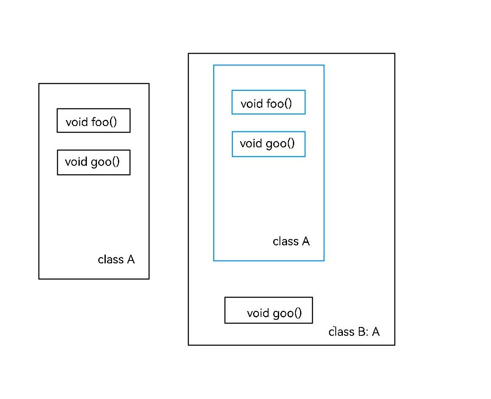
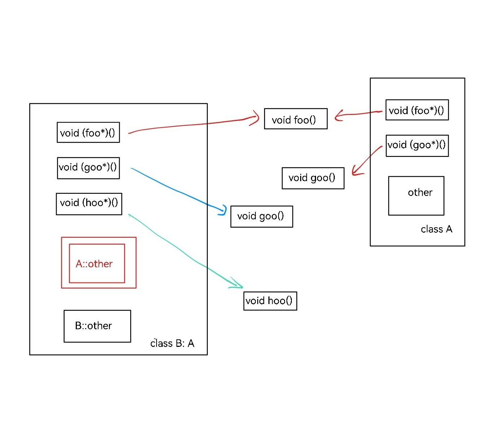

## 类的指针

如果我们有一个 `A` 类的对象 `A a`，我们怎么访问 `a` 的成员呢？

当然是 `a.x` 这样访问。

我们可以定义类的指针（什么东西都可以指针）。如果我们定义 `A *b = &a`，即定义一个 `A*` 类型的指针指向 `a` 的地址，那怎么通过指针访问 `a` 的成员呢？

我们可以将指针解引用，再用 `.` 操作符。如下：`(*b).x`。

但是，C++ 提供了另一种办法：`b->x`。一个很形象的，看上去就是指针的写法。这和 `(*b).x` 是等价的。

考虑到 `b = &a`，其实就是说，`(&a)->x` 和 `a.x` 是等价的。

## 构造函数与析构函数

### 构造函数

当一个对象被定义的时候，初始值是什么呢？

比如我们定义 `string s;` 但不赋值，这时候的 `s` 的值是什么呢？

这是由 `string` 的构造函数决定的。当我们定义自己的类时，我们也可以指定自己的构造函数。

所谓构造函数，是类的一个特殊成员函数。它没有返回值，函数名应该与类名完全相同。编译器会在这个对象被创建的时候调用一次。

如下所示：

??? note "构造函数实例"
    ```cpp
    --8<-- "docs/course/program/code/oop/example_constructor_1.cpp"
    ```

### 析构函数

当一个对象结束了生命周期，会发生什么？

比如我们定义了 `string s = "qwertyuiop";`。这占据了 10 个字符的空间。当 `s` 没用的时候，这些空间就应该释放掉。这个操作就是在析构函数内实现的。

析构函数和构造函数很像。没有返回值，函数名应该与是 `~` 加上类名。编译器会在这个对象被销毁的时候调用一次。

如下所示：

??? note "构造函数与析构函数"
    ```cpp
    --8<-- "docs/course/program/code/oop/example_constructor_2.cpp"
    ```

### 复制对象

有三种情况会涉及到变量的复制。

- 显示使用 `=` 赋值。
- 函数的返回值。
- 函数的参数。

这个复制过程中，会有一个新的对象被创建。我们来观察一下：

??? note "复制对象"
    ```cpp
    --8<-- "docs/course/program/code/oop/example_constructor_3.cpp"
    ```

运行结果似乎不太对？为什么 `d` 被销毁了两次？

事实上，复制过程确实创建了新对象。但这个对象不是由我们见过的构造函数创建的，而是另一种特殊的构造函数，称作“复制构造函数”。函数接受一个 `const &` 本身类型的静态引用。我们可以自己实现复制构造函数，并把新的对象标注为一份拷贝：

??? note "复制构造函数"
    ```cpp
    --8<-- "docs/course/program/code/oop/example_constructor_4.cpp"
    ```

观察运行结果。

我们发现，`=` 赋值和参数传递都进行了拷贝，但是返回值好像没有拷贝。

这其实是 C++ 编译器的默认优化，会将返回值的拷贝和销毁省略。如果我们使用编译开关 `-fno-elide-constructors`，就可以关掉这个优化。再执行看看？

### 可能的问题

函数返回值和参数是一种容易被忽视的拷贝。返回值在拷贝之后会将原对象销毁，而参数在函数末尾也会被销毁。如果忽视了这一拷贝或销毁，没有仔细实现拷贝构造函数/析构函数，就可能出现错误。

我们来看一个例子：

???+ note "[矩阵乘法（面向对象版）](https://pintia.cn/problem-sets/1851440820039602176/exam/problems/type/7?problemSetProblemId=1851440820060573699)"
    建立一个整数矩阵类 `matrix` ，其私有数据成员如下：
    ```cpp
    int row;
    int column;
    int **mat;
    ```
    建立该整数矩阵类 `matrix` 构造函数；
    建立一个 `*`（乘号）的运算符重载，以便于对两个输入矩阵进行乘法运算；
    建立输出函数 `void display()`，对整数矩阵按行进行列对齐输出。

下面是某个倒霉蛋写出的代码：

??? note "错误示范"
    ```cpp
    --8<-- "docs/course/program/code/oop/problem_matrix_RE.cpp"
    ```

代码的思路是，构造函数传入矩阵的大小，随后动态开辟空间。既然是 `matrix` 类自己开的空间，自然需要在析构函数里释放空间。

也许你已经发现了问题：没有实现复制构造函数。

会怎么样呢？代码中 `Matrix m3 = m1 * m2;` 先调用了 `m1 * m2` 对应的重载运算符函数（特殊的函数），得到一个 `Matrix` 类型的 `res`。随后，`res` 作为返回值被复制给 `m3`，但是 `res` 本身作为函数内部的变量，在函数结束后就被销毁了。

我们着重分析一下这个过程。`res` 是由构造函数 `Matrix res(a.row, b.column)` 显示创建的，因此在构造函数中通过 `new` 开辟了新的空间。此时有 `res.mat` 这个指针指向这块空间。

随后，`res` 被复制给 `m3`。由于没有实现复制构造函数，编译器使用了默认的复制方法：把所有的成员变量复制一份。但是，编译器复制 `mat` 指针的时候，并不知道 `mat` 具体指向多大的内容，也没法开辟新的空间，而是简单地让两个指针指向的地址相等。也就是说，现在有两个指针 `res.mat`，`m3.mat`，都指向同一块地址，存储着答案。

但是，`res` 的生命周期结束了，调用析构函数。于是 `res.mat` 指向的空间被 `delete` 释放了。但是此时的 `m3.mat` 还指着这个被释放的空间。最终输出 `m3` 的时候，实际上进行了非法的指针访问。Runtime Error。

更进一步，我们还会发现，`main` 函数结束之后 `m3` 又被销毁，析构函数又一次 `delete` 了一块已经被释放的空间。这更是非法的。IOT Trapped。

所有的一切加入复制构造函数就可以解决。正确的复制不应该复制指针，而是应该开辟新的空间，然后复制空间的内容。如下：

```cpp
#include <bits/stdc++.h>
using namespace std;

class Matrix {
private:
    int row, column;
    int **mat;
public:
    Matrix(const Matrix &x) {
        row = x.row;
        column = x.column;
        mat = new int *[row];
        for (int i = 0; i < row; i++) {
            mat[i] = new int[column];
            memcpy(mat[i], x.mat[i], sizeof(int) * column);
        }
    }
};

// 省略
```

## 运算符重载

我们以上面的矩阵乘法为例，详细解释运算符重载的概念。

在上面的代码中，我们定义了一个矩阵对象。我们可以用一个函数计算矩阵乘法：传入两个矩阵对象，返回一个矩阵对象表示乘法的成果。

```cpp
Matrix multiply(const Matrix &a, const Matrix &b) {
    Matrix res(a.row, b.column);
    // 计算 res
    return res;
}
```

这样，我们要计算乘法的时候，就用 `multiply(m1, m2)` 就好了。

但是，这太长了，也不够直观。怎么办呢？

C++ 提供了重载运算符的办法。实现也很简单，我们把 `multiply` 这个函数名改成一个特殊的名字：`operator*`。那么，编译器遇到 `m1 * m2` 时，就会自动换成 `operator*(m1, m2)`。这和 `multiply(m1, m2)` 是一样的。

最后，由于 `row`、`column` 和 `mat` 是私有的成员变量，为了让乘法函数能够访问，我们将 `operator*` 声明成友元函数。如下：

```cpp
class Matrix {
// 省略
public:
    friend Matrix operator*(const Matrix &a, const Matrix &b);
}
Matrix operator*(const Matrix &a, const Matrix &b) {
    Matrix res(a.row, b.column);
    // 和 multiply 函数一样
    return res;
}
```

### 不同的运算符

下面是可重载的运算符列表：

| 运算符类型 | 运算符 |
| ------- | ------------------------------------------------- |
| 双目算术运算符 | `+` (加) `-` (减) `*` (乘) `/` (除) `%` (取模)                       |
| 关系运算符   | `==` (等于) `!=` (不等于) `<` (小于) `>` (大于) `<=` (小于等于) `>=` (大于等于)    |
| 逻辑运算符   | `||` (逻辑或) `&&` (逻辑与) `!` (逻辑非)                           |
| 单目运算符   | `+` (正) `-` (负) `*` (指针) `&` (取地址)                           |
| 自增自减运算符 | `++` (自增) `--` (自减)                                      |
| 位运算符    | `|` (按位或) `&` (按位与) `~` (按位取反) `^` (按位异或) `<<` (左移) `>>` (右移)  |
| 赋值运算符   | `=`, `+=`, `-=`, `*=`, `/=` , `%=` , `&=`, `|=`, `^=`, `<<=`, `>>=`  |
| 空间申请与释放 | `new`, `delete`, `new[]` , `delete[]` |
| 其他运算符   |  `()` (函数调用) `->` (成员访问) `,` (逗号) `[]` (下标)                   |

下面是不可重载的运算符列表：

- `.`：成员访问运算符
- `.*`, `->*`：成员指针访问运算符
- `::`：域运算符
- `sizeof`：长度运算符
- `?:`：条件运算符
- `#`： 预处理符号

一个最好的举例办法是实现一份高精度模板。即我们自定义一个支持加法运算的大整数类型。如下所示：

??? note "无符号高精度加法"
    ```cpp
    --8<-- "docs/course/program/code/oop/example_bigint.cpp"
    ```

## 访问说明符

上面我们提到了：“为了让乘法函数能够访问，我们将 `operator*` 声明成友元函数”。这是什么意思？

思考类的一个好方法是把类看作人。

- 人能做很多事，这对应了类的方法（成员函数）。
- 人有面板属性，这对应了类的属性（成员变量）。
- 人是爹妈生的，这对应了类的继承。
- 人有隐私，这对应了类的访问说明符。

在类中，我们可以指定某些变量和函数是别人不能访问的。一般来说，我们把一些中间过程/辅助函数隐藏起来，因为正常的使用没有在外部调用的必要。

另外，合理的做法是把所有的原始数据都隐藏起来，避免用户对数据的直接乱改导致不合法的结果。如果我们需要知道数据的值，我们可以公开一个函数，返回值是数据的值。这样就实现了只读的权限。

也许你会说，反正都是自己写的代码，为什么要多此一举。好吧，是“为了安全”。此外，也许你的代码会被很多人调用，你可不希望别人乱搞。

怎么做呢？看看下面的例子：

??? note "访问说明符"
    ```cpp
    --8<-- "docs/course/program/code/oop/example_access_1.cpp"
    ```

### 友元

人有朋友。好朋友也许知道你的一些秘密。npy 也许能花你的钱。

类也一样。C++ 允许在类内指定别的某个类或是某个函数是“友元”。友元的类或函数内可以访问自己的私有域。

比如说，在上面的矩阵乘法的例子里，`operator*` 就是一个 `Matrix` 类的友元函数。尽管 `operator*` 是定义在类外的函数，但是因为它是友元，所以同样能够访问私有的 `row`、`column` 和 `mat`。
为了加深理解，我们再看一道例题：

???+ note "[程序猿与产品狗](https://pintia.cn/problem-sets/1851440820039602176/exam/problems/type/7?problemSetProblemId=1851440820060573700)"
    在公司里面，程序猿经常有一堆todolist要做，而这些todolist是产品经理分配给他们的。但是当程序员遇到不懂技术的产品狗时，就悲剧了。产品经理经常修改他们的todolist，比如：添加，减少他们的todolist。

    很难想象出题人和产品经理有什么仇。

没有什么算法。按照题目要求定义 `ProductDog` 和 `CodeMonkey`，产品狗有一个私有变量 `vector<CodeMonkey>` 维护它管理的所有程序猿；程序猿有两个私有变量维护名字和 todolist 数量。

为了让产品狗能够修改程序猿的私有变量，可以将 `ProductDog` 这个类设为 `CodeMonkey` 的友元类。这样，产品狗的所有成员函数都可以修改程序猿的私有变量。或者将 `ProductDog::add_todolist` 和 `ProductDog::reduce_todolist`  两个函数设为 `CodeMonkey` 的友元函数。

代码如下：

??? note "参考代码"
    ```cpp
    --8<-- "docs/course/program/code/oop/problem_access.cpp"
    ```

## This 指针

上面的代码里有一个之前没有提到的用法：`类名::函数名`。这是在类外面访问类内函数声明的方法。我们知道，函数可以先声明，后定义。同样的，类的成员函数可以在类内声明，类外定义。即使是构造函数也是一样的。

要加类名的原因是可能有很多类有同一个名字的函数。只有类名加函数名才能唯一确定。

事实上，这种用法更贴近类实现的本质。我们在构造函数里就提过 this 指针。所谓 this 指针，首先是一个自己类型的指针。在类的任何函数里，你都可以调用 this 指针，且 this 指针总是指向自己。正如我们在构造函数的例子中使用的一样，用 this 指针，就可以明确调用自己的成员变量和函数，不被变量冲突困扰。

但是问题来了：我们并没有定义这个 this 指针啊？它是哪里冒出来的？为什么总是指向自己？我可以修改这个指针吗？

我们写的函数是像这样：

```cpp
class MyClass {
public:
    void foo(int a, int b) {
        // ...
    }
};

MyClass a;
```

但是对于编译器来说，这个函数的全名叫做 `MyClass::foo`，即上文提到的唯一记号。而这个函数的参数列表是什么样的呢？

大概是这样的：`MyClass::foo(MyClass *this, int a, int b)`。编译器添加了一个隐藏的形参 this。当你在调用 `a.foo(1, 2)` 的时候，编译器实际是在做 `MyClass::foo(&a, 1, 2)`。所谓 `.`，只不过是一种语法糖。（这只是方便理解，C++ 并不允许你用后面的办法调用成员函数。但是，Python 真的是这么做的）

另外，this 指针是不可赋值的，也不可重新分配。

## 模板

我们来看一个新问题：求一个整数的正整数次幂。

???+ warning
    事实上，答案可能会大到存不下。不过这里我们忽略乘法造成的溢出问题。

一种比较简单的算法是用幂的定义，真的乘这么多次：

```cpp
// 计算 x 的 p 次方
int power(int x, int p) {
    int res = 1;
    for (int i = 1; i <= p; i++) {
        res = res * x;
    }
    return res;
}
```

但是，当 $p$ 很大的时候，这个算法很慢。也许聪明的你能想到优化的办法：

- 若 $p = 2k$，我们可以计算 $y = x^k$，则 $x^p = y^2$。
- 若 $p = 2k + 1$，同样计算 $y = x^k$，则 $x^p = y^2x$。

而计算 $x^k$，可以用同样的办法继续降低指数，直到指数为 1 为止。

由于 $x^p$ 与 $x^k$ 的计算方法是相同的，我们可以用所谓“递归函数”实现这一过程。这被称为快速幂算法。如下所示：

```cpp
// 计算 x 的 p 次方
int quick_power(int x, int p) {
    if (p == 1) return x;
    int y = quick_power(x, p / 2);
    int res = y * y;
    if (p % 2 == 1) res = res * x;
    return res;
}
```

由于每次调用 $p$ 的大小减半，因此这个函数最多计算 $\lfloor \log_2 p\rfloor + 1$ 次，显著变快了。

很好。现在我们有新需求了：能求幂的可不止整数，我们希望快速计算矩阵的整数次幂。

我们已经有了一个支持乘法的矩阵类 `Matrix`。也许你会想，我们再为矩阵实现一个函数好了：

```cpp
Matrix matrix_power(Matrix x, int p) {
    if (p == 1) return x;  
    Matrix y = matrix_power(x, p / 2);
    Matrix res = y * y;
    if (p % 2 == 1) res = res * x;
    return res;
}
```

但这只是权宜之计。如果又来另一个 `Matrix2` 类要求幂怎么办？或者是一个实现了乘法的高精度数 `BigInt`？

每个类型实现一个函数自然可以。但这太蠢了，而且毫无技术含量。假设要求幂的类型是 `T`，我们的代码总是可以写成如下形式：

```cpp
T quick_power(T x, int p) {
    if (p == 1) return x;
    T y = quick_power(x, p / 2);
    T res = y * y;
    if (p % 2 == 1) res = res * x;
    return res;
}
```

能不能告诉编译器这一点，让编译器帮我们自动生成呢？

可以的！C++ 采用了叫做“模板”的方法实现这一点。只要在我们的“一般形式”前面写上这么一段：

```cpp
template <class T> // or template <typename T>
T quick_power(T x, int p) {
    if (p == 1) return x;
    T y = quick_power(x, p / 2);
    T res = y * y;
    if (p % 2 == 1) res = res * x;
    return res;
}
```

编译器就会知道：哦，这个 T 是任意一种类型。当这个函数真的被调用时，编译器会根据传入的 `x` 的参数确定 `T` 的含义，进而生成一段对应类型的代码。`T` 具体是什么类型不重要，只要 `T` 支持乘法运算符，就能编译出对应的函数。

不仅函数可以有模板，类也可以有模板！比如我们的 `Matrix` 类，其内部使用 `int` 类型存储数据。但也许我们要用到小数，也许我们要用到更大的 `long long`，甚至也许我们要用到自定义的 `BigInt`。这个时候，我们就可以给 `Matrix` 类带上模板，如下：

```cpp
template <class ValueType>
class Matrix {
private:
    int row, column;
    ValueType **mat;
public:
    Matrix(int r, int c) : row(r), column(c) {
        mat = new (ValueType*)[r];
        for (int i = 0; i < r; i++) {
            mat[i] = new ValueType[c];
        }
    }
    // 省略
};
```

这样一来，我们就可以指定任意类型的矩阵了。（甚至是矩阵的矩阵）

等一下。编译器可以知道 `quick_power` 的模板类型是因为参数里面有 `T` 类型。但是 `Matrix` 怎么办呢？或者参数里没有 `T` 的怎么办呢？

C++ 采用如下方法：

```cpp
Matrix<long long> m; // 定义一个 long long 矩阵

template <typename T> // or template<class T> 
T foo() {
    return T();
}

foo<double>(); // 调用 double 类型对应的 foo 函数。
```

也即在函数名/类名后面跟一对尖括号，尖括号里面写类型。

有没有觉得很熟悉？没错，`vector<int>` 就是模板类的典范。在尖括号里写什么类型，就得到能存什么类型的 `vector`。这种可以指定存储类型的类，也被我们称为容器。

模板几乎在标准库中到处都是。比如 `max`。

此外，C++ 也允许定义多个不确定类型，即 `template <class T1, class T2>`，只要在调用的时候像函数参数一样一一写出即可。如 `<int, long long>`。

??? note "模板元编程"
    模板的灵活性远不止于此。模板里不仅能够传递类型，还能够传递常量。模板可以拥有不定长的类型列表，能写无限个类型。
    
    C++ 的模板设计是图灵完备的，由于模板函数与模板类是在编译时就确定到具体的类型的，你甚至可以在编译阶段进行计算。这被称作“模板元编程”。
    
    可以参考[模板——黑魔法入门到入土 - 洛谷专栏](https://www.luogu.com.cn/article/wxhi2pdf)。

??? note "抖机灵"
    我们都知道，`Python` 里面 `**` 是求幂。我们可以在 C++ 中实现一样的效果吗？
    
    可以的！看如下代码：
    
    ```cpp
    --8<-- "docs/course/program/code/oop/example_pow_operator.cpp"
    ```
    
    你知道背后的原理吗？

## 继承

“龙生龙，凤生凤，老鼠的儿子会打洞”。所谓继承，就是让一个类拥有另一个类的内容。

来看下面的代码：

```cpp
--8<-- "docs/course/program/code/oop/example_inherit_1.cpp"
```

这揭示了继承的基本概念。如何声明 `MyClass` 继承于 `BaseClass`？我们在声明 `MyClass` 之后添加了 `: [继承方式] <继承类名>`。

程序会正常输出 `114`。可以看到，虽然 `MyClass` 中没有定义 `a` 变量，但是 `print` 函数仍然能读取 `a`，我们也能从外部改变 `a` 的值。这是因为 `MyClass` 继承了 `BaseClass` 中的 `a` 变量。

下面，我们把被继承的类叫做“父类”，继承的类叫做“子类”。

??? note "有趣的观察"
    在计算机领域，类似的关系大多叫做父子关系，比如树上的父节点子节点，多线程里的父进程子进程。但是在生物领域，这种关系大多叫做母子关系。母本和子本，母一代和子一代。

### 继承的访问权限

上面的代码中有多处出现了 `public`。是什么意思？

首先，我们要引入一个概念叫做 `protected`。这是一种和 `public` 与 `private` 并列的关键字，都是进行访问控制的。

它的含义如下：被 `protected` 修饰的内容可以在子类里访问，但是不可在外部访问，也通过子类在外部访问。

看这个例子：

```cpp
--8<-- "docs/course/program/code/oop/example_inherit_2.cpp"
```

除了我们已经知道的访问说明符，还有一个地方出现了 `public`。是在声明继承的时候选择的继承方式。

继承方式也有 `public`、`protected` 和 `private`。它的意思是，从父类继承的内容在子类中具有什么样的访问权限。

- `public`：父类的公有成员也是子类的公有成员，父类的保护成员也是子类的保护成员，父类的私有成员不能直接被子类访问，但是可以通过调用父类的公有和保护成员来访问。
- `protected`： 父类的公有和保护成员将成为子类的保护成员。
- `private`：父类的公有和保护成员将成为子类的私有成员。

下面这张表列出了父类中的内容在不同继承方式下的可见性：

|  | `public` 继承 | `protected` 继承 | `private` 继承 |
| --- | --- | --- | --- |
| 父类的 `public` 内容 | 子类中是 `public` | 子类中是 `protected` | 子类中是 `private` |
| 父类的 `protected` 内容 | 子类中是 `protected` | 子类中是 `protected` | 子类中是 `private` |
| 父类的 `private` 内容 | 子类中不可见 | 子类中不可见 | 子类中不可见 |

需要注意，“子类中不可见”并不意味着变量/函数不存在。继承会继承整个父域的内容，即使不可见的内容也会被创建，而且可以被父类的可见函数间接调用。

### 重写

如有必要，子类可以重写父类的方法。看下面的题目：

???+ note "[队列操作](https://pintia.cn/problem-sets/1851440820039602176/exam/problems/type/7?problemSetProblemId=1851440820060573701)"
    实现队列的入队、出队、求队列长度。其中出队函数要返回被出队的元素。出队失败输出 `Invalid`。

C++ 标准库中有一个类叫 `queue`，实现了队列的数据结构。这是一个类似于 `vector` 的容器，需要指定类型使用。显然这里是 `queue<int>`。

`queue` 已经实现了入队、出队、求队列长度的函数。但是，`queue` 的出队并不返回被出队的元素。我们可以自定义一个类型继承 `queue<int>`，重写里面的 `pop` 函数，实现这道题的要求。

代码如下：

??? note "参考代码"
    ```cpp
    --8<-- "docs/course/program/code/oop/example_inherit_3.cpp"
    ```

我们在子类中重写了 `pop` 函数，这样调用 `q.pop` 时，就会默认使用子类定义的函数。

但是，我们的重写只是为了返回被弹出的值，而“弹出”这个动作仍需要交给父类实现。如果代码第九行直接写 `pop()`，就会一直递归调用子类的重写函数。

我们需要显示指定调用父类的 `pop()` 函数。这时候就要用到 `::`，限定调用父类 `queue<int>` 域内部的 `pop()` 函数。

特别地，如果你想在类外部调用父类的 `pop()`，可以写 `q.queue<int>::pop()`。

### 继承的更多复杂行为

关于继承的更多复杂行为，包括构造函数继承，构造、析构顺序，多重继承等限于篇幅不再展开，可以参考 [组合与继承 - SAST skill docs](https://docs.net9.org/languages/c-oop/combination-and-derivation/)。

## 虚的东西

### 虚函数

所谓“虚”，是 C++ 类域的一种概念。

普通的函数在域中就是以函数形式存在的。在继承的时候，父类的函数存在父类的域里，子类的函数存在子类的域里。比如下面的代码：

??? note "普通函数"
    ```cpp
    --8<-- "docs/course/program/code/oop/example_virtual_1.cpp"
    ```



上面有一个需要补充的概念：剪切。当我们把子类强转为父类时，子类中的父类域会被剪切出来，而子类的域就被剪没了。所以无论是 `A` 类的指针，`A` 类的引用和 `A` 类的复制，都只能访问 `A` 类的内容。

如果我们想要用 `A` 的指针访问 `B` 的内容，怎么办呢？

你可能觉得这没什么用。不，这很有用。如果 `A` 有很多子类，但都需要实现同一种算法。若我们能用父类的指针访问子类的内容，我们就可以只为父类实现代码，子类当作父类的指针就好。这就叫做“多态”。

想要实现这一点，我们可以把需要访问的函数设为虚函数，在定义的时候加上一个 `virtual`。

??? note "虚函数"
    ```cpp
    --8<-- "docs/course/program/code/oop/example_virtual_2.cpp"
    ```



虚函数使用函数指针的方式存储在类内。继承过程中，父类的虚函数表不会存在父域里，而是复制到子域里。当函数重载发生时，新的函数指针被直接替换到被重载的函数指针的位置。

这样，当调用 `x_point_A -> goo()` 时，编译器实际是在找 `x_point_A` 指向内容的第二个函数指针。如果 `x_point_A` 指向的是 `A` 类型，则这个函数指针指向 `A` 的 `goo`。如果 `x_point_A` 指向的是 `B` 类型，则这个函数指针指向 `B` 的 `goo`。这就实现了多态。

### 纯虚函数

父类可以不实现虚函数，只是做一个声明，实现交给子类来完成。这被称为纯虚函数。包含纯虚函数的类被称为纯虚类（或抽象类、接口）。因为实现不完整，纯虚类只能作为一种结构，但不能被实例化。

定义纯虚函数也很简单，只要在函数的括号后面加上 `=0` 即可。

我们来看一道例题：

???+ note "[用虚函数计算各种图形的面积](https://pintia.cn/problem-sets/1851440820039602176/exam/problems/type/7?problemSetProblemId=1851440820060573703)"
    定义抽象基类Shape，由它派生出五个派生类：Circle（圆形）、Square（正方形）、Rectangle（ 长方形）、Trapezoid （梯形）和Triangle （三角形），用虚函数分别计算各种图形的面积，输出它们的面积和。要求用基类指针数组，每一个数组元素指向一个派生类的对象。PI=3.14159f，单精度浮点数计算。

显然 `Shape` 自己没法计算面积。所以 `Shape` 应该是纯虚类，声明了面积函数，但不实现。

代码如下：

??? note "参考代码"
    ```cpp
    --8<-- "docs/course/program/code/oop/problem_shape.cpp"
    ```

### 虚函数与模板

上述“多态”的思想，其实用模板也能实现。两者有什么区别呢？

使用纯虚函数继承的方法，要求子类必须要实现所有纯虚函数才能实例化。也就是说，实际运行时，我们可以确保被指针指向的类一定实现了我们需要的功能。而模板就不行，无法对传入类的方法做出限制。

此外，模板会在编译期展开，其实也是对每个子类实现，被称为静多态，会降低编译速度，增大编译体积。但是虚函数的方法是动态的，编译更快，体积更小。

### final 与 override

有些核心方法在实现之后，我们就不希望别人修改了。此时就可以选择用 final 修饰。

不展开，还是推荐参考 [多态与模板 - SAST skill docs](https://docs.net9.org/languages/c-oop/polymorphism-and-templates/)。

### 虚继承

`virtual` 关键字不仅可以在成员函数之前定义，还可以在类继承的时候指定。这就是所谓虚继承。

??? note "参考 [C++语法——详解虚继承-CSDN博客](https://blog.csdn.net/weixin_61857742/article/details/127344922)"
    
    
    
    
    
    
    
    
    
    
    